# 2022年

## 软件架构被高估，清晰和简单的设计被低估

>   2022年11月26日
>
>   摘自：[科技爱好者周刊：第 81 期(2019年11月8日)](https://www.ruanyifeng.com/blog/2019/11/weekly-issue-81.html)
>
>   原文：https://blog.pragmaticengineer.com/software-architecture-is-overrated/

**（1）设计一个计算机系统的目标应该是简单性 。**

系统越简单，理解起来就越简单，找到问题就越简单，实现它就越简单。描述的语言越清晰，设计就越容易理解。

干净的设计类似于干净的代码：它易于阅读且易于理解。

**（2）如何编写干净的代码？**

编写干净代码有很多好方法。但是，你很少会听到有人建议，在代码中应用["四人帮"的设计模式](https://baike.baidu.com/item/%E8%BD%AF%E4%BB%B6%E8%AE%BE%E8%AE%A1%E6%A8%A1%E5%BC%8F/2117635?fromModule=search-result_lemma)。

干净代码的特征是：单一责任，明确命名和易于理解的约定。这些原则同样适用于清晰的架构。

**（3）设计模式的作用是什么？**

设计模式可以为你提供如何改进代码或架构的想法。了解常见的设计模式是一件好事，它们有助于缩短与他人的讨论，让别人以与你相同的方式谈论一件事。

但是，设计模式不是目标，它们不能替代系统设计的简单性。在设计系统时，你可能会发现自己意外地应用了一个众所周知的设计模式，这是一件好事。但你不应该为了采用一种或多种设计模式，而将其用作锤子，到处寻找钉子来使用它。

我承认，虽然我花了很多时间阅读和理解"四人帮"的《设计模式》，但它们对我成为一名更好的程序员的影响，要小于我从其他工程师那里得到的反馈。

作为一名工程师，你的目标应该是更多地解决问题，并通过它们进行学习，而不是选择闪亮的设计模式。

## 关于1024程序员节

>   2022年10月24日

不太记得从什么时候开始，10月24日这一天成为了程序猿们的专属节日。

似乎、可能是从那些国内互联网大厂开始传播起来的。

那么，疑惑🤔的是当我1024这一天，依照惯例访问google查询资料时，却并没有看到隆重的程序员节日logo...

要知道，google可是非常重视极客文化的哟。不太可能遗忘这么重要的节日呢。

出于好奇，我百科了一下1024程序员节，由此获得了全新的认知。

-----

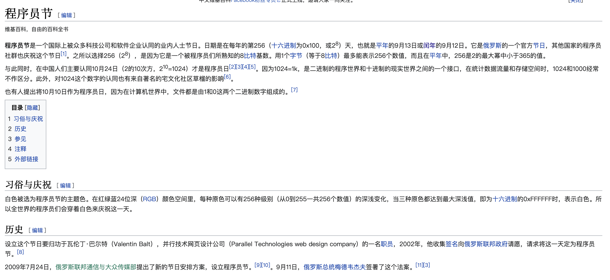

-----

>   图片截取自wiki

这么说来，程序员节实际上有2个，国际上是9月13日或[闰年](https://zh.wikipedia.org/wiki/闰年)的9月12日。国内是10月24日。

那么这也就解释了我的疑惑，为什么google没有在1024这一天推出节日logo。

**同时，我也表达下个人看法：**

众所周知，1024在程序世界是1k的字节数，因此我还是比较接受1024做为我们的节日.😄😄😄...

关键是好记！（不用区分闰年🐶）

## Facebook 的员工入职手册

>   2022年10月22日

周末，闲来无事。网上冲浪，意外收获Facebook员工手册。设计风格极其简约，凸显扁平化设计理念，亦有ikea质感。内容方面，不做评论。

下面，将Facebook员工手册全页及内容发表在此。

可能会对初创企业有所启发。

::: center

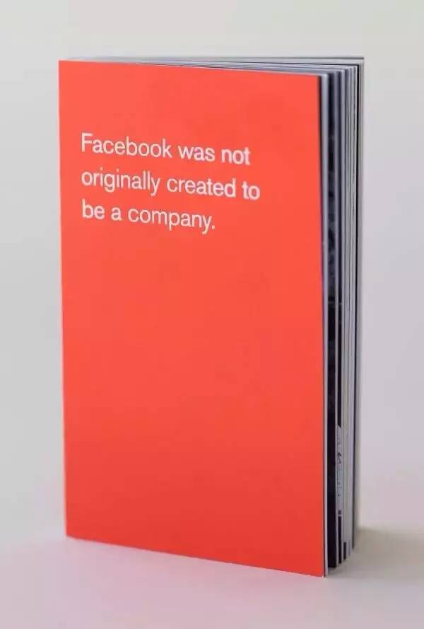

<small>创办Facebook，最初并不只为了成立一家公司</small>

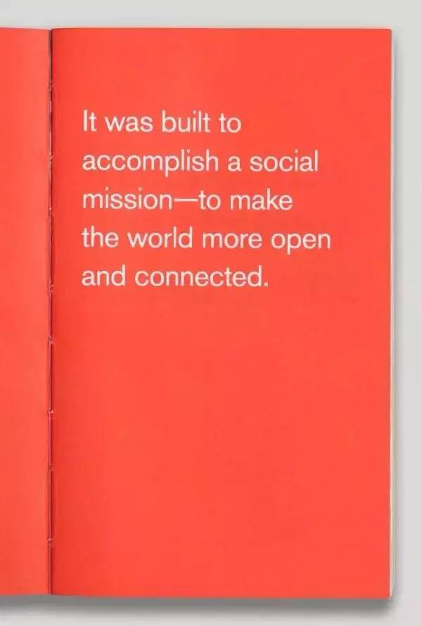

<small>创办Facebook，是为了完成一个社会使命——连接世界、更加开放</small>

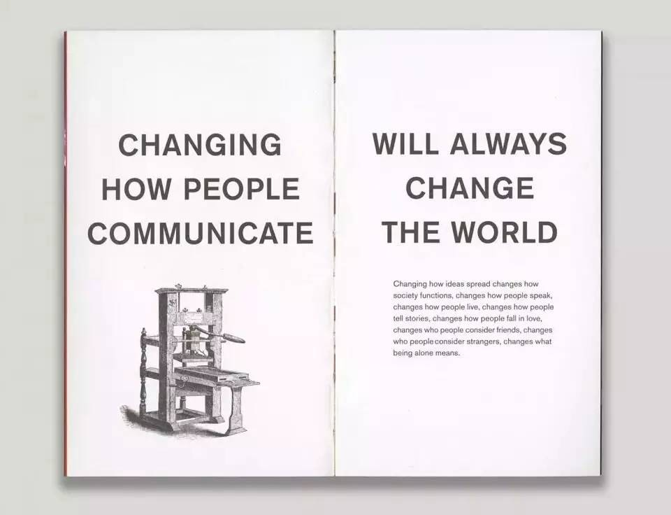

<small>改变人们的沟通方式，将会改变这个世界 改变思想的传播方式改变了社会的运作方式，改变了人们的说话方式。改变人们的生活方式，改变人们讲故事的方式，改变人们恋爱的方式，改变人们眼中的朋友，改变人们眼中的陌生人，改变孤独的含义。</small>

<small>历史上谁控制了媒体谁就控制了信息。 如果控制了唯一的报纸、电台或电视，就控制了人们的全部信息来源。 但是，如果任何人都可以成为媒体，世界将会怎样?</small>

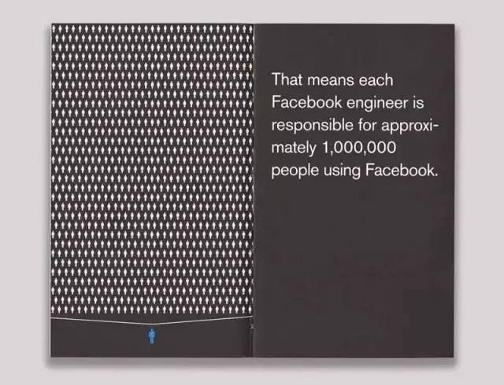

<small>Facebook的每个工程师都在为数以百万的用户服务。</small>

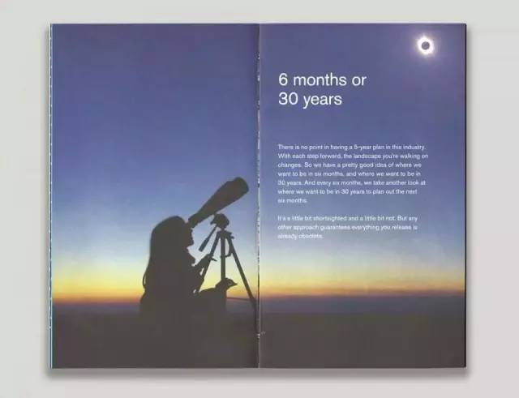

<small>6个月或30年。 在互联网行业里，做个5年计划没什么意义，每走一步，形势都会发生变化。 所以我们只会为未来6个月制定完美的计划，作为未来30年的一部分。</small>

<small>卓越和舒适很少能够共存</small>

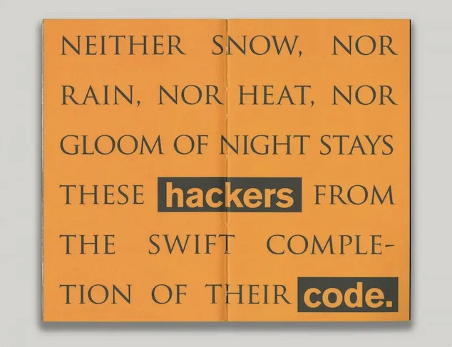

<small>不管刮风下雨，不管烈日长夜，都不能阻止程序员快速完成代码</small>

<small>行动快的人会接管世界</small>

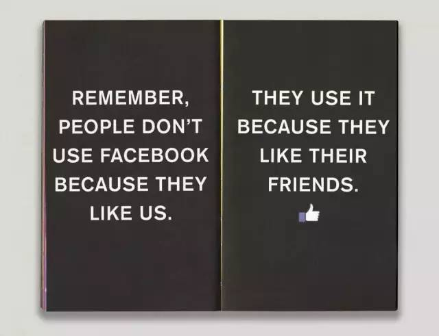

<small>记住，人们不会为了“赞”我们而上facebook。人们上facebook，是为了“赞”他们的朋友们。</small>

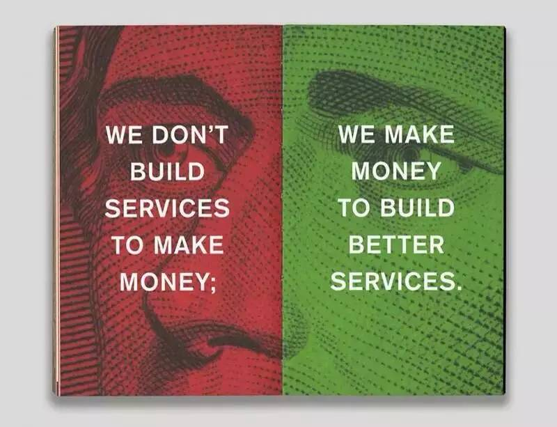

<small>我们向用户提供服务不是为了赚更多钱，我们赚钱是为了向用户提供更好的服务。</small>

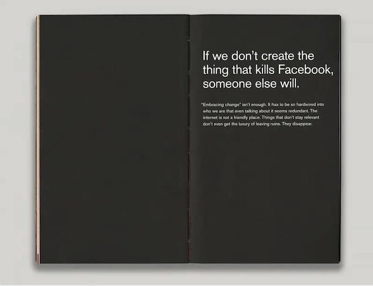

<small>如果我们不革自己的命，其他人就会革我们的命</small>

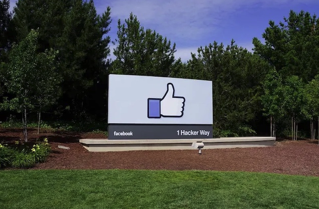

:::

## 一件不可思议的事情

>   2022年10月6日
>
>   摘自：https://www.ruanyifeng.com/

今天，一件不可思议的事情发生在我身上。

我开车来到星巴克，在汽车外卖窗口排队等候。我想为团队购买咖啡，我们团队为了赶上发布日期，整个周日都在加班。

我很感谢自己的团队，为了传播这种奉献精神，也是为了补偿后面顾客的长时间等待。我决定为后面那辆 SUV 买单。

我付掉了他们的咖啡钱，对星巴克的服务员说，如果他们愿意，也可以为别人买单，把这种行为传递下去。

我正要开车离开，那辆 SUV 突然向我鸣笛并闪灯。我停下车，他们开到我旁边。

走下车的居然是亚马逊的老板杰夫·贝佐斯！

他对我的好意感到很惊奇，提出接下来的一个小时，我可以和他一起喝咖啡。我知道团队正在等我，但是我不能错过这种千载难逢的机会。

一个小时的聊天变成了两个小时。我最后竟然加入贝佐斯的蓝色起源公司的下一次太空飞行，费用完全由他承担。

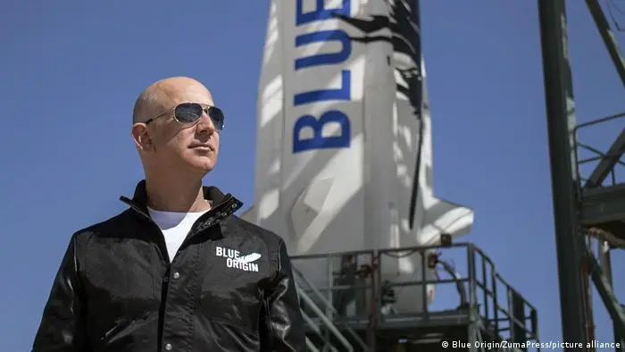

这个故事告诉我们：**善待陌生人，你永远不知道它会如何影响你。**

>后续：
>
>一家旧金山医疗保健公司的产品总监亚历山大·科恩（Alexander Cohen），实在看不惯商务网站 LinkedIn 充斥的浮夸和作假，决定搞一个恶作剧。
>
>他在 LinkedIn 上面发了一个帖子，名字叫做《一件不可思议的事情》。不出所料，文章发布后，上千人要求加他为好友。
>
>第二天，他公布，这篇文章都是虚构的，目的是讽刺 LinkedIn 上面那些自吹自擂的人和事。

## Adobe宣布网页版Photoshop将全部免费提供

>   2022年7月1日
>
>   摘自：https://finance.sina.com.cn/tech/2022-06-15/doc-imizmscu6902624.shtml

Adobe目前正在试验免费使用的Photoshop版本。该试用仅限于加拿大地区，但Adobe可能很快会将试用扩展到其他地区。目前，加拿大的用户可以通过Adobe帐户免费访问Photoshop Web版。

Adobe声称Photoshop网页版本在“免费增值”模式下可用。目前，Photoshop的大部分工具、画笔和其他功能都是免费提供的。然而，Adobe计划关闭一些付费订阅者独有的功能。尽管如此，将免费提供“足够”的工具，以运行Adobe声称的Photoshop核心功能。

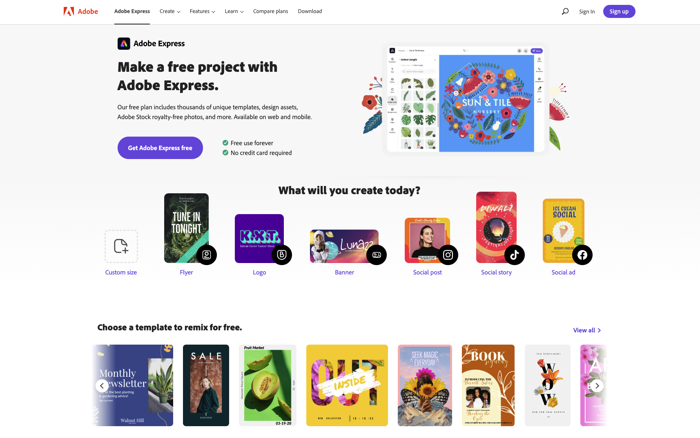

https://www.adobe.com/express/