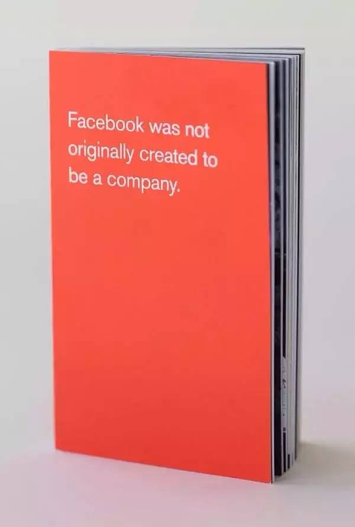
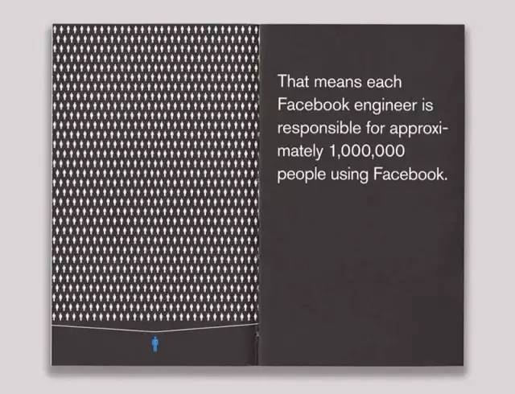
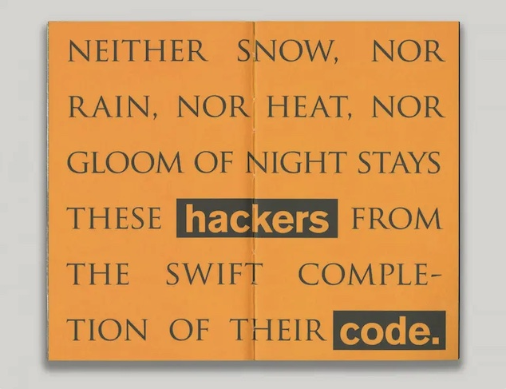
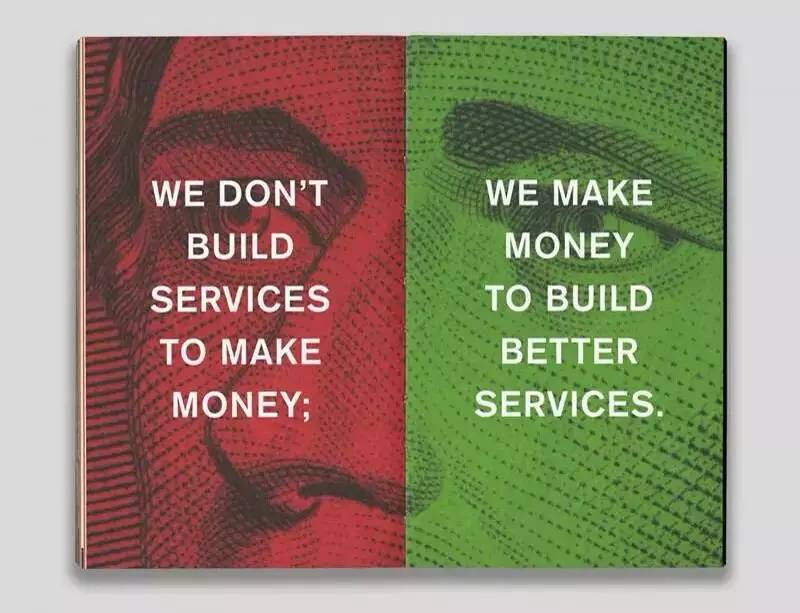

## Facebook 的员工入职手册

>   2022年10月22日

周末，闲来无事。网上冲浪，意外收获Facebook员工手册。设计风格极其简约，凸显扁平化设计理念，亦有ikea质感。内容方面，不做评论。

下面，将Facebook员工手册全页及内容发表在此。

可能会对初创企业有所启发。

::: center

<small>创办Facebook，最初并不只为了成立一家公司</small>

<small>创办Facebook，是为了完成一个社会使命——连接世界、更加开放</small>

<small>改变人们的沟通方式，将会改变这个世界 改变思想的传播方式改变了社会的运作方式，改变了人们的说话方式。改变人们的生活方式，改变人们讲故事的方式，改变人们恋爱的方式，改变人们眼中的朋友，改变人们眼中的陌生人，改变孤独的含义。</small>

<small>历史上谁控制了媒体谁就控制了信息。 如果控制了唯一的报纸、电台或电视，就控制了人们的全部信息来源。 但是，如果任何人都可以成为媒体，世界将会怎样?</small>

<small>Facebook的每个工程师都在为数以百万的用户服务。</small>

<small>6个月或30年。 在互联网行业里，做个5年计划没什么意义，每走一步，形势都会发生变化。 所以我们只会为未来6个月制定完美的计划，作为未来30年的一部分。</small>

<small>卓越和舒适很少能够共存</small>

<small>不管刮风下雨，不管烈日长夜，都不能阻止程序员快速完成代码</small>

<small>行动快的人会接管世界</small>

<small>记住，人们不会为了“赞”我们而上facebook。人们上facebook，是为了“赞”他们的朋友们。</small>

<small>我们向用户提供服务不是为了赚更多钱，我们赚钱是为了向用户提供更好的服务。</small>

<small>如果我们不革自己的命，其他人就会革我们的命</small>

:::