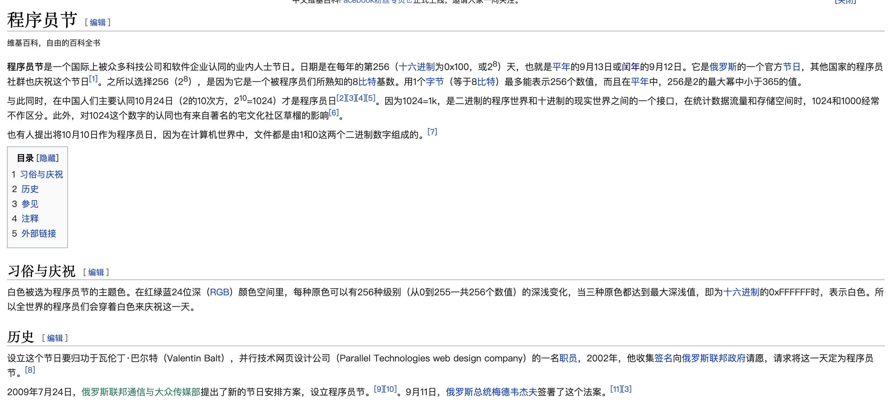

# 关于1024程序员节

>   2022年10月24日

不太记得从什么时候开始，10月24日这一天成为了程序猿们的专属节日。

似乎、可能是从那些国内互联网大厂开始传播起来的。

那么，疑惑🤔的是当我1024这一天，依照惯例访问google查询资料时，却并没有看到隆重的程序员节日logo...

要知道，google可是非常重视极客文化的哟。不太可能遗忘这么重要的节日呢。

出于好奇，我百科了一下1024程序员节，由此获得了全新的认知。

-----

-----

>   图片截取自wiki

这么说来，程序员节实际上有2个，国际上是9月13日或[闰年](https://zh.wikipedia.org/wiki/闰年)的9月12日。国内是10月24日。

那么这也就解释了我的疑惑，为什么google没有在1024这一天推出节日logo。

**同时，我也表达下个人看法：**

众所周知，1024在程序世界是1k的字节数，因此我还是比较接受1024做为我们的节日.😄😄😄...

关键是好记！（不用区分闰年🐶）