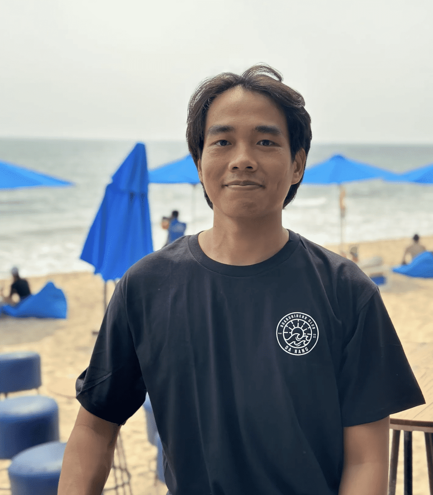
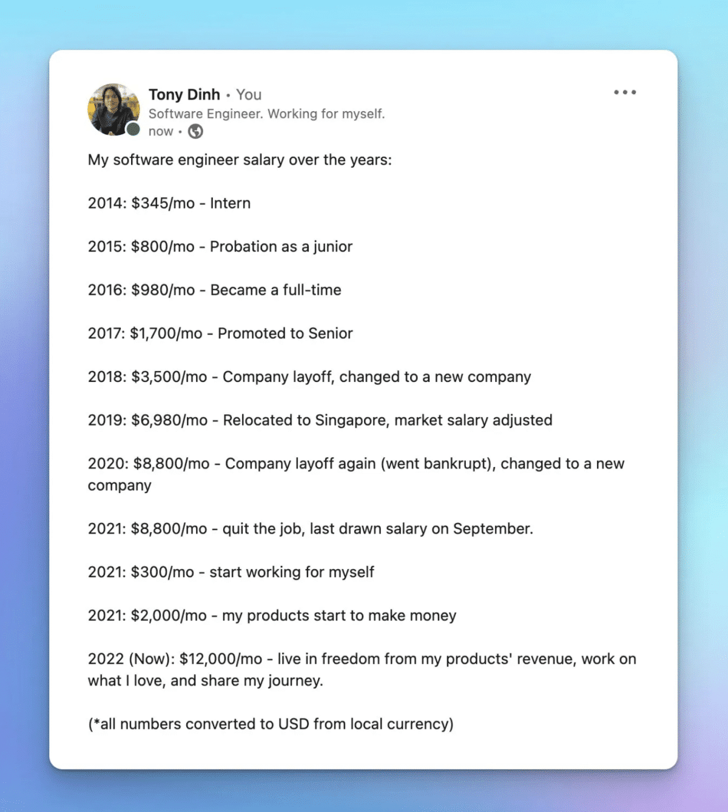
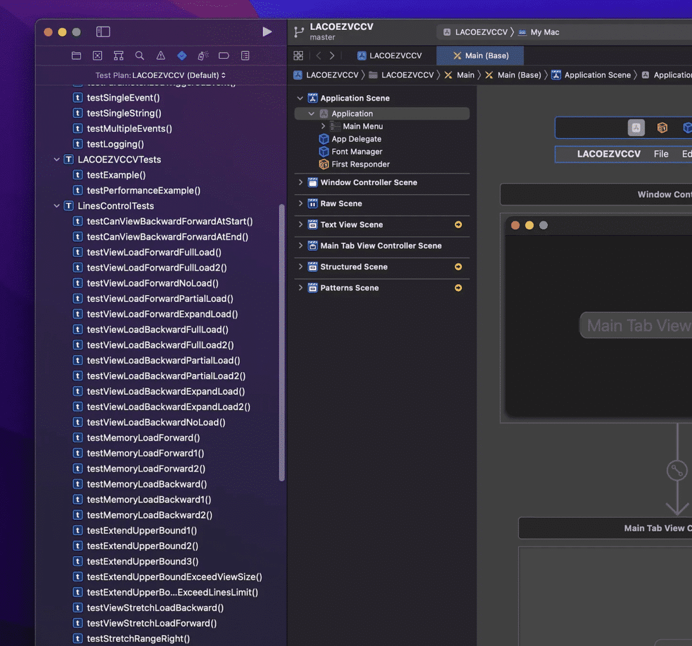
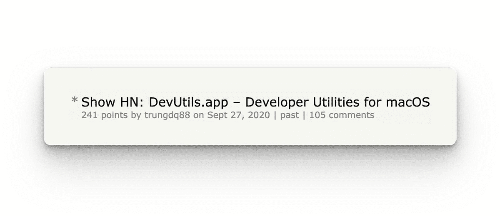
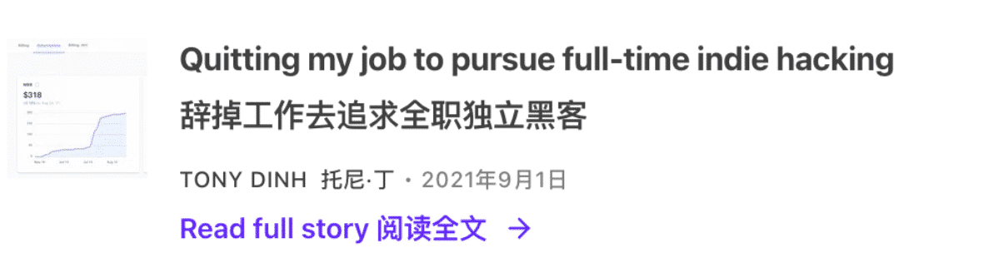
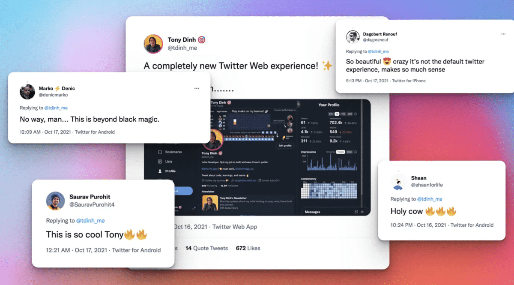
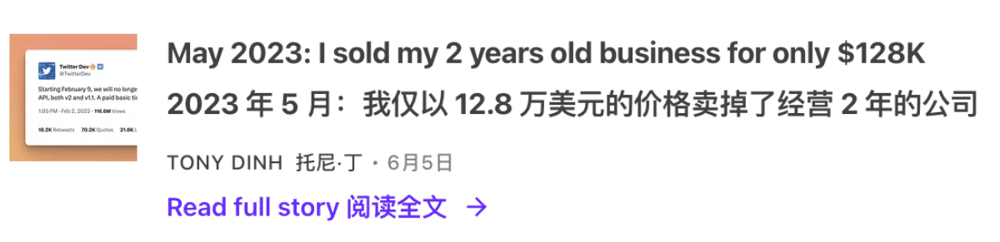
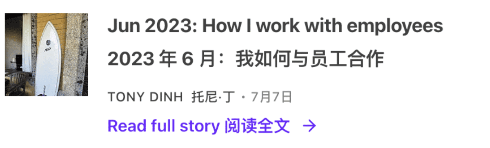

# 程序员创业故事：两年内从零到每月 4.5 万美元

>   本文由谷歌翻译
>
>   原文链接：https://news.tonydinh.com/p/my-solopreneur-story-zero-to-45kmo

20 September 2021 was the first day I became unemployed and started working for myself.
2021 年 9 月 20 日是我失业并开始为自己工作的第一天。

It’s the best decision I’ve ever made. Working for myself gives me a freedom I’ve never experienced before.
这是我做过的最好的决定。为自己工作给了我前所未有的自由。

Over the past two years, I have:
近两年来，我有：

-   created **four** small but successful products (all will be mentioned later in this post)
    创建了四个小但成功的产品（所有这些都将在本文后面提到）
-   built an audience of **97K followers** on Twitter
    Twitter 上拥有 9.7 万粉丝
-   created this newsletter with **6,000+** subscribers
    创建了这份拥有 6,000 多名订阅者的时事通讯
-   jumped on **the AI hype train** and successfully created a product with it
    搭上了人工智能炒作的列车，并成功地用它创造了一个产品
-   and survived a drama that **almost killed** my business
    并在一场差点毁了我生意的闹剧中幸存下来

At the moment, my total revenue across all products is about $45K/month at ~90% profit.
目前，我所有产品的总收入约为每月 45,000 美元，利润约为 90%。

I want to take this opportunity to write a recap of my journey so far. I hope this will be helpful for people who are looking to become their own boss one day.
我想借此机会写下我迄今为止的旅程回顾。我希望这对那些希望有一天成为自己老板的人有所帮助。

This is me in Da Nang City, Vietnam :)
这是我在越南岘港市:)

## A bit of background 一些背景

Before quitting my job, I was a software engineer with 7 years of experience (in 2021).
在辞职之前，我是一名拥有 7 年经验的软件工程师（2021 年）。

I love building software. My first software product was built with Visual Basic 6 in high school. Throughout my career, I have always had some side projects along with my full-time job.
我喜欢构建软件。我的第一个软件产品是在高中时使用 Visual Basic 6 构建的。在我的职业生涯中，除了全职工作之外，我总是有一些副业项目。

Below is a summary of my full career history:
以下是我完整职业生涯的总结：

Thanks to 7 years working in the industry, I picked up a lot of useful skills: frontend, backend, DevOps, mobile apps, game dev, and a bit of UX/UI design.
由于在该行业工作了 7 年，我学到了很多有用的技能：前端、后端、DevOps、移动应用程序、游戏开发和一些 UX/UI 设计。

These skills became my biggest advantage and have helped me tremendously later in my journey.
这些技能成为我最大的优势，并在我后来的旅程中提供了巨大帮助。

## Learned about Indie Hackers 了解独立黑客

Early 2020, COVID happened. I was forced to work remotely alone at home (in a foreign country).
2020年初，新冠疫情发生。我被迫独自在家（在国外）远程工作。

It was incredibly boring.
这太无聊了。

I discovered [IndieHackers.com](http://indiehackers.com/) and started listening to their podcast every day. I got really inspired by the stories of successful indie hackers like [Pieter Levels](https://twitter.com/levelsio), [Kyle Gawley](https://twitter.com/kylegawley), [Jon Yongfook](https://twitter.com/yongfook) (and many more).
我发现了 IndieHackers.com 并开始每天收听他们的播客。 Pieter Levels、Kyle Gawley、Jon Yongfook（等等）等成功独立黑客的故事给了我很大的启发。

The inspiration, the boredom of COVID, and the extra time I got from not having to commute to work led me back to my passion: building software products.
灵感、新冠疫情带来的无聊，以及不用通勤上班而获得的额外时间，让我重新燃起了我的热情：构建软件产品。

So I gave it a try. I started working on a new side project with the hope of generating some revenue.
所以我尝试了一下。我开始从事一个新的副业项目，希望能产生一些收入。

## First failure 第一次失败

My first attempt was to build a log viewer macOS app.
我的第一次尝试是构建一个日志查看器 macOS 应用程序。

As a good software engineer, I wanted the app to have a beautiful UI, tons of features, a comprehensive architecture, and a unit test suite with >95% test coverage.
作为一名优秀的软件工程师，我希望应用程序拥有漂亮的 UI、大量的功能、全面的架构以及测试覆盖率 >95% 的单元测试套件。

This is the failed app, I still have it in my Xcode
这是失败的应用程序，我的 Xcode 中仍然有它

I worked on it for ~6 months. I felt like the project would never finish. Then, I got bored and abandoned the project.
我为此工作了约 6 个月。我感觉这个项目永远不会完成。然后，我感到无聊并放弃了该项目。

It failed spectacularly. 它失败得很惨烈。

But at least I got something from it: I gained a lot of experience working with Swift, which means I can build macOS and iOS apps much faster now.
但至少我从中得到了一些东西：我获得了很多使用 Swift 的经验，这意味着我现在可以更快地构建 macOS 和 iOS 应用程序。

## First successful app: DevUtils 第一个成功的应用程序：DevUtils

It took me a while to recover from my first failure.
我花了一段时间才从第一次失败中恢复过来。

About a month later, I decided to give it another try (and this time, you can be certain that I wrote zero test cases 😂).
大约一个月后，我决定再试一次（这一次，你可以确定我写了零测试用例😂）。

I built the first version of [DevUtils](https://devutils.com/) in about 2 weeks. It’s an app that bundles all the frequently used developer tools into one unified interface that works offline on your macOS.
我在大约两周内构建了 DevUtils 的第一个版本。它是一款应用程序，将所有常用的开发人员工具捆绑到一个统一的界面中，可以在 macOS 上离线工作。

I sent the app to friends, family, and co-workers to use (for free) and received some good feedback. People love the app!
我将该应用程序发送给朋友、家人和同事使用（免费）并收到了一些很好的反馈。人们喜欢这个应用程序！

That was the sign I was looking for. I was excited and decided to add payment to the app: $9 - a one-time purchase to use the app forever.
这就是我一直在寻找的标志。我很兴奋，决定向应用程序添加付款：9 美元 - 一次性购买即可永久使用该应用程序。

Then, I [posted the app on Hacker News](https://news.ycombinator.com/item?id=24604291). I think I got lucky, the post received some positive comments, and I got to the top of Hacker News for a few hours.
然后，我在 Hacker News 上发布了该应用程序。我想我很幸运，这篇文章收到了一些积极的评论，我在几个小时内登上了黑客新闻的榜首。

And that’s how I got my first ever internet dollar. I jumped like crazy in my bedroom in Singapore (I was still working full-time at the time).
这就是我获得第一笔互联网美元的方式。我在新加坡的卧室里疯狂地跳了起来（当时我还在全职工作）。

## I discovered Twitter 我发现了推特

Things started to slow down after the initial traffic spike from the Hacker News front page. I posted the app [on Product Hunt](https://www.producthunt.com/products/devutils#devutils) and got another traffic spike, and that was it.
在黑客新闻首页最初的流量激增之后，事情开始放缓。我在 Product Hunt 上发布了该应用程序，并再次获得流量峰值，仅此而已。

A week after that, I rarely get any visitors to the website. No more sales.
一周后，我的网站就很少有访客了。不再销售。

I knew that posting the app to websites and forums on the internet and hoping for a traffic spike wouldn’t work in the long term. I can’t get lucky forever.
我知道将应用程序发布到互联网上的网站和论坛并希望流量激增从长远来看是行不通的。我不可能永远幸运。

So, I started to look for a long-term distribution channel.
于是，我开始寻找长期的分销渠道。

I tried Google paid ads, wrote SEO articles, looked for sponsorships on newsletter/YouTube channels, and tons of other things.
我尝试过 Google 付费广告、撰写 SEO 文章、在时事通讯/YouTube 频道上寻找赞助，以及许多其他事情。

There were some small results, but in the end, I didn’t see a way that could give me traffic for the long-term without continuous effort. (Except for SEO, but SEO is extremely slow to see the results)
虽然取得了一些小成果，但最终我没有找到一种无需持续努力就能长期为我带来流量的方法。 （SEO除外，但SEO见效极其缓慢）

This is when I think about Twitter and the #buildinpublic community.
这是我想到 Twitter 和 #buildinpublic 社区的时候。

I decided to give it a try to become a Twitter influencer.
我决定尝试成为一名 Twitter 影响者。

The plan was that if I could get a lot of followers, I would have a consistent flow of traffic to DevUtils without doing much.
我的计划是，如果我能获得很多关注者，那么我无需做太多事情就能获得稳定的 DevUtils 流量。

And so, I reactivated my old Twitter account and started building my personal brand. Most of my tweets were about DevUtils and it was quite boring.
因此，我重新激活了我的旧 Twitter 帐户并开始建立我的个人品牌。我的大部分推文都是关于 DevUtils 的，而且很无聊。

## Building an audience 建立受众群体

I quickly learned that tweeting about DevUtils alone wasn’t going to help me gain followers. People just don’t care.
我很快了解到，仅发布有关 DevUtils 的推文并不能帮助我获得关注者。人们只是不在乎。

Sure, I engaged with other people in the community, replied to their tweets, made jokes, and was just hanging around. But in the end, if I don’t have something interesting on my own timeline, people have no reason to follow me. Just tweeting about DevUtils wasn’t going to cut it.
当然，我与社区中的其他人互动，回复他们的推文，开玩笑，然后就闲逛了。但最终，如果我自己的时间线上没有一些有趣的事情，人们就没有理由关注我。仅仅发布有关 DevUtils 的推文并不能解决问题。

I needed to do something interesting to get the attention.
我需要做一些有趣的事情来引起注意。

So I started doing a lot of fun stuff, using my skills and advantages: coding.
所以我开始利用我的技能和优势做很多有趣的事情：编码。

For example, this experiment is [my first ever “viral” tweet](https://twitter.com/tdinh_me/status/1378995883090452481) with 100+ likes:
例如，这个实验是我第一个获得 100 多个赞的“病毒式”推文：

In summary, my Twitter strategy was:
总而言之，我的 Twitter 策略是：

-   Build interesting stuff and share it in public
    构建有趣的东西并公开分享
-   Engage with other people 与其他人交往
-   Write threads 写入线程
-   A lot of memes and jokes
    很多表情包和笑话
-   Overall, be an interesting person and be nice
    总的来说，做一个有趣的人并且友善

After 6 months of consistently doing this, from 100 followers in November 2020, I grew my account to [700 followers](https://twitter.com/tdinh_me/status/1388789631420796931) in May 2021.
经过 6 个月的持续这样做，我的账户从 2020 年 11 月的 100 名关注者增加到 2021 年 5 月的 700 名关注者。

## First “real” business: Black Magic 第一个“真正”的生意：黑魔法

I considered [Black Magic](https://blackmagic.so/) to be my first ever “real” business because it has a subscription pricing model with recurring revenue.
我认为 Black Magic 是我第一个“真正的”业务，因为它有一个具有经常性收入的订阅定价模式。

This is how it started.
事情就是这样开始的。

Around May 2021, when I was approaching 1,000 followers on Twitter, I decided to do something special to celebrate it (and also to get more engagements!).
2021 年 5 月左右，当我在 Twitter 上的关注者接近 1,000 名时，我决定做一些特别的事情来庆祝（同时也获得更多的参与度！）。

By looking around the Twitter API document, I learned that I can update the profile picture via API. So, I built a small script that shows a progress bar around my profile picture.
通过查看 Twitter API 文档，我了解到可以通过 API 更新个人资料图片。因此，我构建了一个小脚本，在我的个人资料图片周围显示进度条。

[The progress bar ](https://twitter.com/tdinh_me/status/1391980513573806081)would get closer and closer to 100% as I get to 1,000 followers.
当我的关注者达到 1,000 名时，进度条会越来越接近 100%。

People loved the idea so much! So, I turned the script into a web app and added a $4/month subscription fee for the “Pro” version, where people can customize the progress bar color.
人们非常喜欢这个主意！因此，我将脚本变成了一个 Web 应用程序，并为“Pro”版本添加了 4 美元/月的订阅费，人们可以在其中自定义进度条颜色。

And that was how I got my [first ever recurring revenue dollar](https://twitter.com/tdinh_me/status/1399225474006478849)!
这就是我获得第一笔经常性收入的方式！

At this time, I was still working at full-time job.
此时，我仍在全职工作。

Embraced the traction, I worked on Black Magic with all the free time I had.
受到这种推动，我利用所有空闲时间致力于《黑魔法》。

I added many other features to Black Magic, mostly Twitter tools that help users create more engagements.
我向 Black Magic 添加了许多其他功能，主要是帮助用户创建更多互动的 Twitter 工具。

By building and tweeting at the same time, both my MRR (monthly recurring revenue) and my followers were increasing fast.
通过同时构建和发推文，我的 MRR（每月经常性收入）和我的关注者都在快速增长。

## Quit job 辞职

By August 2021, I have:
到 2021 年 8 月，我已经：

-   ~$300 MRR from Black Magic
    Black Magic 约 300 美元 MRR
-   ~$200/mo from DevUtils DevUtils 约 200 美元/月
-   ~8,000 followers 约 8,000 名关注者
-   ~1,500 active users (most are free users)
    约 1,500 名活跃用户（大多数是免费用户）

Overall, there is great momentum. I felt confident that I might actually have a shot at making a living out of Black Magic and DevUtils.
总体而言，势头强劲。我相信我实际上可能有机会靠 Black Magic 和 DevUtils 谋生。

That was when I handed in my notice, officially quitting my job. 20 September 2021 was my last working day and my first day as a full-time indie hacker.
就在那时，我递交了通知，正式辞职。 2021 年 9 月 20 日是我的最后一个工作日，也是我作为全职独立黑客的第一天。

I remember I went outside for a walk, took a fresh breath of air, and felt the freedom I never experienced before.
我记得我到外面散步，呼吸新鲜空气，感受到了从未体验过的自由。

The park near my place when I was working in Singapore.
我在新加坡工作时住处附近的公园。

Around the same time, I started writing a newsletter (this newsletter!). If you are a long-time reader, you may remember I wrote about it in detail. Here is the post:
大约在同一时间，我开始写一份时事通讯（这封时事通讯！）。如果您是长期读者，您可能还记得我详细写过。这是帖子：

I have a saving of 2 years in the bank. If I lived in Vietnam (my hometown), I could easily go as far as 4 years without revenue. My backup plan was to just get back to a full-time job if things didn’t work out.
我在银行有2年的存款。如果我住在越南（我的家乡），我可以很容易地长达四年没有收入。我的后备计划是，如果事情不顺利，就回到全职工作。

At the time, I didn’t have a family yet, no wife, and no kid. It was the best time for me to make the biggest bet of my life. So I did.
那时，我还没有家庭，没有妻子，也没有孩子。那是我做出一生中最大赌注的最佳时机。所以我做了。

My goal was to get to $1K MRR in the first year, which would be enough for me to live comfortably in Vietnam forever.
我的目标是在第一年达到 1000 美元 MRR，这足以让我在越南永远舒适地生活。

## Ramen profitability in year one 拉面第一年的盈利能力

Since quitting my job, I spent all of my time working on Black Magic/DevUtils, and still keep tweeting to build an audience.
辞职后，我把所有时间都花在了 Black Magic/DevUtils 上，并且仍然继续发推文来建立受众。

The growth started to pick up. I added many new features to Black Magic, most noticeably [the Magic Sidebar](https://twitter.com/tdinh_me/status/1449394099014934532) – a Chrome extension for Twitter that provides Analytics & CRM features.
增长开始加速。我向 Black Magic 添加了许多新功能，最引人注目的是 Magic Sidebar——一个 Twitter 的 Chrome 扩展，提供分析和 CRM 功能。

This feature single-handedly changed Black Magic as a product forever. From being a fun engagement tool to becoming a true painkiller and solving big problems that many big Twitter accounts had at the time.
这一功能一举改变了 Black Magic 作为一款产品的意义。从一个有趣的参与工具到成为一个真正的止痛药并解决许多大 Twitter 帐户当时遇到的大问题。

Later, I pivoted the whole product around this feature. I changed the landing page to exclusively talk about this feature instead of the profile progress bar and other fun features. You can see it at [BlackMagic.so](https://blackmagic.so/).
后来我把整个产品都围绕着这个功能。我更改了登陆页面以专门讨论此功能，而不是个人资料进度栏和其他有趣的功能。您可以在 BlackMagic.so 上看到它。

Within a few months, by building, tweeting, and launching the product on Product Hunt, my monthly revenue grew to $4K MRR.
几个月内，通过在 Product Hunt 上构建、发布推文和发布该产品，我的每月收入增长到 4,000 美元。

There’s a lot going on during this period. Luckily, I’ve written about everything in this newsletter once a month like a machine.
这段时间发生了很多事情。幸运的是，我像机器一样每月一次在这份时事通讯中写下所有内容。

You can read the related posts in this period here:
您可以在这里阅读这一时期的相关帖子：

By February 2022, I have reached $4K MRR and 28K followers on Twitter, far beyond my goal.
到 2022 年 2 月，我的 MRR 已达到 4,000 美元，Twitter 上的关注者已达到 28,000 名，远远超出了我的目标。

## Travel, Work, and Play 旅行、工作和娱乐

In the first few months after quitting my job, I worked a lot. Probably 12 hours a day, or even 16 hours/day if you also count Twitter as “work”.
辞职后的最初几个月，我工作量很大。大概每天 12 小时，如果你把 Twitter 也算作“工作”的话，甚至每天 16 小时。

So when I reached $4K MRR, a decent amount considering my living cost in Vietnam, I started to slow down.
因此，当我的 MRR 达到 4000 美元（考虑到我在越南的生活成本）时，我开始放慢脚步。

I still want to get more revenue, but I realized that this is a moving goalpost, and it will never stop. $10K, then $20K, then $50K. I knew I would never satisfied.
我仍然想获得更多的收入，但我意识到这是一个移动的球门柱，它永远不会停止。 1 万美元，然后是 2 万美元，然后是 5 万美元。我知道我永远不会满足。

It’s much better to work and play at the same time.
同时工作和娱乐要好得多。

So I traveled. I went for a trip around Vietnam.
所以我旅行了。我去越南旅行了。

My average working hours during this period was about 4 hours/day. I still tweet a lot.
这段时间我的平均工作时间约为每天4小时。我仍然经常发推文。

Around September 2022, something magical happened: I was invited to the Indie Hacker podcast! The very podcast that I listened to every day when I started out. It was like a dream come true!
2022 年 9 月左右，神奇的事情发生了：我被邀请参加独立黑客播客！这是我刚开始时每天听的播客。这就像梦想成真！

The podcast was released on [22nd September 2022](https://twitter.com/tdinh_me/status/1572743468585463810), almost exactly one year after I quit my job.
该播客于 2022 年 9 月 22 日发布，几乎是我辞职一年后。

Fast forward to October 2022, Black Magic grew to $13K MRR steadily.
快进到 2022 年 10 月，Black Magic 的 MRR 稳步增长至 13,000 美元。

## My 3rd product: Xnapper 我的第三个产品：Xnapper

Besides working on my existing products, I experimented and tried new things all the time.
除了开发现有产品之外，我还一直尝试新事物。

I built several small products, some of which failed (EmojiAI, AskCommand).
我构建了几个小产品，其中一些失败了（EmojiAI、AskCommand）。

One of them, **[Xnapper](https://xnapper.com/)** - a screenshot app, picked up my [audience's interest](https://twitter.com/tdinh_me/status/1530118451540684801) and became my 3rd successful product. It’s now making **$6K/month**.
其中之一，Xnapper - 一个屏幕截图应用程序，引起了我的观众的兴趣，并成为我的第三个成功产品。现在每月收入为 6,000 美元。

I’ve written more about how Xnapper started in this post:
我在这篇文章中写了更多关于 Xnapper 如何开始的内容：

Working on multiple products allowed me to switch between them when I feel bored with one product, reducing my stress.
当我对一种产品感到厌倦时，开发多种产品可以让我在它们之间进行切换，从而减轻我的压力。

It’s also a good way to have a fresh new content for the Twitter audience. I was embracing “build in public” and I shared about everything when I was building the app.
这也是为 Twitter 受众提供新鲜内容的好方法。我拥抱“公开构建”，并分享了构建应用程序时的所有内容。

For example, [this tweet](https://twitter.com/tdinh_me/status/1539895622069022720) showing the mobile app demo got 1,700 likes! It’s almost like free marketing.
例如，这条展示移动应用演示的推文获得了 1,700 个赞！这几乎就像免费营销。

## Twitter drama, and my 4th product Twitter 戏剧，也是我的第四个产品

Around February 2023, shortly after Elon Musk bought Twitter, they announced that Twitter API (which Black Magic is using) will no longer be free.
2023 年 2 月左右，埃隆·马斯克 (Elon Musk) 收购 Twitter 后不久，他们宣布 Twitter API（Black Magic 正在使用）将不再免费。

I didn’t think this would be a big deal. I was making good money from Black Magic and would be happy to pay.
我认为这没什么大不了的。我从黑魔法中赚了很多钱，并且很乐意付钱。

Little did I know that, the price was announced **$42K/month** (per month, not per year). There was a smaller plan at $100/month, but the restrictions and limits are so low that you can’t even run a weather bot with it.
我几乎不知道的是，价格公布为 42K 美元/月（每月，而不是每年）。有一个较小的计划，每月 100 美元，但限制和限额非常低，你甚至无法用它运行天气机器人。

Black Magic was at $14K MRR at the time. That means there’s no way I could afford the API price.
Black Magic 当时的 MRR 为 14,000 美元。这意味着我无法承担 API 的价格。

I was “forced” to either shut down or sell.
我“被迫”要么关闭，要么卖掉。

Long story short, I sold Black Magic for **$128K**. You can read about the whole story here:
长话短说，我以 12.8 万美元的价格出售了 Black Magic。您可以在这里阅读整个故事：

As of now, I no longer own Black Magic, but I still love the product and use it every day.
截至目前，我不再拥有 Black Magic，但我仍然喜欢这个产品并每天使用它。

The funny thing is, a few months later, Twitter changed their mind about the pricing. They introduced a new plan at $5,000/month.
有趣的是，几个月后，Twitter 改变了定价的想法。他们推出了一项新计划，每月 5,000 美元。

This plan comes with some restrictions and API limits, it may or may not work for Black Magic, but I didn’t even bothered to check, because it was no longer matter.
这个计划有一些限制和API限制，它可能对Black Magic有用，也可能不起作用，但我什至懒得去检查，因为它已经不再重要了。

So that was my first product exit. Not the way I wanted, but there was nothing I could do.
这是我的第一个产品退出。这不是我想要的方式，但我无能为力。

Around the same time, I started working on a new product: Typing Mind.
大约在同一时间，我开始开发一个新产品：Typing Mind。

## Typing Mind: my 4th product Typing Mind：我的第四个产品

OpenAI [announced the ChatGPT API](https://openai.com/blog/introducing-chatgpt-and-whisper-apis) on March 1, 2023. I’ve been using ChatGPT via the web interface for a while at that point.
OpenAI 于 2023 年 3 月 1 日宣布推出 ChatGPT API。那时我已经通过 Web 界面使用 ChatGPT 一段时间了。

The web interface was very limited and I get annoyed by it for a long time. For example, you can’t search your previous chats, the text output was slow, etc. Most annoyingly, the app logged you out and you had to login again every day, which was extremely frustrating.
网络界面非常有限，我很长一段时间都对它感到恼火。例如，你无法搜索以前的聊天记录，文本输出很慢等等。最烦人的是，应用程序将你注销，你必须每天重新登录，这非常令人沮丧。

At some point I was thinking of writing a Chrome extension to scratch my own itch.
在某个时候，我正在考虑编写一个 Chrome 扩展来解决自己的问题。

OpenAI releasing the API was exactly what I was wating for. I immediately think of writing a better UI for ChatGPT using the API.
OpenAI 发布 API 正是我所期待的。我立即想到使用 API 为 ChatGPT 编写更好的 UI。

The next day, I registered the domain name [typingmind.com](https://www.typingmind.com/) and started working on the prototype for a few hours.
第二天，我注册了域名typingmind.com，并开始了几个小时的原型工作。

The Twitter drama kept me busy for the rest of the week, but I managed to get the first version of Typing Mind finished on the weekend.
推特上的戏剧让我在这周剩下的时间里都很忙，但我设法在周末完成了《Typing Mind》的第一个版本。

On Monday, 6th March 2023, I released the first version to the public, and [announced it on Twitter](https://twitter.com/tdinh_me/status/1632631838866051074).
2023 年 3 月 6 日星期一，我向公众发布了第一个版本，并在 Twitter 上宣布了这一消息。

The app immediately received a lot of traction.
该应用程序立即受到了很大的关注。

I added a paid plan at **$9**, then slowly increased the price as I add more features to the app in the next few days (it’s now priced at **$39**)
我添加了 9 美元的付费计划，然后随着我在接下来的几天内向应用程序添加更多功能，慢慢提高了价格（现在的价格为 39 美元）

Within the first day of releasing the app, I made $1K of revenue, then $2K the next day, then $4K the next day.
在发布应用程序的第一天，我就获得了 1,000 美元的收入，然后第二天就获得了 2,000 美元的收入，然后第二天又获得了 4,000 美元的收入。

In 7 days, I made a total of **$22K** of license revenue.
7 天之内，我总共获得了 22,000 美元的许可收入。

Typing Mind has become my primary focus since April. I’ve been adding features, improving the product, and building a [B2B version](https://custom.typingmind.com/) for companies to create their own ChatGPT UI. The app is currently making ~**$30K/month** revenue on average.
自四月以来，打字思维已成为我的主要关注点。我一直在添加功能、改进产品，并为公司构建 B2B 版本来创建自己的 ChatGPT UI。该应用程序目前平均每月收入约为 3 万美元。

And this is where I am at right now.
这就是我现在的处境。

## Building a team 建立团队

One thing significantly changed in my 2nd year is that I have started to build a team.
第二年发生的一件显着变化是我开始组建一个团队。

I’ve always prefer to go solo. Working alone mean I don’t have to spend time on discussions, meeting, and more time for building.
我一直更喜欢独自一人。独自工作意味着我不必花时间讨论、开会，还有更多时间进行建设。

However, it get boring quickly to do the same thing over and over again. Things like customer support and some coding task that I know how to do but don’t find it interesting to do anymore.
然而，一遍又一遍地做同样的事情很快就会变得无聊。像客户支持和一些我知道如何做但不再感兴趣的编码任务之类的事情。

So over the last year, I’ve hired 1 full-time employee (for content, marketing, support) and 3 freelancers (developers).
因此，在过去的一年里，我雇佣了 1 名全职员工（负责内容、营销、支持）和 3 名自由职业者（开发人员）。

With the help from the team, I got back a lot of my free time without sacrificing customers’ happiness. The products also keep moving forward (new features and bug fixes) without me having to actively working.
在团队的帮助下，我在不牺牲客户幸福感的情况下获得了很多空闲时间。产品也在不断向前发展（新功能和错误修复），而无需我积极工作。

I still work 4 hours/day on average, but now I only work on things I’m interested in, whether it’s a new feature, or experimenting with a new product.
我仍然平均每天工作 4 小时，但现在我只做我感兴趣的事情，无论是新功能，还是尝试新产品。

What do I do with the rest 20 hours in the day?
一天剩下的20个小时我可以做什么？

Let’s talk a bit about lifestyle change.
我们来谈谈生活方式的改变。

## Lifestyle changes, the good & bad 生活方式的改变，好与坏

I absolutely love working for myself and not having a 9-5 job. However, there are pros and cons to everything. After 2 years on this journey, I can understand why this is not the way for everyone.
我非常喜欢为自己工作，而不是朝九晚五的工作。然而，凡事都有优点和缺点。经过两年的这段旅程，我明白为什么这不适合每个人。

### The good 好的

The first and most important benefit to me is the freedom.
对我来说第一个也是最重要的好处是自由。

When I have reached the ramen profitability level, I can choose to change my “work-life-balance” level as how I want it.
当我达到拉面盈利水平时，我可以选择按照我想要的方式改变我的“工作与生活平衡”水平。

I have so much free time that allowed me to pursue other interests I have in life, like [learning hardware](https://twitter.com/tdinh_me/status/1613498539216375810), [surfing](https://x.com/tdinh_me/status/1550390303936647168?s=20), [traveling](https://twitter.com/tdinh_me/status/1531661506756345857), [playing games](https://twitter.com/tdinh_me/status/1463804239948382211), etc.
我有很多空闲时间，让我可以追求生活中的其他兴趣，比如学习硬件、冲浪、旅行、玩游戏等。

I surf almost every day now 🏄‍♂️
我现在几乎每天都冲浪🏄‍♂️

I can choose to work on any day as I feel like it, or I can spend the whole day watching Netflix without asking anyone for permission.
我可以选择在任何一天工作，只要我愿意，或者我可以花一整天的时间看 Netflix 而不征求任何人的许可。

The money is also great, I make much more than my last drawn salary (which was ~$9k/month). To make $45K/month as an employee is not an easy task, I would have to be extremely good at coding (and also office politics!).
钱也很可观，我赚的钱比我上次领取的工资（大约 9000 美元/月）要多得多。作为一名员工每月赚取 45,000 美元并不是一件容易的事，我必须非常擅长编码（还有办公室政治！）。

The learnings are also one of the benefits.
学习也是好处之一。

Running a company requires a wide range of skills that I learned along the way: marketing, legal, finance, partnership, sales, etc.
经营一家公司需要我一路上学到的广泛技能：营销、法律、财务、合作伙伴关系、销售等。

Even thought I’m at a very small scale, I feel much more confident talking about business now compared to when I was just an employee doing what being told.
即使我的规模很小，但与我只是一名员工按指示行事时相比，我现在谈论业务时更加自信。

## The bad 不好的

**The cold start 冷启动**

Nothing comes for free. It could be very challenging and stressful to find a product and make it work, especially in the beginning.
没有什么是免费的。找到一种产品并使其发挥作用可能会非常具有挑战性和压力，尤其是在刚开始的时候。

I always tell people not to quit their job without a stable revenue each month, a lot of savings, and backup plans.
我总是告诉人们，如果每个月没有稳定的收入、大量的储蓄和后备计划，就不要辞职。

Working on side projects while having a full-time job can be stressful too. I was lucky because I haven’t yet have a family and only need to take care of myself. For people who have a full-time job, wife, and kids, there isn’t much time and energy left to work on side projects. The risk factor is also much larger in case of failure.
一边做全职工作一边做副业项目也会带来压力。我很幸运，因为我还没有家庭，只需要照顾好自己。对于有全职工作、有妻子和孩子的人来说，没有太多时间和精力去做副业。一旦失败，风险因素也会大得多。

**The risks 风险**

Even when you have a successful product, the risks still remain.
即使您拥有成功的产品，风险仍然存在。

Revenue may fluctuate, the market may change, new competitors showing up, or maybe you do something stupid. It could affect the business and so affects you.
收入可能会波动，市场可能会发生变化，新的竞争对手出现，或者你可能做了一些愚蠢的事情。它可能会影响业务，从而影响您。

Look at what happened to Black Magic, if I couldn’t managed to get the new product (Typing Mind) generating a new revenue stream for me at the time, I would be extremely stressed, which can cause a spiral downturn, who knows.
看看 Black Magic 的情况，如果当时我不能让新产品（Typing Mind）为我带来新的收入来源，我会承受极大的压力，这可能会导致螺旋式下滑，谁知道呢。

This is also the reason why I prefer to have multiple products, to reduce the risk of one dying.
这也是我更喜欢拥有多种产品的原因，以减少一种产品死亡的风险。

**The social life 社会生活**

I had to sacrifice my professional network and social life. It gets very lonely.
我不得不牺牲我的职业网络和社交生活。它变得非常孤独。

When I quit my job, I didn’t think this would be a big problem, so I didn’t really paying attention to keeping my connections with people around me.
当我辞职时，我并不认为这会是一个大问题，所以我并没有真正注意与周围的人保持联系。

Now I’m starting to build the back connections, but it’s difficult to keep in touch with people when you no longer work in the same office and have the same topics to talk about.
现在我开始建立后台联系，但是当你们不再在同一个办公室工作并且有相同的话题要谈论时，很难与人们保持联系。

My friends all have a full-time jobs, not a lot of indie hacker friends around me and they all have different favorite country/city to live. My best option if I want to fix this is to move to some popular indie hubs around the world like Bali or Lisbon, but I still think this isn’t going to work long-term.
我的朋友都有一份全职工作，我周围的独立黑客朋友并不多，他们都有不同的最喜欢的国家/城市居住。如果我想解决这个问题，我最好的选择是搬到世界各地一些受欢迎的独立中心，如巴厘岛或里斯本，但我仍然认为这不会长期有效。

It’s just the trade off I have to make going on this path. Lucky for me at least I still have the online Twitter community to hang out with.
这只是我在这条道路上必须做出的权衡。对我来说幸运的是，至少我还有在线 Twitter 社区可以闲逛。

## Today and the future. Takeaways. 今天和未来。外卖。

So that’s my entire story from the very beginning.
这就是我从一开始的整个故事。

What’s next? I don’t really know.
下一步是什么？我真的不知道。

Right now, I don’t have a long-term plan. I only have a general guideline that I live to: stay healthy, make more money by doing things that I’m interested in, all of that while not sacrificing my freedom.
目前，我没有长期计划。我的生活准则只有一个：保持健康，通过做我感兴趣的事情赚更多的钱，同时不牺牲我的自由。

Work and enjoy life at the same time.
同时工作和享受生活。

As for short-term plan, I’ll keep working on my products: Typing Mind (current focus), DevUtils, Xnapper. Maybe even a new product in the near future!
至于短期计划，我会继续致力于我的产品：Typing Mind（当前重点）、DevUtils、Xnapper。也许在不久的将来还会推出新产品！

I hope this post will be helpful for anyone want to pursue the same path.
我希望这篇文章对任何想要追求同样道路的人有所帮助。

If you are looking to do the same thing as I did, here are some of my key takeaways:
如果您想做和我一样的事情，以下是我的一些关键要点：

-   First and foremost, keep in mind that all of this is my story, “my way”. It’s definitely not the “only way”, and probably not “the best way”. All you can do is to cherry pick what I shared here and see if it works for you. There is no formula to guarantee success.
    首先，请记住，这一切都是我的故事，“我的方式”。这绝对不是“唯一的方法”，也可能不是“最好的方法”。您所能做的就是挑选我在这里分享的内容，看看它是否适合您。没有任何公式可以保证成功。
-   If you plan to work alone like me, try to become a generalist: know a bit of everything. For example, if you are a developer, don’t restrict yourself to only work as a frontend dev, try to develop in backend too, and mobile apps, and design, then also learn marketing, etc. Make use of the 80/20 rule: use 20% of your effort to capture 80% of the value.
    如果你像我一样打算独自工作，请尝试成为一名多面手：什么都懂一点。例如，如果你是一名开发人员，不要限制自己只做前端开发，也尝试开发后端、移动应用程序、设计，然后还学习营销等。利用 80/20规则：用20%的努力获得80%的价值。
-   Build unfair advantages for yourself. I considered my coding skills as an unfair advantage. I can build apps very fast because I’ve been doing it for years. If you don’t have any unfair advantages, find it or build it today.
    为自己建立不公平的优势。我认为我的编码技能是一种不公平的优势。我可以非常快地构建应用程序，因为我已经这样做了很多年。如果你没有任何不公平的优势，今天就找到它或建立它。
-   Build an audience. This is not for everyone, but if you can, give it a try. Build an audience or a community of your own on Twitter/Reddit/internet forums. Anything you do later will be much more easier. The benefit is compounded. I built an audience of 97K followers on Twitter over the past 2 years and now that’s one of my unfair advantages too.
    建立受众群体。这并不适合所有人，但如果可以的话，请尝试一下。在 Twitter/Reddit/互联网论坛上建立自己的受众或社区。以后你做任何事情都会变得更加容易。好处是复合的。过去 2 年里，我在 Twitter 上建立了 9.7 万粉丝，现在这也是我的不公平优势之一。
-   Ship early, ship small, ship frequently. Don’t stuck on one idea for too long if it doesn’t work. Practice shipping products more frequently to build “muscle memory”.
    早发货、小发货、频繁发货。如果一个想法行不通，不要坚持太久。更频繁地练习运输产品以建立“肌肉记忆”。
-   When building product: focus on the core value it brings to the customer. Practice viewing the product from customer point-of-view to avoid over-engineering. Talk to your customers and involve them to your building process.
    构建产品时：关注它为客户带来的核心价值。练习从客户的角度看待产品，以避免过度设计。与您的客户交谈并让他们参与您的构建过程。
-   Be patient and be prepared for luck. It’s a long term game.
    要有耐心，并为好运做好准备。这是一场长期的游戏。

That’s all I have to share for now. If you like what you’ve just read, make sure to subscribe to [my newsletter](https://news.tonydinh.com/). I write once a month with updates on my journey and share things I know.
这就是我现在要分享的全部内容。如果您喜欢刚刚阅读的内容，请务必订阅我的时事通讯。我每月写一次关于我的旅程的更新并分享我所知道的事情。

## Finally, thank you for all the support! 最后，感谢大家的支持！

I’m grateful to have received a lot of support from the community (that includes you), whether it’s on Twitter, on Indie Hackers forum, or from this newsletter. Especially on the early days. The community is a big factor in my success.
我很高兴得到了社区（包括您）的大力支持，无论是在 Twitter、独立黑客论坛还是本新闻稿中。尤其是在早期。社区是我成功的一个重要因素。

I hope this post will contribute my small part back to the community, and I hope to see more indie hackers in the future.
我希望这篇文章能为社区贡献我的一小部分，也希望将来能看到更多的独立黑客。

Thank you so much and see you soon!
非常感谢您，很快再见！