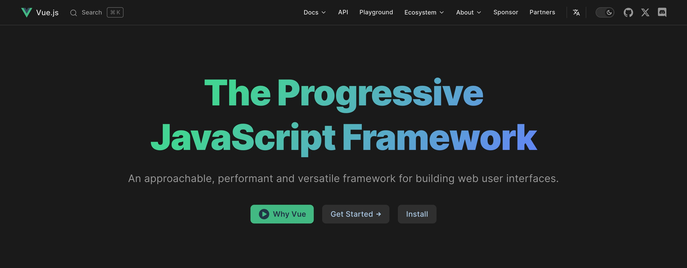
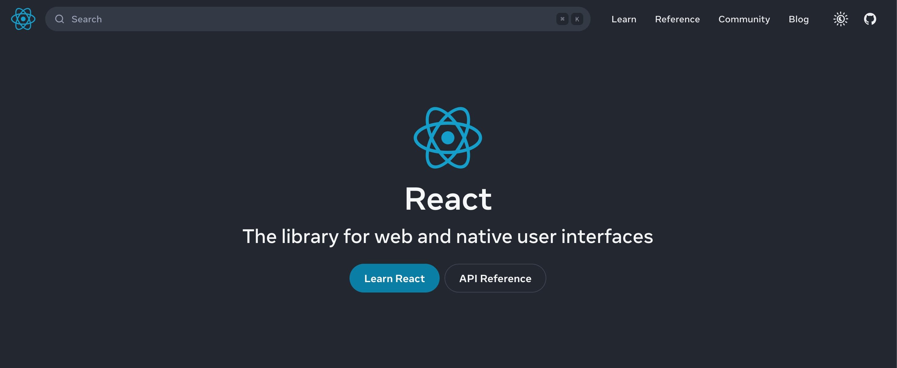
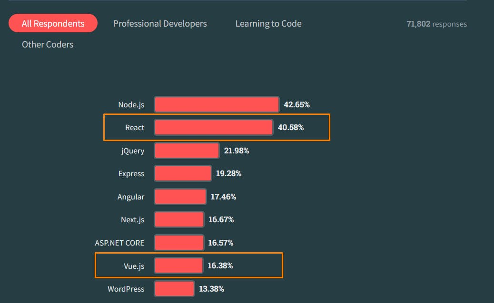
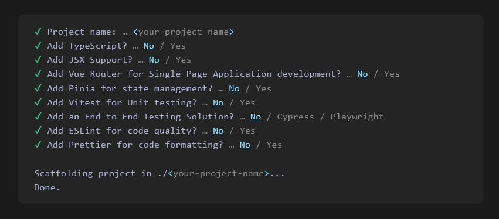
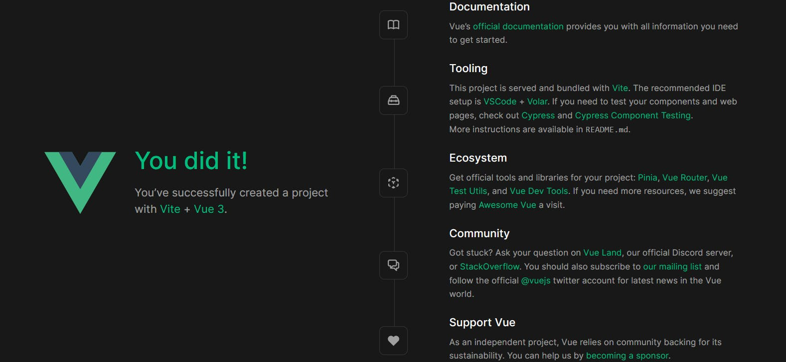
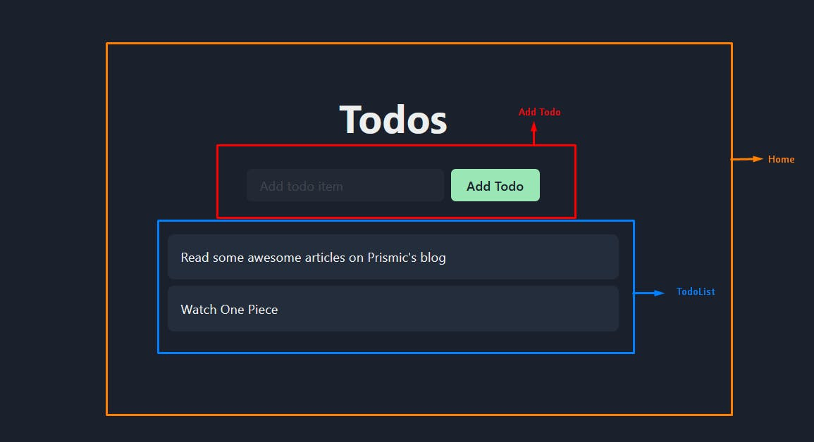
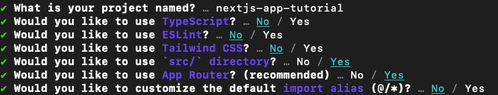
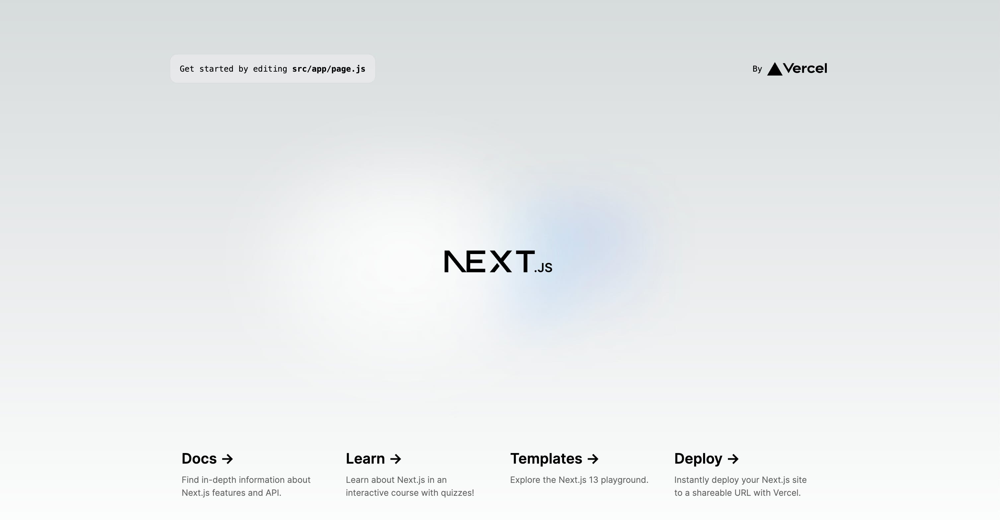

# vue还是react，2024年开发者如何选择


>   原文标题：Vue vs. React: How to Choose for 2024
>
>   原文链接：[https://prismic.io/blog/vue-vs-react](https://prismic.io/blog/vue-vs-react)


前端 Web 开发空间充满了多个可以使用的 JavaScript 框架。然而，我想到了两个顶级竞争者：Vue 和 React。这两个框架都是构建现代 Web 应用程序的高效、灵活的解决方案，并且得到了广泛的采用，甚至包括 Adob​​e、Airbnb、阿里巴巴、Figma 和 Netflix 等主要品牌。


虽然 Vue 和 React 具有相同的用途，但我们在决定使用哪一个时必须注意它们的差异。选择正确的框架至关重要，因为我们的选择可以极大地影响应用程序的开发过程和整体成功。


在本文中，我们将比较 Vue 和 React，看看它们如何相互比较。我们将研究它们的相似点、差异、优缺点以及在它们之间做出决定时要考虑的因素。


读完本文后，您将能够做出明智的决定。在此过程中，我们还将通过使用这两个框架构建一个基本项目来亲自动手。让我们深入了解一下！


## 关于Vue？




Vue，发音为“view”或 Vue.js，是一个用于构建网站和应用程序的开源渐进式 JavaScript 框架。它由前 Google 工程师 Evan You 开发，于 2014 年 2 月正式推出该框架。使用 Vue 的一些流行品牌包括 Adob​​e、Gitlab 和 Apple。


Vue 的设计轻量且易于理解，使其成为初学者和经验丰富的开发人员的绝佳选择。它专注于应用程序的视图层，允许开发人员轻松创建交互式动态 Web 界面。


多年来，Vue 因其简单性、灵活性和性能而获得了广泛的欢迎。它很容易学习，因为它具有简单的模板语法，紧密贴近 HTML、CSS 和 JavaScript 基础知识。另一个以易于理解的语法而闻名的框架是 Svelte。

### 优点

-   Vue 的学习曲线平缓，适合初学者。
-   Vue 有一个紧凑且轻量级的核心库，gzip 后大小为 34.7kb。
-   Vue 可以轻松集成到现有项目中并支持逐步采用。我们不需要全面重写来使用 Vue。

### 缺点

-   Vue 的生态系统比 React 更小，这意味着社区生成的库和工具更少。
-   没有对移动支持的本机支持。
-   虽然它是一个可靠的框架，但对 Vue 开发人员的需求比 React 低。


## 关于React？




React 是一个开源 JavaScript 库，用于构建 Web 应用程序的用户界面。它由 Facebook（现在称为 Meta）开发，最初在内部发布，直到 2013 年 5 月 28 日向公众发布。观看此视频以了解有关 React 历史的更多信息。使用 React 的一些流行品牌包括 Netflix、Facebook（显然）和 Uber。


React 的关键功能之一是虚拟 DOM（文档对象模型），它是实际 DOM 元素及其属性的轻量级副本。 React 使用 diffing 算法将虚拟 DOM 与实际 DOM 进行比较，并仅更新已更改的部分。这使得 React 非常快速且高效，尤其是在处理大型且复杂的应用程序时。

### 优点

-   React 通过其移动开发框架 React Native 支持 iOS 和 Android 开发。
-   React 拥有一个庞大的生态系统，其中充满了更广泛的开源第三方库和工具。
-   React 得到积极维护并经常更新。一个例子是 2022 年 3 月发布的 React 18，它附带了服务器组件和新的 startTransition API 等功能。

### 缺点

-   React 的学习曲线比较陡峭，尤其是对于初学者来说。
-   该生态系统充满了用于状态管理、路由、UI、动画等的多个第三方解决方案，这可能是一个缺点并导致决策瘫痪，特别是在开发人员有不同偏好的团队中。


## Vue 和 React 之间的主要相似之处

### 基于组件的架构

Vue 和 React 之间的主要相似之处之一是它们基于组件的架构。这两个框架都允许我们将 UI 界面分解为可重用且独立的组件。这使我们能够通过组合和重用这些组件来创建复杂的前端层，同时我们的代码保持模块化和可维护性。

### 虚拟DOM

React 引入了虚拟 DOM。然而，这两个工具都使用它来有效地更新和渲染 UI 组件。不是直接操作实际 DOM，而是首先对虚拟 DOM 进行更改，然后仅在必要时应用于实际 DOM。这会提高性能并使渲染过程更加高效。

### 元框架

Vue 和 React 有基于它们的 Meta 框架。借助 Vue，我们拥有 Nuxt.js 和静态站点生成器（例如 Gridsome 和 VuePress）。有了 React，我们就有了 Next.js、Gatbsy 和 Remix 等。

### 灵活性和可扩展性

Vue 和 React 是高度灵活和可扩展的框架。它们可以集成到现有项目中或用于从头开始构建新项目。它们可用于创建简单的单页应用程序或复杂的企业级应用程序。


## Vue 和 React 之间的主要区别

### 受欢迎程度和采用率

根据 Stack Overflow 的 2023 年开发者调查，React 比 Vue 更受欢迎。根据他的统计，29,137 名开发人员使用 React，而 11,761 名开发人员使用 Vue。自 2022 年 Stack Overflow 调查以来，这些百分比一直保持相对不变，该调查显示 42.62% 的开发人员使用 React，而 18.82% 的开发人员使用 Vue。



### 语法：JSX 与模板


Vue 和 React 之间最显着的区别之一是它们提供的不同语法。 Vue 提供了模板语法，这是一种基于 HTML 的语法，可以清晰地分离表示层 (HTML) 和逻辑层 (JavaScript)。


它支持数据绑定、属性绑定、正则 JavaScript 表达式和称为指令的特殊基于 Vue 的属性。模板语法很大程度上受到 Angular 的启发。我喜欢 Vue 的原因之一是它的语法很容易一次性掌握。


以下是数字增量按钮的 Vue 语法示例代码：


```vue
<script setup>
import { ref } from "vue";
const count = ref(0);
</script>

<template>
  <button v-on:click="count++">Count is: {{ count }}</button>
</template>

<style scoped>
button {
  font-weight: bold;
}
</style>
```


另一方面，React 提供了 JSX，它代表 JavaScript XML。它允许我们直接在 JavaScript 文件中编写类似 HTML 的代码。我们编写的任何 JSX 代码在浏览器中执行之前都会被转换为常规 JavaScript。


这些年来我已经习惯了 JSX。然而，作为一个 React 初学者，理解起来有点困难。 JSX 最初不被一些开发人员喜欢，因为它违背了传统的关注点分离模式，即分离 HTML、CSS 和 JavaScript。


这是 React JSX 语法中的相同增量按钮。


```javascript
import { useState } from 'react';

function Counter() {
  const [count, setCount] = useState(0);

  return (
    <div>
      <button onClick={() => setCount(count++)}>Count is: {count}</button>
      <style>
        {`
          button {
            font-weight: bold;
          }
        `}
      </style>
    </div>
  );
}
```


### 学习曲线


React 的学习曲线比 Vue 更陡峭。这主要是因为它们的模板语法不同。 React 的 JSX 语法是 JavaScript 和 HTML，这使得它很难掌握，特别是对于初学者来说。另一方面，Vue 基于模板的语法更类似于传统 HTML，更容易让初学者理解。

### 移动开发支持


React 支持使用 React Native 进行移动应用程序开发。除了移动开发之外，React Native 还提供构建 Windows 和 macOS 应用程序的支持。它于 2015 年发布，被 Instagram、Pinterest 和 Uber Eats 等品牌使用。


Vue 曾经拥有名为 Vue Native 的移动开发产品。然而，它早已被弃用。虽然 Vue 团队没有官方解决方案，但我们可以使用 NativeScript 作为基于 Vue 的移动开发的替代方案。

### 内置过渡组件


就像 Angular 一样，Vue 提供了内置的转换组件 `<Transition>` 和 `<TransitionGroup>` ，我们可以使用它们来提升用户体验。我们可以使用这些组件来创建不同类型的效果，例如进入和离开动画、基于 CSS 的过渡和可重用过渡。另一方面，React 不提供原生动画或过渡功能。但是，我们可以使用 Framer Motion 或 React Transition Group 等动画库。

|                  | vue                           | react                       |
| ---------------- | ----------------------------- | --------------------------- |
| 基于组件的架构   | ✔️                             | ✔️                           |
| 虚拟DOM          | ✔️                             | ✔️                           |
| 元框架           | Nuxt.js、Gridsome 和 VuePress | Next.js、Gatsby 和 Remix 等 |
| 灵活性和可扩展性 | ✔️                             | ✔️                           |
| 人气             | 相对react略少                 | 很受欢迎                    |
| 句法             | 使用模板语法                  | 使用 JSX 语法               |
| 学习曲线         | 较平缓                        | 更陡峭                      |
| 官方移动开发支持 | ❌                             | ✔️ React Native              |
| 过渡和动画       | ✔️                             | ❌                           |
| GitHub Stars     | 40.6k                         | 214k                        |
|                  |                               |                             |


## 在 Vue 和 React 之间进行选择时要考虑的因素


让我们探讨一下在 Vue 和 React 之间进行选择时需要考虑的一些因素。

### 学习曲线


首先要考虑的因素之一是与每个框架相关的学习曲线。与 Vue 相比，React 的学习曲线更陡峭，尤其是对于刚接触 JavaScript 框架的开发人员来说。另一方面，Vue 的学习曲线比较平缓，被认为更适合初学者。根据项目时间表，我们可能希望选择可以更快掌握并上手的工具。

### 社区支持和生态系统


框架社区的规模可以极大地影响其发展和支持。 React 比 Vue 拥有更大的社区和更完善的生态系统。以 GitHub 星数为指标：React 目前有 21.6 万颗星，而 Vue 有 4.06 万颗星。 React 生态系统非常庞大，以至于 Next.js 的星星比 Vue 还要多，准确地说，有 113k 颗星星。不过，Vue 不应该被排除在外，因为它正在迅速流行，而且它的社区也在不断增长。

### 就业市场和行业需求


除非你学习 JavaScript 框架是为了爱好或个人项目，否则你很可能打算用它来找工作和赚​​钱。在这种情况下，可以安全地考虑就业市场对哪种工具的需求量很大。确定这一点的一种方法是检查 10 到 20 名前端开发人员或软件工程师的职位申请，看看这些角色最需要哪种工具。

### 轻松访问第三方解决方案


除了我们计划从头开始构建每个功能之外，轻松访问第三方解决方案（例如预构建的 UI 组件、样式解决方案、身份验证系统、动画库、图像优化库等）也很重要。这是 React 脱颖而出的领域之一，因为社区已经并不断提供针对不同需求量身定制的库。然而，Vue 也有一些很棒的软件包值得一看。

### 跨平台要求


如果唯一考虑的平台是网络，那么我们选择使用的框架并不那么重要。但是，假设我们计划构建 iOS 和 Android 应用程序。在这种情况下，最好将该解决方案与 Microsoft、Skype、Shopify 和 Pinterest 等顶级品牌积极使用的经过实战检验且得到良好支持的移动（iOS 和 Android）开发框架结合使用。


## 开始使用 Vue

按照以下步骤启动新的 Vue 应用程序。

### 第 1 步：安装 `create-vue` 脚手架工具


运行以下命令创建一个新的 Vue 项目。该命令将安装并触发 `create-vue` ，一个由 Vite 支持的脚手架工具。它提供了我们可以根据自己的喜好配置 Vue 应用程序的提示。

```shell
npm create vue@latest
```

这是配置选项的屏幕截图。



### 第 2 步：安装依赖项并启动开发服务器

连续运行以下命令完成安装过程。第一个命令导航到项目目录，第二个命令安装 Vue 所需的第三方依赖项，最后一个命令启动开发服务器。

```shell
cd <name-of-project>
npm install
npm run dev
```

Vue 应用程序的默认端口是 http://localhost:5173/。在浏览器上导航到该 URL 将显示以下网页。浏览 Vue 的文档以获取有关入门的更多信息。



### 有用的 Vue 库

虽然 Vue 的生态系统没有 React 那么多的开源解决方案，但它确实有一些我们可以使用的优秀库和工具。一些选项包括：

-   [Vuetify](https://vuetifyjs.com/en/)
-   [Vue Router](https://router.vuejs.org/)
-   [FormKit](https://formkit.com/)
-   [Gridsome](https://gridsome.org/)
-   [Vuex](https://vuex.vuejs.org/)


## 使用 Vue 构建一个简单的 Todo 应用程序

在本节中，我们将构建一个简单的基于 Vue 的待办事项应用程序。下图显示了该应用程序及其不同的组件。



todo 应用程序包括：

-   包含不同待办事项的 `TodoList` 组件
-   包含输入字段和提交按钮的 `AddTodo` 组件
-   呈现 UI 并处理状态和功能的主页

我们将按照以下步骤构建应用程序。

### 第 1 步：创建用户界面

请注意，我们在界面中使用纯 CSS。为简单起见，以下代码块不包含样式，但如果您想设计如上图所示的项目样式，请随意使用此沙箱中的样式。

首先，我们在 `components` 目录中创建两个文件。

首先是 `TodoList` 组件。现在，我们将对待办事项进行硬编码。然而，我们将改变这一点并以编程方式填充它们。

```vue
<!-- ./src/components/TodoList.vue -->
<template>
  <ul>
    <li>Read some awesome articles on Prismic blog</li>
    <li>Watch One Piece</li>
  </ul>
</template>
```

然后是 `AddTodo` 组件。

```vue
<!-- ./src/components/AddTodo.vue -->
<template>
  <div>
    <input type="text" placeholder="Add todo item" />
    <button>Add Todo</button>
  </div>
</template>
```

最后，我们注册组件并将它们放在主页中，即 `App.vue` 文件。

```vue
<!-- ./src/App.vue -->
<script>
import AddTodo from "./components/AddTodo.vue";
import TodoList from "./components/TodoList.vue";

export default {
	components: {
    AddTodo,
    TodoList,
  },
  setup() {
    return {
      AddTodo,
      TodoList
    };
  }
};
</script>

<template>
  <div id="app">
    <h1>Todos</h1>
    <AddTodo />
    <TodoList />
  </div>
</template>
```

### 第 2 步：创建待办事项状态和状态更新功能

为此，我们需要更新 `App.vue` 文件。

```vue
<script>
import AddTodo from "./components/AddTodo.vue";
import TodoList from "./components/TodoList.vue";

export default {
  data() {
    return {
      todos: [
        { id: 1, item: "Read some awesome articles on Prismic blog" },
        { id: 2, item: "Watch One Piece" },
      ],
    };
  },
  methods: {
    addTodo(item) {
      let newTodo = {
        id: performance.now(),
        item,
      };
      this.todos.push(newTodo);
    },
  },
};
</script>

<template>
  <AddTodo @add-todo="addTodo" />
  <TodoList :todos="todos" />
</template>
```

在这里，我们做了以下事情：

-   创建了一个 `todos` 状态并用一些任务填充它。
-   创建了一个 `addTodo` 方法，该方法接受用户提交的待办事项并将其添加到 `todos` 状态。
-   将 `addTodo` 方法和 `todos` 状态分别传递给 `AddTodo` 和 `TodoList` 组件。

### 第 3 步：跟踪用户输入并处理表单提交

为此，我们需要更新 `AddTodo.vue` 文件中的代码。

```vue
<script>
export default {
  name: "AddTodo",
  data() {
    return {
      todoInput: "",
    };
  },
  methods: {
    handleClick(val) {
      if (!val) return;
      this.$emit("add-todo", val);
      this.todoInput = "";
    },
  },
};
</script>

<template>
  <div class="form-container">
    <input v-model="todoInput" type="text" />
    <button @click="handleClick(todoInput)">Add Todo</button>
  </div>
</template>
```

在这里，我们做了以下事情：

-   创建一个 todoInput，它将保存输入字段的状态，并通过 `v-model` 数据绑定将其与输入同步。
-   创建了一个 handleClick 函数，该函数在用户提交输入时捕获输入中的文本并将其发送到其父组件，然后更新 todos 状态。
-   将该handleClick 函数传递给按钮的单击事件处理程序。


### 第 4 步：显示状态中的待办事项

最后，我们需要显示处于待办事项状态的待办事项，而不是在 TodoList.vue 组件中将它们硬编码。

```vue
<template>
  <ul>
    <li v-for="todo in todos" :key="todo.id">
      {{ todo.item }}
    </li>
  </ul>
</template>

<script>
export default {
  name: "TodoList",
  props: {
    todos: {
      default: () => [],
    },
  },
};
</script>
```

至此，我们已经成功使用 Vue 构建了 todo 应用程序。这是待办事项应用程序的最基本版本。我们可以通过添加更多功能来改进，例如本地存储、数据库集成、基于角色的权限、编辑和删除任务等等。


## 开始使用 React

React 团队建议使用 Gatsby、Next.js 和 Remix 等基于 React 的框架来构建应用程序。在本文中，我们将使用 Next.js。

按照以下步骤启动新的 React 应用程序。

### 第 1 步：使用 `create-next-app` 创建一个新的 Next.js 应用程序

就像 `create-vue` 一样， `create-next-app` CLI 工具可帮助创建和配置新的 Next.js 应用程序。运行以下命令来创建一个新项目。

```shell
npx create-next-app@latest
```

如果您逐步按照本教程进行操作，则可以选择以下配置选项：



### 第 2 步：安装依赖项并启动开发服务器

与 Vue 一样，第一个命令导航到项目的目录。我们使用 `create-next-app` 创建项目，它为我们处理依赖项，因此我们需要做的就是使用下面的第二个命令启动开发服务器。

```shell
cd <name-of-project>
npm run dev
```

Next.js 应用程序的默认端口是 http://localhost:3000。在浏览器上导航到该 URL 将显示以下网页。浏览 React 的文档以获取有关入门的更多信息。




### 有用的 React 库

React 的生态系统充满了我们可以利用的几个优秀的开源解决方案。一些很棒的库和工具包括：

-   [Material UI](https://mui.com/material-ui/getting-started/)
-   [React Router](https://reactrouter.com/)
-   [React Hook Form](https://react-hook-form.com/)
-   [TanStack React Query TanStack](https://tanstack.com/query/v3/)
-   [Zustand](https://github.com/pmndrs/zustand)


## 使用 React 构建一个简单的 Todo 应用程序


让我们在 Next.js 中创建与之前创建的相同的待办事项应用程序，只是这一次。您可以查看此沙箱以获取代码或按照以下步骤操作。


就像 Vue 应用程序一样，Next.js 版本的 UI 由相同的组件 `TodoList` 、 `AddTodo` 以及将所有内容组合在一起的主页组成。

### 第 1 步：安装 Chakra UI 和 uuid

React 应用程序的用户界面与 Vue 版本相同，因此我们不会详细介绍。唯一的区别是我们将在这里使用 Chakra UI。
首先，让我们通过在终端的单独选项卡中运行以下命令来安装 Chakra UI（如果您不使用 npm，您可以按照此处的其他安装说明进行操作）：

```shell
npm i @chakra-ui/react @emotion/react @emotion/styled framer-motion
```

我们还将使用 `uuid` 为每个待办事项提供唯一的 ID。因此，在终端的新选项卡中，运行以下命令，这样当我们添加该代码时就不会出现错误。

```shell
npm install uuid
```

### 第 2 步：更新布局

如果尚未打开您的项目，请在代码编辑器中打开。

现在，让我们通过添加以下代码来更新 `layout.js` 文件以导入 Chakra 组件：

```js
// ./src/app/layout.js
import './globals.css'
import { ChakraProvider } from "@chakra-ui/react";

export default function RootLayout({ children }) {
  return (
    <html lang="en">
      <body>
        <ChakraProvider>
          {children}
        </ChakraProvider>
      </body>
    </html>
  )
}
```

### 第 3 步：创建 todo 状态

该状态将存在于主页组件中，该组件位于 `/src/app/page.js` 文件中。使用下面的代码更新它。

```js
// ./src/app/page.js

"use client";

import { useState } from "react";
import { Heading, VStack } from "@chakra-ui/react";
import AddTodo from "@/components/AddTodo.js";
import TodoList from "@/components/TodoList.js";

export default function Home() {
  const [todos, setTodos] = useState([
    { id: "1", item: "Read some awesome articles on Prismic's blog" },
    { id: "2", item: "Watch One Piece" },
  ]);

  const addTodo = (todo) => {
    setTodos([...todos, todo]);
  };

  return (
    <VStack p={4} mt="28">
      <Heading size="2xl">Todos</Heading>
      <AddTodo addTodo={addTodo} />
      <TodoList todos={todos} />
    </VStack>
  );
}
```

让我们分解一下上面的代码。

-   我们从 React 导入了 `useState` ，这是 React 的内置状态管理钩子。
-   之后，我们使用钩子创建一个 `todos` 状态并用一些默认的待办事项填充它。
-   接下来，我们创建了一个 `addTodo` 函数，负责添加待办事项。该函数将 `todo` 对象作为参数，并使用 `setTodos` 函数将其添加到 `todos` 状态。
-   最后，我们通过 props 将 `addTodo` 和 `todos` 传递给它们各自的组件。 Props 是 React 组件之间传递数据的主要方式。

在此阶段，如果您转到网站的前端，您会注意到一个错误。这是因为我们正在尝试导入尚不存在的组件，所以接下来让我们创建它们！ 👇

### 第 4 步：跟踪用户输入并更新状态

在 `/src` 内，创建一个 `/components` 目录并在其中添加我们的 `AddTodo.js` 文件。将以下代码添加到 `AddTodo.js` 文件中。

```js
// ./src/components/AddTodo.js
import { useRef } from "react";
import { Button, HStack, Input } from "@chakra-ui/react";
import { v4 as uuidv4 } from 'uuid';

export default function AddTodo({ addTodo }) {
  const todoRef = useRef(null);

  const handleSubmit = (e) => {
    e.preventDefault();

	if (!todoRef.current.value.trim());
    const todo = {
      id: uuidv4(),
      item: todoRef.current.value,
    };

    addTodo(todo);
    todoRef.current.value = "";
  };

  return (
    <form onSubmit={handleSubmit}>
      <HStack m="8">
        <Input
          variant="filled"
          border="gray.600"
          placeholder="Add todo item"
          ref={todoRef}
        />
        <Button type="submit" colorScheme="green" px="8">
          Add Todo
        </Button>
      </HStack>
    </form>
  );
}
```

Here, we: 在这里，我们：

-   
    从 React 导入 `useRef` 钩子并使用它来获取输入字段的引用并跟踪其值。它可以帮助我们了解用户是否已输入内容。
-   我们创建了一个 `handleSubmit` 函数，它使用我们在步骤 2 中传递的 `addTodo` 函数将新的 `todo` 对象添加到 `todos` 状态。< b4> 还先用 `todoRef` 确认输入字段不为空，然后再将其添加到状态。这是因为我们希望确保只有当有人填写表单时才能添加待办事项。

### 第 5 步：显示 `todos` 状态下的todos

现在，在 `/components` 目录中添加一个 `TodoList.js` 文件，并将以下代码添加到该文件中。

```js
// ./src/components/TodoList.js
import { HStack, Text, VStack } from "@chakra-ui/react";

export default function TodoList({ todos }) {
  return (
    <VStack
      w="100%"
      alignItems="stretch"
      maxW={{ base: "90vw", sm: "80vw", lg: "50vw", xl: "40vw" }}
    >
      {todos.map((todo) => (
        <HStack key={todo.id} bg="gray.700" borderRadius="lg" p="4">
          <Text color="white">{todo.item}</Text>
        </HStack>
      ))}
    </VStack>
  );
}
```


在这里，我们通过 `todos` 属性访问状态，通过数组映射，并在状态中显示待办事项。通过此设置，只要将新的待办事项对象添加到状态，它就会更新，并且新的待办事项项目会显示在 UI 中。

至此，我们已经成功使用 React 构建了待办事项应用程序。


## 结论


Vue 和 React 是用于构建现代 Web 应用程序的强大 JavaScript 框架。它们都有各自的优点和缺点。在它们之间进行选择时，重要的是要考虑跨平台支持、学习曲线、个人喜好、项目要求、生态系统和就业市场等因素。

无论您选择什么，学习 Vue 或 React 都一定会增强您的技能，并在不断发展的 Web 开发领域开辟新的机会。此外，无论我们选择哪一个，重要的是要注意他们的惯例和最佳实践，以充分利用并充分利用它们。