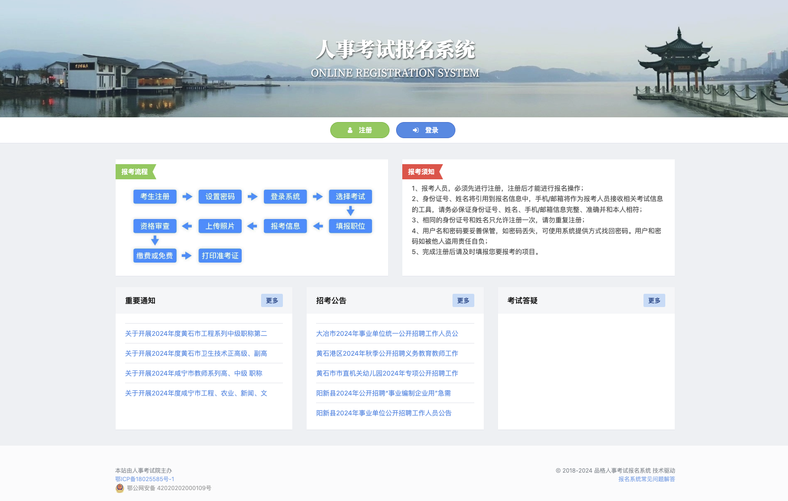
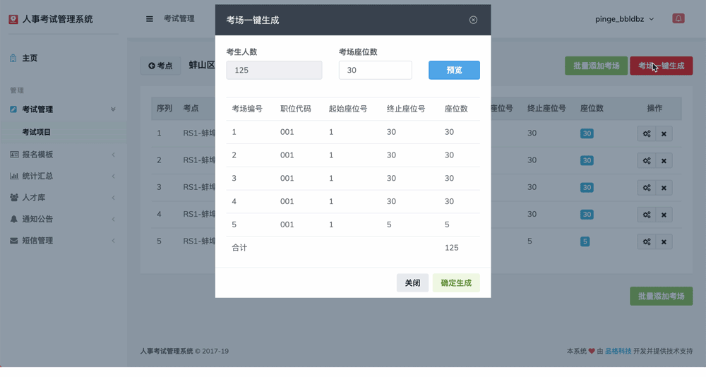
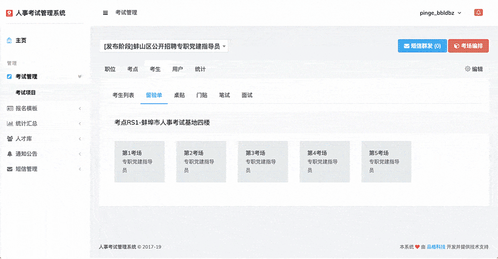
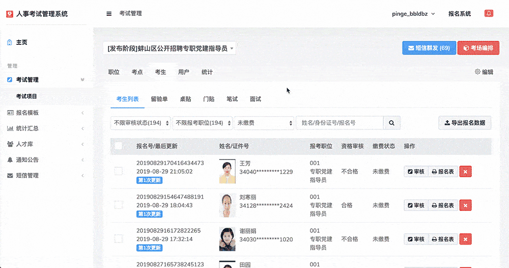
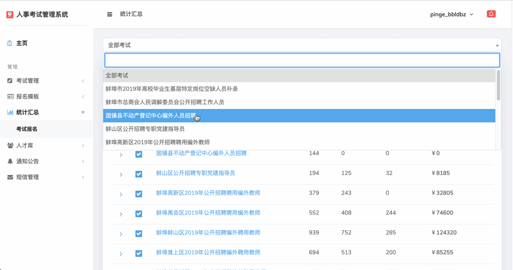

---
head:
  - [meta, { name: keywords, content: "人事考试网上报名系统,人事考试报名系统,人事考试报名管理系统,人事考试报名系统建设,人事考试报名系统开发,考务管理系统,考试报名管理系统,人事考试系统,考试报名系统,报名考试系统" }]
  - [meta, { name: description, content: "这篇文章主要介绍人事考试网上报名管理系统的业务特性，设计原理，以及部署方式。"}]
---

# 事业单位人事招聘考试网上报名考务管理考场编排准考证打印系统推荐

>   这篇文章主要介绍人事考试网上报名系统的业务特性，设计原理，以及部署方式。
>
>   该文章最早于2019年发布在知乎、CSDN、掘金等平台。

随着各地人事机构招考需求不断增强，规模不断扩大，考务管理工作难度不断加大。尤其是网上报名阶段，考生们犹如蓄势待发、抢滩登陆的士兵，扛着枪、冲锋号一响，同一时间往上冲，按照惯例配置的服务器自然难以承受这种猛烈的攻势。瞬时间崩塌，是显然的。

所谓的惯例配置，就是通常情况下，我们会根据网站的日常访问流量，测算出所需要的服务器资源，然后按此配置去组建服务器。影响较大的是：带宽、CPU和内存。这三样相互依存，难分先后，任一样达不到要求，崩了即是可以遇见的。

再有，就是软件的系统开发，有没有做代码优化、数据库优化、并发压力测试等。这些也都将直接影响到系统运行的稳定性。

既然，都已经了解到问题所处的原因。为何一到省考、大考，系统就经常性会崩呢？

这里，我认为不外乎有以下几种情况：

1）软件层面：报名系统开发较早，没有预想到如今所要面对的峰值流量，系统更新迟缓或无更新； 2）硬件层面：服务器为单位机房部署，可能配置较低，或存在多应用共存，难以确保其稳定性； 3）维护层面：技术人员响应不及时，无法第一时间处理宕机故障。

既然如此，更新升级不就完了。但对于大量的单位用户来说，系统升级谈何容易？需求要层层上报，预算要一步步审批，很多时候自然也就搁置了。

实际上，在此之前我对于考试报名系统也未曾了解多少，可能还不及你。

只是年前才开始接触报名系统的开发。而在开发期间，最主要的精力，都放在了上面我所描述的几个问题中。目前，我们的报名系统的开发已经过内测、公测，已进入正式部署阶段。而且也有了一定的用户案例。

借此机会，给大家分享一下我们开发的报名系统（虽然现在互联网发达，传播速度超乎想象。但是，传播是快了，声音却越来越小...）

这里，我只介绍我们的报名系统是如何解决这些问题的。

首先，我们的系统包含了招聘公告发布、网上报名、资格审查、在线缴费、考场设置、座位自动编排、准考证生成及打印、成绩查询、面试通知单、短信群发、数据导出Excel、自动生成人才库信息等覆盖人事考试(报名)与考务管理全套业务流程的功能。

**划重点：超级计算集群。** 官方用语：使用高速RDMA网络互联的CPU以及GPU等异构加速设备，面向高性能计算、数据分析，提供极致计算性能和并行效率的计算集群服务。分钟级交付的弹性裸金属实例，根据需求快速增减集群节点。 实际解决的问题就是：**报名系统不再崩！！！**

下面是我们系统特有的一些亮点功能，在此以动图的形式，简单展示下。

1 一键批量生成考场： 根据各岗位报考的人数，系统可自动以批量形式生成各个考场，可自定义考场座位数，亦支持手动模式。

2 自动生成留验单/桌贴/门贴： 自动编排考场以后，系统已为您生成各个考场的留验单、桌贴、门贴。完全不需要人工干预，即可实现。并且，支持在线一键打印，可自定义A3/A4或其他尺寸的纸张。

3 考务通知，短信群发： 系统目前已支持多种考务通知类型，只需将考生加入短信群发列表，即可快速将考务通知以短信形式发送至考生手机。短信系统会根据考生所属运营商，自动选择短信发送通道，优化短信通知效率，以确保100%送达。

4 考务统计与汇总： 考务统计支持单个考试统计，亦可将各个考试合并统计，满足不同的统计需求。在汇总统计状态下，还可以手动进行选择，可精确到岗位统计。

**系统的报名流程**：考生注册-设置密码-登录系统-选择考试-填报职位-报考信息-上传照片-资格审查-交费-打印准考证。

**系统链接：** [人事考试网上报名管理系统](http://exam.pinge360.com)