# 暑期结束，南京江宁/石臼湖/琅琊山带娃四日游

### D1 南京江宁，云水涧

暑假即将收尾，答应孩子的暑期旅程计划，必须落实。好在有良驹特斯拉傍身，备好行囊，说走就走。

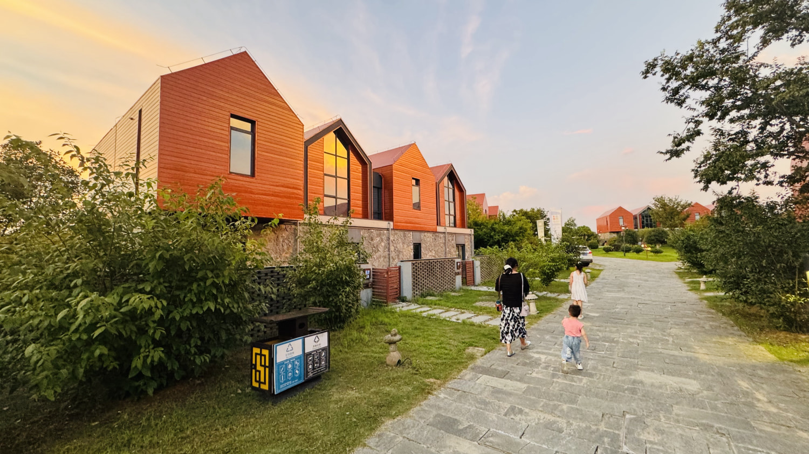

考虑带俩娃出行，主打一个休闲。

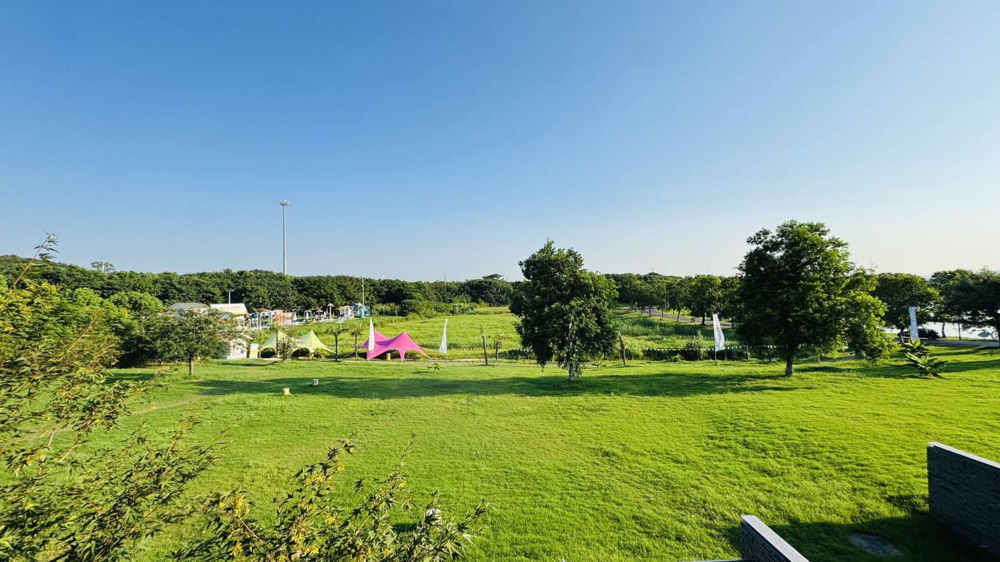

云水涧，是一个度假酒店。周边风景秀丽，红庙水库相伴。提供的房间以联排别墅为主，上下两层，100来平方，特别适合一家人入住。住宿提供免费户外泳池的游泳券，晚上营业到10点。

### D2 马鞍山石臼湖

驱车南下，行驶约30来公里。便来到了马鞍山境内的石臼湖。

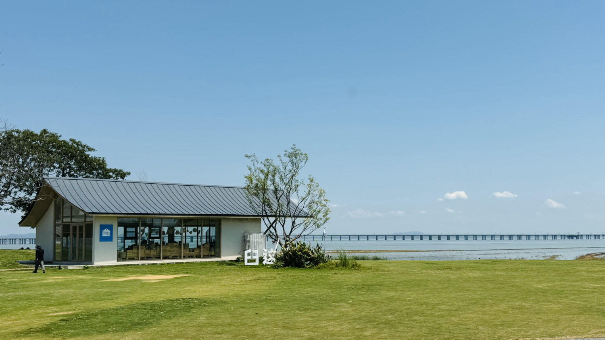

此处是网上刷到的小众景点。夏天可选择雨季前来，可一睹“天空之镜”。

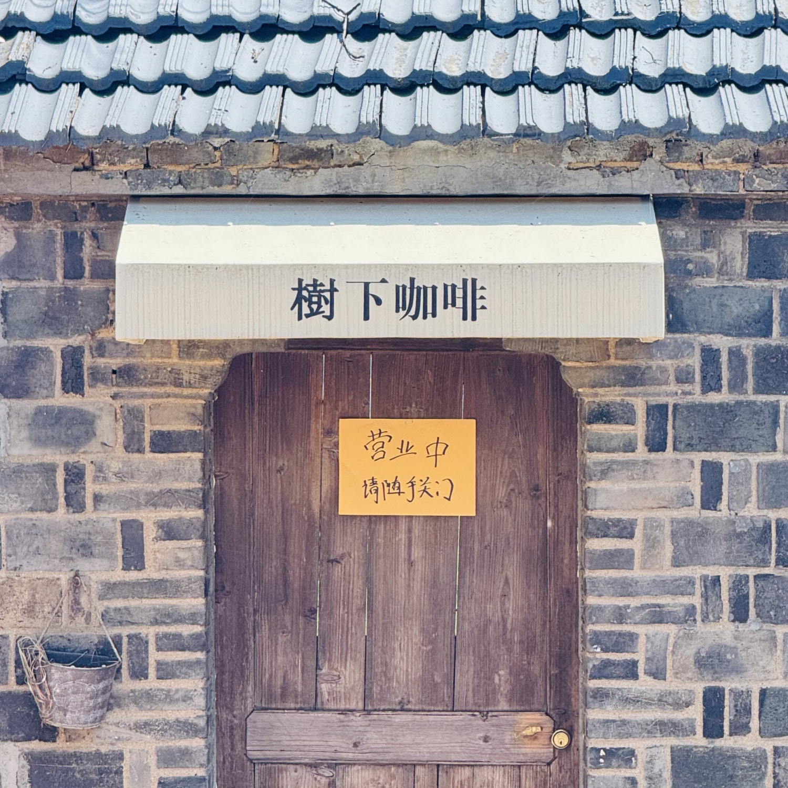

湖边村落之间竟有一小屋，名曰：树下咖啡店。

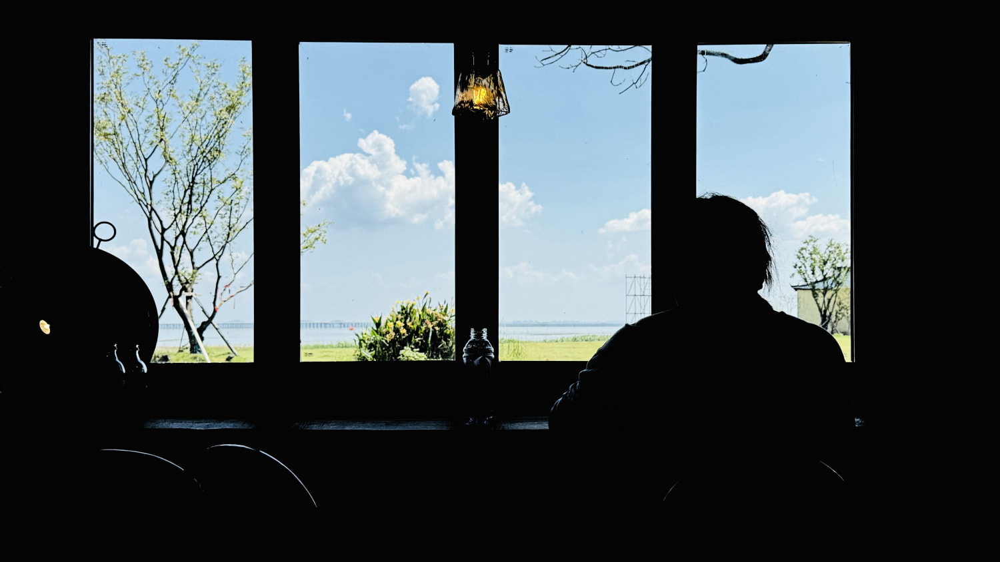

推门而入，的确是一处打卡拍照佳地。

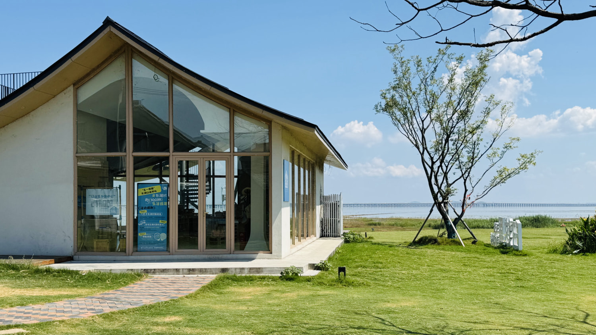

似乎已经不再营业的游客服务站。

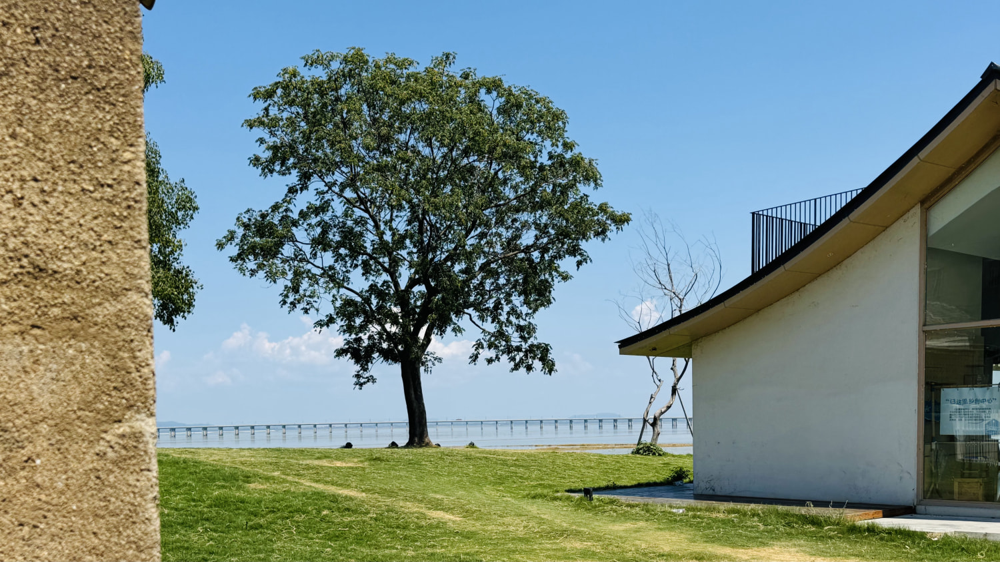

一棵大树。

### D3 南京市区

石臼湖打卡完毕，一路北上，前往南京城区。

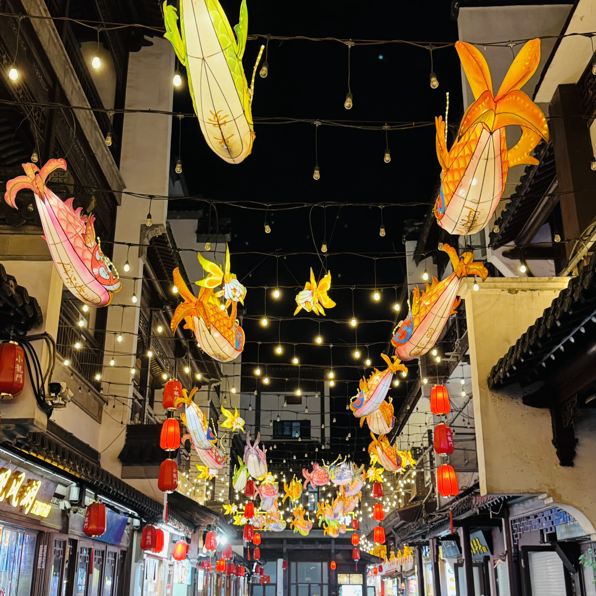

每次来南京，必游之地当属：老门东。

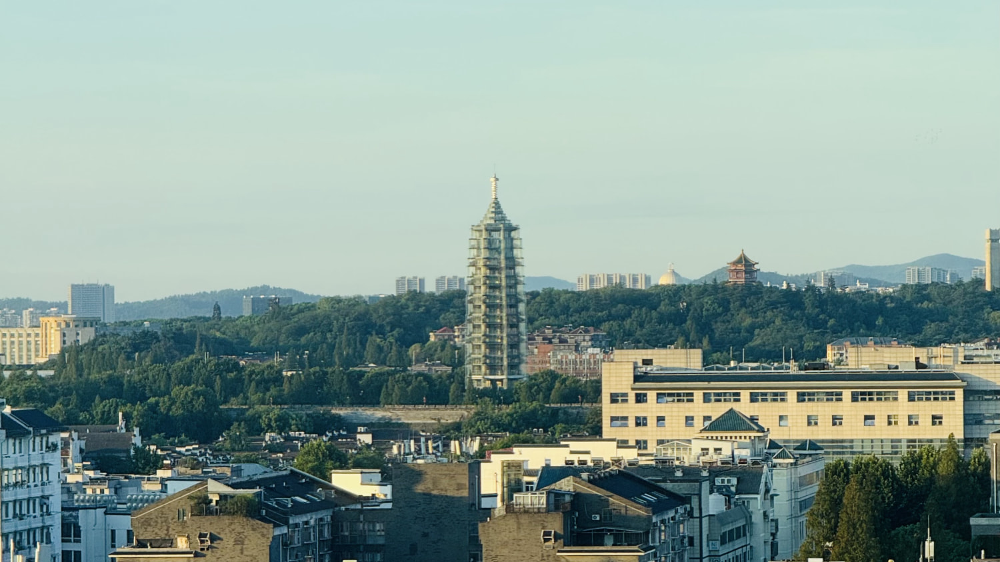

入住水游城度假酒店，落地窗远眺大报恩寺琉璃塔。

### D4 滁州琅琊山

启程滁州，琅琊山乃多次途经但未一探究竟之地。

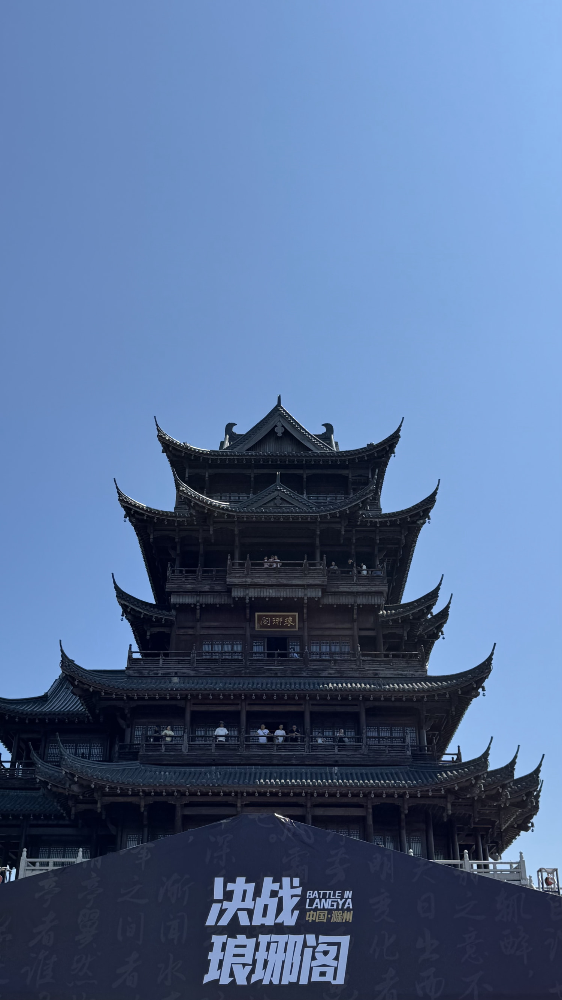

琅琊阁，原名会峰亭、会峰阁，始建于明朝，是琅琊山风景名胜区的最高建筑物。阁高24米，分上下五层，从四面观看，高低形状各不相同。

2015年11月17日一篇报道提及，安徽省琅琊山旅游发展有限公司已抢先注册了琅琊阁商标。该公司负责人曾就此事向媒体称，“会峰阁”更名是为了借助《琅琊榜》配合微信营销，“用于旅游开发 ...

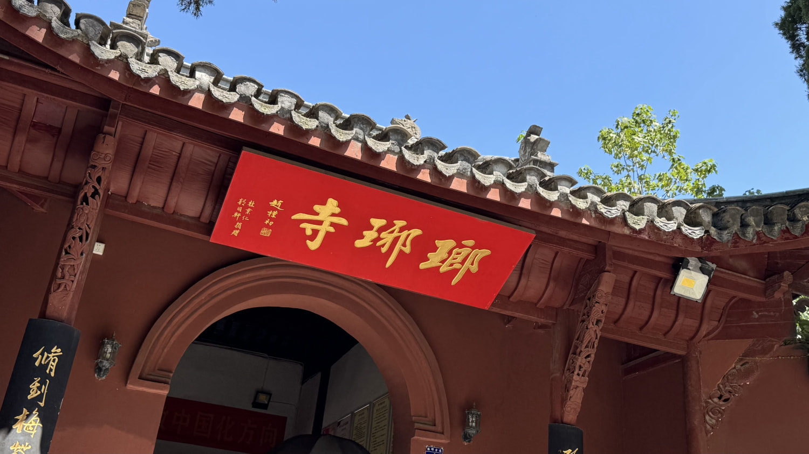

琅琊寺、又称宝应寺、开化禅寺、开化律寺。琅琊寺始建于唐大历年间，由滁州刺史李幼卿与法深法师创建，唐代宗赐“宝应寺”。后宋朝太平兴国三年（978年），宋太宗改“开化禅寺”，亦称“琅琊寺”。元朝末年，寺毁。明朝洪武六年（1373年）绍宁、无为重修。清嘉庆年间，皓清法师予以重建，该为“开化律寺”。咸丰年间毁于太平天国战争。光绪三十年（1904年），达修法师住持开化寺，重建寺院，改回“琅琊寺”。

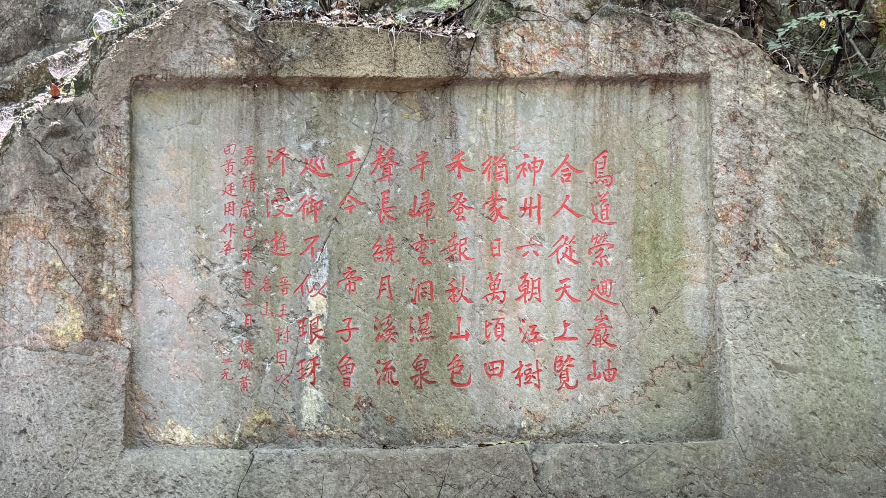

路边一处石刻，不知何意。大概是描绘琅琊山美景的吧。。。

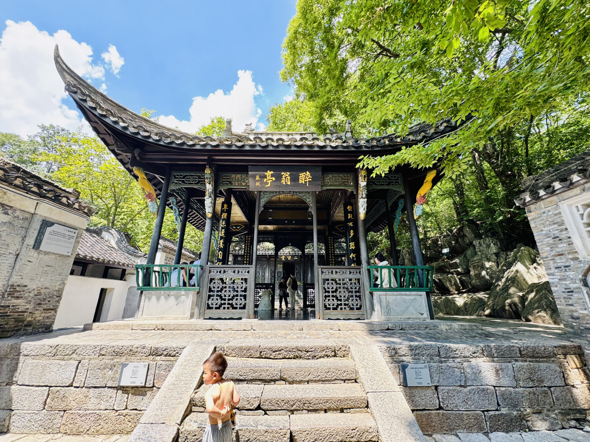

醉翁亭，中国四大名亭之首，又被称为天下第一亭。北宋庆历六年（1046年），文人欧阳修被贬为滁州太守。欧阳修自号“醉翁”，醉翁亭之名由此而得。后写下传世之作《醉翁亭记》，其中有千古名句“醉翁之意不在酒，在乎山水之间也。”醉翁亭与琅琊山的清秀山水从此闻名于世。**今存亭台为清代修筑，并非北宋年间。**

### 行

首次尝试一路国道行驶，感受还不错。

### 食

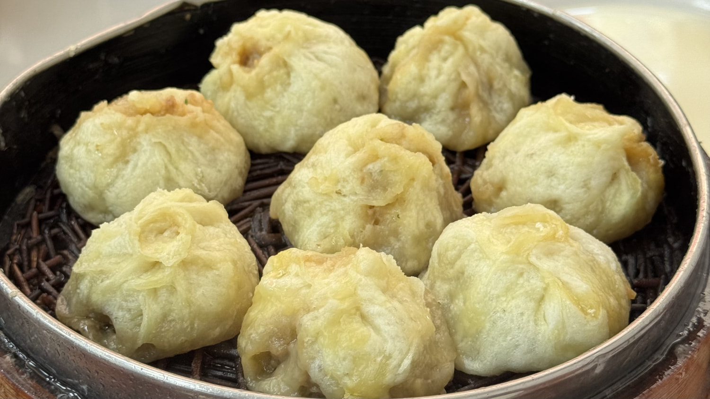

滁州的美食不多。不过，这个包子当属一绝，绝对是童年记忆中的味道。位于矿业路，名：铜矿包子店。

凤阳临淮关的一家小刀面，手工刀切，清汤素面，少许猪油，简单纯粹。

>   若滁州的包子和凤阳的小刀面能双剑合璧，那就相当惊艳了。