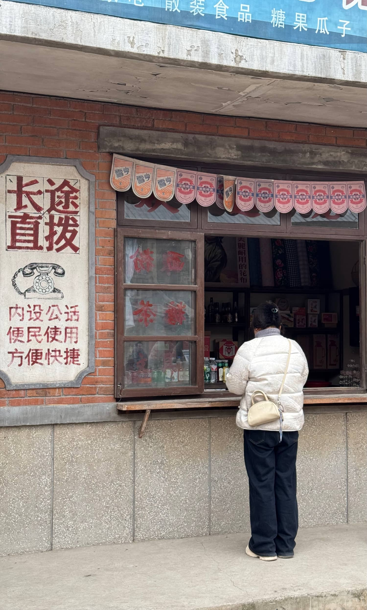

# 寻访《六姊妹》拍摄地：淮南九龙岗的老时光印记

二月的风凛冽刺骨，久居室内，难免生出几分倦怠。百无聊赖之际，指尖划过短视频平台，偶然刷到央视热播剧《六姊妹》的宣传片段。镜头里斑驳的红砖墙、老旧的厂区宿舍、蜿蜒的窄巷，无不透着浓厚的年代感。字幕一闪而过——"拍摄地：淮南九龙岗"。

据说，这里仍保留着大量建国初期的老建筑，时光仿佛在此凝固。一时兴起，不如去探访这座被岁月遗忘的角落，看看戏里戏外，是否真如荧幕上那般鲜活。

### **一场穿越时光的探访**

九龙岗，淮南市郊的一个老工业区，曾是煤矿重镇，如今却因产业变迁而渐渐沉寂。驱车驶入街区，迎面而来的是一排排低矮的砖房，灰白的墙面爬满岁月的裂痕，木质窗框漆色剥落，却仍倔强地维持着旧时的模样。

《六姊妹》的取景地就藏在这些街巷中。剧中的"刘家小院"实为一座上世纪五六十年代的老宅，红砖青瓦，门前几级石阶已被磨得光滑。站在巷口望去，仿佛能听见剧中人的对话声——大姐的严厉、二姐的温柔、小妹的俏皮，似乎都还萦绕在这方寸之间。

沿着石板路漫步，偶遇几位坐在门前晒太阳的老人。问及电视剧，他们笑呵呵地点头："是啊，前阵子可热闹了，来了好多拍戏的。"言语间带着几分自豪，仿佛这座老城终于被人记起。

### **凝固的旧时光**

九龙岗的老建筑群，大多建于上世纪五六十年代，苏式风格的厂区宿舍、红砖砌成的职工俱乐部、斑驳的供销社门脸……每一处都镌刻着那个年代的印记。

最令人驻足的是那座老式电影院，门头上的五角星依然醒目，只是售票窗口早已紧闭。据说，《六姊妹》中几场重要的家庭戏就是在这里拍摄的。站在空荡的影院前，恍惚间似乎能听见旧日里放映机的转动声，和银幕上黑白电影的台词。

### **被镜头唤醒的记忆**

一部电视剧，让这座沉寂的老城重新进入人们的视野。那些被遗忘的街巷、老屋，因《六姊妹》的热播而短暂地热闹起来。游客、摄影爱好者、怀旧者纷至沓来，试图在现实中寻找剧中的影子。

离开时，夕阳斜照，为老建筑镀上一层温暖的金色。或许，九龙岗的魅力不仅在于它的"上镜"，更在于它真实地保存了一段历史。在这里，时光走得很慢，慢到足以让人细细品味那些逝去的岁月。

### **后记**

有时候，一部剧、一座城、一段旧时光，就能让人停下匆忙的脚步，回望来时路。九龙岗如此，《六姊妹》亦是如此。

