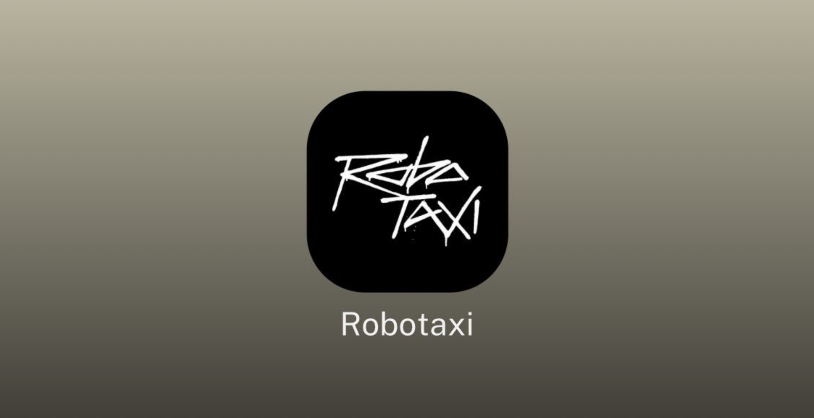
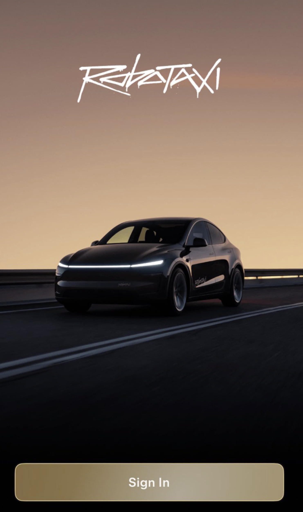

# 特斯拉 RoboTaxi 正式运行，德州奥斯汀小范围公测记录

**2025 年 6 月 22 日**对特斯拉而言是一个特殊的日子。据马斯克社交媒体发文称：“十年辛勤工作的顶峰。人工智能芯片和软件团队都是特斯拉内部从零开始建立的。”(Culmination of a decade of hard work.Both the AI chip and software teams were built from scratch within Tesla.)

### **RoboTaxi**

特斯拉的 RoboTaxi（无人驾驶出租车）是其全自动驾驶（Full Self-Driving, FSD）技术的核心应用，旨在**通过人工智能和摄像头驱动的纯视觉方案实现完全自主驾驶**（SAE 4 级或 5 级）。

### **最新进展**

- **2025 年 6 月 22 日奥斯汀试运营**：特斯拉在德州奥斯汀启动了 RoboTaxi 小规模测试，使用约 10-20 辆 2025 款 Model Y，运营区域限于南奥斯汀特定街区，服务时间为早上 6 点至凌晨 12 点。
  - 费用：每程固定 4.20 美元，仅限受邀用户（主要是特斯拉员工和部分社交媒体影响者）。
  - 安全措施：每车配备一名“安全监控员”坐在副驾驶座，随时可通过紧急开关干预，但具体控制权限尚未明确。远程操控员（teleoperators）作为后备支持复杂场景。
  - 技术：使用升级版 FSD“无监督”软件，依赖摄像头而非激光雷达（LiDAR）或雷达，特斯拉宣称其可扩展性强，无需高成本设备或广泛地图绘制。
- **网站与推广**：特斯拉推出 tesla.com/robotaxi 网站，允许美国用户注册以获取早期体验资格，并开设专门的 X 账号@TeslaRobotaxi 推广服务。
- **加州许可**：2025 年初，特斯拉获得加州许可，允许在特定条件下为员工提供全自动驾驶出租车服务（需安全司机）。
- **未来计划**：
  - 2025 年计划在加州和德州扩展服务，可能包括旧金山。
  - 特斯拉 CEO 马斯克表示，RoboTaxi 将快速扩展，并预测 2025 年中将显著影响公司财务。
  - Cybercab（无方向盘和踏板的两座车型）和 Robovan（可载 20 人的车型）于 2024 年 10 月 10 日发布，预计 2026-2027 年量产，未来将取代部分 Model Y 作为 RoboTaxi 主力。

### **技术与优势**

- **FSD 技术**：特斯拉的 FSD 基于端到端神经网络，依靠全球 500 万辆配备 FSD 硬件的车辆累积超 32 亿公里数据进行训练，号称安全性将比人类驾驶高 1000%以上。
- **成本优势**：纯视觉方案避免了昂贵的 LiDAR，现有 Model Y 可通过软件更新转为 RoboTaxi，降低初始投资。特斯拉预计运营成本可降至每公里 0.3-1 美元。
- **商业模式**：车主可将车辆加入 RoboTaxi 车队，在闲置时赚取收入，类似“共享经济”。
- **可扩展性**：特斯拉宣称其技术不依赖特定区域的高精地图，理论上可在任何 FSD 获批地区快速部署。

### 总结

特斯拉 RoboTaxi 在 2025 年 6 月的奥斯汀试运营标志着其自动驾驶愿景的重要一步。纯视觉方案的成本优势和可扩展性是其亮点，但安全、监管和公众信任问题仍是重大挑战。未来数年，特斯拉需通过技术迭代和市场扩展证明其在万亿美元自动驾驶市场的竞争力。
