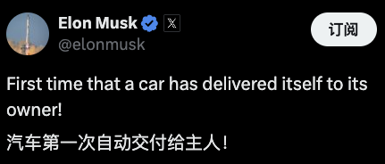
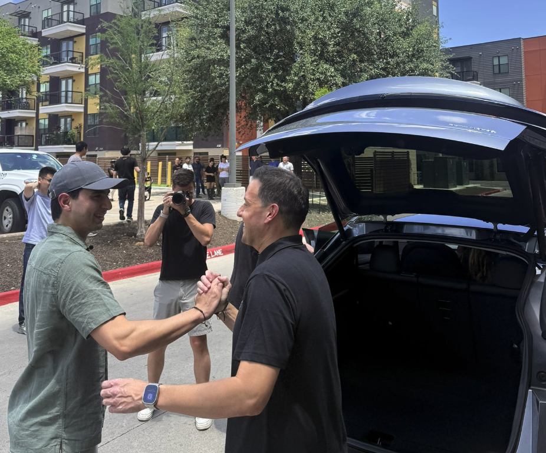

# 物理世界 AI 里程碑事件：特斯拉实现 ModelY FSD 完全自动驾驶，送车上门实现车辆交付

伊隆·马斯克于 2025 年 6 月 27 日夜间在 X 社交平台上发表贴文。表示：“汽车第一次自动交付给主人”。并且比原计划提前一天完成。

这是一次具有里程碑意义的事件！

标志着特斯拉已成功通过 FSD 技术连接真实世界，仅通过车辆外部多个摄像头捕捉到画面，并结合自主训练的 AI 大模型端到端实现无监督的完全自动驾驶解决方案。

值得记住的日子：2025 年 6 月 27 日。
