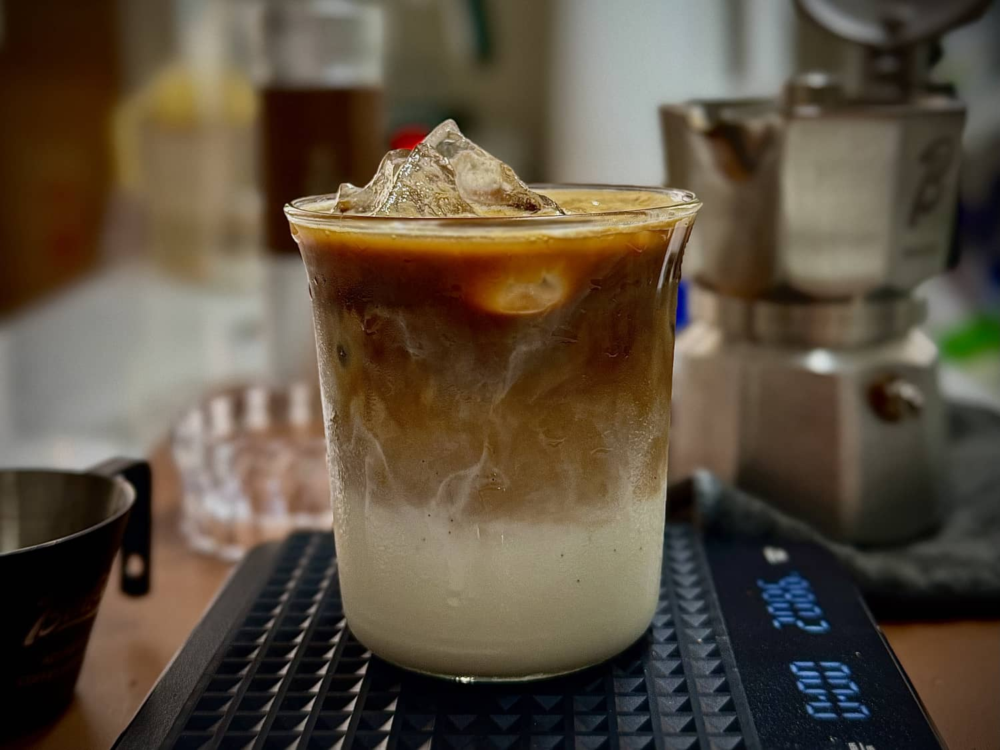
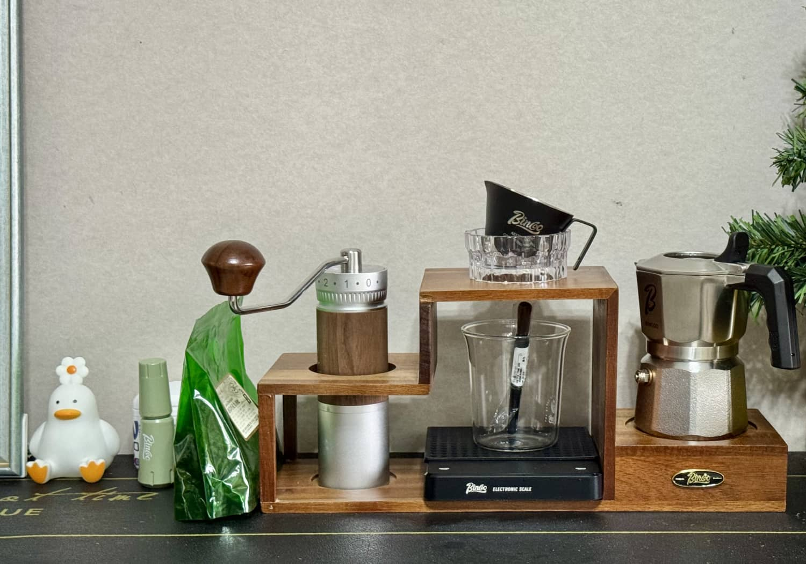
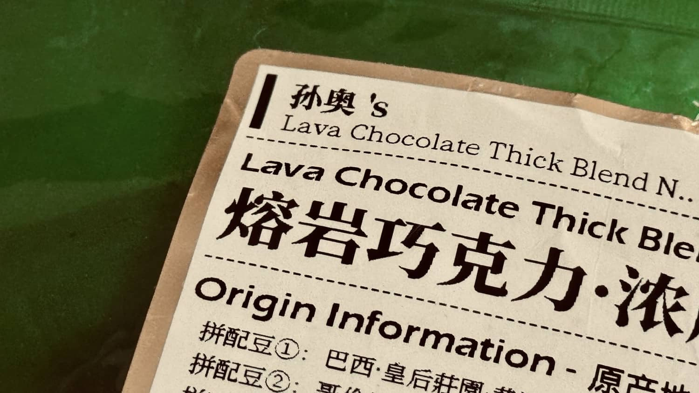
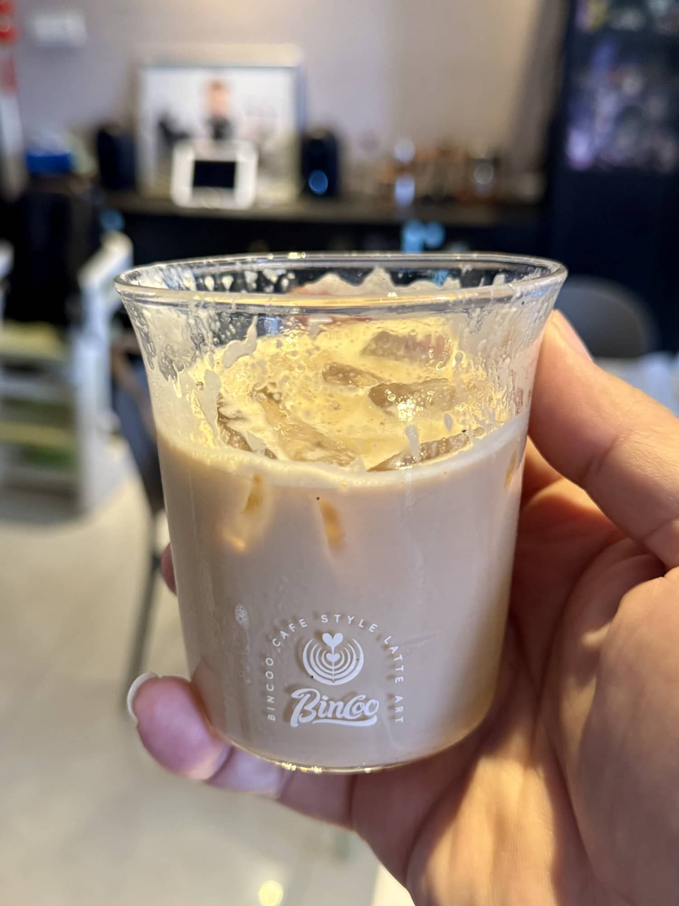

# 我的咖啡慢时光，从一杯拿铁开始...

又是一个值得被记住的日子。

2025年夏末秋初，偶然关注到一位来自广东的咖啡师主播，一下子就被咖啡制作的过程深深吸引。尤其是意式浓缩咖啡的萃取，看着咖啡液缓缓流出，格外疗愈。渐渐地，心里萌生了自己动手的念头。

一开始总想一步到位，照着主播的配置全套搬回家，幻想在自家厨房也能沉浸于做咖啡的惬意。

然而现实总有些出入。进一步查阅资料后了解到，商用咖啡机的核心在于稳定与高效，更适合出杯量大的场景。而于我，更享受的是亲手制作的过程。于是最终决定：从手摇磨豆机开始，搭配一只摩卡壶。这样不仅能体验亲手磨豆的细腻触感，也能欣赏萃取时涌出的丰盈油脂。更让我心动的是，这套轻便的组合不只限于家中使用，还能轻松带出门——在荒野、山间、溪流边，随时来上一杯……光是想象，就已足够美好。

于是，2025年中秋前夕，心愿如愿落地。就有了下面这一套属于我的咖啡小装备。

**我的一点小心得：**

经过这几天的反复尝试，发现用这支摩卡壶，搭配深烘咖啡豆17克、手磨3档粗细，是比较理想的比例。萃出的咖啡液苦韵明显，焦香饱满，油脂感也很丰富。

我习惯用180克鲜牛奶兑上40毫升浓缩液，做一杯简易拿铁。冰块对口感影响颇大，我一般会加大半杯，清凉之余也更突显咖啡的浓郁。

