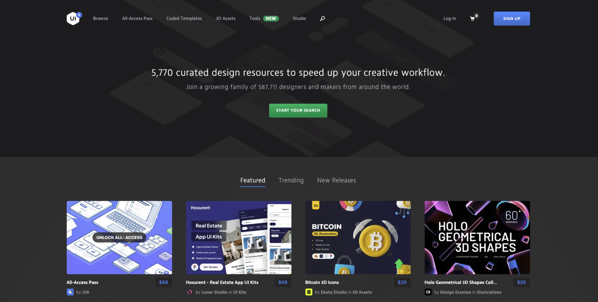

# 灵感来源

## 图库

### [Pexels](https://www.pexels.com/zh-cn/)

推荐！有中文版。提供高清尺寸且品质优良的照片

### [WallHaven](https://wallhaven.cc/)

WallBase创办人失联后，前成员推出的网站

### [Unsplash](https://unsplash.com/)

知名免费图库，支持免费下载高分辨率照片，可商用

## 界面设计

### [Dribbble](https://dribbble.com/)

UI设计师必备站点，顶尖的设计

### [Behance](https://www.behance.net/)

Adobe旗下，面向全球的创意设计聚合平台

### [UI8](https://ui8.net/)

聚集世界各地优秀的设计师的界面源文件出售平台

### [Pixeden](https://www.pixeden.com/)

可免费下载源文件的设计网站

## 素材库

### [storyset](https://storyset.com/)

一个提供大量免费插画素材的网站，还可自定义动画并导出svg

### [reshot](https://www.reshot.com/)

一个免费的图标，矢量插画，图片下载的网站。可以直接下载矢量源文件，SVG等。

### [macosicons](https://macosicons.com/)

提供macos平台上众多应用图标文件，质量很高哦

### [undraw](https://undraw.co/illustrations)

一个开源的矢量插画网站

### [Mockup](https://www.mockupworld.co/all-mockups/)

各种模型素材（真机图）

