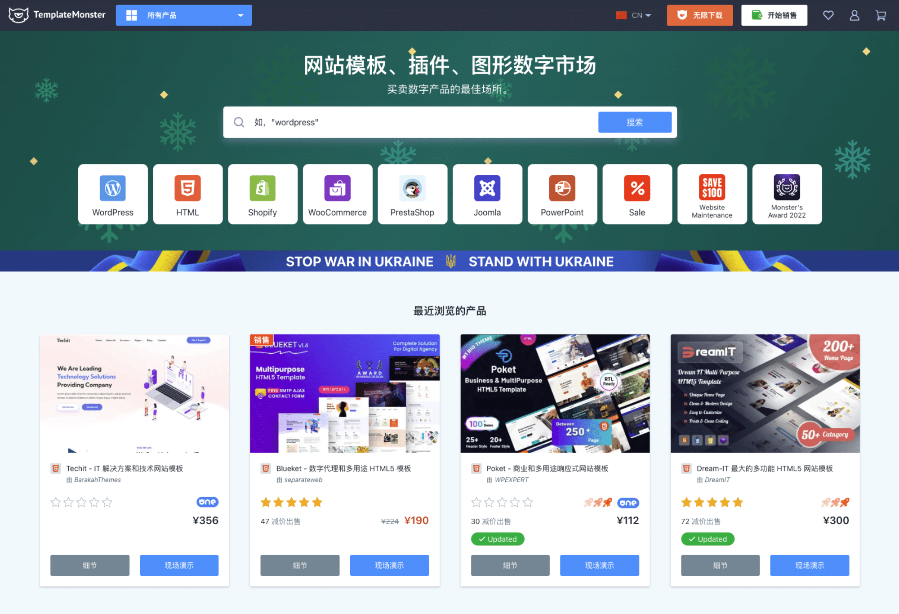
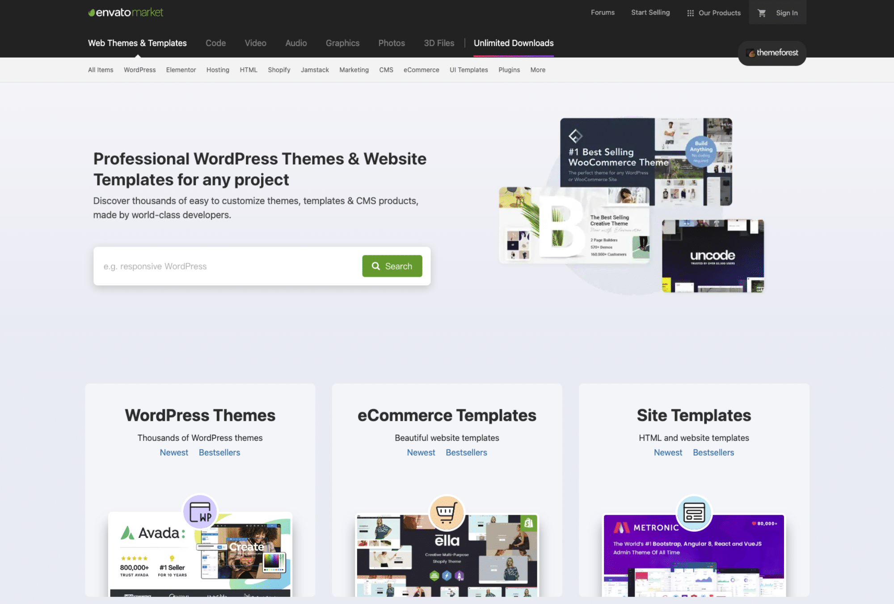

# Web UI Theme模版套件

### [Theme Selection](https://themeselection.com/)

提供主要以后台管理面板为主的UI，模版有免费和付费的。

### [Landingfolio](https://www.landingfolio.com/)

Landingfolio号称提供了网络上最好的着陆页面（首页）设计、模板、组件等。为了保证高质量，所有设计均来自精挑细选的真实案例。

### [HTML5 UP](https://html5up.net/)

一个免费的html5响应式网页模版平台，大约提供了30多套风格简约的web templates。貌似由个人维护。

### [TemplateMonster](https://www.templatemonster.com/cn/)

全球化的网站模板交易市场

### [envoto market](https://themeforest.net/)

一个老牌的设计交易平台，不仅包含web，还有平面设计等大约几十万套风格各异的设计作品公开出售。

