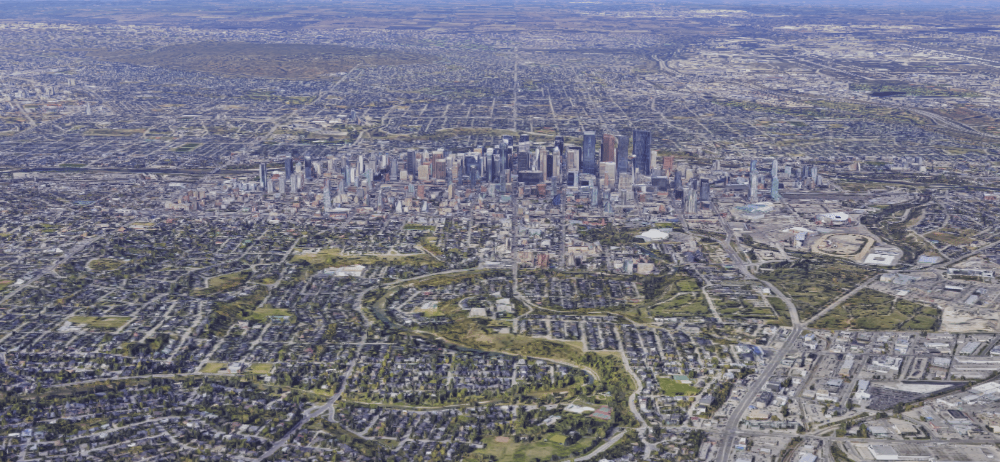

# 卡尔加里

>   文章中部分内容、图片摘录维基百科

 

卡尔加里（英语：Calgary，发音： /ˈkælɡəri/），当地华人及港澳台均译为卡加利，又译卡加立、卡技利，简称卡城，是位于加拿大阿尔伯塔省南部洛矶山脉山麓的城市，亦是该省最大城市。

该市面积789.9平方千米，海拔约1048米。

### 历史

在欧洲人定居卡尔加里之前，该地附近的地区便已有原住民居住。在1787年，探险家大卫·汤普森在进行测绘期间于弓河岸边度过了寒冬，为有记录首名到卡尔加里一带的欧洲人，而首名定居卡尔加里的欧洲人则为约翰·格连，时为1873年[5]。1873年卡尔加里成为了西北骑警（North West Mounted Police，现加拿大皇家骑警）的一所驿站，当时名为比斯波堡（Fort Brisebois），后来在1876年于麦克劳上校的领导下以苏格兰茂尔岛的地名卡尔加里为该驿站命名。

及后加拿大太平洋铁路修建至此，卡尔加里逐渐发展成商业及农业重镇，而该铁路线的总部至今仍设于卡尔加里。卡尔加里在1884年正式取得镇（Town）地位，选出了首任镇长，而于10年后更取得市（City）的地位。

1941年这里发现了丰富的石油和天然气，从此该市得到了迅速的发展。世界上众多的石油公司都在这里设有常驻机构，很多大的石油公司的总部就设在该市，因此卡尔加里也被称作加拿大的能源中心。1988年该市举办过第十五届冬季奥林匹克运动会，当时作为赛场的室内滑冰场位于知名学府卡尔加里大学的校区内。

### 地理

卡尔加里属洛矶山脉的山麓丘陵地带。

#### **班夫国家公园**

班芙国家公园（英语：Banff National Park，法语：Le Parc national Banff）建于1885年，是加拿大历史最悠久的国家公园。它坐落于落基山脉北段，距加拿大艾伯塔省卡尔加里以西约110-180公里处。公园共占地6641平方公里，遍布冰川、冰原、松林和高山。冰原公路从路易斯湖开始，一直连接到北部的贾斯珀国家公园。西面是省级森林和幽鹤国家公园，南面与库特尼国家公园毗邻，卡纳纳斯基斯镇位于其东南方。公园内主要的商业区为弓河山谷的班夫镇。它作为“加拿大落基山脉公园群”的一部分，与其它加拿大洛矶山脉的国家和省立公园一起被列入世界遗产名录中。

加拿大太平洋铁路是早期通往班夫的方式，太平洋铁路集团在公园内建造了班夫温泉酒店和路易斯湖城堡酒店，吸引了大量游客前往。20世纪初期，在一战和大萧条期间，通往班夫的公路建成。1960年开始公园全年对外开放，1990年游客数量达到了500万人次。上百万的游客通过加拿大横贯公路前往。由于班夫国家公园是全球最受欢迎的公园之一，生态系统开始受到影响和破坏。1990年代中期，加拿大公园管理局启动了一个为期两年的研究项目，颁布了一系列的措施，试图控制游客数量，保护生态环境。

### 气候

卡尔加里的天气素以多变著称，甚至市内流传着“一天之中你会体会到一年四季”的说法。当地夏天出现冰雹的几率也比较大。卡尔加里四季分明， 春、秋、冬三季较长，夏季较短，往往到了5月初还会有飘雪的日子，而最冷的月份一般集中在2月和3月。**该市阳光充沛，平均年日照时间居全国之首。**

**卡尔加里1971-2000气候数据 (数据来源：加州大学环境部 ）**

|          月份          |     1月     |     2月     |     3月     |     4月     |     5月     |     6月     |     7月     |     8月     |     9月     |    10月     |    11月     |    12月     |     全年      |
| :--------------------: | :---------: | :---------: | :---------: | :---------: | :---------: | :---------: | :---------: | :---------: | :---------: | :---------: | :---------: | :---------: | :-----------: |
|   平均高温 °C（°F）    | −2.8 (27.0) | −0.1 (31.8) | 4.0 (39.2)  | 11.3 (52.3) | 16.4 (61.5) | 20.2 (68.4) | 22.9 (73.2) | 22.5 (72.5) | 17.6 (63.7) | 12.1 (53.8) | 2.8 (37.0)  | −1.3 (29.7) |  10.5 (50.9)  |
|   平均低温 °C（°F）    | −15.1 (4.8) |  −12 (10)   | −7.8 (18.0) | −2.1 (28.2) | 3.1 (37.6)  | 7.3 (45.1)  | 9.4 (48.9)  | 8.6 (47.5)  | 4.0 (39.2)  | −1.4 (29.5) | −8.9 (16.0) | −13.4 (7.9) |  −2.4 (27.7)  |
| 平均降水量) mm（英寸） | 11.6 (0.46) | 8.8 (0.35)  | 17.4 (0.69) | 23.9 (0.94) | 60.3 (2.37) | 79.8 (3.14) | 67.9 (2.67) | 58.8 (2.31) | 45.7 (1.80) | 13.9 (0.55) | 12.3 (0.48) | 12.2 (0.48) | 412.6 (16.24) |
| 平均降雨量 mm（英寸）  | 0.2 (0.01)  | 0.1 (0.00)  | 1.7 (0.07)  | 11.5 (0.45) | 51.4 (2.02) | 79.8 (3.14) | 67.9 (2.67) | 58.7 (2.31) | 41.7 (1.64) | 6.2 (0.24)  | 1.2 (0.05)  | 0.3 (0.01)  | 320.6 (12.62) |
| 平均降雪量 cm（英寸）  | 17.7 (7.0)  | 13.4 (5.3)  | 21.9 (8.6)  | 15.4 (6.1)  |  9.7 (3.8)  |    0 (0)    |    0 (0)    |    0 (0)    |  4.8 (1.9)  |  9.9 (3.9)  | 16.4 (6.5)  | 17.6 (6.9)  | 126.7 (49.9)  |
|      平均降水天数      |     9.0     |     6.9     |     9.3     |     9.0     |    11.3     |    13.4     |    13.0     |    11.0     |     9.3     |     6.3     |     7.6     |     7.4     |     113.5     |
|      平均降雨天数      |     0.2     |     0.2     |     1.1     |     4.4     |    10.5     |    13.4     |    13.0     |    11.0     |     8.7     |     3.6     |     1.0     |     0.4     |     67.5      |
|      平均降雪天数      |     9.7     |     7.6     |     9.4     |     6.3     |     2.2     |      0      |      0      |      0      |     1.6     |     3.8     |     7.8     |     8.2     |     56.6      |
|     月均[日照时数)     |    117.4    |    141.4    |    177.6    |    218.8    |    253.7    |    280.3    |    314.9    |    281.9    |    207.7    |    180.5    |    123.9    |    107.4    |    2,405.3    |

### 分区

卡尔加里分为东南（SE）、东北（NE）、西南（SW）、西北（NW）四个区（Quadrants），主要以弓河（Bow River）作南北分界，中央大街（Center St）和南部的MacLeod径（Macleod Trail）作东西分界。市中心（City Center，通称Downtown）主要位于东南和西南区。本市共有超过180小区（Neighborhoods）。

### 经济

卡尔加里经济一向以来都是以石油和天然气以及油砂为主，有大量相关公司都于卡尔加里设总部，并且有大量上市公司集中在卡尔加里市中心，例如一间名叫 Test Driven Solutions 的英国科技公司已宣布会在卡尔加里设立其加拿大的总部。

### 教育

-   [卡尔加里大学](https://zh.wikipedia.org/wiki/卡尔加里大学)
-   [南阿省理工学院](https://zh.wikipedia.org/w/index.php?title=南亞省理工學院&action=edit&redlink=1) （Southern Alberta Institute of Technology）
-   [皇家山大学](https://zh.wikipedia.org/wiki/皇家山大學)
-   [阿尔伯塔艺术设计学院](https://zh.wikipedia.org/w/index.php?title=亞伯達藝術設計學院&action=edit&redlink=1) （Alberta College of Art + Design）

### 交通

卡尔加里是加拿大西部的主要运输中心。该市东北区的卡尔加里国际机场（YYC）是加国第4大的机场，也是一个主要货运物流中心。卡尔加里国际机场有直飞航班前往加国各大主要城市、美国、欧洲和中美洲等地，亦有货运航班往亚洲。由于卡尔加里也位于横加公路（1号公路）和加拿大太平洋铁路（CPR）上，因此也是个主要物流中心。

卡城也有一个完善的街道及快速公路系统。大部分街道以数字及区别命名（例 14 Street SW 西南14街、7 Avenue SW 西南7大道，Streets街是南北走向，Avenues大道是东西走向），但在住宅小区内则大部分以小区名命名（例 西南Woodbine小区有Woodbine Blvd SW、Woodmont Way SW等）。 主要高速公路有横加公路、鸦童径（Crowchild Trail）、 鹿蹄径（Deerfoot Trail，向北可通往省会埃德蒙顿，往南可到达加美边境）、弓径（Bow Trail）、镜芜径（Glenmore Trail，阿省8号公路）等。

卡城是北美洲第一批兴建现代轻铁系统的城市之一。系统名为C-train，总长60km，设有2条主要在地面营运路线（201及202），由市营的卡尔加里运输局营运。该部门亦拥有800辆巴士和营运市内超过160条巴士路线；巴士和轻铁系统相辅相承。

### 文化艺术

#### 特色节日
七月初，一年一度的卡尔加里牛仔节是该市最著名的节日，每年都能吸引来自世界各地但主要是美国的游客。

#### 博物馆
市中心内有数座博物馆，当中葛伦堡博物馆为西加拿大最大规模的美术馆。市内其他主要博物馆包括位于华埠的卡城中华文化中心（占地七万平方英尺）、位于奥林匹克公园的加拿大体育名人堂、军事博物馆、机场南面的机库航空博物馆（前称：卡尔加里航空航天博物馆）、以及民俗公园历史村。