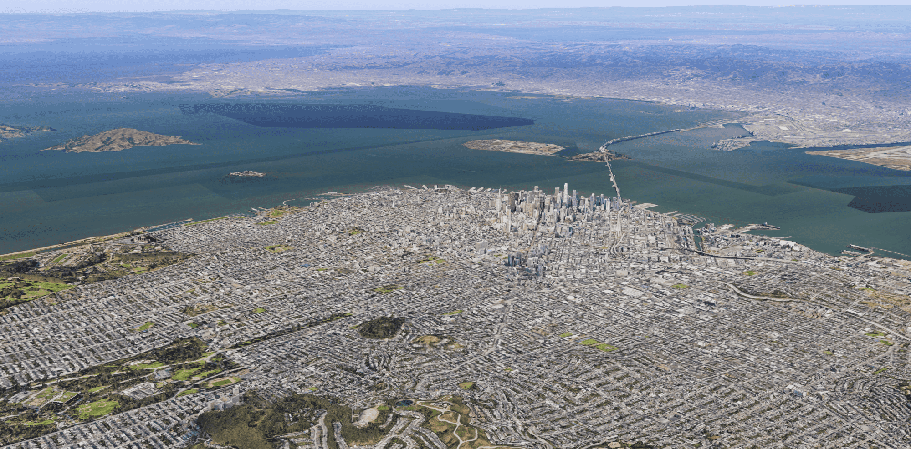
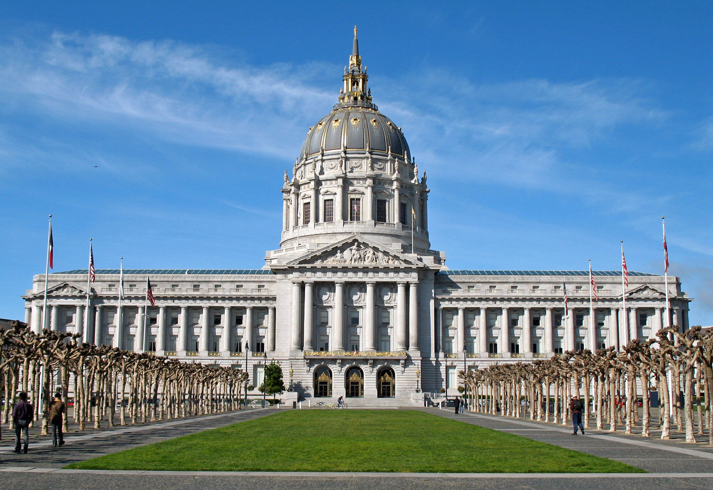
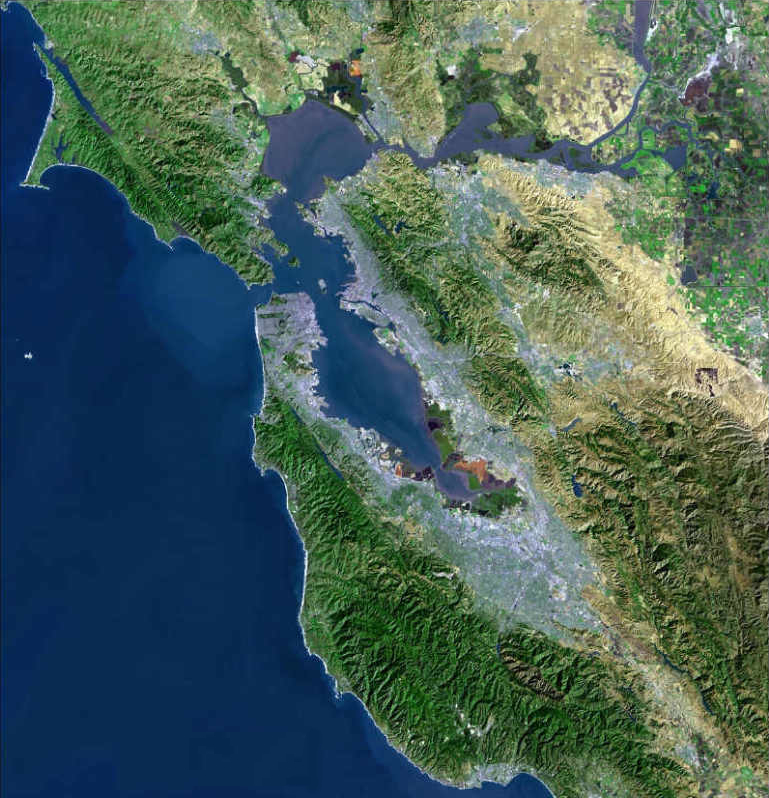
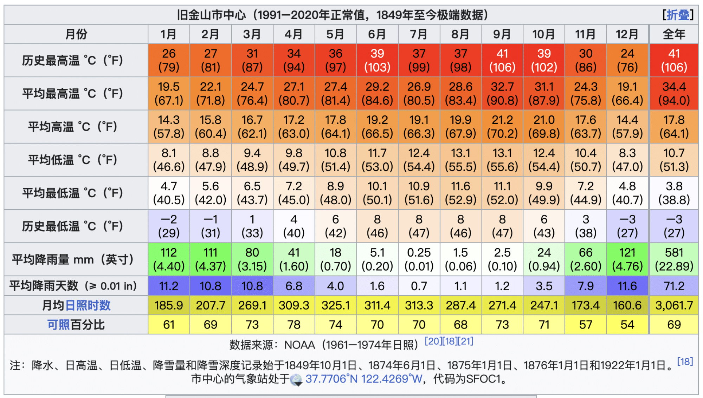
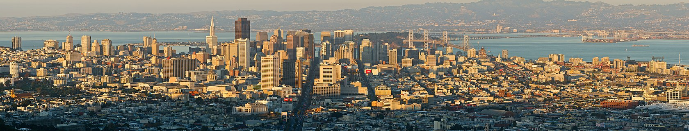
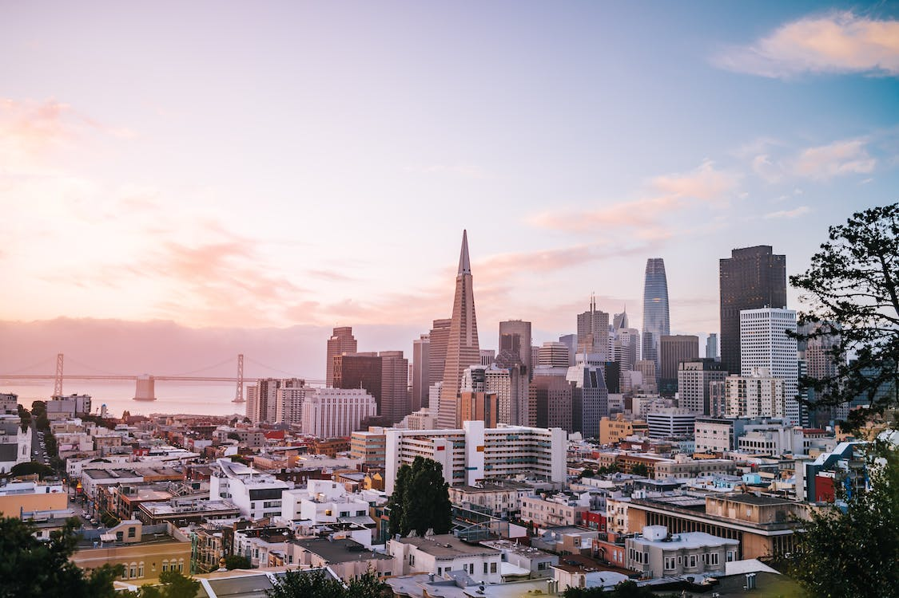
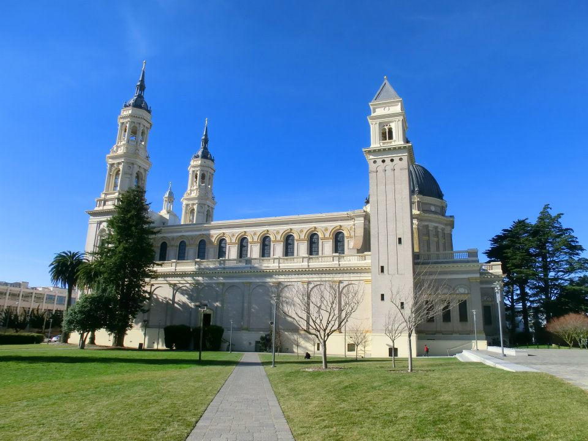
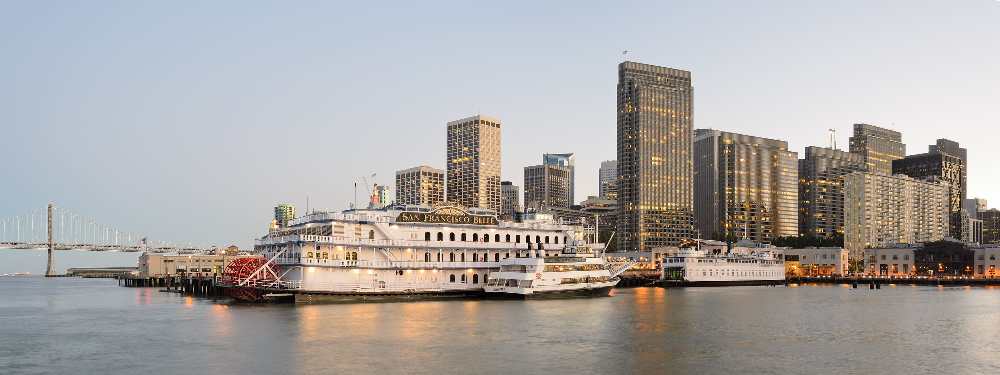

# 旧金山

>   文章中部分内容、图片摘录维基百科

旧金山（英语：San Francisco，中文通常译作旧金山或三藩市）是北加州与旧金山湾区的核心都市，也是文化，商业和金融中心。位于旧金山半岛的北端，东临旧金山湾、西临太平洋，人口86万，是加州第四大城市，仅次于洛杉矶、圣迭戈及圣何塞；其与湾边各都市组成的旧金山湾区，人口总数达768万，是仅次于大洛杉矶地区的美国西岸第二大都会区，但不是加州的首府。

当地住有很多艺术家、作家和演员，在20世纪及21世纪初一直是美国嬉皮士文化和近代自由主义、进步主义的中心之一。**旧金山也是联合国的诞生地**。旧金山是受欢迎的旅游目的地，以其**凉爽的夏季、多雾、绵延的丘陵地形、混合的建筑风格，以及金门大桥、缆车、恶魔岛监狱及唐人街等景点闻名**。此外，旧金山也是五大主要银行及许多大型公司、机构的总部所在，其中又以互联网产业为最。

### 历史

美洲原住民在公元前三千年前就到了北加州地区。证据显示美洲原住民欧隆尼族群（Ohlone）早在六世纪时已居住在旧金山湾区，“欧隆尼”在他们自己的语言中是“西部人”的意思。

*   **早期开发（1542-1847）**

    欧洲人在1542年到旧金山湾区，旧金山区域在16世纪属于西班牙的上加利福尼亚省领土。西班牙将领唐·嘉斯帕·德·伯尔托拉于1769年带领他的属下在旧金山湾区探索地形。1821年，墨西哥自西班牙独立，上加利福尼亚也成为墨西哥领土。独立之后的墨西哥教会管辖的势力逐渐薄弱，教会所属的土地也逐渐规划成私人所拥有。来自英国的威廉·李察森于1835年在半岛的西部（即现今位于唐人街与金融区交界的花园角）建立了第一栋私人别宅。李察森经过他人帮助，开始规划住宅附近的街市，并将此区域称为芳草地。墨西哥和美国战争爆发后，美国海军准将约翰·斯洛特带领手下来到这里，1846年以美国名义占领此城。1847年1月30日，海军上校约翰·蒙哥马利将芳草地更名为圣弗朗西斯科（San Francisco）。

*   **加州淘金潮（1848-1855）**

    1848年1月，在于加州东北部的苏特坊发现黄金。1849年起，加州淘金潮真正展开，从美国其他各地和其他国家搭船或者是从内陆来到加州梦想实现掏金梦的人络绎不绝，这也让旧金山居民从1847到1870年之间，从500人口增加到15万人口。后来所谓旧金山四十九人即是那些于1849年从各地来到旧金山想一夕致富的人。

    当时除了世界各地前来实现掏金梦的投机者外，许多人在旧金山开店提供掏金者需要的补给品，当时的公司有些至今存在，包括制造李维斯牛仔裤（1873年）的李维·斯特劳斯、吉德利巧克力店（1852年）、FOLGERS咖啡（1850年）和富国银行（1852年）、加州银行（1864年）。1848年发现黄金之前加州仍属于墨西哥领土，同年二月墨西哥于美墨战争中战败后，加州变成美国领土。加利福尼亚于1850年正式成美国联邦政府第31个州，旧金山是起初的一个县。旧金山联邦造币厂于1854年成立，主要打造金币用来流通市场。掏金热使得旧金山成为当时美国密西西比河以西最大的城市。

*   **内战前后**

    由于加州是以从墨西哥分离出来的加州共和国的身份加入联邦，因此没有受到此前堪萨斯-内布拉斯加法案和密苏里妥协案的影响，加上蓄奴州的影响力难以企及西岸（主要原因是蓄奴州的白人大多是庄园主，普遍家庭经济条件好，所以安于现状不去参加艰苦的淘金活动。而前往加州淘金的白人移民绝大多数来自于北方各州，因此将反对奴隶制的自由主义带到了加州），因此加州在1860年内战爆发时立刻宣布效忠联邦。由于偏远的地理位置以及和东部之间广袤的不宜居地区的阻隔，战火并没有波及加州。旧金山虽然属于比较重要的港口，但没有受到封锁和战争破坏。

    同时，由于中央太平洋铁路完工，美国东西海岸之间的交通障碍明显缩小，商人可以把货物通过旧金山直接输往亚洲。而当时适逢日本开国以及中国因第二次鸦片战争后通商口岸增多而扩大开放，亚洲市场成为美国商品的新市场，坐拥良港的旧金山成为西海岸的经济中心。到了19世纪末，旧金山已经拥有繁荣的工业、商业、贸易、金融行业，成为北美洲西海岸和美国密西西比河以西举足轻重的重要都会。

*   **20世纪**

    1906年旧金山大地震，1906年4月18日的凌晨五点零二分，旧金山发生八级的大地震。市区内四分之三的房屋几乎完全损毁，造成旧金山区民30万人无家可归，直到2005年市政府才正式更改丧生人数为超过三千人。旧金山大地震彻底摧毁了旧金山的街景，但也使得旧金山能获得机会浴火重生而改造成现代化的都市。当时无家可归的居民大量迁移至东湾的奥克兰和伯克利地区，让东湾开始蓬勃发展。

    受1882年《排华法案》的影响，许多从19世纪中叶到20世纪初的华人和其他亚裔移民在美国倍受歧视。旧金山地震引起的大火烧毁了当时市政厅的档案纪录，让许多华人有了机会，利用购买的伪造出生纸，以假造美籍华人儿女的身份进入美国，即是后人所称的纸儿子。据估计，1910到1940年之间，在进入美国的大约17万5千华人中，有百分之80多的人是以“纸儿子”或“纸女儿”的身份进入美国。纸儿子的出现也造成许多华人后裔无法回归真实的姓氏和家族史，成为特殊的华人移民史。

    **重要历史**

    *   1915年巴拿马-太平洋万国博览会
    *   1936年连接旧金山和奥克兰的海湾大桥竣工。
    *   1937年连接旧金山和马林县的金门大桥竣工。
    *   1939年于金银岛举行金门万国博览会。
    *   1945年联合国51个创始成员在旧金山签订联合国宪章。
    *   1951年同盟国与日本签订《旧金山和约》，正式终止对日本的战争。
    *   1978年当时市长马斯可尼和首位同性恋市议员哈维·米尔克在市政厅内遭到枪杀。

### 地理

#### 地形
旧金山位于加州的圣安地列斯断层上。历史上最大的地震是在1906年，之前在1851年，1858年，1865年和1868年也发生过大型地震。最近的地震是1989年，市中心的街道出了几尺宽的裂口。

市区是典型的丘陵地带，城内有很多直上直下的街道。市内有名的山丘有：诺布山，太平洋高地（Pacific Heights）、双峰（Twin Peaks）、俄罗斯山和电报山。市区内最高的大卫森山（Mount Davidson，282米）上面柱立有31米高的十字像，附近另外有红色的苏特洛讯号塔（Sutro Tower），塔高298米。

#### 气候

旧金山半岛三面环水，并受太平洋加利福尼亚寒流影响，旧金山是典型的凉夏型地中海式气候。因长期受海风影响，旧金山夏天的日高温通常只有20摄氏度左右，一年大约只有一个星期会因强劲陆风影响而超过摄氏30度。9月是最暖和的月份。同时因太平洋水温长年在摄氏10至15度间，夏天半夜也可能下降到10度以下。旧金山因临近海边和金门海峡，下半夜和早上多受雾的影响，但夏季降雨极少，雨季为1月至4月间，冬天虽冷，但鲜有降雪或霜。市中心上一次0 °C（32 °F）或以下的气温在1990年12月24日[18]；最近一次的低温在2023年2月24日，温度降至3.8度，打破132年前的旧金山低温纪录[19]；最近一次降小雪是在2011年2月25日，而在此之前上一次降雪则是在1976年2月5日。

### 文化

整个旧金山以市场街为主干分为南北两端，市场街从东边旧金山湾的内河码头（The Embarcadero）和旧金山渡轮大厦为起点经过金融区、田德隆区、市政中心一直通到西南边的卡斯特罗街和诺谷区。

*   田德隆区（The Tenderloin）为市内景象差异最大的区域，区内有很多商店和电影院。路上也常看游民和乞丐。不过区内也有许多印度、巴基斯坦和东南亚口味的餐馆，口味道地价格也实在。田德隆夹在市政中心和繁荣的联合广场之间，两边的变化相当明显。
*   市场街南区（South of Market，简称SOMA），以往曾是旧金山的工厂和码头卸货所在，1980年代后在市政府规划下，许多地方已呈现不同的面貌。马斯科尼会议中心、芳草地艺术中心、新力复合式电影广场、现代艺术博物馆和犹太艺术博物馆皆位于此区。SOMA 西南边气温较暖活的米慎区主要为拉丁美洲人聚集的区域，除了有地道的墨西哥和中南美洲餐厅外，附近也有不少夜店和新型餐厅进驻。市区最南端的波特雷罗山和湾景猎人角主要为港口的工业区和内地的住宅区。

*   市场街北边为旧金山主要商业和观光文化景点，主要以联合广场为中心，从联合广场往北经过板街的法国区，通过都板街（Grant Avenue）“天下为公”的牌坊下进入唐人街, 是北美洲最古老的唐人街，贴近唐人街旁为小意大利的北滩。小意大利最著名的餐馆为“臭玫瑰”（The Stinking Rose），所有的菜肴都有大量的蒜。科伊特塔（电报塔）及榛子街均位于区内的电报山上。观光客聚集的渔人码头则位于唐人街的北边，内有39号码头及吉尔德利广场（Ghirardelli Square），游客可从39号码头搭船前往恶魔岛和天使岛。
    旧金山西边的太平洋高地与诺布山是全市最贵的住宅区，更由于位处高地，所以可以看到全旧金山的全景。旧金山最有名的酒店之一费尔蒙特酒店即位于诺布山丘上。俄罗斯山是九曲花街的所在地，亦是著名旧金山作家亚米斯德·莫平的《城市故事》（Tales of the City）系列中人物之居处。

*   旧金山西边由金门公园分隔成南北两部分。北边为里士满区，主要为俄罗斯裔及阿拉伯裔集中地，但因该区的克莱门街（Clement Street）有许多华人商店，所以该区亦被称为“新华埠”。南边的日落区早期多为沙丘地，在二次大战左右建造，以住宅为主，早期因为地价比其他区域便宜，目前还有很多在30年代或40年代就搬来的退休人士。日落区的11街和12街一带有许多中国商店，由于靠近旧金山加大和州立大学，而且也有很多华人留学生，所以有人认为这区域是新兴的唐人街。金门公园东边即海特-阿什伯利（Haight-Ashbury），是1960年代嬉皮士的发源地。

### 经济

旅游业是旧金山经济的骨干之一，也常被描述在歌曲、电影、与流行文化里，同时也使得旧金山这个城市和它的地标得以举世闻名。2007年时共有超过1600万旅客来访，注入超过82亿美元到旧金山的经济。在拥有大型旅馆、良好餐饮服务、和世界等级马斯科尼展览馆的优势下，旧金山是北美举行展览会和大会的最受欢迎地点前十名之一。

旧金山拥有多元化的服务经济，遍布各种专业服务，包括金融服务，旅游业和（越来越多）高科技。2017年，14个县的圣荷西 - 旧金山 - 奥克兰联合统计的GDP为9070亿美元，在CSA中排名第3，超过16个国家。

旧金山于19世纪中的加州淘金潮时逐渐发展成美国西岸的金融中心。在金融商业区的蒙哥马利街有“西部的华尔街”之称，位于这条街上的有联邦储备银行旧金山分行和太平洋证券交易所（Pacific Stock Exchange）旧址。全美最大银行美国银行即创始于旧金山。许多其他国际金融机构、跨国银行、以及创投基金都在旧金山创立或设有地区总分部，六家财星500公司、和许多包含法律、公共关系、建筑、和平面设计的专业服务公司都设立在市中心。旧金山是二级全球城市的成员之一。

旧金山合宜的气候和开放的风气，加上市政府为了吸引科技公司进驻和鼓励投资创业，提供了许多减免优惠，让许多世界级科技总公司愿意落脚在旧金山。21世纪初期的旧金山试图转型成为生化科技和生物医学重镇，在AT&T球场南端新开辟了米慎湾科学园区，由旧金山加大医学院和基因科技公司的合作带领下，成立了世界数一数二的再生医学研究中心注重于干细胞方面的研究。原来为火车仓储转运站的米慎湾经过21世纪第一个十年改造后，在AT&T球场和米慎湾科学园区的带领下，吸引了许多专业人士和新兴商业进驻，重新活化为商业住宅区。旧金山于2013年在米慎湾南边举行美国杯帆船比赛。2010年代之后，旧金山得到高新科技公司的青睐，大量互联网技术公司把总部或者分部设在旧金山。

#### 知名公司

*   互联网和基于互联网的企业
    *   X：社交网站、微博客服务、互联网媒体。用户可以经由SMS、实时通信、电邮、X网站或X第三方应用发布更新（称为 X's），输入最多280字的更新。
    *   craigslist.org：为世界最大的免费买卖和社谈交换网站，总部设于旧金山
    *   维基媒体基金会：维基百科经营者，总部设于旧金山
    *   BitTorrent
    *   Yelp
    *   Dropbox
    *   Pinterest
    *   优步（Uber）
    *   来福车 （Lyft）
    *   Citycarshare.org／Zipcar.com：仿效欧洲市内汽车出租模式，个人只要在网站上申请账号，就可以在特定地点即时领取车辆，方便迅速。
    *   爱彼迎 （Airbnb）
    *   Mozilla
    *   Salesforce.com
*   银行、金融
    *   VISA总部
    *   富国银行总部
    *   美国银行总部
*   饮食
    *   Sharffen Berger：巧克力-主要制造高纯度可可巧克力
    *   吉德利巧克力（Ghirardelli）
    *   Peet's Coffee & Tea：1966年创立于伯克利，为旧金山湾区独特咖啡和品茶联锁店，星巴克早期创业曾向其购买咖啡成品并仿效经营模式。
*   服装
    *   GAP：1969年创立于旧金山，目前包含了香蕉共和国、旧海军（Old Navy）、Piperlime、Athleta 共五大服饰专卖店，约有3465间店面分布于全世界。
    *   Levi's牛仔裤：旗舰店位于联合广场
*   影视、音乐
    *   杜比实验室：创立于伦敦，目前总部设于旧金山
    *   卢卡斯电影（Lucasfilm）：位于要塞园区
    *   阿米巴音乐城（Amoeba Music）：美西最著名的二手音乐交换店，海特-阿什伯利分店内占地两千平方米，将近有10万张各类音乐CD、卡带、传统唱片和DVD，规模仅次于其好莱坞分店。
*   博物馆及表演艺术
    *   比尔·格雷厄姆市政礼堂
    *   战争纪念歌剧院
    *   戴维斯交响音乐厅（Davies Symphony Hall）
    *   奥芬剧院（Orpheum Theatre）-主要为百老汇歌剧表演
    *   金门剧院（Golden Gate Theater）-主要为百老汇歌剧表演
    *   克恩剧院（Curran Theatre）-主要为百老汇歌剧表演
*   其他
    *   太平洋瓦电公司 (PG&E):是一家成立于1905年，负责提供加州北部至中部约五百万户天然瓦斯和电力等的公用事业公司。1993年的铬金属污染事件曾改编为电影《永不妥协》。
    *   McKesson Corporation：世界最大医疗企业

### 教育

*   旧金山加利福尼亚大学-建立于1873年，注重于医学和生化科技研究，学校包含医学系、牙医系，药学系、护理系和学士后研究所，主要校区位于金门公园附近的帕纳塞斯街
*   旧金山州立大学-建立于1899年，为加州23个州立大学之一，主要校区位于南旧金山靠近戴立市一带
*   加州大学黑斯廷斯法律学院-成立于1878年，为加州大学系统之一，校区位于市政中心和田德隆区之间
*   金门大学-源自于1896年建立的YMCA私立夜间大学，2009年自田德隆区的金门街搬迁到目前 SOMA 区的米慎街
*   旧金山大学-于1855年建校，为私立大学，是美国西部最老的学校之一。校园位于金门公园东边的高丘上，很远可以看到。学校的法学院是世界驰名的学校。
*   旧金山艺术大学-成立于1929 年，为私立艺术大学，授予艺术学士、大学学士、艺术副学士、艺术硕士、硕士、建筑硕士、专业证书课程或个人进修知识充实等艺术与设计领域之学位或课程，内容包括30多项领域的专业课程。

### 体育

|                          球队                          |                        项目                        |                   联盟                   |                       冠军次数                        |
| :----------------------------------------------------: | :------------------------------------------------: | :--------------------------------------: | :---------------------------------------------------: |
|   金州勇士  |    篮球    | NBA |                     7次NBA总冠军                      |
|旧金山巨人 |    棒球     | MLB |                    8次世界大赛冠军                    |
| 旧金山49人 | 美式足球 | NFL | 5次超级杯冠军 |

### 旅游

*   城市景点列表

    *   旧金山码头（Port of San Francisco）
    *   联合广场
    *   卡斯特罗区
    *   F号古老电车
    *   路面缆车
    *   九曲花街：旧金山最有名的弯曲街道
    *   渔人码头
    *   39号码头、吉尔德利巧克力广场、海湾水族馆
    *   唐人街
    *   北滩（意大利区）
    *   电报塔：野生鹦鹉
    *   旧金山大学会
    *   帕潘尼多号博物馆（USS Pampanito Museum）
    *   圣方济各传教站（都勒教会） / 米慎区
    *   金门大桥-起点为普西迪高地北端，游客可行走于桥上，观望旧金山湾景观，桥的对岸为索萨利托（）小镇，为假日休闲去处
    *   金门公园 内有日本茶园，狄杨博物馆
    *   贝克海滩——天体海滩
    *   悬岩餐厅 Cliff House
    *   海滩小屋啤酒厂及餐厅 Beach Chalet Brewery & Restaurant
    *   海特-阿什伯利（Haight & Ashbury） 嘻皮发源地
    *   阿拉莫广场
    *   要塞公园（Presidio Park）
    *   碉堡角（Fort Point）/ Crissy Field
    *   太平洋高地
    *   日本街 / 费尔摩街
    *   金门公园
    *   天使岛 岛上曾为19世纪及20世纪早期移民通关处 有移民历史馆
    *   恶魔岛
    *   金银岛 观看旧金山夜景最佳地点
    *   大洋滩（Ocean Beach）
    *   双峰（Twin Peaks）可以遥望整个旧金山
    *   花仑岛屿（Farallon Islands）可在渔人码头附近搭乘观光船前往岛屿周围赏鲸
    *   Lincoln Park 位于旧金山西北端
    *   49里景观道路 49-Mile Scenic Drive
    *   39号码头 海狮休息区

    
