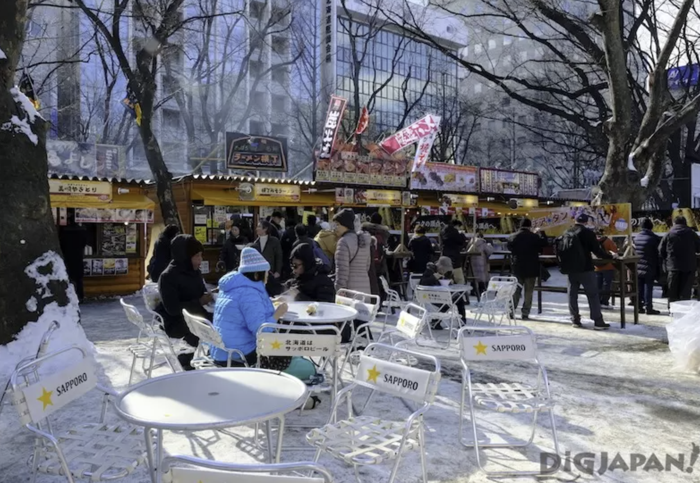
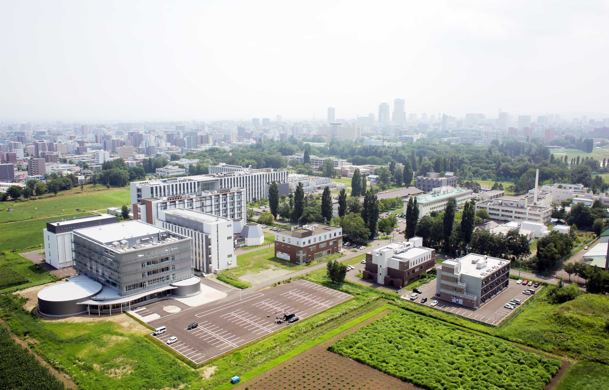

# 札幌

>   文章中部分内容、图片摘录维基百科

### 简述

札幌（Sapporo）是日本北海道地区的首府和政治、经济、文化中心，也是日本第五大城市（人口约197万）。它以冬季雪景、啤酒、拉面和年度冰雪节闻名，是一座兼具现代化与自然风光的国际都市。虽然札幌市的地理位置位于北海道西部，但却是北海道铁路、高速公路、航空路线的放射点，因此在交通上也是北海道的中心。

### 历史

-   **开拓初期**：札幌原为阿伊努人聚居地，“札幌”之名源自阿伊努语“萨特·波罗”（意为“干燥的广阔河流”）。
-   **明治维新后**：1869年，日本政府设立北海道开拓使，仿照欧美城市规划建设札幌，成为北海道的行政中心。
-   **近代发展**：1876年札幌农学校（现北海道大学）成立；1972年举办第11届冬季奥运会，推动城市国际化。

### 地理

-   **位置**：位于北海道西部石狩平原，濒临石狩川，四周被山地环绕。
-   **面积**：约1,121平方公里，是日本面积第四大的政令指定都市。
-   **地形**：市区布局呈网格状（仿美国城市规划），西部有手稻山等滑雪胜地。

### 气候

-   **类型**：湿润大陆性气候，四季分明。
    -   **冬季**（12–2月）：寒冷多雪，平均气温-3°C，年积雪量可达5米，适合滑雪。
    -   **夏季**（7–8月）：凉爽宜人，平均气温22°C，是避暑胜地。
-   **特点**：昼夜温差大，冬季降雪量位居世界前列。

### 文化

-   **饮食文化**：
    -   **札幌拉面**：味噌汤底拉面为代表，与旭川、函馆并称“北海道三大拉面”。
    -   **成吉思汗烤肉**：北海道特色羊肉料理。
    -   **札幌啤酒**：日本最早的啤酒厂（1876年创立），啤酒节（夏季）吸引全球游客。
-   **节庆活动**：
    -   **札幌冰雪节**（2月）：大通公园展出巨型雪雕和冰雕。
    -   **YOSAKOI索朗祭**（6月）：融合传统与现代的舞蹈节。
-   **语言**：部分方言保留北海道特有词汇，如“なまら”（非常）。

### 经济

-   **核心产业**：
    -   **农业与食品加工**：北海道农牧业发达，乳制品、海鲜、小麦制品（如“白色恋人”饼干）畅销全国。
    -   **旅游业**：冬季滑雪和夏季观光为支柱，年接待游客超1,400万人次。
    -   **信息技术**：札幌站周边聚集IT企业和创业公司，有“札幌硅谷”之称。
-   **商业中心**：薄野（Susukino）是北海道最繁华的娱乐购物区之一。

### 旅游

-   **主要景点**：
    -   **大通公园**：冰雪节主会场，夏季有露天啤酒花园。
    -   **札幌电视塔**：地标建筑，可俯瞰城市全景。
    -   **北海道神宫**：市内最重要的神社，樱花季人气极高。
    -   **藻岩山**：夜景被誉为“日本新三大夜景之一”。
    -   **定山溪温泉**：距市区1小时车程的温泉度假地。
-   **冬季运动**：手稻滑雪场、札幌国际滑雪场是冬奥会遗产。

### 教育

-   **高等教育**：
    -   **北海道大学**：日本顶尖国立大学，前身为札幌农学校，校园以白杨林道和克拉克像闻名。
    -   **札幌市立大学**：以设计学和护理学见长。
-   **国际交流**：多所大学设有英语课程，吸引海外留学生。

