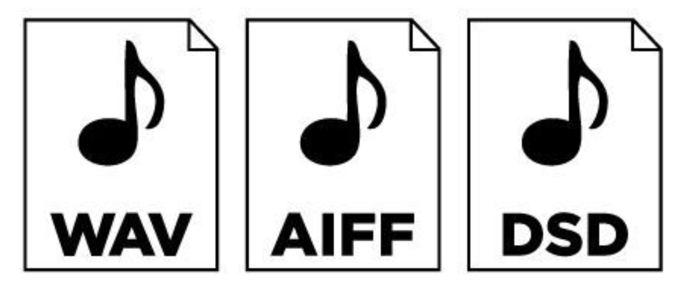

# cd与无损数字音频的音质是否存在差异

在理论层面上，WAV和FLAC等无损音频格式在采样率和位深度上能够超越标准CD音频，提供更大的动态范围和更高的频率响应。但在实际聆听体验中，特别是对于普通音乐欣赏，差异可能微乎其微。CD音频仍然是非常高质量的音频格式，而无损格式则提供了更大的灵活性和潜在的音质提升。

#### 1. 采样率与位深度

-   **CD音频**：标准的CD音频使用44.1kHz的采样率和16-bit的位深度。这意味着CD每秒采样44,100次，并且每个样本由16位（2字节）数据表示。44.1kHz的采样率决定了CD音频的最高可捕获频率约为22.05kHz（根据Nyquist定理）。
-   **无损音频格式（WAV, FLAC）**：这些格式可以支持更高的采样率和位深度，比如48kHz、96kHz，甚至192kHz的采样率，以及24-bit或32-bit的位深度。因此，理论上这些格式可以提供更高的频率范围和更精细的动态范围。

#### 2. **压缩**

-   **CD音频**：CD音频是未压缩的音频数据，即线性脉冲编码调制（LPCM）。
-   **WAV**：WAV通常也存储未压缩的LPCM数据，因此和CD在音质上是相同的，唯一的区别可能是采样率和位深度。
-   **FLAC**：FLAC是一种无损压缩格式，它使用压缩算法来减少文件大小，但在解码时可以完全恢复原始音频数据。因此，FLAC在理论上和数据上是与CD音频等效的，但其文件体积比WAV小得多。

#### 3. **频率响应**

-   **CD音频**：由于其采样率限制，CD音频的频率响应在22.05kHz以内，这符合大多数人的听觉能力，但无法捕捉到超声波范围的声音。
-   **无损音频格式（高采样率）**：理论上，高采样率的无损音频可以捕捉到更高的频率（例如48kHz采样率可捕捉到24kHz），虽然大多数人无法听到这些高频率的声音，但在某些专业领域或音响发烧友中被认为能提升音频的“空气感”或整体音质。

#### 4. **动态范围**

-   **CD音频**：16-bit位深度提供的动态范围约为96dB。
-   **无损音频格式**：24-bit音频的动态范围可以达到144dB，理论上能更精确地表示极静音和极响亮的音频信号。

#### 5. **理论上的音质差异**

-   虽然高采样率和高位深度的无损音频格式在理论上能够提供更高的音质，但在实际聆听体验中，对于大多数人和设备来说，CD音质已经足够高，很难感知到显著的区别。超高采样率和位深度的音频文件通常在专业录音和混音过程中更为重要，而非普通的音乐欣赏。

#### 6. **兼容性和可访问性**

-   **CD**：是一种标准化的物理介质，任何CD播放器都能播放。
-   **无损音频格式**：需要兼容的软件和硬件播放器，但现代设备和软件大多数都支持WAV和FLAC等格式。

#### 
