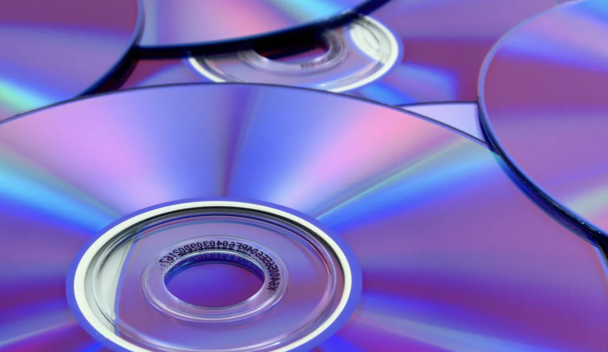

# 不同cd音质是否有差异

在HiFi发烧友圈子里，CD音质的差异确实会受到多种因素的影响，这不仅包括CD的制作和罐装方式，还涉及到母带的质量、录制和混音的工艺等。这些因素都会影响最终的音质表现。

以下是主要影响因素和通常被认为音质最佳的CD类型与录制方式：

### 1. **母带质量**

-   **原始母带（Master Tape）**：母带是录音的最初版本，所有后续的复制都是基于母带进行的。如果母带质量高，那么最终的CD音质也会相应更好。
-   **模拟母带 vs 数字母带**：一些HiFi爱好者认为，模拟母带（通常是模拟磁带录音）在音质上比早期的数字母带更有“暖感”和“丰富性”，因为模拟音频可以捕捉到非常细微的声音细节，而这些细节可能在数字化过程中丢失。

### 2. **CD的罐装和制作方式**

-   **普通CD**：这些是大众市场的标准CD，通常批量生产。音质可能会因批次的不同而有所差异。
-   **金碟（Gold CD）**：一些HiFi厂商使用金作为CD基底材料（例如Mobile Fidelity Sound Lab的“Ultradisc”系列），据说这种材料可以减少氧化，提供更好的音质保真度。
-   **SACD（Super Audio CD）**：SACD使用更高的采样率（通常为2.8224 MHz）和DSD（Direct Stream Digital）编码技术，能提供更广的动态范围和更高的频率响应。许多发烧友认为SACD的音质优于普通CD。
-   **XRCD（Extended Resolution CD）**：XRCD使用了特别优化的母带处理和生产工艺，力求在普通CD格式下获得更好的音质。
-   **SHM-CD（Super High Material CD）**：SHM-CD使用了一种新的材料（聚碳酸酯树脂），声称能提高激光读取的精确度，从而提升音质。

### 3. **录制和混音的工艺**

-   **直接数字录音（Direct-to-Digital）**：现代录音通常直接使用高质量的数字设备录音，以避免模拟-数字转换中可能引入的失真。这种方法在细节和清晰度上表现出色。
-   **全模拟录音（All-Analog Recording）**：一些发烧友更喜欢全模拟录音，尤其是在摇滚、爵士或古典音乐中，因为他们认为这种方法更能捕捉到音乐的“灵魂”。
-   **重新混音和重制（Remix & Remaster）**：旧的录音有时会被重新混音和重制，以利用现代技术提高音质。然而，重制的效果可能因工程师的手法不同而有所差异，有些重制可能失去了原始录音的意图和感觉。

### 4. **压缩与动态范围**

-   **动态压缩（Dynamic Compression）**：现代音乐制作中经常使用动态压缩，以使音乐在各种播放设备上听起来更响亮。然而，过度的动态压缩可能会导致音质劣化，失去音乐的自然动态。
-   **无压缩或最小压缩录音**：一些高端CD或黑胶唱片使用最少的动态压缩，保留了录音的全部动态范围，这在HiFi圈子里被认为是最佳的音质选择。

### 结论

通常认为音质最佳的CD类型包括**金碟、SACD、XRCD，以及使用高质量母带、避免过度动态压缩的录音**。录制和混音工艺也是关键，直接数字录音和全模拟录音都可能产生优异的音质。HiFi发烧友往往会选择那些在每个制作环节都追求极致的CD版本，以获得最佳的听觉体验。