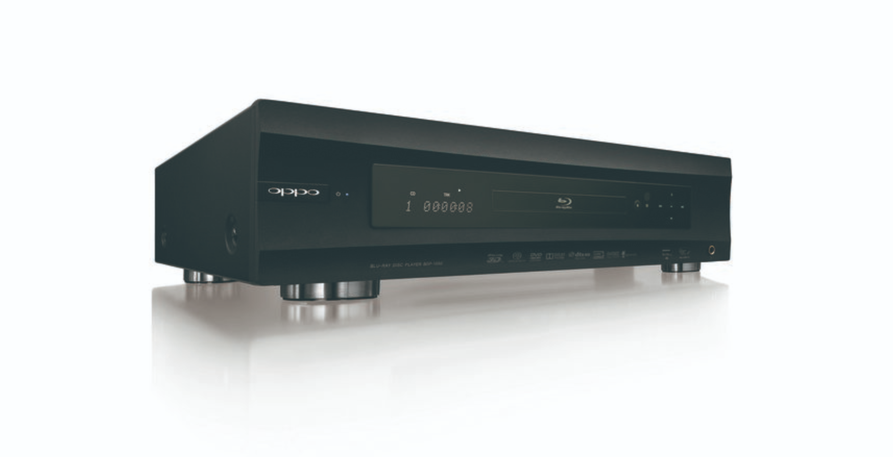

# 播放设备对音质的影响究竟有多大

播放设备对CD、磁带和黑胶唱片的音质有非常大的影响，甚至可能决定最终的听觉体验。在HiFi系统中，播放设备的质量、匹配程度以及各个组件的协调性都会显著影响音质表现。

下面分为三部分探讨CD、磁带和黑胶唱片的播放设备对音质的影响，并提供选购建议。

### 1. **CD播放设备**

#### 音质影响因素：

-   **数字模拟转换器（DAC）**：CD的音频存储为数字信号，CD机需要将其转换为模拟信号才能输出到音响系统。DAC的质量直接影响音质的清晰度、细节、动态范围等。高端DAC能提供更高的采样精度和更好的音质表现。
-   **激光头和机械系统**：CD播放机的激光头用于读取CD上的数据，机械系统负责旋转CD和保持稳定性。高质量的激光头和稳定的转动系统能够减少误读和抖动（jitter），从而提高音质。
-   **电源和信号处理**：电源的稳定性以及信号处理的准确性同样影响音质。高端CD机通常会配备独立的电源设计，减少电磁干扰。

#### 选购建议：

-   **独立DAC**：很多发烧友会选择一台独立的高端DAC搭配CD转盘（CD Transport），这种组合通常能带来更好的音质表现，因为独立DAC可以处理更精细的数字信号。
-   **避震设计**：高质量的CD播放设备通常有很好的避震设计，避免播放过程中因为振动导致信号读取不稳定。
-   **品牌推荐**：高端品牌如Esoteric、Accuphase、Mark Levinson等提供的CD播放机和独立DAC常被认为是顶级音质的保障。

### 2. **磁带播放设备**

#### 音质影响因素：

-   **磁头**：磁头的质量直接影响磁带播放时的音质表现。高质量的磁头能更好地读取磁带上的音频信号，特别是在高频部分。三磁头（录音、回放、擦除分离）系统通常比双磁头或单磁头系统有更好的音质表现。
-   **磁带速度**：磁带播放速度会影响音质，尤其是卡座设备。高端的磁带播放机通常有非常精准的速度控制，避免音频失真。
-   **电源和电路设计**：高质量的电源和低噪音电路设计对磁带设备来说也非常重要，尤其是对于降低磁带本身的噪音水平。

#### 选购建议：

-   **三磁头磁带机**：如果你追求最佳的磁带音质，选择带有三磁头的设备，能够在录音和回放时提供更好的保真度。
-   **品牌推荐**：经典的高端磁带设备品牌包括Nakamichi（特别是Dragon系列），以及Technics、TEAC、Revox等。这些品牌的设备通常在音质、耐用性和精准度上表现出色。
-   **维护**：磁带设备需要定期维护，尤其是磁头的清洁和调整，以确保音质的最佳表现。

### 3. **黑胶唱片播放设备**

#### 音质影响因素：

-   **唱头（Cartridge）**：唱头是读取黑胶唱片凹槽的关键部件。高质量的动圈（MC）唱头相比动磁（MM）唱头通常有更好的解析力和动态表现。唱头的类型、质量、材质都会直接影响到最终的音质。
-   **唱臂（Tonearm）**：唱臂的稳定性和跟踪能力会影响唱头的读取精度。高端唱臂通常具有更好的平衡性和抗震设计，可以减少唱头在播放过程中产生的失真。
-   **转盘（Turntable）**：黑胶转盘的转速稳定性和避震能力非常重要。高质量的转盘通常有良好的避震设计和精准的电机控制，确保播放过程中不会受到振动或电磁干扰的影响。
-   **唱放（Phono Preamp）**：黑胶唱片的信号非常微弱，因此需要通过唱放放大。高端唱放能准确地处理唱头的微小信号，并提供更好的音质表现。

#### 选购建议：

-   **唱头**：如果追求极致音质，可以考虑选择动圈（MC）唱头，如Ortofon、Audio-Technica等品牌的高端型号。这些唱头的解析力和声音表现更加细腻。
-   **转盘**：选择具有良好避震设计和稳定转速控制的黑胶转盘是关键。如Linn、Rega、VPI、Clearaudio等高端品牌提供的转盘被认为是音质表现最好的设备之一。
-   **唱放**：独立的唱放通常能比内置唱放提供更好的音质表现。可以选择具备MC/MM模式切换的高端唱放，确保与唱头良好匹配。品牌如Pass Labs、Sutherland等在发烧友中口碑很好。

### 4. **功放和音箱**

无论是CD、磁带还是黑胶，播放设备只是音频系统的一部分。功放和音箱的质量也对音质有着至关重要的影响：

-   **功放**：功放的输出功率、信噪比和频率响应都会影响音质表现。高端功放如McIntosh、Pass Labs、Accuphase等品牌能带来非常纯净的声音。
-   **音箱**：音箱的频率响应、灵敏度、动态表现都决定了最终的听觉体验。不同音箱会有不同的音色表现，选择适合自己音乐品味的音箱非常重要。Bowers & Wilkins、Focal、KEF等品牌常被推荐。

### 总结

-   **CD设备**：选择带有高端DAC的CD播放机或独立DAC能带来更细腻的数字音质。
-   **磁带设备**：高端三磁头磁带机能提供更好的音质，注意磁头的保养和设备的精准调校。
-   **黑胶设备**：唱头、唱臂和转盘的质量对音质至关重要，优质的唱放设备也会提升整体表现。

对于选购HiFi设备，关注每个环节的质量和匹配性是关键。音质的最终表现不仅依赖于单个设备，而是整个音响系统的协调表现。