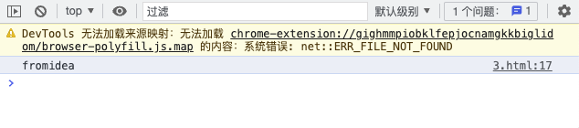
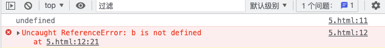

# JavaScript学习笔记


## javascript概述

JavaScript（JS）是一种具有函数优先特性的轻量级、解释型或者说即时编译型的编程语言。虽然作为 Web 页面中的脚本语言被人所熟知，但是它也被用到了很多非浏览器环境中，例如 Node.js、Apache CouchDB、Adobe Acrobat 等。进一步说，JavaScript 是一种基于原型、多范式、单线程的动态 (en-US)语言，并且支持面向对象、命令式和声明式（如函数式编程）风格。

JavaScript 的动态特性包括运行时对象的构造、变量参数列表、函数变量、动态脚本创建（通过 eval）、对象内枚举（通过 for...in 和 Object 工具方法）和源代码恢复（JavaScript 函数会存储其源代码文本，可以使用 toString() 进行检索）。

>   该笔记从2022年12月28日开始持续更新

### 资源

[Javascript详细中文手册](https://developer.mozilla.org/zh-CN/docs/Web/JavaScript)

[JavaScript开发者应懂的33个概念](/program/javascript/JavaScript开发者应懂的33个概念.html)


## 开发工具


### vscode

vscode是微软开发的一个ide代码编辑器。拥有极为强大且丰富的扩展库。

访问vscode[官网](https://code.visualstudio.com/)，下载安装。

安装完成后运行vscode。

#### 安装扩展

依次安装以下扩展

*   **live Server**，实时浏览器渲染


## HelloWorld

在html文件中，使用 `<script>` 标签元素编写javascript代码。

### 内部 JavaScript

```html
<!DOCTYPE html>
<html lang="en">
<head>
    <meta charset="UTF-8">
    <meta http-equiv="X-UA-Compatible" content="IE=edge">
    <meta name="viewport" content="width=device-width, initial-scale=1.0">
    <title>Hello World</title>
</head>
<body>
    <div id="app"></div>
</body>
    <script>
        document.getElementById('app').innerHTML = 'Hello World';
    </script>
</html>
```

### 外部 JavaScript

html文件

```html
<!DOCTYPE html>
<html lang="en">
<head>
    <meta charset="UTF-8">
    <meta http-equiv="X-UA-Compatible" content="IE=edge">
    <meta name="viewport" content="width=device-width, initial-scale=1.0">
    <title>Hello World</title>
</head>
<body>
    <div id="app"></div>
</body>
    <script src="2.js"></script>
</html>
```

js文件

```javascript
function load() {
    document.getElementById('app').innerHTML = 'Hello World';
}
load();
```

### 浏览器结果


### 避免延迟

为了保证页面静态内容的正常加载，在没有特殊需求的情况下，应该将js代码或外部js引入写在 `<body>` 最末尾。


## 注释与执行符

| 符号       | 用途     |
| :----------- | ------------ |
| **//**       | 单行注释     |
| **/\*  \*/** | 多行注释     |
| **;**        | 语句结束符号 |

**示例代码：**

```html
<!DOCTYPE html>
<html lang="en">
<head>
    <meta charset="UTF-8">
    <meta http-equiv="X-UA-Compatible" content="IE=edge">
    <meta name="viewport" content="width=device-width, initial-scale=1.0">
    <title>Document</title>
</head>
<body>
    <script>
        //声明变量a，分号结束当前语句
        let a = "fromidea";
        /*
            多行注释，
            控制台输出变量a
        */
        console.log(a);
    </script>
</body>
</html>
```

**控制台输出：**



## 变量声明

### var

**`var` 语句** 用于声明一个函数范围或全局范围的变量，并可将其初始化为一个值（可选）。

同时，在js中变量无需设置字符类型（属于弱类型）。

示例代码：

``` html
 <!DOCTYPE html>
 <html lang="en">
 <head>
    <meta charset="UTF-8">
    <meta http-equiv="X-UA-Compatible" content="IE=edge">
    <meta name="viewport" content="width=device-width, initial-scale=1.0">
    <title>Document</title>
 </head>
 <body>
    
 </body>
    <script>
        var a = 1;
        console.log(typeof a);
      	//输出：number
        var a = 'fromidea';
        console.log(typeof a);
      	//输出：string
        var a = {};
        console.log(typeof a);
      	//输出：object
    </script>
 </html>
```

#### 变量提升

无论在何处使用 `var` 语句来声明变量，都会在执行任何代码之前进行预处理。这被称为变量提升。

>   因此，建议始终在作用域顶部声明变量（全局代码的顶部和函数代码的顶部），这可以清楚知道哪些变量是函数作用域（局部），哪些变量在作用域链上解决。

示例代码：

``` html
<!DOCTYPE html>
<html lang="en">
<head>
    <meta charset="UTF-8">
    <meta http-equiv="X-UA-Compatible" content="IE=edge">
    <meta name="viewport" content="width=device-width, initial-scale=1.0">
    <title>Document</title>
</head>
<body>
    <script>
        console.log(a);
        console.log(b);
        var a = 'fromidea';
    </script>
</body>
</html>
```

控制台输出：



观察控制台输出结果，可以发现：

*   虽然变量 `a` 写在 `console` 之后，但程序并未报错，输出结果为undefined，表示该变量存在，但并没有值。

*   当输出变量`b`时，程序是报错的。因为代码中并未声明该变量。


### let

**`let`** 允许声明一个“块”作用域中的变量、语句或者表达式。与 `var` 关键字不同的是，`var` 声明的变量作用域是全局或者整个函数块的。 

示例代码：

```html
<!DOCTYPE html>
<html lang="en">
<head>
    <meta charset="UTF-8">
    <meta http-equiv="X-UA-Compatible" content="IE=edge">
    <meta name="viewport" content="width=device-width, initial-scale=1.0">
    <title>Document</title>
</head>
<body>
    <script>
        console.log(a);
        let a = 'fromidea';
    </script>
</body>
</html>
```

控制台输出：

<p class="demo">Uncaught ReferenceError: Cannot access 'a' before initialization at 6.html:11:21</p>

这段代码体现出了`var` 和 `let` 的另一个重要区别，`let` 声明的变量不会在作用域中被提升，它是在编译时才初始化（暂时性死区）。

>   就像  `const`  一样，`let` 不会在全局声明时（在最顶层的作用域）创建 `window` 对象的属性。


#### 暂时性死区

从一个代码块的开始直到代码执行到声明变量的行之前，let 或 const 声明的变量都处于“暂时性死区”（Temporal dead zone，TDZ）中。

当变量处于暂时性死区之中时，其尚未被初始化，尝试访问变量将抛出 ReferenceError。当代码执行到声明变量所在的行时，变量被初始化为一个值。如果声明中未指定初始值，则变量将被初始化为 undefined。

与 var 声明的变量不同，如果在声明前访问了变量，变量将会返回 undefined。以下代码演示了在使用 let 和 var 声明变量的行之前访问变量的不同结果。
