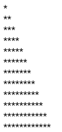

# JavaScript学习笔记


## 基本知识

JavaScript（JS）是一种具有函数优先特性的轻量级、解释型或者说即时编译型的编程语言。虽然作为 Web 页面中的脚本语言被人所熟知，但是它也被用到了很多非浏览器环境中，例如 Node.js、Apache CouchDB、Adobe Acrobat 等。进一步说，JavaScript 是一种基于原型、多范式、单线程的动态 (en-US)语言，并且支持面向对象、命令式和声明式（如函数式编程）风格。

>   该笔记从2022年12月28日开始持续更新

### 资源

[Javascript详细中文手册](https://developer.mozilla.org/zh-CN/docs/Web/JavaScript)

[JavaScript开发者应懂的33个概念](/program/javascript/JavaScript开发者应懂的33个概念.html)


### 开发工具

#### vscode

vscode是微软开发的一个ide代码编辑器。拥有极为强大且丰富的扩展库。

访问vscode[官网](https://code.visualstudio.com/)，下载安装。

安装完成后运行vscode。

##### 安装扩展

依次安装以下扩展

*   **live Server**，实时浏览器渲染


### HelloWorld

在html文件中，使用 `<script>` 标签元素编写javascript代码。

#### 内部 JavaScript

```html
<!DOCTYPE html>
<html lang="en">
<head>
    <meta charset="UTF-8">
    <meta http-equiv="X-UA-Compatible" content="IE=edge">
    <meta name="viewport" content="width=device-width, initial-scale=1.0">
    <title>Hello World</title>
</head>
<body>
    <div id="app"></div>
</body>
    <script>
        document.getElementById('app').innerHTML = 'Hello World';
    </script>
</html>
```

#### 外部 JavaScript

html文件

```html
<!DOCTYPE html>
<html lang="en">
<head>
    <meta charset="UTF-8">
    <meta http-equiv="X-UA-Compatible" content="IE=edge">
    <meta name="viewport" content="width=device-width, initial-scale=1.0">
    <title>Hello World</title>
</head>
<body>
    <div id="app"></div>
</body>
    <script src="2.js"></script>
</html>
```

js文件

```javascript
function load() {
    document.getElementById('app').innerHTML = 'Hello World';
}
load();
```

浏览器结果


#### 避免延迟

为了保证页面静态内容的正常加载，在没有特殊需求的情况下，应该将js代码或外部js引入写在 `<body>` 最末尾。


### 注释与执行符

| 符号       | 用途     |
| :----------- | ------------ |
| **//**       | 单行注释     |
| **/\*  \*/** | 多行注释     |
| **;**        | 语句结束符号 |

示例代码：

```js
//声明变量a，分号结束当前语句
let a = "fromidea";
/*
多行注释，
控制台输出变量a
*/
console.log(a);
```

控制台输出**：**


### 变量声明

#### var

**`var` 语句** 用于声明一个函数范围或全局范围的变量，并可将其初始化为一个值（可选）。

同时，JavaScript 是一种“动态类型语言”，这意味着无需指定变量将包含什么数据类型。

示例代码：

``` js
var a = 1;
console.log(typeof a);
//输出：number
var a = 'fromidea';
console.log(typeof a);
//输出：string
var a = {};
console.log(typeof a);
//输出：object
```

##### 变量提升

无论在何处使用 `var` 语句来声明变量，都会在执行任何代码之前进行预处理。这被称为变量提升。

>   因此，建议始终在作用域顶部声明变量（全局代码的顶部和函数代码的顶部），这可以清楚知道哪些变量是函数作用域（局部），哪些变量在作用域链上解决。

示例代码：

``` js
console.log(a);
console.log(b);
var a = 'fromidea';
```

控制台输出：


观察控制台输出结果，可以发现：

*   虽然变量 `a` 写在 `console` 之后，但程序并未报错，输出结果为undefined，表示该变量存在，但并没有值。

*   当输出变量`b`时，程序是报错的。因为代码中并未声明该变量。


##### 数据类型

*   Number，数字
*   String，字符串
*   Boolean，true/false
*   Array，数组
*   Object，对象


##### typeof

使用 `typeof` 运算符可以获得当前变量的数据类型。

```javascript
var myInt = 5;
var myFloat = 6.667;

typeof myInt;   //number
typeof myFloat; //number
```

 

#### let

**`let`** 允许声明一个“块”作用域中的变量、语句或者表达式。与 `var` 关键字不同的是，`var` 声明的变量作用域是全局或者整个函数块的。 

示例代码：

```js
console.log(a);
let a = 'fromidea';
```

控制台输出：

<p class="demo">Uncaught ReferenceError: Cannot access 'a' before initialization at 6.html:11:21</p>

这段代码体现出了`var` 和 `let` 的另一个重要区别，`let` 声明的变量不会在作用域中被提升，它是在编译时才初始化（暂时性死区）。

>   就像  `const`  一样，`let` 不会在全局声明时（在最顶层的作用域）创建 `window` 对象的属性。


##### 暂时性死区

从一个代码块的开始直到代码执行到声明变量的行之前，`let` 或 `const` 声明的变量都处于“暂时性死区”（Temporal dead zone，TDZ）中。

当变量处于暂时性死区之中时，其尚未被初始化，尝试访问变量将抛出 ReferenceError。当代码执行到声明变量所在的行时，变量被初始化为一个值。如果声明中未指定初始值，则变量将被初始化为 undefined。


##### 块作用域

简单来说，即变量作用仅在 `{}` 内有效。

示例代码：

```js
var i = 999;
for(let i = 0;i < 3;i++){
  console.log(i);
}
console.log(i);
```

控制台输出：

<div class="demo">
		0<br>
		1<br>
		2<br>
		999
</div>


##### 全局污染

在函数内部使用的变量，一定要单独声明。除非该变量是全局的。

当函数内部变量没有进行 `var` 或 `let` 进行声明时。那么，这个变量会影响到函数外部的同名变量。

示例代码：

```javascript
function show(){
  web = '创意';
}
web = 'fromidea';
show();
console.log(web);
```

控制台输出：

<div class="demo">
  创意
</div>

观察输出结果，“创意”替代了值“fromidea”。


### 常量

#### const

常量是**块级范围**的，非常类似用 `let` 语句定义的变量。但常量的值是无法（通过重新赋值）改变的，也不能被重新声明。

**常量声明通常情况下全部用大写字母。**

示例代码：	

```js
const URL = 'fromidea.com';
if(URL){
  const URL = 'www.fromidea.com';
  console.log(URL);
}
console.log(URL);
```

控制台输出：

<div class="demo">
  www.fromidea.com<br>
  fromidea.com
</div>

观察可以发现，在不同的作用域，可以重复声明 `URL` 常量，不同作用域的常量并不相互影响。

在同一作用域重新声明或对其赋值，都是错误的。


##### const声明为对象类型时

当使用 `const` 声明对象时，对象的元素值是可以改变的。

示例代码：

```js
<script>
    const HOST = {
        url : 'http://www.fromidea.com',
        port : 80
    }
    HOST.port = 443;
    console.log(HOST);
</script>
```

控制台输出：

<div class="demo">
  {url: 'http://www.fromidea.com', port: 443}
</div>

那么，如果我们不想让常量对象的值被修改，可以使用 `Object.freeze()` 方法来实现。

示例代码：

```js
<script>
    "use strict";
    const HOST = {
        url : 'http://www.fromidea.com',
        port : 80
    }
    Object.freeze(HOST);
    HOST.port = 443;
    console.log(HOST);
</script>
```

控制台输出：

<div class="demo">
  Uncaught TypeError: Cannot assign to read only property 'port' of object...
</div>


##### 延伸：use strict（严格模式）

若要避免因函数内部变量未声明而导致全局污染的情况，也可以采用“严格模式”策略。

开启严格模式，需要在所有语句之前放一个特定语句 `"use strict";` 

1.   严格模式通过抛出错误来消除了一些原有静默错误。

2.   严格模式修复了一些导致 JavaScript 引擎难以执行优化的缺陷：有时候，相同的代码，严格模式可以比非严格模式下运行得更快。

3.   严格模式禁用了在 ECMAScript 的未来版本中可能会定义的一些语法。

     

### window全局变量

`window` 作为全局变量，代表了脚本正在运行的窗口，暴露给 Javascript 代码。

在有标签页功能的浏览器中，每个标签都拥有自己的 `window` 对象；也就是说，同一个窗口的标签页之间不会共享一个 `window` 对象。

示例代码：

```js
<script>
    console.log(window.screenLeft);
</script>
```

此时，移动浏览器窗口，并刷新页面，观察控制台，可以看到数值在变化。

`screenLeft` 是 `window` 的一个属性，用于获得当前窗口相对于桌面的位置（左边距离）。

如果用 `var` 重新声明 `screenLeft` 这个变量，则会影响 `window.screenLeft` 的结果。

示例代码：

```js
<script>
    var screenLeft = 100;
    console.log(window.screenLeft);
</script>
```

此时，无论如何移动窗口并刷新页面，控制台输出：

<div class="demo">
  100
</div>

那么，也就是 `window.screenLeft` 已经被污染。

这时，如果我们使用 `let` 声明，则不会对 `window.screenLeft` 造成影响。

```javascript
<script>
    let screenLeft = 100;
    console.log(window.screenLeft);
    console.log(screenLeft);
</script>
```

控制台输出：

<div class="demo">
  1<br>
  100<br>
</div>

`screenLeft` 和 `window.screenLeft` 互不影响。


#### window对象的属性

| 属性/手册链接                                                | 说明                                                         |
| ------------------------------------------------------------ | ------------------------------------------------------------ |
| [`Window.closed`](https://developer.mozilla.org/zh-CN/docs/Web/API/Window/closed) | 这个属性指示当前窗口是否关闭。                               |
| [`Window.console`](https://developer.mozilla.org/zh-CN/docs/Web/API/Window/console) | 返回 console 对象的引用，该对象提供了对浏览器调试控制台的访问。 |
| [`Window.content`](https://developer.mozilla.org/zh-CN/docs/Web/API/Window/content) | 返回当前 window 的 content 元素的引用。通过带下划线的过时变种方法不再可以获得 Web content。 |
| [`Window.customElements`](https://developer.mozilla.org/zh-CN/docs/Web/API/Window/customElements) | 返回对CustomElementRegistry对象的引用，该对象可用于注册新的自定义元素并获取有关以前注册的自定义元素的信息。 |
| [`Window.crypto`](https://developer.mozilla.org/zh-CN/docs/Web/API/crypto_property) | 返回浏览器 crypto 对象。                                     |
| [`Window.defaultStatus`](https://developer.mozilla.org/zh-CN/docs/Web/API/Window/defaultStatus) | 获取或设置指定窗口的状态栏文本。                             |
| [`Window.document`](https://developer.mozilla.org/zh-CN/docs/Web/API/Window/document) | 返回对当前窗口所包含文档的引用。                             |
| [`Window.devicePixelRatio`](https://developer.mozilla.org/zh-CN/docs/Web/API/Window/devicePixelRatio) | 返回当前显示器的物理像素和设备独立像素的比例。               |
| [`Window.event`](https://developer.mozilla.org/zh-CN/docs/Web/API/Window/event) | 返回当前事件，即当前由JavaScript代码上下文处理的事件，如果当前未处理任何事件，则返回未定义的事件。应尽可能使用直接传递给事件处理程序的Event对象。 |
| [`Window.frameElement`](https://developer.mozilla.org/zh-CN/docs/Web/API/Window/frameElement) | 返回嵌入窗口的元素，如果未嵌入窗口，则返回 null。            |
| [`Window.frames`](https://developer.mozilla.org/zh-CN/docs/Web/API/Window/frames) | 返回当前窗口中所有子窗体的数组。                             |
| [`Window.fullScreen`](https://developer.mozilla.org/zh-CN/docs/Web/API/Window/fullScreen) | 此属性表示窗口是否以全屏显示。                               |
| [`Window.history`](https://developer.mozilla.org/zh-CN/docs/Web/API/Window/history) | 返回一个对 history 对象的引用。                              |
| [`Window.innerHeight`](https://developer.mozilla.org/zh-CN/docs/Web/API/Window/innerHeight) | 获得浏览器窗口的内容区域的高度，包含水平滚动条 (如果有的话)。 |
| [`Window.innerWidth`](https://developer.mozilla.org/zh-CN/docs/Web/API/Window/innerWidth) | 获得浏览器窗口的内容区域的宽度，包含垂直滚动条 (如果有的话)。 |
| [`Window.length`](https://developer.mozilla.org/zh-CN/docs/Web/API/Window/length) | 返回窗口中的 frames 数量。参见 [`window.frames`](https://developer.mozilla.org/zh-CN/docs/Web/API/Window/frames)。 |
| [`Window.location`](https://developer.mozilla.org/zh-CN/docs/Web/API/Window/location) | 获取、设置 window 对象的 location，或者当前的 URL.           |
| [`Window.locationbar`](https://developer.mozilla.org/zh-CN/docs/Web/API/Window/locationbar) | 返回 locationbar 对象，其可视性可以在窗口中切换。            |
| [`Window.localStorage`](https://developer.mozilla.org/zh-CN/docs/Web/API/Window/localStorage) | 返回用来存储只能在创建它的源下访问的数据的本地存储对象的引用 |
| [`Window.menubar`](https://developer.mozilla.org/zh-CN/docs/Web/API/Window/menubar) | 返回菜单条对象，它的可视性可以在窗口中切换                   |
| [`Window.mozAnimationStartTime`](https://developer.mozilla.org/zh-CN/docs/Web/API/Animation/startTime) | 返回当前动画循环开始经过的毫秒数                             |
| [`Window.mozInnerScreenX`](https://developer.mozilla.org/zh-CN/docs/Web/API/Window/mozInnerScreenX) | 返回窗口视口左上角的水平（X）坐标，以屏幕坐标表示。此值以CSS像素报告。如果需要，请参阅nsIDOMWindowUtils中的mozScreenPixelsPerCSSPixel，了解适应屏幕像素的转换因子。 |
| [`Window.mozInnerScreenY`](https://developer.mozilla.org/zh-CN/docs/Web/API/Window/mozInnerScreenY) | 返回窗口视口左上角的垂直（Y）坐标，以屏幕坐标表示。此值以CSS像素报告。如果需要，请参阅mozScreenPixelsPerCSSPixel以获取适应屏幕像素的转换因子。 |
| [`Window.mozPaintCount`](https://developer.mozilla.org/zh-CN/docs/Web/API/Window) | 返回当前文档在此窗口中呈现到屏幕的次数。这可用于计算渲染性能。 |
| [`Window.name`](https://developer.mozilla.org/zh-CN/docs/Web/API/Window/name) | 获取/设置窗口的名称。                                        |
| [`Window.navigator`](https://developer.mozilla.org/zh-CN/docs/Web/API/Window/navigator) | 返回对 navigator 对象的引用。                                |
| [`Window.opener`](https://developer.mozilla.org/zh-CN/docs/Web/API/Window/opener) | 返回对打开当前窗口的那个窗口的引用。                         |
| [`Window.orientation`](https://developer.mozilla.org/en-US/docs/Web/API/Window/orientation) | 返回视口相对于设备自然方向的角度方向（以90度为增量）。       |
| [`Window.outerHeight`](https://developer.mozilla.org/zh-CN/docs/Web/API/Window/outerHeight) | 返回浏览器窗口的外部高度。                                   |
| [`Window.outerWidth`](https://developer.mozilla.org/zh-CN/docs/Web/API/Window/outerWidth) | 返回浏览器窗口的外部宽度。                                   |
| [`Window.pageXOffset`](https://developer.mozilla.org/zh-CN/docs/Web/API/Window/scrollX) | [`window.scrollX`](https://developer.mozilla.org/zh-CN/docs/Web/API/Window/scrollX)的别名。 |
| [`Window.pageYOffset`](https://developer.mozilla.org/zh-CN/docs/Web/API/Window/scrollY) | [`window.scrollY`](https://developer.mozilla.org/zh-CN/docs/Web/API/Window/scrollY)的别名。 |
| [`Window.parent`](https://developer.mozilla.org/zh-CN/docs/Web/API/Window/parent) | 返回当前窗口或子窗口的父窗口的引用。                         |
| [`Window.performance`](https://developer.mozilla.org/zh-CN/docs/Web/API/performance_property) | 返回Performance对象，该对象包括计时和导航属性，每个属性都是提供性能相关（en-US）数据的对象。有关更多信息和示例，请参见使用导航计时。 |
| [`Window.personalbar`](https://developer.mozilla.org/zh-CN/docs/Web/API/Window/personalbar) | 返回 personalbar 对象，它的可视性可以在窗口中切换。          |
| [`Window.screen`](https://developer.mozilla.org/zh-CN/docs/Web/API/Window/screen) | 返回对与窗口关联的屏幕对象的引用。                           |
| [`Window.screenX`](https://developer.mozilla.org/zh-CN/docs/Web/API/Window/screenX) & [`Window.screenLeft`](https://developer.mozilla.org/zh-CN/docs/Web/API/Window/screenLeft) | 这两个属性都会返回从用户浏览器视口左边框到屏幕左侧的水平距离。 |
| [`Window.screenY`](https://developer.mozilla.org/zh-CN/docs/Web/API/Window/screenY) & [`Window.screenTop`](https://developer.mozilla.org/zh-CN/docs/Web/API/Window/screenTop) | 这两个属性都会返回从用户浏览器视口的上边框到屏幕顶部的垂直距离。 |
| [`Window.scrollbars`](https://developer.mozilla.org/zh-CN/docs/Web/API/Window/scrollbars) | 返回滚动条对象，其可见性可以在窗口中切换。                   |
| [`Window.scrollMaxX`](https://developer.mozilla.org/zh-CN/docs/Web/API/Window/scrollMaxX) | 窗口可以水平滚动到的最大偏移量，即文档宽度减去视口宽度。     |
| [`Window.scrollMaxY`](https://developer.mozilla.org/zh-CN/docs/Web/API/Window/scrollMaxY) | 窗口可以垂直滚动到的最大偏移量（即文档高度减去视口高度）。   |
| [`Window.scrollX`](https://developer.mozilla.org/zh-CN/docs/Web/API/Window/scrollX) | 返回文档已水平滚动的像素数。                                 |
| [`Window.scrollY`](https://developer.mozilla.org/zh-CN/docs/Web/API/Window/scrollY) | 返回文档已垂直滚动的像素数。                                 |
| [`Window.self`](https://developer.mozilla.org/zh-CN/docs/Web/API/Window/self) | 返回对窗口对象本身的对象引用。                               |
| [`Window.sessionStorage`](https://developer.mozilla.org/zh-CN/docs/Web/API/Window/sessionStorage) | 返回对会话存储对象的引用，该对象用于存储只能由创建它的源访问的数据。 |
| [`Window.sidebar`](https://developer.mozilla.org/zh-CN/docs/Web/API/Window/sidebar) | 返回对侧边栏的窗口对象的引用。                               |
| [`Window.speechSynthesis`](https://developer.mozilla.org/en-US/docs/Web/API/Window/speechSynthesis) | 返回SpeechSynthesis对象，该对象是使用Web SpeechAPI语音合成功能的入口点。 |
| [`Window.status`](https://developer.mozilla.org/en-US/docs/Web/API/Window/status) | 获取/设置浏览器底部状态栏中的文本。                          |
| [`Window.statusbar`](https://developer.mozilla.org/en-US/docs/Web/API/Window/statusbar) | 返回statusbar对象，其可见性可以在窗口中切换。                |
| [`Window.toolbar`](https://developer.mozilla.org/en-US/docs/Web/API/Window/toolbar) | 返回工具栏对象，其可见性可以在窗口中切换。                   |
| [`Window.top`](https://developer.mozilla.org/zh-CN/docs/Web/API/Window/top) | 返回对窗口层次结构中最顶层窗口的引用。此属性是只读的。       |
| [`Window.visualViewport`](https://developer.mozilla.org/zh-CN/docs/Web/API/Window/visualViewport) | 返回表示给定窗口的视觉视口的VisualViewport对象。             |
| [`Window.window`](https://developer.mozilla.org/zh-CN/docs/Web/API/Window/window) | 返回对当前窗口的引用。                                       |


#### window对象的方法

| 方法/手册链接                                                | 说明                                                         |
| ------------------------------------------------------------ | ------------------------------------------------------------ |
| [`Window.alert()`](https://developer.mozilla.org/zh-CN/docs/Web/API/Window/alert) | 显示警报对话框。                                             |
| [`Window.back()`](https://developer.mozilla.org/zh-CN/docs/Web/API/Window/back) | 在窗口历史记录中向后移动一个。该方法已过时；您应该改用window.history.back（）。 |
| [`Window.blur()`](https://developer.mozilla.org/zh-CN/docs/Web/API/Window/blur) | 将焦点设置为远离窗口。                                       |
| [`Window.cancelAnimationFrame()`](https://developer.mozilla.org/zh-CN/docs/Web/API/Window/cancelAnimationFrame) | 允许您取消以前使用Window.requestAnimationFrame计划的回调。   |
| [`Window.cancelIdleCallback()`](https://developer.mozilla.org/zh-CN/docs/Web/API/Window/cancelIdleCallback) | 允许您取消以前使用Window.requestIdleCallback计划的回调。     |
| [`Window.captureEvents()`](https://developer.mozilla.org/en-US/docs/Web/API/Window/captureEvents) | 注册窗口以捕获指定类型的所有事件。                           |
| [`Window.clearImmediate()`](https://developer.mozilla.org/zh-CN/docs/Web/API/Window/clearImmediate) | 使用setImmediate取消重复执行集。                             |
| [`Window.clearImmediate()`](https://developer.mozilla.org/zh-CN/docs/Web/API/Window/clearImmediate) | 使用setImmediate取消重复执行集。                             |
| [`Window.close()`](https://developer.mozilla.org/zh-CN/docs/Web/API/Window/close) | 关闭当前窗口。                                               |
| [`Window.confirm()`](https://developer.mozilla.org/zh-CN/docs/Web/API/Window/confirm) | 显示一个对话框，其中包含用户需要响应的消息。                 |
| [`Window.dump()`](https://developer.mozilla.org/zh-CN/docs/Web/API/Window/dump) | 将消息写入控制台。                                           |
| [`Window.find()`](https://developer.mozilla.org/zh-CN/docs/Web/API/Window/find) | 在窗口中搜索给定字符串。                                     |
| [`Window.focus()`](https://developer.mozilla.org/zh-CN/docs/Web/API/Window/focus) | 设置当前窗口的焦点。                                         |
| [`Window.getComputedStyle()`](https://developer.mozilla.org/zh-CN/docs/Web/API/Window/getComputedStyle) | 获取指定元素的计算样式。计算样式指示元素的所有CSS属性的计算值。 |
| [`Window.getDefaultComputedStyle()`](https://developer.mozilla.org/zh-CN/docs/Web/API/Window/getDefaultComputedStyle) | 获取指定元素的默认计算样式，忽略作者样式表。                 |
| [`Window.getSelection()`](https://developer.mozilla.org/zh-CN/docs/Web/API/Window/getSelection) | 返回表示所选项目的选择对象。                                 |
| [`Window.matchMedia()`](https://developer.mozilla.org/zh-CN/docs/Web/API/Window/matchMedia) | 返回表示指定媒体查询字符串的MediaQueryList对象。             |
| [`Window.minimize()`](https://developer.mozilla.org/zh-CN/docs/Web/API/Window) | 最小化窗口。                                                 |
| [`Window.moveBy()`](https://developer.mozilla.org/zh-CN/docs/Web/API/Window/moveBy) | 将当前窗口移动指定的量。                                     |
| [`Window.moveTo()`](https://developer.mozilla.org/zh-CN/docs/Web/API/Window/moveTo) | 将窗口移动到指定的坐标。                                     |
| [`Window.open()`](https://developer.mozilla.org/zh-CN/docs/Web/API/Window/open) | 打开一个新窗口。                                             |
| [`Window.postMessage()`](https://developer.mozilla.org/zh-CN/docs/Web/API/Window/postMessage) | 为一个窗口向另一个窗口发送数据字符串提供了一种安全方法，该窗口不必与第一个窗口处于相同的域中。 |
| [`Window.print()`](https://developer.mozilla.org/zh-CN/docs/Web/API/Window/print) | 打开打印对话框以打印当前文档。                               |
| [`Window.prompt()`](https://developer.mozilla.org/zh-CN/docs/Web/API/Window/prompt) | 返回用户在提示对话框中输入的文本。                           |
| [`Window.requestAnimationFrame()`](https://developer.mozilla.org/zh-CN/docs/Web/API/Window/requestAnimationFrame) | 告诉浏览器一个动画正在进行中，请求浏览器为下一个动画帧重新绘制窗口。 |
| [`Window.requestIdleCallback()`](https://developer.mozilla.org/zh-CN/docs/Web/API/Window/requestIdleCallback) | 启用在浏览器空闲期间对任务进行调度。                         |
| [`Window.resizeBy()`](https://developer.mozilla.org/zh-CN/docs/Web/API/Window/resizeBy) | 将当前窗口调整到一定的大小。                                 |
| [`Window.resizeTo()`](https://developer.mozilla.org/zh-CN/docs/Web/API/Window/resizeTo) | 动态调整窗口。                                               |
| [`Window.scroll()`](https://developer.mozilla.org/zh-CN/docs/Web/API/Window/scroll) | 滚动窗口到文档中的特定位置。                                 |
| [`Window.scrollBy()`](https://developer.mozilla.org/zh-CN/docs/Web/API/Window/scrollBy) | 按给定的数量在窗口中滚动文档。                               |
| [`Window.scrollByLines()`](https://developer.mozilla.org/zh-CN/docs/Web/API/Window/scrollByLines) | 按给定行数滚动文档。                                         |
| [`Window.scrollByPages()`](https://developer.mozilla.org/zh-CN/docs/Web/API/Window/scrollByPages) | 按指定页数滚动当前文档。                                     |
| [`Window.scrollTo()`](https://developer.mozilla.org/zh-CN/docs/Web/API/Window/scrollTo) | 滚动到文档中的特定坐标集。                                   |
| [`Window.setImmediate()`](https://developer.mozilla.org/zh-CN/docs/Web/API/Window/setImmediate) | 在浏览器完成其他繁重任务后执行一个函数。                     |
| `Window.setResizable()`                                      | 切换用户调整窗口大小的能力。                                 |
| [`Window.sizeToContent()`](https://developer.mozilla.org/zh-CN/docs/Web/API/Window/sizeToContent) | 根据内容设置窗口大小。                                       |
| [`Window.stop()`](https://developer.mozilla.org/zh-CN/docs/Web/API/Window/stop) | 这个方法停止窗口加载。                                       |
| [`Window.updateCommands()`](https://developer.mozilla.org/zh-CN/docs/Web/API/Window/updateCommands) | 更新当前 chrome 窗口 (UI) 命令的状态。                       |


### 传值

可以理解为，一个变量复制另一个变量的值。

示例代码：

```js
<script>
    let a = 1;
		//b复制a
    let b = a;
    console.log(a,b);
    b = 3;
    console.log(a,b);
</script>
```

控制台输出：


可以发现，b复制了a的值，第一次打印时，b和a的值是一致的。当对b重新赋值后，b的值会更新，a不会发生变化。


### 传址

可以理解为，一个变量是另一个变量的分身。当分身的值变动时，主体也随之变动。

示例代码：

```js
<script>
    let a = {name : 'fromidea'};
    let b = a;
    console.log(a,b);
    b.name = 'fromidea.com';
    console.log(a,b);
</script>
```

控制台输出：


### null

`null` 是表示缺少的标识，指示变量未指向任何对象。

把 `null` 作为尚未创建的对象，也许更好理解。

`null` 用于在声明变量时，虽创建了它，但没有赋予类型或值。

示例代码：

```js
<script>
    // foo 不存在，它从来没有被定义过或者是初始化过：
    console.log(foo);
		// foo 现在已经是知存在的，但是它没有类型或者是值：
    let foo = null;
    console.log(foo);
</scirpt>
```

控制台输出：


当我们把第一次 `console` 注释掉。再次刷新：


### undefined

`undefined` 则表示**没有被赋值**。

示例代码：

```js
<script>
    function test(a){
        if(a === undefined){
            a = 'fromidea';
            console.log(a);
        }else{
            console.log(a);
        }
    }
    test(null);
    test();
    test(1);
</script>
```

控制台输出：


当检测 null 或 undefined 时，注意相等（==）与全等（===）两个操作符的区别，前者会执行类型转换：

```js
typeof null        // "object" (因为一些以前的原因而不是'null')
typeof undefined   // "undefined"
null === undefined // false
null  == undefined // true
null === null // true
null == null // true
!null //true
isNaN(1 + null) // false
isNaN(1 + undefined) // true
```


## 运算符与流程控制

### 赋值运算符

赋值元素符会将右边的操作数的值分配给左边的操作数，并将其值修改为右边操作数相等的值。

| 运算符                                                       | 说明                                                         |
| ------------------------------------------------------------ | ------------------------------------------------------------ |
| [`=`](https://developer.mozilla.org/zh-CN/docs/Web/JavaScript/Reference/Operators/Assignment) | 赋值运算符。                                                 |
| [`*=`](https://developer.mozilla.org/zh-CN/docs/Web/JavaScript/Reference/Operators/Multiplication_assignment) | 赋值乘积。                                                   |
| [`**=`](https://developer.mozilla.org/zh-CN/docs/Web/JavaScript/Reference/Operators/Exponentiation_assignment) | 求幂赋值。                                                   |
| [`/=`](https://developer.mozilla.org/zh-CN/docs/Web/JavaScript/Reference/Operators/Division_assignment) | 赋值商。                                                     |
| [`%=`](https://developer.mozilla.org/zh-CN/docs/Web/JavaScript/Reference/Operators/Remainder_assignment) | 赋值求余。                                                   |
| [`+=`](https://developer.mozilla.org/zh-CN/docs/Web/JavaScript/Reference/Operators/Addition_assignment) | 赋值求和。                                                   |
| [`-=`](https://developer.mozilla.org/zh-CN/docs/Web/JavaScript/Reference/Operators/Subtraction_assignment) | 赋值求差。                                                   |
| [`<<=`](https://developer.mozilla.org/zh-CN/docs/Web/JavaScript/Reference/Operators/Left_shift_assignment) | 左位移。                                                     |
| [`>>=`](https://developer.mozilla.org/zh-CN/docs/Web/JavaScript/Reference/Operators/Right_shift_assignment) | 右位移。                                                     |
| [`>>>=`](https://developer.mozilla.org/zh-CN/docs/Web/JavaScript/Reference/Operators/Unsigned_right_shift_assignment) | 无符号右位移。                                               |
| [`&=`](https://developer.mozilla.org/zh-CN/docs/Web/JavaScript/Reference/Operators/Bitwise_AND_assignment) | 赋值与。                                                     |
| [`^=`](https://developer.mozilla.org/zh-CN/docs/Web/JavaScript/Reference/Operators/Bitwise_XOR_assignment) | 赋值按位异或。                                               |
| [`\|=`](https://developer.mozilla.org/zh-CN/docs/Web/JavaScript/Reference/Operators/Bitwise_OR_assignment) | 赋值或。                                                     |
| [`&&=`](https://developer.mozilla.org/zh-CN/docs/Web/JavaScript/Reference/Operators/Logical_AND_assignment) | 逻辑和赋值运算符。                                           |
| [`\|\|=`](https://developer.mozilla.org/zh-CN/docs/Web/JavaScript/Reference/Operators/Logical_OR_assignment) | 逻辑或赋值运算符。                                           |
| [`??=`](https://developer.mozilla.org/zh-CN/docs/Web/JavaScript/Reference/Operators/Nullish_coalescing_assignment) | 逻辑空赋值运算符。                                           |
| [`[a, b] = arr`, `{ a, b } = obj`](https://developer.mozilla.org/zh-CN/docs/Web/JavaScript/Reference/Operators/Destructuring_assignment) | 解构赋值允许您使用类似于数组或对象字面量的语法将数组或对象的属性赋值给变量。 |


### 算术运算符

算术运算符以二个数值（字面量或变量）作为操作数，并返回单个数值。

| 运算符                                                       | 说明         |
| ------------------------------------------------------------ | ------------ |
| [`+`](https://developer.mozilla.org/zh-CN/docs/Web/JavaScript/Reference/Operators/Addition) | 加法运算符。 |
| [`-`](https://developer.mozilla.org/zh-CN/docs/Web/JavaScript/Reference/Operators/Subtraction) | 减法运算符。 |
| [`/`](https://developer.mozilla.org/zh-CN/docs/Web/JavaScript/Reference/Operators/Division) | 除法运算符。 |
| [`*`](https://developer.mozilla.org/zh-CN/docs/Web/JavaScript/Reference/Operators/Multiplication) | 乘法运算符。 |
| [`%`](https://developer.mozilla.org/zh-CN/docs/Web/JavaScript/Reference/Operators/Remainder) | 取余运算符。 |
| [`**`](https://developer.mozilla.org/zh-CN/docs/Web/JavaScript/Reference/Operators/Exponentiation) | 求幂运算符。 |


### 自增和自减

前置/后置自增运算符和前置/后置自减运算符。

| 运算符                                                       | 说明             |
| ------------------------------------------------------------ | ---------------- |
| [`A++`](https://developer.mozilla.org/zh-CN/docs/Web/JavaScript/Reference/Operators/Increment) | 后置自增运算符。 |
| [`A--`](https://developer.mozilla.org/zh-CN/docs/Web/JavaScript/Reference/Operators/Decrement) | 后置自减运算符。 |
| [`++A`](https://developer.mozilla.org/zh-CN/docs/Web/JavaScript/Reference/Operators/Increment) | 前置自增运算符。 |
| [`--A`](https://developer.mozilla.org/zh-CN/docs/Web/JavaScript/Reference/Operators/Decrement) | 前置自减运算符。 |

示例代码：

```js
<script>
    let a = 1;
    a = a + 1;
    console.log(a); //2
    ++a;
    console.log(a); //3
    a++;
    console.log(a); //4

    let b = 5;
    let c = 1;
    let d = b + ++c;
    console.log(d); //7

    b = 5;
    c = 1;
    d = b + c++;
    console.log(d); //6
</script>
```


### 一元运算符

一元运算符只有一个操作数。

| 运算符                                                       | 说明                                         |
| ------------------------------------------------------------ | -------------------------------------------- |
| [`+`](https://developer.mozilla.org/zh-CN/docs/Web/JavaScript/Reference/Operators/Unary_plus) | 一元加运算符将操作转换为 Number 类型。       |
| [`-`](https://developer.mozilla.org/zh-CN/docs/Web/JavaScript/Reference/Operators/Unary_negation) | 一元减运算符将操作转换为 Number 类型并取反。 |
| [`~`](https://developer.mozilla.org/zh-CN/docs/Web/JavaScript/Reference/Operators/Bitwise_NOT) | 按位非运算符。                               |
| [`!`](https://developer.mozilla.org/zh-CN/docs/Web/JavaScript/Reference/Operators/Logical_NOT) | 逻辑非运算符。                               |
| [`delete`](https://developer.mozilla.org/zh-CN/docs/Web/JavaScript/Reference/Operators/delete) | `delete` 运算符用来删除对象的属性。          |
| [`void`](https://developer.mozilla.org/zh-CN/docs/Web/JavaScript/Reference/Operators/void) | `void` 运算符表示表达式放弃返回值。          |
| [`typeof`](https://developer.mozilla.org/zh-CN/docs/Web/JavaScript/Reference/Operators/typeof) | `typeof` 运算符用来判断给定对象的类型。      |

示例代码：

```js
<script>
    let a = '1';
    a=+a
    console.log(a); //1
    console.log(typeof a); //number

    a = 1;
    console.log(-a); //-1

    a = 1;
    console.log(~a); //-2

    a = undefined;
    console.log(!a);//true

    a = {name : 'fromidea'};
    delete a.name;
    console.log(a); // {}

    a = 1;
    console.log(void a); //undefined
</script>
```


### 比较运算符

比较运算符比较两个操作数并返回基于比较结果的布尔值。	

| 运算符                                                       | 说明             |
| ------------------------------------------------------------ | ---------------- |
| [`<`](https://developer.mozilla.org/zh-CN/docs/Web/JavaScript/Reference/Operators/Less_than) | 小于运算符。     |
| [`>`](https://developer.mozilla.org/zh-CN/docs/Web/JavaScript/Reference/Operators/Greater_than) | 大于运算符。     |
| [`<=`](https://developer.mozilla.org/zh-CN/docs/Web/JavaScript/Reference/Operators/Less_than_or_equal) | 小于等于运算符。 |
| [`>=`](https://developer.mozilla.org/zh-CN/docs/Web/JavaScript/Reference/Operators/Greater_than_or_equal) | 大于等于运算符。 |
| [`==`](https://developer.mozilla.org/zh-CN/docs/Web/JavaScript/Reference/Operators/Equality) | 相等运算符。     |
| [`!=`](https://developer.mozilla.org/zh-CN/docs/Web/JavaScript/Reference/Operators/Inequality) | 不等运算符。     |
| [`===`](https://developer.mozilla.org/zh-CN/docs/Web/JavaScript/Reference/Operators/Strict_equality) | 全等运算符。     |
| [`!==`](https://developer.mozilla.org/zh-CN/docs/Web/JavaScript/Reference/Operators/Strict_inequality) | 非全等运算符。   |

示例代码：

```js
<script>
    let a = 1;
    let b = 2;

    console.log(a < b); // true
    console.log(a > b); // false
    console.log(a <= b); // true
    console.log(a >= b); // false
    console.log(a == b); // false
    console.log(a != b); // true
    console.log(a === b); //false
    console.log(a !== b); //true
</script>
```


### 逻辑运算符

逻辑运算符典型的用法是用于布尔（逻辑）值运算，它们返回布尔值。

| 运算符                                                       | 说明                                                         |
| ------------------------------------------------------------ | ------------------------------------------------------------ |
| [`&&`](https://developer.mozilla.org/zh-CN/docs/Web/JavaScript/Reference/Operators/Logical_AND) | 逻辑与。                                                     |
| [`\|\|`](https://developer.mozilla.org/zh-CN/docs/Web/JavaScript/Reference/Operators/Logical_OR) | 逻辑或。                                                     |
| [`??`](https://developer.mozilla.org/zh-CN/docs/Web/JavaScript/Reference/Operators/Nullish_coalescing) | 空值合并运算符，如果 ?? 前面是 null 或 undefined，取后面的默认值。 |

示例代码：

```js
<script>
    let a = 1;
    let b = 2;
    let c = 3;

    if(a > b && b > c){
        console.log('yes');
    }else{
        console.log('err');
    }

    // err

    if(a > b || b < c){
        console.log('yes');
    }else{
        console.log('err');
    }

    // yes

    let d;
    d = d ?? 'fromidea.com';
    console.log(d);

    // fromidea.com

</script>
```


### if...else判断语句

当指定条件为真，if 语句会执行一段语句。如果条件为假，则执行另一段语句。

```js
<script>
    function validate(str){
        if(str.length >= 12){
            return '密码非常安全';
        }else if(str.length >= 6){
            return '密码比较安全';
        }else{
            return '密码不太安全';
        }
    }
    let valid = validate('123123');
    console.log(valid); //密码比较安全
</script>
```


### 三元表达式

一个条件后跟一个问号（?），如果条件为真值，则执行冒号（:）前的表达式；若条件为假值，则执行最后的表达式。该运算符经常当作 if...else 语句的简捷形式来使用。

```js
<script>
    let a = 0;
    let b = 1;

    let c = a ? a : b;
    console.log(c); // 1
</script>
```


### switch

将表达式的值与case子句匹配，并执行与该情况相关联的语句。

示例代码：

```js
<script>
    function age(num){

        let msg = '';

        switch(true){
            case num >= 60:
                msg = '老年';
                break;
            
            case num >= 40:
                msg = '中年';
                break;

            case num >= 20:
                msg = '青年';
                break;

            case num >= 10:
                msg = '少年';
                break;

            case num >= 0:
            default:
                msg = '婴幼儿';
            break;
        }

        return msg;
    }
    console.log(age()); //婴幼儿
</script>
```


### while

某个条件表达式为真的前提下，循环执行指定的一段代码，直到那个表达式不为真时结束循环。

示例代码：

```js
<script>
    function table(options = {tr:5,td:10}){
        document.write(`<table border='1' style="width:100%">`);
        while (options.tr -- != 0){
            document.write(`<tr>`);
            let td = options.td;
            while (td-- != 0){
                document.write(`<td>${options.tr}:${td}</td>`);
            }       
            document.write('</tr>');
        }
        document.write(`</table>`);
    }

    table({tr:10,td:10});
</script>
```

浏览器效果：

<table border="1" style="width:100%"><tbody><tr><td>9:9</td><td>9:8</td><td>9:7</td><td>9:6</td><td>9:5</td><td>9:4</td><td>9:3</td><td>9:2</td><td>9:1</td><td>9:0</td></tr><tr><td>8:9</td><td>8:8</td><td>8:7</td><td>8:6</td><td>8:5</td><td>8:4</td><td>8:3</td><td>8:2</td><td>8:1</td><td>8:0</td></tr><tr><td>7:9</td><td>7:8</td><td>7:7</td><td>7:6</td><td>7:5</td><td>7:4</td><td>7:3</td><td>7:2</td><td>7:1</td><td>7:0</td></tr><tr><td>6:9</td><td>6:8</td><td>6:7</td><td>6:6</td><td>6:5</td><td>6:4</td><td>6:3</td><td>6:2</td><td>6:1</td><td>6:0</td></tr><tr><td>5:9</td><td>5:8</td><td>5:7</td><td>5:6</td><td>5:5</td><td>5:4</td><td>5:3</td><td>5:2</td><td>5:1</td><td>5:0</td></tr><tr><td>4:9</td><td>4:8</td><td>4:7</td><td>4:6</td><td>4:5</td><td>4:4</td><td>4:3</td><td>4:2</td><td>4:1</td><td>4:0</td></tr><tr><td>3:9</td><td>3:8</td><td>3:7</td><td>3:6</td><td>3:5</td><td>3:4</td><td>3:3</td><td>3:2</td><td>3:1</td><td>3:0</td></tr><tr><td>2:9</td><td>2:8</td><td>2:7</td><td>2:6</td><td>2:5</td><td>2:4</td><td>2:3</td><td>2:2</td><td>2:1</td><td>2:0</td></tr><tr><td>1:9</td><td>1:8</td><td>1:7</td><td>1:6</td><td>1:5</td><td>1:4</td><td>1:3</td><td>1:2</td><td>1:1</td><td>1:0</td></tr><tr><td>0:9</td><td>0:8</td><td>0:7</td><td>0:6</td><td>0:5</td><td>0:4</td><td>0:3</td><td>0:2</td><td>0:1</td><td>0:0</td></tr></tbody></table>


### do...while

创建一个执行指定语句的循环，直到条件为 false。在执行do语句后检测条件，所以do会至少执行一次。

示例代码：

```js
<script>
    function star(row = 5){
        let start = 0;
        do{
            let n = 0;
            do{
                document.write('*');
            }while(++n <= start);
            document.write('<br>');
        }while(start++ <= row);
    }
    star(10);
</script>
```

浏览器效果：




### for

用于创建一个循环，它包含了三个可选的表达式，这三个表达式被包围在圆括号之中，使用分号分隔，后跟一个用于在循环中执行的语句（通常是一个块语句）。

示例代码：

绘制一个“圣诞树”

```js
<script>
    let row = 10;
    let last = 0;
    for(let i = 1;i<=row;i++){
        for(let j = row - i;j > 0;j--){
            document.write('<i style="color:white">*</i>');
        }
        for(let n = 0;n < i * 2 - 1;n++){
            document.write('*');
            last = n;
        }
        document.write('<br>')
    }
    console.log(last);//最后一行*的数量
    for(let i = 1; i <= 3; i++){
        for(let j = last / 2 - 1; j > 0;j--){
            document.write('<i style="color:white">*</i>');
        }
        document.write('***');
        document.write('<br>');
    }
</script>
```

浏览器效果：


### continue

跳过本次循环，继续执行下次循环。

示例代码：

```js
<script>
    for(let i = 1; i <= 10; i++){
        if( i % 2 ) continue; 
        console.log(i);
    }
</script>
```

控制台输出：

<div class="demo">
  2<br>
  4<br>
  6<br>
  8<br>
  10<br>
</div>


### break

终止或跳出当前循环体。

#### 延伸：label标记

标记语句可以和 break 或 continue 语句一起使用。标记就是在一条语句前面加个可以引用的标识符（identifier）。

```js
<script>
    list1 : for(let i = 1; i <= 10; i++){
        list2: for(let n = 1; n <= 10; n++){
            if( n % 2 ) continue list2; 
            if( i + n >= 12 ) break list1;
            console.log(i,n);
        }
    }
</script>
```

控制器输出：

<div class="demo">
  1 2<br>
	1 4<br>
	1 6<br>
	1 8<br>
	1 10<br>
	2 2<br>
	2 4<br>
	2 6<br> 
</div>


### for...in

是为遍历对象属性而构建的。以任意顺序迭代一个对象的除Symbol以外的可枚举属性，包括继承的可枚举属性。

示例代码：

```js
<script>
    let obj = [
        {name:'fromidea',url:'fromidea.com'},
        {name:'pintecher',url:'pintecher.com'}
		];

    for (const key in obj){
        console.log(obj[key].name , obj[key].url);
    }
</script>
```

控制台输出：

<div class="demo">
  fromidea fromidea.com<br>
  pintecher pintecher.com
</div>


### for...of

在可迭代对象（包括 Array，Map，Set，String，TypedArray，arguments 对象等）上创建一个迭代循环，调用自定义迭代钩子，并为每个不同属性的值执行语句。

示例代码：

```js
<script>
    let obj = [
        {name:'fromidea',url:'fromidea.com'},
        {name:'pintecher',url:'pintecher.com'}
		];

    for (const item of obj){
        console.log(item.name , item.url);
    }
</script>
```

控制台输出：

<div class="demo">
  fromidea fromidea.com<br>
  pintecher pintecher.com
</div>

