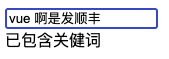

# JavaScript学习笔记


## 基本知识

JavaScript（JS）是一种具有函数优先特性的轻量级、解释型或者说即时编译型的编程语言。虽然作为 Web 页面中的脚本语言被人所熟知，但是它也被用到了很多非浏览器环境中，例如 Node.js、Apache CouchDB、Adobe Acrobat 等。进一步说，JavaScript 是一种基于原型、多范式、单线程的动态 (en-US)语言，并且支持面向对象、命令式和声明式（如函数式编程）风格。

>   该笔记从2022年12月28日开始持续更新

### 资源

[Javascript详细中文手册](https://developer.mozilla.org/zh-CN/docs/Web/JavaScript)

[JavaScript开发者应懂的33个概念](/program/javascript/JavaScript开发者应懂的33个概念.html)


### 开发工具

#### vscode

vscode是微软开发的一个ide代码编辑器。拥有极为强大且丰富的扩展库。

访问vscode[官网](https://code.visualstudio.com/)，下载安装。

安装完成后运行vscode。

##### 安装扩展

依次安装以下扩展

*   **live Server**，实时浏览器渲染


### HelloWorld

在html文件中，使用 `<script>` 标签元素编写javascript代码。

#### 内部 JavaScript

```html
<!DOCTYPE html>
<html lang="en">
<head>
    <meta charset="UTF-8">
    <meta http-equiv="X-UA-Compatible" content="IE=edge">
    <meta name="viewport" content="width=device-width, initial-scale=1.0">
    <title>Hello World</title>
</head>
<body>
    <div id="app"></div>
</body>
    <script>
        document.getElementById('app').innerHTML = 'Hello World';
    </script>
</html>
```

#### 外部 JavaScript

html文件

```html
<!DOCTYPE html>
<html lang="en">
<head>
    <meta charset="UTF-8">
    <meta http-equiv="X-UA-Compatible" content="IE=edge">
    <meta name="viewport" content="width=device-width, initial-scale=1.0">
    <title>Hello World</title>
</head>
<body>
    <div id="app"></div>
</body>
    <script src="2.js"></script>
</html>
```

js文件

```javascript
function load() {
    document.getElementById('app').innerHTML = 'Hello World';
}
load();
```

浏览器结果


#### 避免延迟

为了保证页面静态内容的正常加载，在没有特殊需求的情况下，应该将js代码或外部js引入写在 `<body>` 最末尾。


### 注释与执行符

| 符号       | 用途     |
| :----------- | ------------ |
| **//**       | 单行注释     |
| **/\*  \*/** | 多行注释     |
| **;**        | 语句结束符号 |

示例代码：

```js
//声明变量a，分号结束当前语句
let a = "fromidea";
/*
多行注释，
控制台输出变量a
*/
console.log(a);
```

控制台输出：


### 变量声明

#### var

**`var` 语句** 用于声明一个函数范围或全局范围的变量，并可将其初始化为一个值（可选）。

同时，JavaScript 是一种“**动态类型语言**”，这意味着无需指定变量将包含什么数据类型。

示例代码：

``` js
var a = 1;
console.log(typeof a);
//输出：number
var a = 'fromidea';
console.log(typeof a);
//输出：string
var a = {};
console.log(typeof a);
//输出：object
```

##### 变量提升

无论在何处使用 `var` 语句来声明变量，都会在执行任何代码之前进行预处理。这被称为变量提升。

>   因此，建议始终在作用域顶部声明变量（全局代码的顶部和函数代码的顶部），这可以清楚知道哪些变量是函数作用域（局部），哪些变量在作用域链上解决。

示例代码：

``` js
console.log(a);
console.log(b);
var a = 'fromidea';
```

控制台输出：


观察控制台输出结果，可以发现：

*   虽然变量 `a` 写在 `console` 之后，但程序并未报错，输出结果为undefined，表示该变量存在，但并没有值。

*   当输出变量`b`时，程序是报错的。因为代码中并未声明该变量。


##### 数据类型

| 类型                                                         | 结果                                                         |
| :----------------------------------------------------------- | :----------------------------------------------------------- |
| [Undefined](https://developer.mozilla.org/zh-CN/docs/Glossary/undefined) | `"undefined"`                                                |
| [Null](https://developer.mozilla.org/zh-CN/docs/Glossary/Null) | `"object"`（[原因](https://developer.mozilla.org/zh-CN/docs/Web/JavaScript/Reference/Operators/typeof#typeof_null)） |
| [Boolean](https://developer.mozilla.org/zh-CN/docs/Glossary/Boolean) | `"boolean"`                                                  |
| [Number](https://developer.mozilla.org/zh-CN/docs/Glossary/Number) | `"number"`                                                   |
| [BigInt](https://developer.mozilla.org/zh-CN/docs/Glossary/BigInt) | `"bigint"`                                                   |
| [String](https://developer.mozilla.org/zh-CN/docs/Glossary/String) | `"string"`                                                   |
| [Symbol](https://developer.mozilla.org/zh-CN/docs/Web/JavaScript/Reference/Global_Objects/Symbol) | `"symbol"`                                                   |
| [Function](https://developer.mozilla.org/zh-CN/docs/Glossary/Function)（在 ECMA-262 中实现 [[Call]]；[classes](https://developer.mozilla.org/zh-CN/docs/Web/JavaScript/Reference/Statements/class)也是函数) | `"function"`                                                 |
| 其他任何对象                                                 | `"object"`                                                   |

##### typeof

使用 `typeof` 运算符可以获得当前变量的数据类型。

```javascript
var myInt = 5;
var myFloat = 6.667;

typeof myInt;   //number
typeof myFloat; //number
```

 

#### let

**`let`** 允许声明一个“**块**”作用域中的变量、语句或者表达式。与 `var` 关键字不同的是，`var` 声明的变量作用域是全局或者整个函数块的。 

示例代码：

```js
console.log(a);
let a = 'fromidea';
```

控制台输出：

<p class="demo">Uncaught ReferenceError: Cannot access 'a' before initialization at 6.html:11:21</p>

这段代码体现出了`var` 和 `let` 的另一个重要区别，`let` 声明的变量不会在作用域中被提升，它是在编译时才初始化（暂时性死区）。

>   就像  `const`  一样，`let` 不会在全局声明时（在最顶层的作用域）创建 `window` 对象的属性。


##### 暂时性死区

从一个代码块的开始直到代码执行到声明变量的行之前，`let` 或 `const` 声明的变量都处于“暂时性死区”（Temporal dead zone，TDZ）中。

当变量处于暂时性死区之中时，其尚未被初始化，尝试访问变量将抛出 ReferenceError。当代码执行到声明变量所在的行时，变量被初始化为一个值。如果声明中未指定初始值，则变量将被初始化为 undefined。


##### 块作用域

简单来说，即变量作用仅在 `{}` 内有效。

示例代码：

```js
var i = 999;
for(let i = 0;i < 3;i++){
  console.log(i);
}
console.log(i);
```

控制台输出：

<div class="demo">
		0<br>
		1<br>
		2<br>
		999
</div>


##### 全局污染

在函数内部使用的变量，一定要单独声明。除非该变量是全局的。

当函数内部变量没有进行 `var` 或 `let` 进行声明时。那么，这个变量会影响到函数外部的同名变量。

示例代码：

```javascript
function show(){
  web = '创意';
}
web = 'fromidea';
show();
console.log(web);
```

控制台输出：

<div class="demo">
  创意
</div>

观察输出结果，“创意”替代了值“fromidea”。


### 常量

#### const

常量是**块级范围**的，非常类似用 `let` 语句定义的变量。但常量的值是无法（通过重新赋值）改变的，也不能被重新声明。

**常量声明通常情况下全部用大写字母。**

示例代码：	

```js
const URL = 'fromidea.com';
if(URL){
  const URL = 'www.fromidea.com';
  console.log(URL);
}
console.log(URL);
```

控制台输出：

<div class="demo">
  www.fromidea.com<br>
  fromidea.com
</div>

观察可以发现，在不同的作用域，可以重复声明 `URL` 常量，不同作用域的常量并不相互影响。

在同一作用域重新声明或对其赋值，都是错误的。


##### const声明为对象类型时

当使用 `const` 声明对象时，对象的元素值是可以改变的。

示例代码：

```js
<script>
    const HOST = {
        url : 'http://www.fromidea.com',
        port : 80
    }
    HOST.port = 443;
    console.log(HOST);
</script>
```

控制台输出：

<div class="demo">
  {url: 'http://www.fromidea.com', port: 443}
</div>

那么，如果我们不想让常量对象的值被修改，可以使用 `Object.freeze()` 方法来实现。

示例代码：

```js
<script>
    "use strict";
    const HOST = {
        url : 'http://www.fromidea.com',
        port : 80
    }
    Object.freeze(HOST);
    HOST.port = 443;
    console.log(HOST);
</script>
```

控制台输出：

<div class="demo">
  Uncaught TypeError: Cannot assign to read only property 'port' of object...
</div>


##### 延伸：use strict（严格模式）

若要避免因函数内部变量未声明而导致全局污染的情况，也可以采用“严格模式”策略。

开启严格模式，需要在所有语句之前放一个特定语句 `"use strict";` 

1.   严格模式通过抛出错误来消除了一些原有静默错误。

2.   严格模式修复了一些导致 JavaScript 引擎难以执行优化的缺陷：有时候，相同的代码，严格模式可以比非严格模式下运行得更快。

3.   严格模式禁用了在 ECMAScript 的未来版本中可能会定义的一些语法。


### window全局变量

`window` 作为全局变量，代表了脚本正在运行的窗口，暴露给 Javascript 代码。

在有标签页功能的浏览器中，每个标签都拥有自己的 `window` 对象；也就是说，同一个窗口的标签页之间不会共享一个 `window` 对象。

示例代码：

```js
<script>
    console.log(window.screenLeft);
</script>
```

此时，移动浏览器窗口，并刷新页面，观察控制台，可以看到数值在变化。

`screenLeft` 是 `window` 的一个属性，用于获得当前窗口相对于桌面的位置（左边距离）。

如果用 `var` 重新声明 `screenLeft` 这个变量，则会影响 `window.screenLeft` 的结果。

示例代码：

```js
<script>
    var screenLeft = 100;
    console.log(window.screenLeft);
</script>
```

此时，无论如何移动窗口并刷新页面，控制台输出：

<div class="demo">
  100
</div>

那么，也就是 `window.screenLeft` 已经被污染。

这时，如果我们使用 `let` 声明，则不会对 `window.screenLeft` 造成影响。

```javascript
<script>
    let screenLeft = 100;
    console.log(window.screenLeft);
    console.log(screenLeft);
</script>
```

控制台输出：

<div class="demo">
  1<br>
  100<br>
</div>

`screenLeft` 和 `window.screenLeft` 互不影响。


#### window对象的属性

| 属性/手册链接                                                | 说明                                                         |
| ------------------------------------------------------------ | ------------------------------------------------------------ |
| [`Window.closed`](https://developer.mozilla.org/zh-CN/docs/Web/API/Window/closed) | 这个属性指示当前窗口是否关闭。                               |
| [`Window.console`](https://developer.mozilla.org/zh-CN/docs/Web/API/Window/console) | 返回 console 对象的引用，该对象提供了对浏览器调试控制台的访问。 |
| [`Window.content`](https://developer.mozilla.org/zh-CN/docs/Web/API/Window/content) | 返回当前 window 的 content 元素的引用。通过带下划线的过时变种方法不再可以获得 Web content。 |
| [`Window.customElements`](https://developer.mozilla.org/zh-CN/docs/Web/API/Window/customElements) | 返回对CustomElementRegistry对象的引用，该对象可用于注册新的自定义元素并获取有关以前注册的自定义元素的信息。 |
| [`Window.crypto`](https://developer.mozilla.org/zh-CN/docs/Web/API/crypto_property) | 返回浏览器 crypto 对象。                                     |
| [`Window.defaultStatus`](https://developer.mozilla.org/zh-CN/docs/Web/API/Window/defaultStatus) | 获取或设置指定窗口的状态栏文本。                             |
| [`Window.document`](https://developer.mozilla.org/zh-CN/docs/Web/API/Window/document) | 返回对当前窗口所包含文档的引用。                             |
| [`Window.devicePixelRatio`](https://developer.mozilla.org/zh-CN/docs/Web/API/Window/devicePixelRatio) | 返回当前显示器的物理像素和设备独立像素的比例。               |
| [`Window.event`](https://developer.mozilla.org/zh-CN/docs/Web/API/Window/event) | 返回当前事件，即当前由JavaScript代码上下文处理的事件，如果当前未处理任何事件，则返回未定义的事件。应尽可能使用直接传递给事件处理程序的Event对象。 |
| [`Window.frameElement`](https://developer.mozilla.org/zh-CN/docs/Web/API/Window/frameElement) | 返回嵌入窗口的元素，如果未嵌入窗口，则返回 null。            |
| [`Window.frames`](https://developer.mozilla.org/zh-CN/docs/Web/API/Window/frames) | 返回当前窗口中所有子窗体的数组。                             |
| [`Window.fullScreen`](https://developer.mozilla.org/zh-CN/docs/Web/API/Window/fullScreen) | 此属性表示窗口是否以全屏显示。                               |
| [`Window.history`](https://developer.mozilla.org/zh-CN/docs/Web/API/Window/history) | 返回一个对 history 对象的引用。                              |
| [`Window.innerHeight`](https://developer.mozilla.org/zh-CN/docs/Web/API/Window/innerHeight) | 获得浏览器窗口的内容区域的高度，包含水平滚动条 (如果有的话)。 |
| [`Window.innerWidth`](https://developer.mozilla.org/zh-CN/docs/Web/API/Window/innerWidth) | 获得浏览器窗口的内容区域的宽度，包含垂直滚动条 (如果有的话)。 |
| [`Window.length`](https://developer.mozilla.org/zh-CN/docs/Web/API/Window/length) | 返回窗口中的 frames 数量。参见 [`window.frames`](https://developer.mozilla.org/zh-CN/docs/Web/API/Window/frames)。 |
| [`Window.location`](https://developer.mozilla.org/zh-CN/docs/Web/API/Window/location) | 获取、设置 window 对象的 location，或者当前的 URL.           |
| [`Window.locationbar`](https://developer.mozilla.org/zh-CN/docs/Web/API/Window/locationbar) | 返回 locationbar 对象，其可视性可以在窗口中切换。            |
| [`Window.localStorage`](https://developer.mozilla.org/zh-CN/docs/Web/API/Window/localStorage) | 返回用来存储只能在创建它的源下访问的数据的本地存储对象的引用 |
| [`Window.menubar`](https://developer.mozilla.org/zh-CN/docs/Web/API/Window/menubar) | 返回菜单条对象，它的可视性可以在窗口中切换                   |
| [`Window.mozAnimationStartTime`](https://developer.mozilla.org/zh-CN/docs/Web/API/Animation/startTime) | 返回当前动画循环开始经过的毫秒数                             |
| [`Window.mozInnerScreenX`](https://developer.mozilla.org/zh-CN/docs/Web/API/Window/mozInnerScreenX) | 返回窗口视口左上角的水平（X）坐标，以屏幕坐标表示。此值以CSS像素报告。如果需要，请参阅nsIDOMWindowUtils中的mozScreenPixelsPerCSSPixel，了解适应屏幕像素的转换因子。 |
| [`Window.mozInnerScreenY`](https://developer.mozilla.org/zh-CN/docs/Web/API/Window/mozInnerScreenY) | 返回窗口视口左上角的垂直（Y）坐标，以屏幕坐标表示。此值以CSS像素报告。如果需要，请参阅mozScreenPixelsPerCSSPixel以获取适应屏幕像素的转换因子。 |
| [`Window.mozPaintCount`](https://developer.mozilla.org/zh-CN/docs/Web/API/Window) | 返回当前文档在此窗口中呈现到屏幕的次数。这可用于计算渲染性能。 |
| [`Window.name`](https://developer.mozilla.org/zh-CN/docs/Web/API/Window/name) | 获取/设置窗口的名称。                                        |
| [`Window.navigator`](https://developer.mozilla.org/zh-CN/docs/Web/API/Window/navigator) | 返回对 navigator 对象的引用。                                |
| [`Window.opener`](https://developer.mozilla.org/zh-CN/docs/Web/API/Window/opener) | 返回对打开当前窗口的那个窗口的引用。                         |
| [`Window.orientation`](https://developer.mozilla.org/en-US/docs/Web/API/Window/orientation) | 返回视口相对于设备自然方向的角度方向（以90度为增量）。       |
| [`Window.outerHeight`](https://developer.mozilla.org/zh-CN/docs/Web/API/Window/outerHeight) | 返回浏览器窗口的外部高度。                                   |
| [`Window.outerWidth`](https://developer.mozilla.org/zh-CN/docs/Web/API/Window/outerWidth) | 返回浏览器窗口的外部宽度。                                   |
| [`Window.pageXOffset`](https://developer.mozilla.org/zh-CN/docs/Web/API/Window/scrollX) | [`window.scrollX`](https://developer.mozilla.org/zh-CN/docs/Web/API/Window/scrollX)的别名。 |
| [`Window.pageYOffset`](https://developer.mozilla.org/zh-CN/docs/Web/API/Window/scrollY) | [`window.scrollY`](https://developer.mozilla.org/zh-CN/docs/Web/API/Window/scrollY)的别名。 |
| [`Window.parent`](https://developer.mozilla.org/zh-CN/docs/Web/API/Window/parent) | 返回当前窗口或子窗口的父窗口的引用。                         |
| [`Window.performance`](https://developer.mozilla.org/zh-CN/docs/Web/API/performance_property) | 返回Performance对象，该对象包括计时和导航属性，每个属性都是提供性能相关（en-US）数据的对象。有关更多信息和示例，请参见使用导航计时。 |
| [`Window.personalbar`](https://developer.mozilla.org/zh-CN/docs/Web/API/Window/personalbar) | 返回 personalbar 对象，它的可视性可以在窗口中切换。          |
| [`Window.screen`](https://developer.mozilla.org/zh-CN/docs/Web/API/Window/screen) | 返回对与窗口关联的屏幕对象的引用。                           |
| [`Window.screenX`](https://developer.mozilla.org/zh-CN/docs/Web/API/Window/screenX) & [`Window.screenLeft`](https://developer.mozilla.org/zh-CN/docs/Web/API/Window/screenLeft) | 这两个属性都会返回从用户浏览器视口左边框到屏幕左侧的水平距离。 |
| [`Window.screenY`](https://developer.mozilla.org/zh-CN/docs/Web/API/Window/screenY) & [`Window.screenTop`](https://developer.mozilla.org/zh-CN/docs/Web/API/Window/screenTop) | 这两个属性都会返回从用户浏览器视口的上边框到屏幕顶部的垂直距离。 |
| [`Window.scrollbars`](https://developer.mozilla.org/zh-CN/docs/Web/API/Window/scrollbars) | 返回滚动条对象，其可见性可以在窗口中切换。                   |
| [`Window.scrollMaxX`](https://developer.mozilla.org/zh-CN/docs/Web/API/Window/scrollMaxX) | 窗口可以水平滚动到的最大偏移量，即文档宽度减去视口宽度。     |
| [`Window.scrollMaxY`](https://developer.mozilla.org/zh-CN/docs/Web/API/Window/scrollMaxY) | 窗口可以垂直滚动到的最大偏移量（即文档高度减去视口高度）。   |
| [`Window.scrollX`](https://developer.mozilla.org/zh-CN/docs/Web/API/Window/scrollX) | 返回文档已水平滚动的像素数。                                 |
| [`Window.scrollY`](https://developer.mozilla.org/zh-CN/docs/Web/API/Window/scrollY) | 返回文档已垂直滚动的像素数。                                 |
| [`Window.self`](https://developer.mozilla.org/zh-CN/docs/Web/API/Window/self) | 返回对窗口对象本身的对象引用。                               |
| [`Window.sessionStorage`](https://developer.mozilla.org/zh-CN/docs/Web/API/Window/sessionStorage) | 返回对会话存储对象的引用，该对象用于存储只能由创建它的源访问的数据。 |
| [`Window.sidebar`](https://developer.mozilla.org/zh-CN/docs/Web/API/Window/sidebar) | 返回对侧边栏的窗口对象的引用。                               |
| [`Window.speechSynthesis`](https://developer.mozilla.org/en-US/docs/Web/API/Window/speechSynthesis) | 返回SpeechSynthesis对象，该对象是使用Web SpeechAPI语音合成功能的入口点。 |
| [`Window.status`](https://developer.mozilla.org/en-US/docs/Web/API/Window/status) | 获取/设置浏览器底部状态栏中的文本。                          |
| [`Window.statusbar`](https://developer.mozilla.org/en-US/docs/Web/API/Window/statusbar) | 返回statusbar对象，其可见性可以在窗口中切换。                |
| [`Window.toolbar`](https://developer.mozilla.org/en-US/docs/Web/API/Window/toolbar) | 返回工具栏对象，其可见性可以在窗口中切换。                   |
| [`Window.top`](https://developer.mozilla.org/zh-CN/docs/Web/API/Window/top) | 返回对窗口层次结构中最顶层窗口的引用。此属性是只读的。       |
| [`Window.visualViewport`](https://developer.mozilla.org/zh-CN/docs/Web/API/Window/visualViewport) | 返回表示给定窗口的视觉视口的VisualViewport对象。             |
| [`Window.window`](https://developer.mozilla.org/zh-CN/docs/Web/API/Window/window) | 返回对当前窗口的引用。                                       |


#### window对象的方法

| 方法/手册链接                                                | 说明                                                         |
| ------------------------------------------------------------ | ------------------------------------------------------------ |
| [`Window.alert()`](https://developer.mozilla.org/zh-CN/docs/Web/API/Window/alert) | 显示警报对话框。                                             |
| [`Window.back()`](https://developer.mozilla.org/zh-CN/docs/Web/API/Window/back) | 在窗口历史记录中向后移动一个。该方法已过时；您应该改用window.history.back（）。 |
| [`Window.blur()`](https://developer.mozilla.org/zh-CN/docs/Web/API/Window/blur) | 将焦点设置为远离窗口。                                       |
| [`Window.cancelAnimationFrame()`](https://developer.mozilla.org/zh-CN/docs/Web/API/Window/cancelAnimationFrame) | 允许您取消以前使用Window.requestAnimationFrame计划的回调。   |
| [`Window.cancelIdleCallback()`](https://developer.mozilla.org/zh-CN/docs/Web/API/Window/cancelIdleCallback) | 允许您取消以前使用Window.requestIdleCallback计划的回调。     |
| [`Window.captureEvents()`](https://developer.mozilla.org/en-US/docs/Web/API/Window/captureEvents) | 注册窗口以捕获指定类型的所有事件。                           |
| [`Window.clearImmediate()`](https://developer.mozilla.org/zh-CN/docs/Web/API/Window/clearImmediate) | 使用setImmediate取消重复执行集。                             |
| [`Window.clearImmediate()`](https://developer.mozilla.org/zh-CN/docs/Web/API/Window/clearImmediate) | 使用setImmediate取消重复执行集。                             |
| [`Window.close()`](https://developer.mozilla.org/zh-CN/docs/Web/API/Window/close) | 关闭当前窗口。                                               |
| [`Window.confirm()`](https://developer.mozilla.org/zh-CN/docs/Web/API/Window/confirm) | 显示一个对话框，其中包含用户需要响应的消息。                 |
| [`Window.dump()`](https://developer.mozilla.org/zh-CN/docs/Web/API/Window/dump) | 将消息写入控制台。                                           |
| [`Window.find()`](https://developer.mozilla.org/zh-CN/docs/Web/API/Window/find) | 在窗口中搜索给定字符串。                                     |
| [`Window.focus()`](https://developer.mozilla.org/zh-CN/docs/Web/API/Window/focus) | 设置当前窗口的焦点。                                         |
| [`Window.getComputedStyle()`](https://developer.mozilla.org/zh-CN/docs/Web/API/Window/getComputedStyle) | 获取指定元素的计算样式。计算样式指示元素的所有CSS属性的计算值。 |
| [`Window.getDefaultComputedStyle()`](https://developer.mozilla.org/zh-CN/docs/Web/API/Window/getDefaultComputedStyle) | 获取指定元素的默认计算样式，忽略作者样式表。                 |
| [`Window.getSelection()`](https://developer.mozilla.org/zh-CN/docs/Web/API/Window/getSelection) | 返回表示所选项目的选择对象。                                 |
| [`Window.matchMedia()`](https://developer.mozilla.org/zh-CN/docs/Web/API/Window/matchMedia) | 返回表示指定媒体查询字符串的MediaQueryList对象。             |
| [`Window.minimize()`](https://developer.mozilla.org/zh-CN/docs/Web/API/Window) | 最小化窗口。                                                 |
| [`Window.moveBy()`](https://developer.mozilla.org/zh-CN/docs/Web/API/Window/moveBy) | 将当前窗口移动指定的量。                                     |
| [`Window.moveTo()`](https://developer.mozilla.org/zh-CN/docs/Web/API/Window/moveTo) | 将窗口移动到指定的坐标。                                     |
| [`Window.open()`](https://developer.mozilla.org/zh-CN/docs/Web/API/Window/open) | 打开一个新窗口。                                             |
| [`Window.postMessage()`](https://developer.mozilla.org/zh-CN/docs/Web/API/Window/postMessage) | 为一个窗口向另一个窗口发送数据字符串提供了一种安全方法，该窗口不必与第一个窗口处于相同的域中。 |
| [`Window.print()`](https://developer.mozilla.org/zh-CN/docs/Web/API/Window/print) | 打开打印对话框以打印当前文档。                               |
| [`Window.prompt()`](https://developer.mozilla.org/zh-CN/docs/Web/API/Window/prompt) | 返回用户在提示对话框中输入的文本。                           |
| [`Window.requestAnimationFrame()`](https://developer.mozilla.org/zh-CN/docs/Web/API/Window/requestAnimationFrame) | 告诉浏览器一个动画正在进行中，请求浏览器为下一个动画帧重新绘制窗口。 |
| [`Window.requestIdleCallback()`](https://developer.mozilla.org/zh-CN/docs/Web/API/Window/requestIdleCallback) | 启用在浏览器空闲期间对任务进行调度。                         |
| [`Window.resizeBy()`](https://developer.mozilla.org/zh-CN/docs/Web/API/Window/resizeBy) | 将当前窗口调整到一定的大小。                                 |
| [`Window.resizeTo()`](https://developer.mozilla.org/zh-CN/docs/Web/API/Window/resizeTo) | 动态调整窗口。                                               |
| [`Window.scroll()`](https://developer.mozilla.org/zh-CN/docs/Web/API/Window/scroll) | 滚动窗口到文档中的特定位置。                                 |
| [`Window.scrollBy()`](https://developer.mozilla.org/zh-CN/docs/Web/API/Window/scrollBy) | 按给定的数量在窗口中滚动文档。                               |
| [`Window.scrollByLines()`](https://developer.mozilla.org/zh-CN/docs/Web/API/Window/scrollByLines) | 按给定行数滚动文档。                                         |
| [`Window.scrollByPages()`](https://developer.mozilla.org/zh-CN/docs/Web/API/Window/scrollByPages) | 按指定页数滚动当前文档。                                     |
| [`Window.scrollTo()`](https://developer.mozilla.org/zh-CN/docs/Web/API/Window/scrollTo) | 滚动到文档中的特定坐标集。                                   |
| [`Window.setImmediate()`](https://developer.mozilla.org/zh-CN/docs/Web/API/Window/setImmediate) | 在浏览器完成其他繁重任务后执行一个函数。                     |
| `Window.setResizable()`                                      | 切换用户调整窗口大小的能力。                                 |
| [`Window.sizeToContent()`](https://developer.mozilla.org/zh-CN/docs/Web/API/Window/sizeToContent) | 根据内容设置窗口大小。                                       |
| [`Window.stop()`](https://developer.mozilla.org/zh-CN/docs/Web/API/Window/stop) | 这个方法停止窗口加载。                                       |
| [`Window.updateCommands()`](https://developer.mozilla.org/zh-CN/docs/Web/API/Window/updateCommands) | 更新当前 chrome 窗口 (UI) 命令的状态。                       |


### 传值

可以理解为，一个变量复制另一个变量的值。

示例代码：

```js
<script>
    let a = 1;
		//b复制a
    let b = a;
    console.log(a,b);
    b = 3;
    console.log(a,b);
</script>
```

控制台输出：


可以发现，b复制了a的值，第一次打印时，b和a的值是一致的。当对b重新赋值后，b的值会更新，a不会发生变化。


### 传址

可以理解为，一个变量是另一个变量的分身。当分身的值变动时，主体也随之变动。

示例代码：

```js
<script>
    let a = {name : 'fromidea'};
    let b = a;
    console.log(a,b);
    b.name = 'fromidea.com';
    console.log(a,b);
</script>
```

控制台输出：


### null

`null` 是表示缺少的标识，指示变量未指向任何对象。

把 `null` 作为尚未创建的对象，也许更好理解。

`null` 用于在声明变量时，虽创建了它，但没有赋予类型或值。

示例代码：

```js
<script>
    // foo 不存在，它从来没有被定义过或者是初始化过：
    console.log(foo);
		// foo 现在已经是知存在的，但是它没有类型或者是值：
    let foo = null;
    console.log(foo);
</scirpt>
```

控制台输出：


当我们把第一次 `console` 注释掉。再次刷新：


### undefined

`undefined` 则表示**没有被赋值**。

示例代码：

```js
<script>
    function test(a){
        if(a === undefined){
            a = 'fromidea';
            console.log(a);
        }else{
            console.log(a);
        }
    }
    test(null);
    test();
    test(1);
</script>
```

控制台输出：


当检测 null 或 undefined 时，注意相等（==）与全等（===）两个操作符的区别，前者会执行类型转换：

```js
typeof null        // "object" (因为一些以前的原因而不是'null')
typeof undefined   // "undefined"
null === undefined // false
null  == undefined // true
null === null // true
null == null // true
!null //true
isNaN(1 + null) // false
isNaN(1 + undefined) // true
```


## 运算符与流程控制

### 赋值运算符

赋值元素符会将右边的操作数的值分配给左边的操作数，并将其值修改为右边操作数相等的值。

| 运算符                                                       | 说明                                                         |
| ------------------------------------------------------------ | ------------------------------------------------------------ |
| [`=`](https://developer.mozilla.org/zh-CN/docs/Web/JavaScript/Reference/Operators/Assignment) | 赋值运算符。                                                 |
| [`*=`](https://developer.mozilla.org/zh-CN/docs/Web/JavaScript/Reference/Operators/Multiplication_assignment) | 赋值乘积。                                                   |
| [`**=`](https://developer.mozilla.org/zh-CN/docs/Web/JavaScript/Reference/Operators/Exponentiation_assignment) | 求幂赋值。                                                   |
| [`/=`](https://developer.mozilla.org/zh-CN/docs/Web/JavaScript/Reference/Operators/Division_assignment) | 赋值商。                                                     |
| [`%=`](https://developer.mozilla.org/zh-CN/docs/Web/JavaScript/Reference/Operators/Remainder_assignment) | 赋值求余。                                                   |
| [`+=`](https://developer.mozilla.org/zh-CN/docs/Web/JavaScript/Reference/Operators/Addition_assignment) | 赋值求和。                                                   |
| [`-=`](https://developer.mozilla.org/zh-CN/docs/Web/JavaScript/Reference/Operators/Subtraction_assignment) | 赋值求差。                                                   |
| [`<<=`](https://developer.mozilla.org/zh-CN/docs/Web/JavaScript/Reference/Operators/Left_shift_assignment) | 左位移。                                                     |
| [`>>=`](https://developer.mozilla.org/zh-CN/docs/Web/JavaScript/Reference/Operators/Right_shift_assignment) | 右位移。                                                     |
| [`>>>=`](https://developer.mozilla.org/zh-CN/docs/Web/JavaScript/Reference/Operators/Unsigned_right_shift_assignment) | 无符号右位移。                                               |
| [`&=`](https://developer.mozilla.org/zh-CN/docs/Web/JavaScript/Reference/Operators/Bitwise_AND_assignment) | 赋值与。                                                     |
| [`^=`](https://developer.mozilla.org/zh-CN/docs/Web/JavaScript/Reference/Operators/Bitwise_XOR_assignment) | 赋值按位异或。                                               |
| [`\|=`](https://developer.mozilla.org/zh-CN/docs/Web/JavaScript/Reference/Operators/Bitwise_OR_assignment) | 赋值或。                                                     |
| [`&&=`](https://developer.mozilla.org/zh-CN/docs/Web/JavaScript/Reference/Operators/Logical_AND_assignment) | 逻辑和赋值运算符。                                           |
| [`\|\|=`](https://developer.mozilla.org/zh-CN/docs/Web/JavaScript/Reference/Operators/Logical_OR_assignment) | 逻辑或赋值运算符。                                           |
| [`??=`](https://developer.mozilla.org/zh-CN/docs/Web/JavaScript/Reference/Operators/Nullish_coalescing_assignment) | 逻辑空赋值运算符。                                           |
| [`[a, b] = arr`, `{ a, b } = obj`](https://developer.mozilla.org/zh-CN/docs/Web/JavaScript/Reference/Operators/Destructuring_assignment) | 解构赋值允许您使用类似于数组或对象字面量的语法将数组或对象的属性赋值给变量。 |


### 算术运算符

算术运算符以二个数值（字面量或变量）作为操作数，并返回单个数值。

| 运算符                                                       | 说明         |
| ------------------------------------------------------------ | ------------ |
| [`+`](https://developer.mozilla.org/zh-CN/docs/Web/JavaScript/Reference/Operators/Addition) | 加法运算符。 |
| [`-`](https://developer.mozilla.org/zh-CN/docs/Web/JavaScript/Reference/Operators/Subtraction) | 减法运算符。 |
| [`/`](https://developer.mozilla.org/zh-CN/docs/Web/JavaScript/Reference/Operators/Division) | 除法运算符。 |
| [`*`](https://developer.mozilla.org/zh-CN/docs/Web/JavaScript/Reference/Operators/Multiplication) | 乘法运算符。 |
| [`%`](https://developer.mozilla.org/zh-CN/docs/Web/JavaScript/Reference/Operators/Remainder) | 取余运算符。 |
| [`**`](https://developer.mozilla.org/zh-CN/docs/Web/JavaScript/Reference/Operators/Exponentiation) | 求幂运算符。 |


### 自增和自减

前置/后置自增运算符和前置/后置自减运算符。

| 运算符                                                       | 说明             |
| ------------------------------------------------------------ | ---------------- |
| [`A++`](https://developer.mozilla.org/zh-CN/docs/Web/JavaScript/Reference/Operators/Increment) | 后置自增运算符。 |
| [`A--`](https://developer.mozilla.org/zh-CN/docs/Web/JavaScript/Reference/Operators/Decrement) | 后置自减运算符。 |
| [`++A`](https://developer.mozilla.org/zh-CN/docs/Web/JavaScript/Reference/Operators/Increment) | 前置自增运算符。 |
| [`--A`](https://developer.mozilla.org/zh-CN/docs/Web/JavaScript/Reference/Operators/Decrement) | 前置自减运算符。 |

示例代码：

```js
<script>
    let a = 1;
    a = a + 1;
    console.log(a); //2
    ++a;
    console.log(a); //3
    a++;
    console.log(a); //4

    let b = 5;
    let c = 1;
    let d = b + ++c;
    console.log(d); //7

    b = 5;
    c = 1;
    d = b + c++;
    console.log(d); //6
</script>
```


### 一元运算符

一元运算符只有一个操作数。

| 运算符                                                       | 说明                                         |
| ------------------------------------------------------------ | -------------------------------------------- |
| [`+`](https://developer.mozilla.org/zh-CN/docs/Web/JavaScript/Reference/Operators/Unary_plus) | 一元加运算符将操作转换为 Number 类型。       |
| [`-`](https://developer.mozilla.org/zh-CN/docs/Web/JavaScript/Reference/Operators/Unary_negation) | 一元减运算符将操作转换为 Number 类型并取反。 |
| [`~`](https://developer.mozilla.org/zh-CN/docs/Web/JavaScript/Reference/Operators/Bitwise_NOT) | 按位非运算符。                               |
| [`!`](https://developer.mozilla.org/zh-CN/docs/Web/JavaScript/Reference/Operators/Logical_NOT) | 逻辑非运算符。                               |
| [`delete`](https://developer.mozilla.org/zh-CN/docs/Web/JavaScript/Reference/Operators/delete) | `delete` 运算符用来删除对象的属性。          |
| [`void`](https://developer.mozilla.org/zh-CN/docs/Web/JavaScript/Reference/Operators/void) | `void` 运算符表示表达式放弃返回值。          |
| [`typeof`](https://developer.mozilla.org/zh-CN/docs/Web/JavaScript/Reference/Operators/typeof) | `typeof` 运算符用来判断给定对象的类型。      |

示例代码：

```js
<script>
    let a = '1';
    a=+a
    console.log(a); //1
    console.log(typeof a); //number

    a = 1;
    console.log(-a); //-1

    a = 1;
    console.log(~a); //-2

    a = undefined;
    console.log(!a);//true

    a = {name : 'fromidea'};
    delete a.name;
    console.log(a); // {}

    a = 1;
    console.log(void a); //undefined
</script>
```


### 比较运算符

比较运算符比较两个操作数并返回基于比较结果的布尔值。	

| 运算符                                                       | 说明             |
| ------------------------------------------------------------ | ---------------- |
| [`<`](https://developer.mozilla.org/zh-CN/docs/Web/JavaScript/Reference/Operators/Less_than) | 小于运算符。     |
| [`>`](https://developer.mozilla.org/zh-CN/docs/Web/JavaScript/Reference/Operators/Greater_than) | 大于运算符。     |
| [`<=`](https://developer.mozilla.org/zh-CN/docs/Web/JavaScript/Reference/Operators/Less_than_or_equal) | 小于等于运算符。 |
| [`>=`](https://developer.mozilla.org/zh-CN/docs/Web/JavaScript/Reference/Operators/Greater_than_or_equal) | 大于等于运算符。 |
| [`==`](https://developer.mozilla.org/zh-CN/docs/Web/JavaScript/Reference/Operators/Equality) | 相等运算符。     |
| [`!=`](https://developer.mozilla.org/zh-CN/docs/Web/JavaScript/Reference/Operators/Inequality) | 不等运算符。     |
| [`===`](https://developer.mozilla.org/zh-CN/docs/Web/JavaScript/Reference/Operators/Strict_equality) | 全等运算符。     |
| [`!==`](https://developer.mozilla.org/zh-CN/docs/Web/JavaScript/Reference/Operators/Strict_inequality) | 非全等运算符。   |

示例代码：

```js
<script>
    let a = 1;
    let b = 2;

    console.log(a < b); // true
    console.log(a > b); // false
    console.log(a <= b); // true
    console.log(a >= b); // false
    console.log(a == b); // false
    console.log(a != b); // true
    console.log(a === b); //false
    console.log(a !== b); //true
</script>
```


### 逻辑运算符

逻辑运算符典型的用法是用于布尔（逻辑）值运算，它们返回布尔值。

| 运算符                                                       | 说明                                                         |
| ------------------------------------------------------------ | ------------------------------------------------------------ |
| [`&&`](https://developer.mozilla.org/zh-CN/docs/Web/JavaScript/Reference/Operators/Logical_AND) | 逻辑与。                                                     |
| [`\|\|`](https://developer.mozilla.org/zh-CN/docs/Web/JavaScript/Reference/Operators/Logical_OR) | 逻辑或。                                                     |
| [`??`](https://developer.mozilla.org/zh-CN/docs/Web/JavaScript/Reference/Operators/Nullish_coalescing) | 空值合并运算符，如果 ?? 前面是 null 或 undefined，取后面的默认值。 |

示例代码：

```js
<script>
    let a = 1;
    let b = 2;
    let c = 3;

    if(a > b && b > c){
        console.log('yes');
    }else{
        console.log('err');
    }

    // err

    if(a > b || b < c){
        console.log('yes');
    }else{
        console.log('err');
    }

    // yes

    let d;
    d = d ?? 'fromidea.com';
    console.log(d);

    // fromidea.com

</script>
```


### if...else判断语句

当指定条件为真，if 语句会执行一段语句。如果条件为假，则执行另一段语句。

```js
<script>
    function validate(str){
        if(str.length >= 12){
            return '密码非常安全';
        }else if(str.length >= 6){
            return '密码比较安全';
        }else{
            return '密码不太安全';
        }
    }
    let valid = validate('123123');
    console.log(valid); //密码比较安全
</script>
```


### 三元表达式

一个条件后跟一个问号（?），如果条件为真值，则执行冒号（:）前的表达式；若条件为假值，则执行最后的表达式。该运算符经常当作 if...else 语句的简捷形式来使用。

```js
<script>
    let a = 0;
    let b = 1;

    let c = a ? a : b;
    console.log(c); // 1
</script>
```


### switch

将表达式的值与case子句匹配，并执行与该情况相关联的语句。

示例代码：

```js
<script>
    function age(num){

        let msg = '';

        switch(true){
            case num >= 60:
                msg = '老年';
                break;
            
            case num >= 40:
                msg = '中年';
                break;

            case num >= 20:
                msg = '青年';
                break;

            case num >= 10:
                msg = '少年';
                break;

            case num >= 0:
            default:
                msg = '婴幼儿';
            break;
        }

        return msg;
    }
    console.log(age()); //婴幼儿
</script>
```


### while

某个条件表达式为真的前提下，循环执行指定的一段代码，直到那个表达式不为真时结束循环。

示例代码：

```js
<script>
    function table(options = {tr:5,td:10}){
        document.write(`<table border='1' style="width:100%">`);
        while (options.tr -- != 0){
            document.write(`<tr>`);
            let td = options.td;
            while (td-- != 0){
                document.write(`<td>${options.tr}:${td}</td>`);
            }       
            document.write('</tr>');
        }
        document.write(`</table>`);
    }

    table({tr:10,td:10});
</script>
```

浏览器效果：

<table border="1" style="width:100%"><tbody><tr><td>9:9</td><td>9:8</td><td>9:7</td><td>9:6</td><td>9:5</td><td>9:4</td><td>9:3</td><td>9:2</td><td>9:1</td><td>9:0</td></tr><tr><td>8:9</td><td>8:8</td><td>8:7</td><td>8:6</td><td>8:5</td><td>8:4</td><td>8:3</td><td>8:2</td><td>8:1</td><td>8:0</td></tr><tr><td>7:9</td><td>7:8</td><td>7:7</td><td>7:6</td><td>7:5</td><td>7:4</td><td>7:3</td><td>7:2</td><td>7:1</td><td>7:0</td></tr><tr><td>6:9</td><td>6:8</td><td>6:7</td><td>6:6</td><td>6:5</td><td>6:4</td><td>6:3</td><td>6:2</td><td>6:1</td><td>6:0</td></tr><tr><td>5:9</td><td>5:8</td><td>5:7</td><td>5:6</td><td>5:5</td><td>5:4</td><td>5:3</td><td>5:2</td><td>5:1</td><td>5:0</td></tr><tr><td>4:9</td><td>4:8</td><td>4:7</td><td>4:6</td><td>4:5</td><td>4:4</td><td>4:3</td><td>4:2</td><td>4:1</td><td>4:0</td></tr><tr><td>3:9</td><td>3:8</td><td>3:7</td><td>3:6</td><td>3:5</td><td>3:4</td><td>3:3</td><td>3:2</td><td>3:1</td><td>3:0</td></tr><tr><td>2:9</td><td>2:8</td><td>2:7</td><td>2:6</td><td>2:5</td><td>2:4</td><td>2:3</td><td>2:2</td><td>2:1</td><td>2:0</td></tr><tr><td>1:9</td><td>1:8</td><td>1:7</td><td>1:6</td><td>1:5</td><td>1:4</td><td>1:3</td><td>1:2</td><td>1:1</td><td>1:0</td></tr><tr><td>0:9</td><td>0:8</td><td>0:7</td><td>0:6</td><td>0:5</td><td>0:4</td><td>0:3</td><td>0:2</td><td>0:1</td><td>0:0</td></tr></tbody></table>


### do...while

创建一个执行指定语句的循环，直到条件为 false。在执行do语句后检测条件，所以do会至少执行一次。

示例代码：

```js
<script>
    function star(row = 5){
        let start = 1;
        do{
            let n = 1;
            do{
                document.write('*');
            }while(++n <= start);
            document.write('<br>');
        }while(++start <= row);
    }
    star(10);
</script>
```

浏览器效果：


### for

用于创建一个循环，它包含了三个可选的表达式，这三个表达式被包围在圆括号之中，使用分号分隔，后跟一个用于在循环中执行的语句（通常是一个块语句）。

示例代码：

绘制一个“圣诞树”

```js
<script>
    let row = 10;
    let last = 0;
    for(let i = 1;i<=row;i++){
        for(let j = row - i;j > 0;j--){
            document.write('<i style="color:white">*</i>');
        }
        for(let n = 0;n < i * 2 - 1;n++){
            document.write('*');
            last = n;
        }
        document.write('<br>')
    }
    console.log(last);//最后一行*的数量
    for(let i = 1; i <= 3; i++){
        for(let j = last / 2 - 1; j > 0;j--){
            document.write('<i style="color:white">*</i>');
        }
        document.write('***');
        document.write('<br>');
    }
</script>
```

浏览器效果：


### continue

跳过本次循环，继续执行下次循环。

示例代码：

```js
<script>
    for(let i = 1; i <= 10; i++){
        if( i % 2 ) continue; 
        console.log(i);
    }
</script>
```

控制台输出：

<div class="demo">
  2<br>
  4<br>
  6<br>
  8<br>
  10<br>
</div>


### break

终止或跳出当前循环体。

#### 延伸：label标记

标记语句可以和 ```break``` 或 ```continue``` 语句一起使用。标记就是在一条语句前面加个可以引用的标识符（identifier）。

```js
<script>
    list1 : for(let i = 1; i <= 10; i++){
        list2: for(let n = 1; n <= 10; n++){
            if( n % 2 ) continue list2; 
            if( i + n >= 12 ) break list1;
            console.log(i,n);
        }
    }
</script>
```

控制器输出：

<div class="demo">
  1 2<br>
	1 4<br>
	1 6<br>
	1 8<br>
	1 10<br>
	2 2<br>
	2 4<br>
	2 6<br> 
</div>


### for...in

是为遍历对象属性而构建的。以任意顺序迭代一个对象的除Symbol以外的可枚举属性，包括继承的可枚举属性。

示例代码：

```js
<script>
    let obj = [
        {name:'fromidea',url:'fromidea.com'},
        {name:'pintecher',url:'pintecher.com'}
		];

    for (const key in obj){
        console.log(obj[key].name , obj[key].url);
    }
</script>
```

控制台输出：

<div class="demo">
  fromidea fromidea.com<br>
  pintecher pintecher.com
</div>


### for...of

在可迭代对象（包括 Array，Map，Set，String，TypedArray，arguments 对象等）上创建一个迭代循环，调用自定义迭代钩子，并为每个不同属性的值执行语句。

示例代码：

```js
<script>
    let obj = [
        {name:'fromidea',url:'fromidea.com'},
        {name:'pintecher',url:'pintecher.com'}
		];

    for (const item of obj){
        console.log(item.name , item.url);
    }
</script>
```

控制台输出：

<div class="demo">
  fromidea fromidea.com<br>
  pintecher pintecher.com
</div>


## 数据类型


### 类型判断

通常，我们使用以下2种方式来进行类型判断：

*   [typeof](https://developer.mozilla.org/zh-CN/docs/Web/JavaScript/Reference/Operators/typeof)，返回一个字符串，表示[操作数的类型](#数据类型)。
*   [instanceof](https://developer.mozilla.org/zh-CN/docs/Web/JavaScript/Reference/Operators/instanceof)，用于检测构造函数的 `prototype` 属性是否出现在某个实例对象的原型链上。

示例代码：

```js
<script>
  let a = {};
  let b = [];

  console.log(typeof a); //object
  console.log(typeof b); //object

  console.log(a instanceof Object); //true
  console.log(b instanceof Array);  //true
</script>
```


### 模版字面量及嵌套

模板字面量是允许嵌入表达式的字符串字面量。可以使用多行字符串和字符串插值功能。

>   它们在 ES2015 规范的先前版本中被称为“模板字符串”。

模板字符串使用反引号 (\`\`) 来代替普通字符串中的用双引号和单引号。

```js
<script>
    let list = [
        {name: 'fromidea',url:'fromidea.com'},
        {name: 'pintecher',url:'pintecher.com'},
    ];

    function ul(){
        return `
            <ul>
                ${list.map(item=>`
                    <li><a href="http://${item.url}">${item.name}</a></li>
                `).join("")}
            </ul>
        `;
    }

    document.body.innerHTML = ul();
</script>
```

浏览器输出：

<div class="demo">
<ul>          
  <li><a href="http://fromidea.com">fromidea</a></li>
  <li><a href="http://pintecher.com">pintecher</a></li>
</ul>
</div>


### 标签模版

标签使得可以用函数解析模板字符串。

标签函数的第一个参数包含一个字符串值的数组。其余的参数与表达式相关。最后，你的函数可以返回处理好的的字符串（或者它可以返回完全不同的东西 , 如下个例子所述）。用于该标签的函数的名称可以被命名为任何名字。

示例代码：

```js
<script>
    let list = [
        {title: 'fromidea',content:'站在科技与人文的交叉口，记录、共享、传播。'},
        {title: 'pintecher',content:'安徽品格网络科技有限公司'},
    ];

    function template(){
        return `
            <ul>
                ${list.map(item=> links `
                    <li>标题：${item.title}，内容：${item.content}</li>
                `).join("")}
            </ul>
        `;
    }

    function links(string, ...vars){
        return `
            ${string.map((str,key)=>{
                    return str + (vars[key] ? 
                        vars[key].replace('fromidea',`<a href="http://www.fromidea.com">fromidea</a>`)
                    : '');
                }                
            ).join("")}
        `;
    }

    document.body.innerHTML = template();
</script>
```

浏览器输出：

<div class="demo">
  <ul>
  <li>标题：<a href="http://www.fromidea.com">fromidea</a>，内容：站在科技与人文的交叉口，记录、共享、传播。</li>
	<li>标题：pintecher，内容：安徽品格网络科技有限公司</li>
	</ul>
</div>

​    

### 字符串属性与方法 

#### 属性                

| 属性                                                         | 说明                        |
| ------------------------------------------------------------ | --------------------------- |
| [`length`](https://developer.mozilla.org/zh-CN/docs/Web/JavaScript/Reference/Global_Objects/String/length) | 反映字符串的 length。只读。 |

#### 方法

| 方法                                                         | 说明                                                         |
| ------------------------------------------------------------ | ------------------------------------------------------------ |
| [`at()`](https://developer.mozilla.org/zh-CN/docs/Web/JavaScript/Reference/Global_Objects/String/at) | 返回指定索引处的字符（正好是一个 UTF-16 码元）。接受负整数，从最后一个字符串字符开始倒数。 |
| [`charAt()`](https://developer.mozilla.org/zh-CN/docs/Web/JavaScript/Reference/Global_Objects/String/charAt) | 返回指定 index 处的字符（正好是一个 UTF-16 码元）。          |
| [`charCodeAt()`](https://developer.mozilla.org/zh-CN/docs/Web/JavaScript/Reference/Global_Objects/String/charCodeAt) | 返回一个数字，它是给定 index 处的 UTF-16 码元值。            |
| [`codePointAt()`](https://developer.mozilla.org/zh-CN/docs/Web/JavaScript/Reference/Global_Objects/String/codePointAt) | 返回一个非负整数值，它是从指定位置（pos）开始的 UTF-16 编码码位的码位值。 |
| [`concat()`](https://developer.mozilla.org/zh-CN/docs/Web/JavaScript/Reference/Global_Objects/String/concat) | 合并两个（或更多）字符串的文本并返回一个新字符串。           |
| [`includes()`](https://developer.mozilla.org/zh-CN/docs/Web/JavaScript/Reference/Global_Objects/String/includes) | 确定调用字符串是否包含 searchString。                        |
| [`endsWith()`](https://developer.mozilla.org/zh-CN/docs/Web/JavaScript/Reference/Global_Objects/String/endsWith) | 确定字符串是否以字符串 searchString 的字符结尾。             |
| [`indexOf()`](https://developer.mozilla.org/zh-CN/docs/Web/JavaScript/Reference/Global_Objects/String/indexOf) | 返回在调用 String 对象中第一次出现的 searchValue 的索引，如果未找到则返回 -1。 |
| [`lastIndexOf()`](https://developer.mozilla.org/zh-CN/docs/Web/JavaScript/Reference/Global_Objects/String/lastIndexOf) | 返回在调用 String 对象中最后一次出现的 searchValue 的索引，如果未找到则返回 -1。 |
| [`localeCompare()`](https://developer.mozilla.org/zh-CN/docs/Web/JavaScript/Reference/Global_Objects/String/localeCompare) | 返回一个数字，用于指示一个参考字符串 compareString 是否在排序顺序前面或之后或与给定字符串相同。 |
| [`match()`](https://developer.mozilla.org/zh-CN/docs/Web/JavaScript/Reference/Global_Objects/String/match) | 用于将正则表达式 regexp 与字符串匹配。                       |
| [`matchAll()`](https://developer.mozilla.org/zh-CN/docs/Web/JavaScript/Reference/Global_Objects/String/matchAll) | 返回所有 regexp 的匹配项的迭代器。                           |
| [`normalize()`](https://developer.mozilla.org/zh-CN/docs/Web/JavaScript/Reference/Global_Objects/String/normalize) | 返回调用字符串值的 Unicode 规范化形式。                      |
| [`padEnd()`](https://developer.mozilla.org/zh-CN/docs/Web/JavaScript/Reference/Global_Objects/String/padEnd) | 用给定字符串从末尾填充当前字符串并返回长度为 targetLength 的新字符串。 |
| [`padStart()`](https://developer.mozilla.org/zh-CN/docs/Web/JavaScript/Reference/Global_Objects/String/padStart) | 用给定字符串从开头填充当前字符串并返回长度为 targetLength 的新字符串。 |
| [`repeat()`](https://developer.mozilla.org/zh-CN/docs/Web/JavaScript/Reference/Global_Objects/String/repeat) | 返回由对象的元素重复 count 次组成的字符串。                  |
| [`replace()`](https://developer.mozilla.org/zh-CN/docs/Web/JavaScript/Reference/Global_Objects/String/replace) | 用于使用 replaceWith 替换出现的 searchFor。searchFor 可以是字符串或正则表达式，replaceWith 可以是字符串或函数。 |
| [`replaceAll()`](https://developer.mozilla.org/zh-CN/docs/Web/JavaScript/Reference/Global_Objects/String/replaceAll) | 用于使用 replaceWith 替换所有出现的 searchFor。searchFor 可以是字符串或正则表达式，replaceWith 可以是字符串或函数。 |
| [`search()`](https://developer.mozilla.org/zh-CN/docs/Web/JavaScript/Reference/Global_Objects/String/search) | 搜索正则表达式 regexp 和调用字符串之间的匹配项。             |
| [`slice()`](https://developer.mozilla.org/zh-CN/docs/Web/JavaScript/Reference/Global_Objects/String/slice) | 提取字符串的一部分并返回一个新字符串。                       |
| [`split()`](https://developer.mozilla.org/zh-CN/docs/Web/JavaScript/Reference/Global_Objects/String/split) | 返回一个由在出现子字符串 sep 时拆分调用的字符串然后填充的字符串数组。 |
| [`startsWith()`](https://developer.mozilla.org/zh-CN/docs/Web/JavaScript/Reference/Global_Objects/String/startsWith) | 确定调用字符串是否以字符串 searchString 的字符开头。         |
| [`substring()`](https://developer.mozilla.org/zh-CN/docs/Web/JavaScript/Reference/Global_Objects/String/substring) | 返回一个新字符串，其中包含来自（或之间）指定索引（或多个索引）的调用字符串的字符。 |
| [`toLocaleLowerCase()`](https://developer.mozilla.org/zh-CN/docs/Web/JavaScript/Reference/Global_Objects/String/toLocaleLowerCase) | 字符串中的字符将转换为小写，同时尊重当前语言环境。<br/>对于大多数语言，这将返回与 toLowerCase() 相同的结果。 |
| [`toLocaleUpperCase( [locale, ...locales\])`](https://developer.mozilla.org/zh-CN/docs/Web/JavaScript/Reference/Global_Objects/String/toLocaleUpperCase) | 字符串中的字符将转换为大写，同时尊重当前语言环境。<br/>对于大多数语言，这将返回与 toUpperCase() 相同的结果。 |
| [`toLowerCase()`](https://developer.mozilla.org/zh-CN/docs/Web/JavaScript/Reference/Global_Objects/String/toLowerCase) | 返回转换为小写的调用字符串值。                               |
| [`toString()`](https://developer.mozilla.org/zh-CN/docs/Web/JavaScript/Reference/Global_Objects/String/toString) | 返回表示指定对象的字符串。覆盖 Object.prototype.toString() 方法。 |
| [`toUpperCase()`](https://developer.mozilla.org/zh-CN/docs/Web/JavaScript/Reference/Global_Objects/String/toUpperCase) | 返回转换为大写的调用字符串值。                               |
| [`trim()`](https://developer.mozilla.org/zh-CN/docs/Web/JavaScript/Reference/Global_Objects/String/Trim) | 修剪字符串开头和结尾的空格。                                 |
| [`trimStart()`](https://developer.mozilla.org/zh-CN/docs/Web/JavaScript/Reference/Global_Objects/String/trimStart) | 修剪字符串开头的空格。                                       |
| [`trimEnd()`](https://developer.mozilla.org/zh-CN/docs/Web/JavaScript/Reference/Global_Objects/String/trimEnd) | 修剪字符串结尾的空格。                                       |
| [`valueOf()`](https://developer.mozilla.org/zh-CN/docs/Web/JavaScript/Reference/Global_Objects/String/valueOf) | 返回指定对象的原始值。覆盖 Object.prototype.valueOf() 方法。 |
| [`[@@iterator]()`](https://developer.mozilla.org/zh-CN/docs/Web/JavaScript/Reference/Global_Objects/String/@@iterator) | 返回一个新的迭代器对象，该对象迭代 String 值的码位，将每个码位作为 String 值返回。 |

#### 示例

##### includes

执行区分大小写的搜索，以确定是否可以在另一个字符串中找到一个字符串，并根据情况返回 true 或 false

```js
<script>
  let keys = ['知识','共享','传播'];

  let text1 = 'fromidea网站是一个专注于知识共享与传播的平台';
  let text2 = 'fromdiea的定位是，站在科技与人文的交叉口';

  function search(text){
    let status = keys.some(word => {
      return text.includes(word);
    })
    return status;
  }

  let msg = '';

  if(search(text1)){
    msg += "第1行句子找到关键词；";
  }else{
    msg += "第1行句子没有找到关键词；";
  }
  if(search(text2)){
    msg += "第2行句子找到关键词；";
  }else{
    msg += "第2行句子没有找到关键词；";
  }

  document.body.innerHTML = msg;
</script>
```

浏览器输出：

<div class="demo">
  <text>第1行句子找到关键词；第2行句子没有找到关键词；</text>
</div>


##### slice，repeat

slice() 方法提取字符串的一部分，并返回一个新的字符串，且不会改动原字符串。

repeat() 构造并返回一个新字符串，按指定数量克隆字符串。

```js
<script>
  function phone(number,start = 5,len = 4){
    number = String(number);
    return number.slice(0,start-1) + '*'.repeat(len) + number.slice(start+len-1);
  }
	console.log(phone(13812345678,5,4));
</script>
```

控制台输出：

<div class="demo">
  1381****678
</div>


### boolean类型

Boolean 类型表示一个逻辑实体并且包括两个值：true 和 false。

布尔值通常用于条件运算，包括三元运算符、if...else、while 等。

示例代码：

```js
<script>
  while( true ){
    const url = prompt('fromidea的网址是？').trim();
    if(!url) continue;
    let msg = url == 'fromidea.com' ? '回答正确' : '填写错误';
    document.write(msg);
    break;
  }
</script>
```

浏览器效果：


代码中判断是否填写内容，如果提交的内容为空，将会反复弹窗。直至填写内容。


### NaN

是一个表示非数字的值。

NaN 的初始值不是数字——与 Number.NaN 的值相同。在现代浏览器中，NaN 是一个不可配置、不可写的属性。即使不是这样，也要避免重写它。在程序中很少使用 NaN。

```js
<script>
  let arr = [1,2,3];
  console.log(Number(arr));
</script>
```

控制台输出：

NaN


### Math数学计算

Math 是一个内置对象，它拥有一些数学常数属性和数学函数方法。Math 不是一个函数对象。

Math 用于 Number 类型。

| 方法                                                         | 说明                                                         |
| ------------------------------------------------------------ | ------------------------------------------------------------ |
| [`Math.abs(x)`](https://developer.mozilla.org/zh-CN/docs/Web/JavaScript/Reference/Global_Objects/Math/abs) | 返回一个数的绝对值。                                         |
| [`Math.acos(x)`](https://developer.mozilla.org/zh-CN/docs/Web/JavaScript/Reference/Global_Objects/Math/acos) | 返回一个数的反余弦值。                                       |
| [`Math.acosh(x)`](https://developer.mozilla.org/zh-CN/docs/Web/JavaScript/Reference/Global_Objects/Math/acosh) | 返回一个数的反双曲余弦值。                                   |
| [`Math.asin(x)`](https://developer.mozilla.org/zh-CN/docs/Web/JavaScript/Reference/Global_Objects/Math/asin) | 返回一个数的反正弦值。                                       |
| [`Math.asinh(x)`](https://developer.mozilla.org/zh-CN/docs/Web/JavaScript/Reference/Global_Objects/Math/asinh) | 返回一个数的反双曲正弦值。                                   |
| [`Math.atan(x)`](https://developer.mozilla.org/zh-CN/docs/Web/JavaScript/Reference/Global_Objects/Math/atan) | 返回一个数的反正切值。                                       |
| [`Math.atanh(x)`](https://developer.mozilla.org/zh-CN/docs/Web/JavaScript/Reference/Global_Objects/Math/atanh) | 返回一个数的反双曲正切值。                                   |
| [`Math.atan2(y, x)`](https://developer.mozilla.org/zh-CN/docs/Web/JavaScript/Reference/Global_Objects/Math/atan2) | 返回 `y/x` 的反正切值。                                      |
| [`Math.cbrt(x)`](https://developer.mozilla.org/zh-CN/docs/Web/JavaScript/Reference/Global_Objects/Math/cbrt) | 返回一个数的立方根。                                         |
| [`Math.ceil(x)`](https://developer.mozilla.org/zh-CN/docs/Web/JavaScript/Reference/Global_Objects/Math/ceil) | 返回大于一个数的最小整数，即一个数向上取整后的值。           |
| [`Math.clz32(x)`](https://developer.mozilla.org/zh-CN/docs/Web/JavaScript/Reference/Global_Objects/Math/clz32) | 返回一个 32 位整数的前导零的数量。                           |
| [`Math.cos(x)`](https://developer.mozilla.org/zh-CN/docs/Web/JavaScript/Reference/Global_Objects/Math/cos) | 返回一个数的余弦值。                                         |
| [`Math.cosh(x)`](https://developer.mozilla.org/zh-CN/docs/Web/JavaScript/Reference/Global_Objects/Math/cosh) | 返回一个数的双曲余弦值。                                     |
| [`Math.exp(x)`](https://developer.mozilla.org/zh-CN/docs/Web/JavaScript/Reference/Global_Objects/Math/exp) | 返回欧拉常数的参数次方，`E^x`，其中 `x` 为参数，`E` 是欧拉常数（2.718...，自然对数的底数）。 |
| [`Math.expm1(x)`](https://developer.mozilla.org/zh-CN/docs/Web/JavaScript/Reference/Global_Objects/Math/expm1) | 返回 `exp(x) - 1` 的值。                                     |
| [`Math.floor(x)`](https://developer.mozilla.org/zh-CN/docs/Web/JavaScript/Reference/Global_Objects/Math/floor) | 返回小于一个数的最大整数，即一个数向下取整后的值。           |
| [`Math.fround(x)`](https://developer.mozilla.org/zh-CN/docs/Web/JavaScript/Reference/Global_Objects/Math/fround) | 返回最接近一个数的单精度浮点型表示。                         |
| [`Math.hypot([x[, y[, …\]]])`](https://developer.mozilla.org/zh-CN/docs/Web/JavaScript/Reference/Global_Objects/Math/hypot) | 返回其所有参数平方和的平方根。                               |
| [`Math.imul(x, y)`](https://developer.mozilla.org/zh-CN/docs/Web/JavaScript/Reference/Global_Objects/Math/imul) | 返回 32 位整数乘法的结果。                                   |
| [`Math.log(x)`](https://developer.mozilla.org/zh-CN/docs/Web/JavaScript/Reference/Global_Objects/Math/log) | 返回一个数的自然对数（㏒e，即 ㏑）。                         |
| [`Math.log1p(x)`](https://developer.mozilla.org/zh-CN/docs/Web/JavaScript/Reference/Global_Objects/Math/log1p) | 返回一个数加 1 的和的自然对数（㏒e，即 ㏑）。                |
| [`Math.log10(x)`](https://developer.mozilla.org/zh-CN/docs/Web/JavaScript/Reference/Global_Objects/Math/log10) | 返回一个数以 10 为底数的对数。                               |
| [`Math.log2(x)`](https://developer.mozilla.org/zh-CN/docs/Web/JavaScript/Reference/Global_Objects/Math/log2) | 返回一个数以 2 为底数的对数。                                |
| [`Math.max([x[, y[, …\]]])`](https://developer.mozilla.org/zh-CN/docs/Web/JavaScript/Reference/Global_Objects/Math/max) | 返回零到多个数值中最大值。                                   |
| [`Math.min([x[, y[, …\]]])`](https://developer.mozilla.org/zh-CN/docs/Web/JavaScript/Reference/Global_Objects/Math/min) | 返回零到多个数值中最小值。                                   |
| [`Math.pow(x, y)`](https://developer.mozilla.org/zh-CN/docs/Web/JavaScript/Reference/Global_Objects/Math/pow) | 返回一个数的 y 次幂。                                        |
| [`Math.random()`](https://developer.mozilla.org/zh-CN/docs/Web/JavaScript/Reference/Global_Objects/Math/random) | 返回一个 0 到 1 之间的伪随机数。                             |
| [`Math.round(x)`](https://developer.mozilla.org/zh-CN/docs/Web/JavaScript/Reference/Global_Objects/Math/round) | 返回四舍五入后的整数。                                       |
| [`Math.sign(x)`](https://developer.mozilla.org/zh-CN/docs/Web/JavaScript/Reference/Global_Objects/Math/sign) | 返回一个数的符号，得知一个数是正数、负数还是 0。             |
| [`Math.sin(x)`](https://developer.mozilla.org/zh-CN/docs/Web/JavaScript/Reference/Global_Objects/Math/sin) | 返回一个数的正弦值。                                         |
| [`Math.sinh(x)`](https://developer.mozilla.org/zh-CN/docs/Web/JavaScript/Reference/Global_Objects/Math/sinh) | 返回一个数的双曲正弦值。                                     |
| [`Math.sqrt(x)`](https://developer.mozilla.org/zh-CN/docs/Web/JavaScript/Reference/Global_Objects/Math/sqrt) | 返回一个数的平方根。                                         |
| [`Math.tan(x)`](https://developer.mozilla.org/zh-CN/docs/Web/JavaScript/Reference/Global_Objects/Math/tan) | 返回一个数的正切值。                                         |
| [`Math.tanh(x)`](https://developer.mozilla.org/zh-CN/docs/Web/JavaScript/Reference/Global_Objects/Math/tanh) | 返回一个数的双曲正切值。                                     |
| Math.toSource()                                              | 返回字符串 `"Math"`。                                        |
| [`Math.trunc(x)`](https://developer.mozilla.org/zh-CN/docs/Web/JavaScript/Reference/Global_Objects/Math/trunc) | 返回一个数的整数部分，直接去除其小数点及之后的部分。         |

#### 示例

##### ceil，floor，round

```js
<script>
  console.log(Math.ceil(1.01)); //向上取整 2
	console.log(Math.floor(1.6)); //向下取整 1
	console.log(Math.round(1.5)); //四舍五入 2
</script>
```


##### max，random

```js
<script>
  console.log(Math.max(50,55,33,85)); //取最大数 85

  const scores = [50,55,99,33,85,20,75];
  console.log(Math.max.apply(null,scores)); //从数组中取最大数 99

  console.log(Math.random()); //生成一个从0～1的随机数

  //随机从数组中选择一个名称
  const names = ['章三','里斯','旺起','粥吧'];

  function random(array,start=1,end){
    end = end ? end : array.length;
    start --;
    let index = start + Math.floor(Math.random() * (end - start));
    return array[index];
  }

  console.log(random(names,1,3));
</script>
```


### Date

javascript中处理时间的对象。

| 方法                                                         | 说明                                                         |
| ------------------------------------------------------------ | ------------------------------------------------------------ |
| [`Date.now()`](https://developer.mozilla.org/zh-CN/docs/Web/JavaScript/Reference/Global_Objects/Date/now) | 返回自 1970-1-1 00:00:00 UTC（世界标准时间）至今所经过的毫秒数。 |
| [`Date.parse()`](https://developer.mozilla.org/zh-CN/docs/Web/JavaScript/Reference/Global_Objects/Date/parse) | 解析一个表示日期的字符串，并返回从 1970-1-1 00:00:00 所经过的毫秒数。 |
| [`Date.UTC()`](https://developer.mozilla.org/zh-CN/docs/Web/JavaScript/Reference/Global_Objects/Date/UTC) | 接受和构造函数最长形式的参数相同的参数（从 2 到 7），并返回从 1970-01-01 00:00:00 UTC 开始所经过的毫秒数。 |

#### Date 实例

| 方法                                                         | 说明                                                         |
| ------------------------------------------------------------ | ------------------------------------------------------------ |
| [`getDate()`](https://developer.mozilla.org/zh-CN/docs/Web/JavaScript/Reference/Global_Objects/Date/getDate) | 根据本地时间，返回一个指定的 Date 对象为一个月中的哪一日（1-31）。 |
| [`getDay()`](https://developer.mozilla.org/zh-CN/docs/Web/JavaScript/Reference/Global_Objects/Date/getDay) | 根据本地时间，返回一个指定的 Date 对象是在一周中的第几天（0-6），0 表示星期天。 |
| [`getFullYear()`](https://developer.mozilla.org/zh-CN/docs/Web/JavaScript/Reference/Global_Objects/Date/getFullYear) | 根据本地时间，返回一个指定的 [`Date`](https://developer.mozilla.org/zh-CN/docs/Web/JavaScript/Reference/Global_Objects/Date) 对象的完整年份（四位数年份）。 |
| [`getHours()`](https://developer.mozilla.org/zh-CN/docs/Web/JavaScript/Reference/Global_Objects/Date/getHours) | 根据本地时间，返回一个指定的 [`Date`](https://developer.mozilla.org/zh-CN/docs/Web/JavaScript/Reference/Global_Objects/Date) 对象的小时（`0`–`23`）。 |
| [`getMilliseconds()`](https://developer.mozilla.org/zh-CN/docs/Web/JavaScript/Reference/Global_Objects/Date/getMilliseconds) | 根据本地时间，返回一个指定的 [`Date`](https://developer.mozilla.org/zh-CN/docs/Web/JavaScript/Reference/Global_Objects/Date) 对象的毫秒数（`0`–`999`）。 |
| [`getMinutes()`](https://developer.mozilla.org/zh-CN/docs/Web/JavaScript/Reference/Global_Objects/Date/getMinutes) | 根据本地时间，返回一个指定的 [`Date`](https://developer.mozilla.org/zh-CN/docs/Web/JavaScript/Reference/Global_Objects/Date) 对象的分钟数（`0`–`59`）。 |
| [`getMonth()`](https://developer.mozilla.org/zh-CN/docs/Web/JavaScript/Reference/Global_Objects/Date/getMonth) | 根据本地时间，返回一个指定的 [`Date`](https://developer.mozilla.org/zh-CN/docs/Web/JavaScript/Reference/Global_Objects/Date) 对象的月份（`0`–`11`），0 表示一年中的第一月。 |
| [`getSeconds()`](https://developer.mozilla.org/zh-CN/docs/Web/JavaScript/Reference/Global_Objects/Date/getSeconds) | 根据本地时间，返回一个指定的 [`Date`](https://developer.mozilla.org/zh-CN/docs/Web/JavaScript/Reference/Global_Objects/Date) 对象的秒数（`0`–`59`）。 |
| [`getTime()`](https://developer.mozilla.org/zh-CN/docs/Web/JavaScript/Reference/Global_Objects/Date/getTime) | 返回一个数值，表示从 1970 年 1 月 1 日 0 时 0 分 0 秒（UTC，即协调世界时）距离该 [`Date`](https://developer.mozilla.org/zh-CN/docs/Web/JavaScript/Reference/Global_Objects/Date) 对象所代表时间的毫秒数。（更早的时间会用负数表示） |
| [`getTimezoneOffset()`](https://developer.mozilla.org/zh-CN/docs/Web/JavaScript/Reference/Global_Objects/Date/getTimezoneOffset) | 返回协调世界时（UTC）相对于当前时区的时间差值，单位为分钟。  |
| [`getUTCDate()`](https://developer.mozilla.org/zh-CN/docs/Web/JavaScript/Reference/Global_Objects/Date/getUTCDate) | 以协调世界时为标准，返回一个指定的 [`Date`](https://developer.mozilla.org/zh-CN/docs/Web/JavaScript/Reference/Global_Objects/Date) 对象为一个月中的哪一日（`1`-`31`）。 |
| [`getUTCDay()`](https://developer.mozilla.org/zh-CN/docs/Web/JavaScript/Reference/Global_Objects/Date/getUTCDay) | 以协调世界时为标准，返回一个指定的 [`Date`](https://developer.mozilla.org/zh-CN/docs/Web/JavaScript/Reference/Global_Objects/Date) 对象是在一周中的第几天（`0`-`6`），0 表示星期天。 |
| [`getUTCFullYear()`](https://developer.mozilla.org/zh-CN/docs/Web/JavaScript/Reference/Global_Objects/Date/getUTCFullYear) | 以协调世界时为标准，返回一个指定的 [`Date`](https://developer.mozilla.org/zh-CN/docs/Web/JavaScript/Reference/Global_Objects/Date) 对象的完整年份（四位数年份）。 |
| [`getUTCHours()`](https://developer.mozilla.org/zh-CN/docs/Web/JavaScript/Reference/Global_Objects/Date/getUTCHours) | 以协调世界时为标准，返回一个指定的 [`Date`](https://developer.mozilla.org/zh-CN/docs/Web/JavaScript/Reference/Global_Objects/Date) 对象的小时（`0`–`23`）。 |
| [`getUTCMilliseconds()`](https://developer.mozilla.org/zh-CN/docs/Web/JavaScript/Reference/Global_Objects/Date/getUTCMilliseconds) | 以协调世界时为标准，返回一个指定的 [`Date`](https://developer.mozilla.org/zh-CN/docs/Web/JavaScript/Reference/Global_Objects/Date) 对象的毫秒数（`0`–`999`）。 |
| [`getUTCMinutes()`](https://developer.mozilla.org/zh-CN/docs/Web/JavaScript/Reference/Global_Objects/Date/getUTCMinutes) | 以协调世界时为标准，返回一个指定的 [`Date`](https://developer.mozilla.org/zh-CN/docs/Web/JavaScript/Reference/Global_Objects/Date) 对象的分钟数（`0`–`59`）。 |
| [`getUTCMonth()`](https://developer.mozilla.org/zh-CN/docs/Web/JavaScript/Reference/Global_Objects/Date/getUTCMonth) | 以协调世界时为标准，返回一个指定的 [`Date`](https://developer.mozilla.org/zh-CN/docs/Web/JavaScript/Reference/Global_Objects/Date) 对象的月份（`0`–`11`），0 表示一年中的第一月。 |
| [`getUTCSeconds()`](https://developer.mozilla.org/zh-CN/docs/Web/JavaScript/Reference/Global_Objects/Date/getUTCSeconds) | 以协调世界时为标准，返回一个指定的 [`Date`](https://developer.mozilla.org/zh-CN/docs/Web/JavaScript/Reference/Global_Objects/Date) 对象的秒数（`0`–`59`）。 |
| [`getYear()`](https://developer.mozilla.org/zh-CN/docs/Web/JavaScript/Reference/Global_Objects/Date/getYear) | 根据本地时间，返回一个指定的 [`Date`](https://developer.mozilla.org/zh-CN/docs/Web/JavaScript/Reference/Global_Objects/Date) 对象的相对年份（相对 1900 年，通常是 2 到 3 位数字）。请改用 [`getFullYear`](https://developer.mozilla.org/zh-CN/docs/Web/JavaScript/Reference/Global_Objects/Date/getFullYear) 。 |
| [`setDate()`](https://developer.mozilla.org/zh-CN/docs/Web/JavaScript/Reference/Global_Objects/Date/setDate) | 根据本地时间，设置一个 [`Date`](https://developer.mozilla.org/zh-CN/docs/Web/JavaScript/Reference/Global_Objects/Date) 对象在所属月份中的天数。 |
| [`setFullYear()`](https://developer.mozilla.org/zh-CN/docs/Web/JavaScript/Reference/Global_Objects/Date/setFullYear) | 根据本地时间，设置一个 [`Date`](https://developer.mozilla.org/zh-CN/docs/Web/JavaScript/Reference/Global_Objects/Date) 对象的完整年份（四位数年份）。 |
| [`setHours()`](https://developer.mozilla.org/zh-CN/docs/Web/JavaScript/Reference/Global_Objects/Date/setHours) | 根据本地时间，设置一个 [`Date`](https://developer.mozilla.org/zh-CN/docs/Web/JavaScript/Reference/Global_Objects/Date) 对象的小时数。 |
| [`setMilliseconds()`](https://developer.mozilla.org/zh-CN/docs/Web/JavaScript/Reference/Global_Objects/Date/setMilliseconds) | 根据本地时间，设置一个 [`Date`](https://developer.mozilla.org/zh-CN/docs/Web/JavaScript/Reference/Global_Objects/Date) 对象的豪秒数。 |
| [`setMinutes()`](https://developer.mozilla.org/zh-CN/docs/Web/JavaScript/Reference/Global_Objects/Date/setMinutes) | 根据本地时间，设置一个 [`Date`](https://developer.mozilla.org/zh-CN/docs/Web/JavaScript/Reference/Global_Objects/Date) 对象的分钟数。 |
| [`setMonth()`](https://developer.mozilla.org/zh-CN/docs/Web/JavaScript/Reference/Global_Objects/Date/setMonth) | 根据本地时间，设置一个 [`Date`](https://developer.mozilla.org/zh-CN/docs/Web/JavaScript/Reference/Global_Objects/Date) 对象的月份。 |
| [`setSeconds()`](https://developer.mozilla.org/zh-CN/docs/Web/JavaScript/Reference/Global_Objects/Date/setSeconds) | 根据本地时间，设置一个 [`Date`](https://developer.mozilla.org/zh-CN/docs/Web/JavaScript/Reference/Global_Objects/Date) 对象的秒数。 |
| [`setTime()`](https://developer.mozilla.org/zh-CN/docs/Web/JavaScript/Reference/Global_Objects/Date/setTime) | 用一个从 1970-1-1 00:00:00 UTC 计时的毫秒数来为一个 [`Date`](https://developer.mozilla.org/zh-CN/docs/Web/JavaScript/Reference/Global_Objects/Date) 对象设置时间。用负数来设置更早的时间。 |
| [`setUTCDate()`](https://developer.mozilla.org/zh-CN/docs/Web/JavaScript/Reference/Global_Objects/Date/setUTCDate) | 以协调世界时为标准，设置一个 [`Date`](https://developer.mozilla.org/zh-CN/docs/Web/JavaScript/Reference/Global_Objects/Date) 对象在所属月份中的天数。 |
| [`setUTCFullYear()`](https://developer.mozilla.org/zh-CN/docs/Web/JavaScript/Reference/Global_Objects/Date/setUTCFullYear) | 以协调世界时为标准，设置一个 [`Date`](https://developer.mozilla.org/zh-CN/docs/Web/JavaScript/Reference/Global_Objects/Date) 对象的完整年份（四位数年份）。 |
| [`setUTCHours()`](https://developer.mozilla.org/zh-CN/docs/Web/JavaScript/Reference/Global_Objects/Date/setUTCHours) | 以协调世界时为标准，设置一个 [`Date`](https://developer.mozilla.org/zh-CN/docs/Web/JavaScript/Reference/Global_Objects/Date) 对象的小时数。 |
| [`setUTCMilliseconds()`](https://developer.mozilla.org/zh-CN/docs/Web/JavaScript/Reference/Global_Objects/Date/setUTCMilliseconds) | 以协调世界时为标准，设置一个 [`Date`](https://developer.mozilla.org/zh-CN/docs/Web/JavaScript/Reference/Global_Objects/Date) 对象的豪秒数。 |
| [`setUTCMinutes()`](https://developer.mozilla.org/zh-CN/docs/Web/JavaScript/Reference/Global_Objects/Date/setUTCMinutes) | 以协调世界时为标准，设置一个 [`Date`](https://developer.mozilla.org/zh-CN/docs/Web/JavaScript/Reference/Global_Objects/Date) 对象的分钟数。 |
| [`setUTCMonth()`](https://developer.mozilla.org/zh-CN/docs/Web/JavaScript/Reference/Global_Objects/Date/setUTCMonth) | 以协调世界时为标准，设置一个 [`Date`](https://developer.mozilla.org/zh-CN/docs/Web/JavaScript/Reference/Global_Objects/Date) 对象的月份。 |
| [`setUTCSeconds()`](https://developer.mozilla.org/zh-CN/docs/Web/JavaScript/Reference/Global_Objects/Date/setUTCSeconds) | 以协调世界时为标准，设置一个 [`Date`](https://developer.mozilla.org/zh-CN/docs/Web/JavaScript/Reference/Global_Objects/Date) 对象的秒数。 |
| [`setYear()`](https://developer.mozilla.org/zh-CN/docs/Web/JavaScript/Reference/Global_Objects/Date/setYear) | 根据本地时间，设置一个 [`Date`](https://developer.mozilla.org/zh-CN/docs/Web/JavaScript/Reference/Global_Objects/Date) 对象的相对年份（相对 1900 年，通常是 2 到 3 位数字）。请改用 [`setFullYear`](https://developer.mozilla.org/zh-CN/docs/Web/JavaScript/Reference/Global_Objects/Date/setFullYear) 。 |
| [`toDateString()`](https://developer.mozilla.org/zh-CN/docs/Web/JavaScript/Reference/Global_Objects/Date/toDateString) | 以美式英语和人类易读的表述形式返回一个 [`Date`](https://developer.mozilla.org/zh-CN/docs/Web/JavaScript/Reference/Global_Objects/Date) 对象日期部分的字符串。 |
| [`toISOString()`](https://developer.mozilla.org/zh-CN/docs/Web/JavaScript/Reference/Global_Objects/Date/toISOString) | 将指定 [`Date`](https://developer.mozilla.org/zh-CN/docs/Web/JavaScript/Reference/Global_Objects/Date) 对象转换成 ISO 格式表述的字符串并返回。 |
| [`toJSON()`](https://developer.mozilla.org/zh-CN/docs/Web/JavaScript/Reference/Global_Objects/Date/toJSON) | 返回指定 [`Date`](https://developer.mozilla.org/zh-CN/docs/Web/JavaScript/Reference/Global_Objects/Date) 对象调用 [`toISOString()`](https://developer.mozilla.org/zh-CN/docs/Web/JavaScript/Reference/Global_Objects/Date/toISOString) 方法的返回值。在 [`JSON.stringify()`](https://developer.mozilla.org/zh-CN/docs/Web/JavaScript/Reference/Global_Objects/JSON/stringify) 中使用。 |
| [`toLocaleDateString()`](https://developer.mozilla.org/zh-CN/docs/Web/JavaScript/Reference/Global_Objects/Date/toLocaleDateString) | 返回一个表述指定 [`Date`](https://developer.mozilla.org/zh-CN/docs/Web/JavaScript/Reference/Global_Objects/Date) 对象的日期部分字符串。该字符串格式因不同语言而不同。 |
| [`toLocaleString()`](https://developer.mozilla.org/zh-CN/docs/Web/JavaScript/Reference/Global_Objects/Date/toLocaleString) | 返回一个表述指定 [`Date`](https://developer.mozilla.org/zh-CN/docs/Web/JavaScript/Reference/Global_Objects/Date) 对象的字符串。该字符串格式因不同语言而不同。 |
| [`toLocaleTimeString()`](https://developer.mozilla.org/zh-CN/docs/Web/JavaScript/Reference/Global_Objects/Date/toLocaleTimeString) | 返回一个表述指定 [`Date`](https://developer.mozilla.org/zh-CN/docs/Web/JavaScript/Reference/Global_Objects/Date) 对象时间部分的的字符串。该字符串格式因不同语言而不同。 |
| [`toString()`](https://developer.mozilla.org/zh-CN/docs/Web/JavaScript/Reference/Global_Objects/Date/toString) | 返回一个字符串，表示该 [`Date`](https://developer.mozilla.org/zh-CN/docs/Web/JavaScript/Reference/Global_Objects/Date) 对象。覆盖了 [`Object.prototype.toString()`](https://developer.mozilla.org/zh-CN/docs/Web/JavaScript/Reference/Global_Objects/Object/toString) 方法。 |
| [`toTimeString()`](https://developer.mozilla.org/zh-CN/docs/Web/JavaScript/Reference/Global_Objects/Date/toTimeString) | 以人类易读形式返回一个 [`Date`](https://developer.mozilla.org/zh-CN/docs/Web/JavaScript/Reference/Global_Objects/Date) 对象时间部分的字符串，该字符串以美式英语格式化。 |
| [`toUTCString()`](https://developer.mozilla.org/zh-CN/docs/Web/JavaScript/Reference/Global_Objects/Date/toUTCString) | 使用 UTC 时区，把一个 [`Date`](https://developer.mozilla.org/zh-CN/docs/Web/JavaScript/Reference/Global_Objects/Date) 对象转换为一个字符串。 |
| [`valueOf()`](https://developer.mozilla.org/zh-CN/docs/Web/JavaScript/Reference/Global_Objects/Date/valueOf) | 返回一个 Date 对象的原始值。覆盖了 Object.prototype.valueOf() 方法。 |

示例代码：

```js
<script>
  const date = new Date();
  console.log(date.getFullYear()); //年
  console.log(date.getMonth()+1);  //月
  console.log(date.getDate()); //日
  console.log(date.getHours()); //时
  console.log(date.getMinutes()); //分
  console.log(date.getSeconds()); //秒

  //格式化时间函数
  function formatDate(date,format = 'YYYY年MM月DD日 HH点ii分ss秒'){
    const config = {
      YYYY : date.getFullYear(),
      MM : date.getMonth()+1,
      DD : date.getDate(),
      HH : date.getHours(),
      ii : date.getMinutes(),
      ss : date.getSeconds(),
    }
    for (const key in config) {
      format = format.replace(key,config[key]);
    }
    return format;
  }

  let newDate = formatDate(new Date());
  console.log(newDate); //2023年1月2日 11点28分1秒
</script>
```


#### MomentJS日期处理类库

```shell
npm install moment --save   # npm
```

[http://momentjs.cn/](http://momentjs.cn/)


## 数组

Array 对象支持在单个变量名下存储多个元素。


### 特征

*   JavaScript 数组是可调整大小的，并且可以包含不同的数据类型。（当不需要这些特征时，可以使用类型化数组。）
*   JavaScript 数组不是关联数组，因此，不能使用任意字符串作为索引访问数组元素，但必须使用非负整数（或它们各自的字符串形式）作为索引访问。
*   JavaScript 数组的索引从 0 开始：数组的第一个元素在索引 0 处，第二个在索引 1 处，以此类推，最后一个元素是数组的 length 属性减去 1 的值。
*   JavaScript 数组复制操作创建浅拷贝。（所有 JavaScript 对象的标准内置复制操作都会创建浅拷贝，而不是深拷贝）。


### 静态方法

| 方法                                                         | 说明                                                         |
| ------------------------------------------------------------ | ------------------------------------------------------------ |
| [`Array.from()`](https://developer.mozilla.org/zh-CN/docs/Web/JavaScript/Reference/Global_Objects/Array/from) | 从数组类对象或可迭代对象创建一个新的 `Array` 实例。          |
| [`Array.isArray()`](https://developer.mozilla.org/zh-CN/docs/Web/JavaScript/Reference/Global_Objects/Array/isArray) | 如果参数是数组则返回 `true` ，否则返回 `false` 。            |
| [`Array.of()`](https://developer.mozilla.org/zh-CN/docs/Web/JavaScript/Reference/Global_Objects/Array/of) | 创建一个新的 Array 实例，具有可变数量的参数，而不管参数的数量或类型。 |

示例代码：

```html
<body>
    <div>fromidea.com</div>
    <div>pintecher.com</div>
    <script>
        //Array.isArray
        let arr = [1,2,3,4];
        let str = '1,2,3,4';
        console.log(Array.isArray(arr)); //true 
        console.log(Array.isArray(str)); //false

        //Array.of
        console.table(Array.of(3,5)); // [3,5]

        //Array.from
        let divs = document.querySelectorAll('div');
        Array.from(divs,item=>{
            item.style.backgroundColor = 'blue';
            item.style.color = '#fff';
        })
    </script>
</body>
```

浏览器效果：

<div class="demo">
  <div style="background-color: blue; color: rgb(255, 255, 255);">fromidea.com</div>
  <div style="background-color: blue; color: rgb(255, 255, 255);">pintecher.com</div>
</div>


### 实例方法

| 方法                                                         | 说明                                                         |
| ------------------------------------------------------------ | ------------------------------------------------------------ |
| [`at()`](https://developer.mozilla.org/zh-CN/docs/Web/JavaScript/Reference/Global_Objects/Array/at) | 返回给定索引处的数组元素。接受从最后一项往回计算的负整数。   |
| [`concat()`](https://developer.mozilla.org/zh-CN/docs/Web/JavaScript/Reference/Global_Objects/Array/concat) | 返回一个新数组，该数组由被调用的数组与其它数组或值连接形成。 |
| [`copyWithin()`](https://developer.mozilla.org/zh-CN/docs/Web/JavaScript/Reference/Global_Objects/Array/copyWithin) | 在数组内复制数组元素序列。                                   |
| [`entries()`](https://developer.mozilla.org/zh-CN/docs/Web/JavaScript/Reference/Global_Objects/Array/entries) | 返回一个新的[*数组迭代器*](https://developer.mozilla.org/zh-CN/docs/Web/JavaScript/Guide/Iterators_and_Generators)对象，其中包含数组中每个索引的键/值对。 |
| [`every()`](https://developer.mozilla.org/zh-CN/docs/Web/JavaScript/Reference/Global_Objects/Array/every) | 如果调用数组中的每个元素都满足测试函数，则返回 `true`。      |
| [`fill()`](https://developer.mozilla.org/zh-CN/docs/Web/JavaScript/Reference/Global_Objects/Array/fill) | 用静态值填充数组中从开始索引到结束索引的所有元素。           |
| [`filter()`](https://developer.mozilla.org/zh-CN/docs/Web/JavaScript/Reference/Global_Objects/Array/filter) | 返回一个新数组，其中包含调用所提供的筛选函数返回为 `true` 的所有数组元素。 |
| [`find()`](https://developer.mozilla.org/zh-CN/docs/Web/JavaScript/Reference/Global_Objects/Array/find) | 返回数组中满足提供的测试函数的第一个元素的值，如果没有找到合适的元素，则返回 `undefined`。 |
| [`findIndex()`](https://developer.mozilla.org/zh-CN/docs/Web/JavaScript/Reference/Global_Objects/Array/findIndex) | 返回数组中满足提供的测试函数的第一个元素的索引，如果没有找到合适的元素，则返回 `-1`。 |
| [`findLast()`](https://developer.mozilla.org/zh-CN/docs/Web/JavaScript/Reference/Global_Objects/Array/findLast) | 返回数组中满足提供的测试函数的最后一个元素的值，如果没有找到合适的元素，则返回 `undefined`。 |
| [`findLastIndex()`](https://developer.mozilla.org/zh-CN/docs/Web/JavaScript/Reference/Global_Objects/Array/findLastIndex) | 返回数组中满足所提供测试函数的最后一个元素的索引，如果没有找到合适的元素，则返回 `-1`。 |
| [`flat()`](https://developer.mozilla.org/zh-CN/docs/Web/JavaScript/Reference/Global_Objects/Array/flat) | 返回一个新数组，所有子数组元素递归地连接到其中，直到指定的深度。 |
| [`flatMap()`](https://developer.mozilla.org/zh-CN/docs/Web/JavaScript/Reference/Global_Objects/Array/flatMap) | 对调用数组的每个元素调用给定的回调函数，然后将结果平展一层，返回一个新数组。 |
| [`forEach()`](https://developer.mozilla.org/zh-CN/docs/Web/JavaScript/Reference/Global_Objects/Array/forEach) | 对调用数组中的每个元素调用函数。                             |
| [`group()` ](https://developer.mozilla.org/en-US/docs/Web/JavaScript/Reference/Global_Objects/Array/group) | 根据测试函数返回的字符串，将数组的元素分组到一个对象中。     |
| [`groupToMap()`](https://developer.mozilla.org/en-US/docs/Web/JavaScript/Reference/Global_Objects/Array/groupToMap) | 根据测试函数返回的值，将数组的元素分组到 [`Map`](https://developer.mozilla.org/zh-CN/docs/Web/JavaScript/Reference/Global_Objects/Map) 中。 |
| [`includes()`](https://developer.mozilla.org/zh-CN/docs/Web/JavaScript/Reference/Global_Objects/Array/includes) | 确定调用数组是否包含一个值，根据情况返回 `true` 或 `false`。 |
| [`indexOf()`](https://developer.mozilla.org/zh-CN/docs/Web/JavaScript/Reference/Global_Objects/Array/indexOf) | 返回在调用数组中可以找到给定元素的第一个（最小）索引。       |
| [`join()`](https://developer.mozilla.org/zh-CN/docs/Web/JavaScript/Reference/Global_Objects/Array/join) | 将数组的所有元素连接为字符串。                               |
| [`keys()`](https://developer.mozilla.org/zh-CN/docs/Web/JavaScript/Reference/Global_Objects/Array/keys) | 返回一个新的[*数组迭代器*](https://developer.mozilla.org/zh-CN/docs/Web/JavaScript/Guide/Iterators_and_Generators)，其中包含调用数组中每个索引的键。 |
| [`lastIndexOf()`](https://developer.mozilla.org/zh-CN/docs/Web/JavaScript/Reference/Global_Objects/Array/lastIndexOf) | 返回在调用数组中可以找到给定元素的最后一个（最大）索引，如果找不到则返回 `-1`。 |
| [`map()`](https://developer.mozilla.org/zh-CN/docs/Web/JavaScript/Reference/Global_Objects/Array/map) | 返回一个新数组，其中包含对调用数组中的每个元素调用函数的结果。 |
| [`pop()`](https://developer.mozilla.org/zh-CN/docs/Web/JavaScript/Reference/Global_Objects/Array/pop) | 从数组中移除最后一个元素并返回该元素。                       |
| [`push()`](https://developer.mozilla.org/zh-CN/docs/Web/JavaScript/Reference/Global_Objects/Array/push) | 在数组末尾添加一个或多个元素，并返回数组新的 `length`。      |
| [`reduce()`](https://developer.mozilla.org/zh-CN/docs/Web/JavaScript/Reference/Global_Objects/Array/Reduce) | 对数组的每个元素（从左到右）执行用户提供的 “reducer” 回调函数，将其简化为单个值。 |
| [`reduceRight()`](https://developer.mozilla.org/zh-CN/docs/Web/JavaScript/Reference/Global_Objects/Array/ReduceRight) | 对数组的每个元素（从右到左）执行用户提供的 “reducer” 回调函数，将其简化为单个值。 |
| [`reverse()`](https://developer.mozilla.org/zh-CN/docs/Web/JavaScript/Reference/Global_Objects/Array/reverse) | 反转数组中元素的顺序。（前面变成后面，后面变成前面。）       |
| [`shift()`](https://developer.mozilla.org/zh-CN/docs/Web/JavaScript/Reference/Global_Objects/Array/shift) | 从数组中移除第一个元素并返回该元素。                         |
| [`slice()`](https://developer.mozilla.org/zh-CN/docs/Web/JavaScript/Reference/Global_Objects/Array/slice) | 提取调用数组的一部分并返回一个新数组。                       |
| [`some()`](https://developer.mozilla.org/zh-CN/docs/Web/JavaScript/Reference/Global_Objects/Array/some) | 如果调用数组中至少有一个元素满足提供的测试函数，则返回 `true`。 |
| [`sort()`](https://developer.mozilla.org/zh-CN/docs/Web/JavaScript/Reference/Global_Objects/Array/sort) | 对数组的元素进行排序并返回该数组。                           |
| [`splice()`](https://developer.mozilla.org/zh-CN/docs/Web/JavaScript/Reference/Global_Objects/Array/splice) | 从数组中添加和/或删除元素。                                  |
| [`toLocaleString()`](https://developer.mozilla.org/zh-CN/docs/Web/JavaScript/Reference/Global_Objects/Array/toLocaleString) | 返回一个表示调用数组及其元素的本地化字符串。重写 [`Object.prototype.toLocaleString()`](https://developer.mozilla.org/zh-CN/docs/Web/JavaScript/Reference/Global_Objects/Object/toLocaleString) 方法。 |
| [`toString()`](https://developer.mozilla.org/zh-CN/docs/Web/JavaScript/Reference/Global_Objects/Array/toString) | 返回一个表示调用数组及其元素的字符串。重写 [`Object.prototype.toString()`](https://developer.mozilla.org/zh-CN/docs/Web/JavaScript/Reference/Global_Objects/Object/toString) 方法。 |
| [`unshift()`](https://developer.mozilla.org/zh-CN/docs/Web/JavaScript/Reference/Global_Objects/Array/unshift) | 在数组的前面添加一个或多个元素，并返回数组新的 `length`。    |
| [`values()`](https://developer.mozilla.org/zh-CN/docs/Web/JavaScript/Reference/Global_Objects/Array/values) | 返回一个新的[*数组迭代器*](https://developer.mozilla.org/zh-CN/docs/Web/JavaScript/Guide/Iterators_and_Generators)对象，该对象包含数组中每个索引的值。 |
| [`[@@iterator]()`](https://developer.mozilla.org/zh-CN/docs/Web/JavaScript/Reference/Global_Objects/Array/@@iterator) | 默认情况下，该方法为 values() 方法的别名。                   |

#### 示例代码

```js
<script>
  let ret;

  let array = [1,2,3,4,5];
  ret = array.unshift(0); // 在数组的前面添加一个或多个元素，并返回数组新的 `length`。
  console.log(ret); // 6
  console.log(array); // [0, 1, 2, 3, 4, 5]

  ret = array.shift(); // 从数组中移除第一个元素并返回该元素。
  console.log(ret); // 0
  console.log(array); // [1, 2, 3, 4, 5] 

  ret = array.push(6); // 在数组末尾添加一个或多个元素，并返回数组新的 `length`。
  console.log(ret); // 6
  console.log(array); // [1, 2, 3, 4, 5, 6]

  ret = array.pop(); // 从数组中移除最后一个元素并返回该元素。
  console.log(ret); // 6
  console.log(array); // [1, 2, 3, 4, 5]

  ret = array.slice(1,3); // 提取调用数组的一部分并返回一个新数组。原数组不变。
  console.log(ret); // [2, 3]
  console.log(array); // [1, 2, 3, 4, 5]

  ret = array.splice(1,3); // 从数组中添加和/或删除元素。
  console.log(ret); //  [2, 3, 4]
  console.log(array); //  [1, 5]

  ret = array.splice(1,0,...ret); // 第二个参数为0，表示不删除。第三个参数是向数组追加元素
  console.log(ret); // []
  console.log(array); // [1, 2, 3, 4, 5]
</script>
```


### 浅拷贝

示例代码：

```js
<script>
  let array = [1,2,3,4];
  let hd = array;
  hd[1] = 'fromidea.com';
  console.log(hd); // array (4) [1, 'fromidea.com', 3, 4]
  console.log('array',array); // array (4) [1, 'fromidea.com', 3, 4]
</script>
```

观察发现，虽然 `array` 赋值给了 `hd`，但是 `hd` 的值被修改，`array` 的值同样发生了变化。

这主要原因是，对象的浅拷贝是其属性与拷贝源对象的属性共享相同引用（指向相同的底层值）的副本。因此，当你更改源或副本时，也可能导致其他对象也发生更改——也就是说，你可能会无意中对源或副本造成意料之外的更改。这种行为与深拷贝的行为形成对比，在深拷贝中，源和副本是完全独立的。


### 展开语法

可以在函数调用/数组构造时，将数组表达式或者 string 在语法层面展开；还可以在构造字面量对象时，将对象表达式按 key-value 的方式展开。

示例代码：

```js
<script>
  let arr = ['fromidea','pintecher'];
  let hd = ['html','css','php','mysql','javascript'];

  //循环方式实现数组追加值
  for (const value of hd) {
    arr.push(value);
  }
  console.log(arr);

  //使用展开语法的实现，更为简便
  arr = ['fromidea','pintecher'];
  hd = ['html','css','php','mysql','javascript'];
  arr = [...arr,...hd];

  console.log(arr);
</script>
```


#### 数组拷贝

展开语法和 Object.assign() 行为一致，执行的都是浅拷贝 (只遍历一层)。如果想对多维数组进行深拷贝，下面的示例就有些问题了。

示例代码：

对获取到的dom元素进行批量绑定click事件。

```js
<body>
    <div>fromidea</div>
    <div>pintecher</div>

    <script>
        const divs = document.querySelectorAll('div');

        [...divs].map(item=>{
            item.addEventListener('click',function(){
                this.style.display = 'none';
            })
            console.log(item);
        })
    </script>
</body>
```


#### 解构赋值

解构赋值语法是一种 Javascript 表达式。可以将数组中的值或对象的属性取出，赋值给其他变量。

示例代码：

```js
<script>
  let [name,...url] = ['fromidea','fromidea.com','pintecher.com'];
  console.log(name); // fromidea
  console.log(url);  // ['fromidea.com', 'pintecher.com']

  function show(){
    return ['1','2','3','4','5'];
  }

  let [a,b,...c] = show();
  console.log(c); // ['3', '4', '5']
</script>
```


#### 添加元素

可以使用展开语法向数组添加元素。

示例代码：

```js
<script>
  let array = ['fromidea','pintecher'];
  let names = ['neosun','neil'];

  array.push(...names);
  console.log(array); // ['fromidea', 'pintecher', 'neosun', 'neil']
</script>
```


### 数据出栈和入栈

pop,unshift,fill的用法。

示例代码：

```js
<script>
  let array = ["fromidea","pintecher"];
  let vars = array.pop(); //移出最后一个元素
  console.log(vars); //pintecher
  console.log(array); //['fromidea']

  let length = array.unshift('pintecher'); //在数组前面增加一个或多个元素，返回值是新的长度
  console.log(length); //2
  console.log(array); // ['pintecher', 'fromidea']

  //向数组填充所有元素
  console.log(Array(5).fill('fromidea')); //['fromidea', 'fromidea', 'fromidea', 'fromidea', 'fromidea']

  //填充到具体位置，参数：起始位置、结束位置
  console.log([1,2,3,4,5].fill('fromidea',1,3)); //[1, 'fromidea', 'fromidea', 4, 5]
</script>
```


### 清空数组

在js中，清空数组有多种方法。

示例代码：

```js
<script>
  let arr = [1,2,3,4,5];
  arr = []; // 方法1
  console.log(arr);

  arr = [1,2,3,4,5];
  arr.length = 0; // 方法2
  console.log(arr);

  arr = [1,2,3,4,5];
  arr.splice(0); // 方法3
  console.log(arr);

  arr = [1,2,3,4,5];
  while(arr.pop()){} // 方法4
  console.log(arr);
</script>
```


### 数组拆分与合并

split, join, concat, copyWithin的用法。

示例代码：

```js
<script>
  let str = 'fromidea,pintecher';

  let arr = str.split(','); // 拆分为数组
  console.log(arr); // ['fromidea', 'pintecher']

  str = arr.join(','); // 合并为字符串
  console.log(str); // fromidea,pintecher

  let arr1 = ['fromidea','pintecher'];
  let arr2 = ['fromidea.com','pintecher.com'];
  let arr3 = ['neosun','neil'];

  //合并数组
  arr = arr1.concat(arr2,arr3); // ['fromidea', 'pintecher', 'fromidea.com', 'pintecher.com', 'neosun', 'neil']
  console.log(arr);

  //使用展开语法合并数组
  let arr4 = [...arr1,...arr2,...arr3];
  console.log(arr4); // ['fromidea', 'pintecher', 'fromidea.com', 'pintecher.com', 'neosun', 'neil']

  //复制元素
  console.log(arr4.copyWithin(2,0,2)); // ['fromidea', 'pintecher', 'fromidea', 'pintecher', 'neosun', 'neil']
</script>
```


### 查找元素

indexOf, lastIndexOf, includes, find, findIndex的用法。

示例代码：

```js
<script>
  let arr = ['fromidea','pintecher','neil','neosun','pintecher'];

  //从左向右查找，找到返回key，找不到返回-1
  console.log(arr.indexOf('pintecher')); // 1

  //从右向左查找
  console.log(arr.lastIndexOf('pintecher')); // 4

  //查找元素，返回true 或 false
  console.log(arr.includes('neil')); //true

  //遍历数组元素，返回元素
  let persons = [{name:'neosin',com:'fromidea'},{name:'neil',com:"pintecher"}];
  let res = persons.find((item)=>{
    return item.name == 'neil'
  })
  console.log(res); // {name: 'neil', com: 'pintecher'}

  //遍历数组元素，返回元素key
  res = persons.findIndex((item)=>{
    return item.name == 'neil'
  })
  console.log(res); // 1
</script>
```


### 数组排序

sort的用法。

示例代码：

```js
<script>
  let pros = [
    {name:'iphone',price:9999},
    {name:'ipad',price:6500},
    {name:'macbook',price:12000},
    {name:'macmini',price:4800}
  ];

  let order = pros.sort(function(a,b){
    return a.price - b.price; //从小到大排序
    // return b.price - a.price; //从大到小排序
  })

  console.table(order);
</script>
```

控制台输出：


### 循环数组

forEach的用法。

示例代码：

```js
<script>
  let arr = ['fromdiea','pintecher','neo','neil'];

  //循环数组
  arr.forEach(function(item,index,arr){
    console.log(index); //元素key
    console.log(item); //元素value
    console.log(arr); //数组本身
  })
</script>
```


### 迭代器

iterator迭代器的使用。keys、values、entries的用法。

```js
<script>
    let array = ["fromidea","pintecher"];

    //调用数组中每个索引，生成一个迭代器
    let keys = array.keys();
    console.log(keys.next()); //{value: 0, done: false}

    //调用数组中每个数值，生成一个迭代器
    let values = array.values();
    console.log(values.next()); //{value: 'fromidea', done: false}

    //调用数组中键/值对，生成一个迭代器
    let entries = array.entries();
    console.log(entries.next());
    /*
    done:false,
    value: (2) [0, 'fromidea']
    */
</script>
```


### 测试函数

some、every的用法。

示例代码：

```js
<script>
  let content = document.getElementById('content');
  let keywords = ["js","vue","php"];

  //判断输入的内容是否包含keywords全部关键词
  content.addEventListener('keyup',function(){
  let content = this.value;
  let res = keywords.every(function(value,index,arr){
  return content.indexOf(value) !== -1;
  })
  document.querySelector('span').innerHTML = res ? '全部包含关健词' : '未完全包含关键词';
  })

  //判断输入的内容是否包含了keywords其中某个关健词
  content.addEventListener('keyup',function(){
  let content = this.value;
  let res = keywords.some(function(value,index,arr){
  return content.indexOf(value) !== -1;
  })
  document.querySelector('span').innerHTML = res ? '已包含关健词' : '未包含关键词';
  })

</script>
```

浏览器预览：





### 过滤操作

filter的用法。

示例代码：

```js
<script>
  let list = [
    {name:'fromidea',link:'fromidea.com',type:'company'},
    {name:'ikaowu',link:'ikaowu.com',type:'product'},
    {name:'pintecher',link:'pintehcer.com',type:'company'},
  ]; 

  //将数组中type为company的数据筛选出来
  let newList = list.filter(function(line){
  	return line['type'] == 'company';
  })

  console.log(newList);
  /*
  0: {name: 'fromidea', link: 'fromidea.com', type: 'company'}
  1: {name: 'pintecher', link: 'pintehcer.com', type: 'company'}
	*/
</script>
```


### 映射数组

map的用法。

示例代码：

```js
<script>
  let list = [
    {name:'fromidea',link:'fromidea.com',type:'company'},
    {name:'ikaowu',link:'ikaowu.com',type:'product'},
    {name:'pintecher',link:'pintehcer.com',type:'company'},
  ]; 

  //将list数据中每个link值前面都加上http://
  list.map(function(line){
  	line.link = 'http://'+line.link;
  })

  console.log(list);
  /*
  0: {name: 'fromidea', link: 'http://fromidea.com', type: 'company'}
  1: {name: 'ikaowu', link: 'http://ikaowu.com', type: 'product'}
  2: {name: 'pintecher', link: 'http://pintehcer.com', type: 'company'}
  */	
</script>
```


### reduce

示例代码：

```js
<script>
  let scores = [58,64,76,98,23,78,99];

  //得到scores中最大的数
  let max = scores.reduce(function(pre,cur){
  return pre > cur ? pre : cur;
  })

  console.log(max); //99
</script>
```


### 示例：制作文字特效动画

代码：

```html
<!DOCTYPE html>
<html lang="en">
<head>
    <meta charset="UTF-8">
    <meta http-equiv="X-UA-Compatible" content="IE=edge">
    <meta name="viewport" content="width=device-width, initial-scale=1.0">
    <title>Document</title>
    <style>
        *{
            margin:0;
            padding:0;
        }
        body{
            width:100vh;
            height:100vh;
            display:flex;
            justify-content: center;
            align-items: center;
            background: #000;
        }
        div{
            font-size: 3em;
            color:#fff;
            font-weight: blod;
            text-transform: uppercase;
        }
        div>span{
            display: inline-block;
            position: relative;
        }
        .color{
            animation-name: color;
            animation-duration: 1s; /* 动画时间 */
            animation-iteration-count: 2; /* 重复次数 */
            animation-timing-function: linear; /* 动画类型 线性*/
            animation-direction: alternate; /* 来回切换 */
        }
        @keyframes color {
            50%{
                color:#f1c40f;
                transform: scale(2);
            }
            to{
                color:#e74c4c;
                transform: scale(0.5);
            }
        }
    </style>
</head>
<body>
    <div>fromidea.com</div>
    <script>
        let div = document.querySelector('div');

        [...div.textContent].reduce(function(pre,cur,index){
            pre == index && (div.innerHTML = '');
            let span = document.createElement('span');
            span.innerHTML = cur;
            div.appendChild(span);
            span.addEventListener('mouseover',function(){
                this.classList.add('color');
            })
            span.addEventListener('animationend',function(){
                this.classList.remove('color');
            })
        },0)

    </script>
</body>
</html>
```

预览效果：


## 唯一标识符 Symbol

`Symbol` 是 JavaScript 中一种基本数据类型，用于创建独一无二的标识符。

`Symbol` 创建的每个值都是唯一且不可变的，因此可以用作对象属性的键，以确保不会与其他属性键冲突。例如：

```js
const obj = {};
const symbol1 = Symbol("key");
const symbol2 = Symbol("key");
obj[symbol1] = "value1";
obj[symbol2] = "value2";
console.log(obj[symbol1]); // 输出 "value1"
console.log(obj[symbol2]); // 输出 "value2"
```

在这个例子中，`symbol1` 和 `symbol2` 是两个不同的 `Symbol` 值，尽管它们都是使用相同的字符串参数创建的。因此，它们可以用作对象属性的键，而不必担心冲突。

`Symbol` 还可以用于创建一些 JavaScript 内置对象中的特殊属性，例如迭代器（`Symbol.iterator`）、异步迭代器（`Symbol.asyncIterator`）和原型（`Symbol.prototype`）等。这些属性可以让您自定义对象的行为并实现更复杂的功能。

总的来说，`Symbol` 是一种非常有用的 JavaScript 数据类型，可以用于创建独一无二的标识符，以及实现一些更高级的编程功能。


### 属性

| 属性                        | 描述                                                      |
| --------------------------- | --------------------------------------------------------- |
| `Symbol.asyncIterator`      | 一个表示默认异步迭代器的 `Symbol`。                       |
| `Symbol.hasInstance`        | 一个表示对象是否为构造函数的实例的 `Symbol`。             |
| `Symbol.isConcatSpreadable` | 一个表示对象是否可展开为数组的 `Symbol`。                 |
| `Symbol.iterator`           | 一个表示默认迭代器的 `Symbol`。                           |
| `Symbol.match`              | 一个表示用于字符串匹配的 `Symbol`。                       |
| `Symbol.matchAll`           | 一个表示用于返回所有匹配结果的 `Symbol`。                 |
| `Symbol.replace`            | 一个表示用于字符串替换的 `Symbol`。                       |
| `Symbol.search`             | 一个表示用于字符串搜索的 `Symbol`。                       |
| `Symbol.species`            | 一个表示对象构造函数的 `Symbol`。                         |
| `Symbol.split`              | 一个表示用于字符串拆分的 `Symbol`。                       |
| `Symbol.toPrimitive`        | 一个表示对象被转换为原始值时的 `Symbol`。                 |
| `Symbol.toStringTag`        | 一个表示对象默认的字符串标识的 `Symbol`。                 |
| `Symbol.unscopables`        | 一个表示对象中不应被包含在 with 语句中的属性的 `Symbol`。 |


### 方法

| 方法                 | 描述                                                         |
| -------------------- | ------------------------------------------------------------ |
| `Symbol.for(key)`    | 如果存在带有给定 key 的 `Symbol`，则返回该 `Symbol`，否则创建一个新的 `Symbol`。 |
| `Symbol.keyFor(sym)` | 返回与给定 `Symbol` 关联的 key。                             |


## Set类型

`Set` 是 JavaScript 中一种基本数据类型，用于存储唯一的、不重复的值。它类似于数组，但与数组不同的是，`Set` 中的值不能重复，且没有顺序概念。

创建 `Set` 对象时，可以将一个可迭代对象作为参数传递给构造函数，该对象中的每个值都将添加到新的 `Set` 对象中。例如：

```js
const set1 = new Set([1, 2, 3, 4]);
console.log(set1); // 输出 Set(4) {1, 2, 3, 4}
```

在这个例子中，我们使用数组 `[1, 2, 3, 4]` 来创建一个新的 `Set` 对象 `set1`，该对象包含数组中的所有不同的值。

`Set` 对象有多个实用方法，包括 `add()`、`delete()`、`has()` 和 `clear()` 等。例如：

```js
const set2 = new Set();
set2.add(1);
set2.add(2);
set2.add(3);
set2.delete(2);
console.log(set2.has(1)); // 输出 true
console.log(set2.has(2)); // 输出 false
console.log(set2); // 输出 Set(2) {1, 3}
```

在这个例子中，我们创建一个空的 `Set` 对象 `set2`，然后使用 `add()` 方法向其中添加三个值 `1`、`2` 和 `3`。接下来，我们使用 `delete()` 方法删除值 `2`，使用 `has()` 方法检查值 `1` 和 `2` 是否存在于 `Set` 对象中，并使用 `console.log()` 输出最终的 `Set` 对象。

总的来说，`Set` 对象是一种非常有用的数据结构，可以用于存储唯一的、不重复的值，并提供了多种实用方法来操作 `Set` 对象中的值。如果您需要处理大量的不同的值，并且需要确保它们不重复，那么 `Set` 对象可能是一个很好的选择。

### 属性

| 属性   | 描述                      |
| ------ | ------------------------- |
| `size` | 返回 `Set` 中的元素个数。 |

### 方法

| 方法                                         | 描述                                                         |
| -------------------------------------------- | ------------------------------------------------------------ |
| `Set.prototype.add(value)`                   | 向 `Set` 中添加一个新元素。                                  |
| `Set.prototype.clear()`                      | 移除 `Set` 中的所有元素。                                    |
| `Set.prototype.delete(value)`                | 移除 `Set` 中指定的元素。                                    |
| `Set.prototype.entries()`                    | 返回一个包含 `Set` 中所有元素的键值对的迭代器对象。          |
| `Set.prototype.forEach(callback[, thisArg])` | 遍历 `Set` 中的每个元素，并执行指定的回调函数。              |
| `Set.prototype.has(value)`                   | 判断 `Set` 中是否存在指定元素，返回布尔值。                  |
| `Set.prototype.keys()`                     | 返回一个包含 `Set` 中所有元素索引的迭代器对象。                |
| `Set.prototype.values()`                     | 返回一个包含 `Set` 中所有元素值的迭代器对象。                |
| `Set.prototype[@@iterator]()`                | 返回一个包含 `Set` 中所有元素值的迭代器对象。                |


## WeakSet类型

`WeakSet` 是 `Set` 的一种特殊形式，其中只能存储对象。`WeakSet` 中存储的对象是弱引用，意味着在没有任何对该对象的引用时，它们将被自动垃圾回收。

与 `Set` 相比，`WeakSet` 具有以下几个区别：

-   `WeakSet` 中只能存储对象，而不能存储原始值。
-   `WeakSet` 中存储的对象是弱引用，这意味着当对象没有被其他引用时，会被垃圾回收掉。
-   `WeakSet` 没有迭代器（iterator）和 `size` 属性，因为无法获取 `WeakSet` 的大小和内容。

`WeakSet` 主要用于存储一组对象，且这些对象的生命周期受到其他代码的控制。例如，当一个对象被销毁时，如果它还存在于 `WeakSet` 中，那么它将自动从 `WeakSet` 中删除，避免了内存泄漏问题。因此，`WeakSet` 对于需要缓存对象，但不想阻止它们被垃圾回收的情况非常有用。


### 方法

| 方法                              | 描述                                          |
| --------------------------------- | --------------------------------------------- |
| `WeakSet.prototype.add(value)`    | 在 `WeakSet` 中添加一个对象 `value`。         |
| `WeakSet.prototype.delete(value)` | 从 `WeakSet` 中删除一个对象 `value`。         |
| `WeakSet.prototype.has(value)`    | 检查 `WeakSet` 中是否存在指定的对象 `value`。 |


### 示例代码

```js
<!DOCTYPE html>
<html lang="en">
<head>
    <meta charset="UTF-8">
    <meta http-equiv="X-UA-Compatible" content="IE=edge">
    <meta name="viewport" content="width=device-width, initial-scale=1.0">
    <title>Document</title>
    <style>
        li.remove,li.remove a{
            color:#eee;
        }
    </style>
</head>
<body>
    <ul>
        <li>fromidea.com <a href="javascript:;">×</a></li>
        <li>pintecher.com <a href="javascript:;">×</a></li>
        <li>ikaowu.com <a href="javascript:;">×</a></li>
    </ul>
    <script>
        class Todo{
            constructor(){
                this.li = document.querySelectorAll('ul>li');
                this.list = new WeakSet();
                this.li.forEach(item=>this.list.add(item));
                console.log(this.list);
            }
            run(){
                this.addEvent();
            }
            addEvent(){
                this.li.forEach(item=>{
                    let a = item.querySelector('a');
                    a.addEventListener('click',event=>{
                        const parent = event.target.parentElement;
                        if(this.list.has(parent)){
                            parent.classList.add('remove');
                            this.list.delete(parent);
                        }else{
                            parent.classList.remove('remove');
                            this.list.add(parent);
                        }
                        console.log(this.list);
                    })
                })
                
            }
        }

        new Todo().run();
    </script>
</body>
</html>
```

效果预览：


