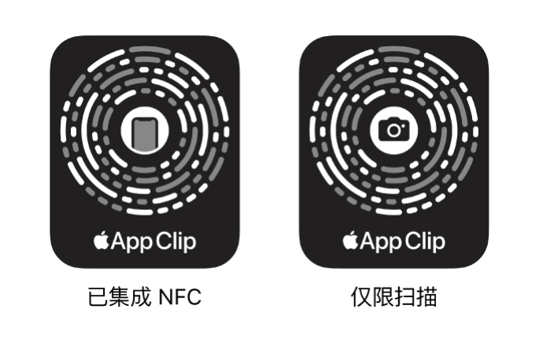
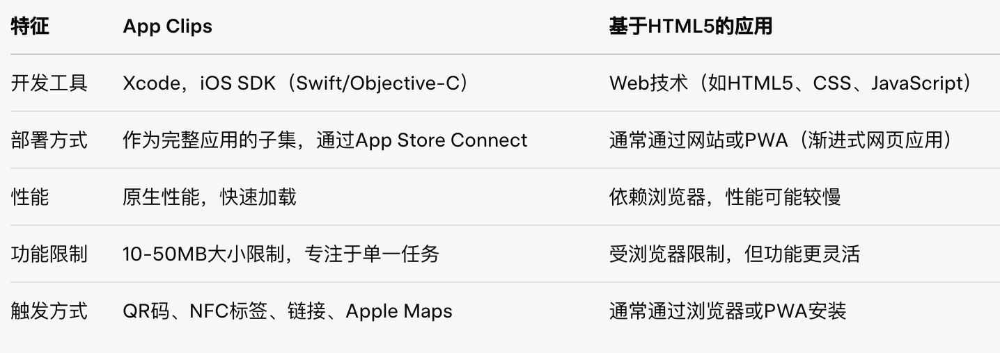

# 关于 App Clips 轻应用，我了解的一些信息汇总

App Clips 是完整 iOS 应用的一个子集，最初大小限制为 10MB（iOS 16 后扩展至 15MB，数字调用可达 50MB），专注于单一任务的快速完成。研究表明，它们在餐饮、交通和娱乐行业应用广泛，例如通过 QR 码点餐或通过 NFC 标签租用共享单车 。它们的目的是提供即用即走的用户体验，而非长期使用。

### 开发方式

首先，App Clips 不是基于 HTML5 开发的。它们是 Apple 为 iOS 设计的一种轻量级应用，允许用户在不下载完整应用的情况下快速体验特定功能。官方文档显示，App Clips 是使用 iOS SDK 在 Xcode 中开发的，与完整应用共享同一个项目，因此它们是原生 iOS 应用，而不是基于 web 技术的 HTML5 应用。

一些文章可能导致误解。例如，Engadget 提到 App Clips 可以通过网站链接触发，这可能让人误以为它们是 web 应用。但实际上，网站只是触发机制，App Clips 本身是原生 iOS 应用，可能包含 web 视图（如 WKWebView）来显示网页内容，但这并不意味着它们基于 HTML5。

### App Clips 与 HTML5 的对比

### 从哪里获得 App Clips 应用

目前没有专门汇聚 App Clips 轻应用的集中式网站或“App Clips 商店”。App Clips 的设计初衷是通过特定场景触发，例如扫描二维码、NFC 标签、苹果地图、Safari 链接或 iMessage 分享，而不是通过一个统一的商店分发。以下是一些相关信息和获取 App Clips 的途径：

- #### 获取 App Clips 的方式：

  扫描二维码或 NFC 标签：在支持 App Clips 的商家（如汉堡王、ChargeSPOT）实地扫描二维码或靠近 NFC 标签即可触发。

  社交分享：通过 iMessage 接收朋友分享的 App Clips 链接。

  特定场景：例如，Apple Store 的零售店通过 App Clips 提供自助结账功能。

- #### 为什么没有 App Clips 商店？

  App Clips 的理念是“即用即走”，强调轻量和场景化体验，苹果限制其大小（最初 10MB，iOS 16 后可能放宽至 15MB），并要求其作为完整 App 的功能子集。

  苹果生态更倾向于通过 App Store 推广完整应用，App Clips 只是辅助工具，因此没有像微信小程序那样的集中平台。

  目前，App Clips 的普及度较低，国内支持的商家有限（如汉堡王、ChargeSPOT），且 Apple Pay 和 Sign in with Apple 的普及度限制了其发展。

### 有哪些流行案例

由于 App Clips 是场景化、轻量级的 iOS 应用，通常通过 QR 码、NFC 标签或苹果地图触发，且没有集中式商店，流行案例多集中在餐饮、交通、娱乐等行业。以下是基于最新信息整理的一些流行 App Clips 应用案例，涵盖不同领域。需要注意的是，部分案例可能因地区或时间而有可用性差异。

#### 餐饮

- Panera Bread
  用户通过餐厅桌上的 QR 码快速点餐和支付，支持 Apple Pay，体验流畅。
  来源: Heady.io

- Toast’s Checkout System
  餐厅收据上的 QR 码触发 App Clip，允许用户通过 Apple Pay 快速结账，无需下载完整 POS 应用。
  来源: Reddit

#### 交通与停车

- ChargeSPOT
  用于电动车充电站，用户扫描 QR 码或 NFC 标签启动充电服务，适合快速使用场景。
  来源: Apple Developer

- Lime
  通过扫描共享单车或电动滑板车上的 QR 码，快速租用车辆，无需完整应用。
  来源: Apple Developer

- ParkWhiz
  用户通过 NFC 标签或 QR 码支付停车费，无需创建账户，适合临时停车场景。
  来源: Heady.io

#### 娱乐与媒体

- TikTok
  通过 iMessage 分享的视频链接触发 App Clip，用户可直接预览内容，无需安装完整应用。
  来源: Apple Developer WWDC21

- Shazam
  通过 Siri 触发，快速识别正在播放的歌曲，适合即时音乐发现。
  来源: Reddit

- Yelp
  从苹果地图的餐厅信息卡片触发 App Clip，快速查看餐厅详情或预订。
  来源: Reddit

#### 其他服务

- Ticketmaster
  用户通过 QR 码或链接快速购买活动门票，适合临时购票需求。
  来源: Heady.io

- SignEasy
  通过 App Clip 发送和签署电子文档，接收者无需下载应用即可完成签名。
  来源: Heady.io
- Parcel
  用于跟踪单个包裹并分享物流信息，适合临时物流查询。
  来源: Heady.io
