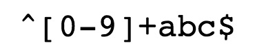

# 正则表达式


### 关于正则表达式

正则表达式使用单个字符串来描述、匹配某个句法规则的字符串。

正则表达式的"祖先"可以一直上溯至对人类神经系统如何工作的早期研究。Warren McCulloch 和 Walter Pitts 这两位神经生理学家研究出一种数学方式来描述这些神经网络。

1956 年, 一位叫 Stephen Kleene 的数学家在 McCulloch 和 Pitts 早期工作的基础上，发表了一篇标题为"神经网事件的表示法"的论文，引入了正则表达式的概念。正则表达式就是用来描述他称为"正则集的代数"的表达式，因此采用"正则表达式"这个术语。

随后，发现可以将这一工作应用于使用 Ken Thompson 的计算搜索算法的一些早期研究，Ken Thompson 是 Unix 的主要发明人。正则表达式的第一个实用应用程序就是 Unix 中的 qed 编辑器。

如他们所说，剩下的就是众所周知的历史了。从那时起直至现在正则表达式都是基于文本的编辑器和搜索工具中的一个重要部分。

正则表达式是繁琐的，但它是强大的，学会之后的应用会让你除了提高效率外，会给你带来绝对的成就感。


### 正则表达式基本用法

通常我们在计算机上使用 **?** 和 **\*** 通配符来查找硬盘上的文件。

**?** 通配符匹配文件名中的 0 个或 1 个字符，而 **\*** 通配符匹配零个或多个字符。

例如这种写法 **data(\w)?\.dat** 可以在计算机上查找到下列文件：

``` she
data.dat
data1.dat
data2.dat
datax.dat
dataN.dat
```

 ***** 通配符是正则表达式中的概念，同时正则表达式功能更加强大。

例如：



-   **^** 为匹配输入字符串的开始位置。
-   **[0-9]+**匹配多个数字， **[0-9]** 匹配单个数字，**+** 匹配一个或者多个。
-   **abc$**匹配字母 **abc** 并以 **abc** 结尾，**$** 为匹配输入字符串的结束位置。

最常见的用法，是在用户注册时验证输入有效性。

比如只允许用户名包含字符、数字、下划线和连接符-，并设置长度。


以上的正则表达式可以匹配 **runoob、runoob1、run-oob、run_oob**， 但不匹配 **ru**，因为它包含的字母太短了，小于 3 个无法匹配。也不匹配 **runoob$**, 因为它包含特殊字符。

**实践：匹配以数字开头，并以 abc 结尾的字符串**

```js
var str = "123abc";
var patt1 = /^[0-9]+abc$/;
document.write(str.match(patt1));
```


### 正则表达式语法

一个正则表达式通常被称为一个**模式**（pattern），为用来描述或者匹配一系列匹配某个句法规则的字符串。例如：Handel、Händel和Haendel这三个字符串，都可以由`H(a|ä|ae)ndel`这个模式来描述。大部分正则表达式的形式都有如下的结构：

**选择**

*   竖线|代表选择（即或集），具有最低优先级。例如gray|grey可以匹配grey或gray。

**数量限定**

某个字符后的数量限定符用来限定前面这个字符允许出现的个数。最常见的数量限定符包括+、?和*（不加数量限定则代表出现一次且仅出现一次）：

*   加号+代表前面的字符必须至少出现一次。（1次或多次）。例如，goo+gle可以匹配google、gooogle、goooogle等；
*   问号?代表前面的字符最多只可以出现一次。（0次或1次）。例如，colou?r可以匹配color或者colour；
*   星号*代表前面的字符可以不出现，也可以出现一次或者多次。（0次、1次或多次）。例如，0*42可以匹配42、042、0042、00042等。

**匹配**

*   圆括号()可以用来定义操作符的范围和优先度。例如，gr(a|e)y等价于gray|grey，(grand)?father匹配father和grandfather。

上述这些构造子都可以自由组合，因此H(ae?|ä)ndel和H(a|ae|ä)ndel是相同的，表示{"Handel", "Haendel", "Händel"}。


### 正则表达式速查（表）

|      字符      | 描述                                                         |
| :------------: | :----------------------------------------------------------- |
|      `\`       | 将下一个字符标记为一个特殊字符（File Format Escape，清单见本表）、或一个原义字符（Identity Escape，有^$()*+?.[\{\|共计12个)、或一个向后引用（backreferences）、或一个八进制转义符。例如，“`n`”匹配字符“`n`”。“`\n`”匹配一个换行符。序列“`\\`”匹配“`\`”而“`\(`”则匹配“`(`”。 |
|      `^`       | 匹配输入字符串的开始位置。如果设置了RegExp对象的Multiline属性，^也匹配“`\n`”或“`\r`”之后的位置。 |
|      `$`       | 匹配输入字符串的结束位置。如果设置了RegExp对象的Multiline属性，$也匹配“`\n`”或“`\r`”之前的位置。 |
|      `*`       | 匹配前面的子表达式零次或多次。例如，zo*能匹配“`z`”、“`zo`”以及“`zoo`”。*等价于{0,}。 |
|      `+`       | 匹配前面的子表达式一次或多次。例如，“`zo+`”能匹配“`zo`”以及“`zoo`”，但不能匹配“`z`”。+等价于{1,}。 |
|      `?`       | 匹配前面的子表达式零次或一次。例如，“`do(es)?`”可以匹配“`does`”中的“`do`”和“`does`”。?等价于{0,1}。 |
|     `{n}`      | *n*是一个非负整数。匹配确定的*n*次。例如，“`o{2}`”不能匹配“`Bob`”中的“`o`”，但是能匹配“`food`”中的两个o。 |
|     `{n,}`     | *n*是一个非负整数。至少匹配*n*次。例如，“`o{2,}`”不能匹配“`Bob`”中的“`o`”，但能匹配“`foooood`”中的所有o。“`o{1,}`”等价于“`o+`”。“`o{0,}`”则等价于“`o*`”。 |
|    `{n,m}`     | *m*和*n*均为非负整数，其中*n*<=*m*。最少匹配*n*次且最多匹配*m*次。例如，“`o{1,3}`”将匹配“`fooooood`”中的前三个o。“`o{0,1}`”等价于“`o?`”。请注意在逗号和两个数之间不能有空格。 |
|      `?`       | 非贪心量化（Non-greedy quantifiers）：当该字符紧跟在任何一个其他重复修饰符（*,+,?，{*n*}，{*n*,}，{*n*,*m*}）后面时，匹配模式是**非**贪婪的。非贪婪模式尽可能少的匹配所搜索的字符串，而默认的贪婪模式则尽可能多的匹配所搜索的字符串。例如，对于字符串“`oooo`”，“`o+?`”将匹配单个“`o`”，而“`o+`”将匹配所有“`o`”。 |
|      `.`       | 匹配除“`\r`”“`\n`”之外的任何单个字符。要匹配包括“`\r`”“`\n`”在内的任何字符，请使用像“`(.|\r|\n)`”的模式。 |
|  `(pattern)`   | 匹配pattern并获取这一匹配的子字符串。该子字符串用于向后引用。所获取的匹配可以从产生的Matches集合得到，在VBScript中使用SubMatches集合，在JScript中则使用$0…$9属性。要匹配圆括号字符，请使用“`\(`”或“`\)`”。可带数量后缀。 |
| `(?:pattern)`  | 匹配pattern但不获取匹配的子字符串（shy groups），也就是说这是一个非获取匹配，不存储匹配的子字符串用于向后引用。这在使用或字符“`(|)`”来组合一个模式的各个部分是很有用。例如“`industr(?:y|ies)`”就是一个比“`industry|industries`”更简略的表达式。 |
| `(?=pattern)`  | 正向肯定预查（look ahead positive assert），在任何匹配pattern的字符串开始处匹配查找字符串。这是一个非获取匹配，也就是说，该匹配不需要获取供以后使用。例如，“`Windows(?=95|98|NT|2000)`”能匹配“`Windows2000`”中的“`Windows`”，但不能匹配“`Windows3.1`”中的“`Windows`”。预查不消耗字符，也就是说，在一个匹配发生后，在最后一次匹配之后立即开始下一次匹配的搜索，而不是从包含预查的字符之后开始。 |
| `(?!pattern)`  | 正向否定预查（negative assert），在任何不匹配pattern的字符串开始处匹配查找字符串。这是一个非获取匹配，也就是说，该匹配不需要获取供以后使用。例如“`Windows(?!95|98|NT|2000)`”能匹配“`Windows3.1`”中的“`Windows`”，但不能匹配“`Windows2000`”中的“`Windows`”。预查不消耗字符，也就是说，在一个匹配发生后，在最后一次匹配之后立即开始下一次匹配的搜索，而不是从包含预查的字符之后开始 |
| `(?<=pattern)` | 反向（look behind）肯定预查，与正向肯定预查类似，只是方向相反。例如，“`(?<=95|98|NT|2000)Windows`”能匹配“`2000Windows`”中的“`Windows`”，但不能匹配“`3.1Windows`”中的“`Windows`”。 |
| `(?<!pattern)` | 反向否定预查，与正向否定预查类似，只是方向相反。例如“`(?<!95|98|NT|2000)Windows`”能匹配“`3.1Windows`”中的“`Windows`”，但不能匹配“`2000Windows`”中的“`Windows`”。 |
|     `x|y`      | 没有包围在()里，其范围是整个正则表达式。例如，“`z|food`”能匹配“`z`”或“`food`”。“`(?:z|f)ood`”则匹配“`zood`”或“`food`”。 |
|    `[xyz]`     | 字符集合（character class）。匹配所包含的任意一个字符。例如，“`[abc]`”可以匹配“`plain`”中的“`a`”。特殊字符仅有反斜线\保持特殊含义，用于转义字符。其它特殊字符如星号、加号、各种括号等均作为普通字符。脱字符^如果出现在首位则表示负值字符集合；如果出现在字符串中间就仅作为普通字符。连字符 - 如果出现在字符串中间表示字符范围描述；如果如果出现在首位（或末尾）则仅作为普通字符。右方括号应转义出现，也可以作为首位字符出现。 |
|    `[^xyz]`    | 排除型字符集合（negated character classes）。匹配未列出的任意字符。例如，“`[^abc]`”可以匹配“`plain`”中的“`plin`”。 |
|    `[a-z]`     | 字符范围。匹配指定范围内的任意字符。例如，“`[a-z]`”可以匹配“`a`”到“`z`”范围内的任意小写字母字符。 |
|    `[^a-z]`    | 排除型的字符范围。匹配任何不在指定范围内的任意字符。例如，“`[^a-z]`”可以匹配任何不在“`a`”到“`z`”范围内的任意字符。 |
|   `[:name:]`   | 增加命名字符类（named character class）中的字符到表达式。只能用于**方括号表达式**。 |
|   `[=elt=]`    | 增加当前locale下排序（collate）等价于字符“elt”的元素。例如，[=a=]可能会增加ä、á、à、ă、ắ、ằ、ẵ、ẳ、â、ấ、ầ、ẫ、ẩ、ǎ、å、ǻ、ä、ǟ、ã、ȧ、ǡ、ą、ā、ả、ȁ、ȃ、ạ、ặ、ậ、ḁ、ⱥ、ᶏ、ɐ、ɑ 。只能用于方括号表达式。 |
|   `[.elt.]`    | 增加排序元素（collation element）elt到表达式中。这是因为某些排序元素由多个字符组成。例如，29个字母表的西班牙语， "CH"作为单个字母排在字母C之后，因此会产生如此排序“cinco, credo, chispa”。只能用于方括号表达式。 |
|      `\b`      | 匹配一个单词边界，也就是指单词和空格间的位置。例如，“`er\b`”可以匹配“`never`”中的“`er`”，但不能匹配“`verb`”中的“`er`”。 |
|      `\B`      | 匹配非单词边界。“`er\B`”能匹配“`verb`”中的“`er`”，但不能匹配“`never`”中的“`er`”。 |
|     `\cx`      | 匹配由x指明的控制字符。x的值必须为`A-Z`或`a-z`之一。否则，将c视为一个原义的“`c`”字符。控制字符的值等于x的值最低5比特（即对3210进制的余数）。例如，\cM匹配一个Control-M或回车符。\ca等效于\u0001, \cb等效于\u0002, 等等… |
|      `\d`      | 匹配一个数字字符。等价于[0-9]。注意Unicode正则表达式会匹配全角数字字符。 |
|      `\D`      | 匹配一个非数字字符。等价于[^0-9]。                           |
|      `\f`      | 匹配一个换页符。等价于\x0c和\cL。                            |
|      `\n`      | 匹配一个换行符。等价于\x0a和\cJ。                            |
|      `\r`      | 匹配一个回车符。等价于\x0d和\cM。                            |
|      `\s`      | 匹配任何空白字符，包括空格、制表符、换页符等等。等价于[ \f\n\r\t\v]。注意Unicode正则表达式会匹配全角空格符。 |
|      `\S`      | 匹配任何非空白字符。等价于[^ \f\n\r\t\v]。                   |
|      `\t`      | 匹配一个制表符。等价于\x09和\cI。                            |
|      `\v`      | 匹配一个垂直制表符。等价于\x0b和\cK。                        |
|      `\w`      | 匹配包括下划线的任何单词字符。等价于“`[A-Za-z0-9_]`”。注意Unicode正则表达式会匹配中文字符。 |
|      `\W`      | 匹配任何非单词字符。等价于“`[^A-Za-z0-9_]`”。                |
|     `\xnn`     | 十六进制转义字符序列。匹配两个十六进制数字*nn*表示的字符。例如，“`\x41`”匹配“`A`”。“`\x041`”则等价于“`\x04&1`”。正则表达式中可以使用ASCII编码。. |
|     `\num`     | 向后引用（back-reference）一个子字符串（substring），该子字符串与正则表达式的第*num*个用括号围起来的捕捉群（capture group）子表达式（subexpression）匹配。其中*num*是从1开始的十进制正整数，其上限可能是9、31、99甚至无限，正则表达式#cite_note-5)。例如：“`(.)\1`”匹配两个连续的相同字符。 |
|      `\n`      | 标识一个八进制转义值或一个向后引用。如果\*n*之前至少*n*个获取的子表达式，则*n*为向后引用。否则，如果*n*为八进制数字（0-7），则*n*为一个八进制转义值。 |
|     `\nm`      | 3位八进制数字，标识一个八进制转义值或一个向后引用。如果\*nm*之前至少有*nm*个获得子表达式，则*nm*为向后引用。如果\*nm*之前至少有*n*个获取，则*n*为一个后跟文字*m*的向后引用。如果前面的条件都不满足，若*n*和*m*均为八进制数字（0-7），则\*nm*将匹配八进制转义值*nm*。 |
|     `\nml`     | 如果*n*为八进制数字（0-3），且*m和l*均为八进制数字（0-7），则匹配八进制转义值*nm*l。 |
|     `\un`      | Unicode转义字符序列。其中*n*是一个用四个十六进制数字表示的Unicode字符。例如，\u00A9匹配著作权符号（©）。 |

##### POSIX字符组

| POSIX字符组  | 说明                            | ASCII环境                            | Unicode环境          |
| :----------- | :------------------------------ | :----------------------------------- | :------------------- |
| `[:alnum:]`  | 字母字符和数字字符              | `[a-zA-Z0-9]`                        | `[\p{L&}\p{Nd}]`     |
| `[:alpha:]`  | 字母                            | `[a-zA-Z]`                           | `\p{L&}`             |
| `[:ascii:]`  | ASCII字符                       | `[\x00-\x7F]`                        | `\p{InBasicLatin}`   |
| `[:blank:]`  | 空格字符和制表符                | `[ \t]`                              | `[\p{Zs}\t]`         |
| `[:cntrl:]`  | 控制字符                        | `[\x00-\x1F\x7F]`                    | `\p{Cc}`             |
| `[:digit:]`  | 数字字符                        | `[0-9]`                              | `\p{Nd}`             |
| `[:graph:]`  | 空白字符之外的字符              | `[\x21-\x7E]`                        | `[^\p{Z}\p{C}]`      |
| `[:lower:]`  | 小写字母字符                    | `[a-z]`                              | `\p{Ll}`             |
| `[:print:]`  | 类似`[:graph:]`，但包括空白字符 | `[\x20-\x7E]`                        | `\P{C}`              |
| `[:punct:]`  | 标点符号                        | `[][!"#$%&'()*+,./:;<=>?@\^_`{|}~-]` | `[\p{P}\p{S}]`       |
| `[:space:]`  | 空白字符                        | `[ \t\r\n\v\f]`                      | `[\p{Z}\t\r\n\v\f]`  |
| `[:upper:]`  | 大写字母字符                    | `[A-Z]`                              | `\p{Lu}`             |
| `[:word:]`   | 字母字符                        | `[A-Za-z0-9_]`                       | `[\p{L}\p{N}\p{Pc}]` |
| `[:xdigit:]` | 十六进制字符                    | `[A-Fa-f0-9]`                        | `[A-Fa-f0-9]`        |

##### 优先级

| 优先级 | 符号                                  |
| :----- | :------------------------------------ |
| 最高   | `\`                                   |
| 高     | `()`、`(?:)`、`(?=)`、`[]`            |
| 中     | `*`、`+`、`?`、`{n}`、`{n,}`、`{n,m}` |
| 低     | `^`、`$`、中介字符                    |
| 次最低 | 串接，即相邻字符连接在一起            |
| 最低   | `|`                                   |


### 正则表达式速查（图）


### 正则表达式在线测试工具

[LINK](https://c.runoob.com/front-end/854/)
