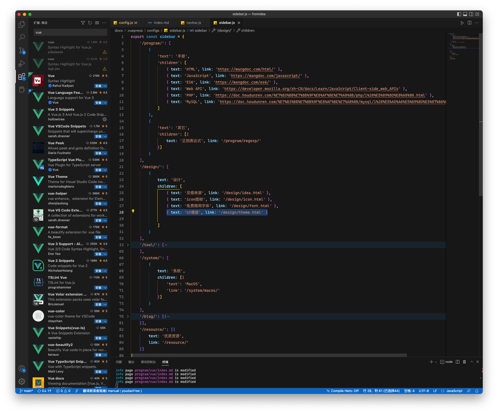
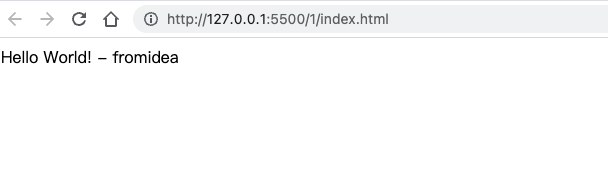
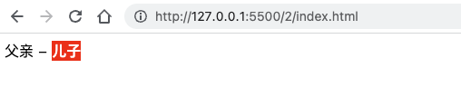

# VUE3学习笔记

这个笔记会记录我的整个vue3学习之路，从2022年12月27日开始，将不间断更新。

希望这篇笔记不仅能对我个人起到加强巩固作用，还能帮助到其他vue3的学友。

努力吧，学而时习之，不亦说乎...

最后，感谢vue的作者：[@youyuxi](https://twitter.com/youyuxi)


## vue3官网

[https://cn.vuejs.org/](https://cn.vuejs.org/)


## 开发环境的配置


### nodejs

访问nodejs[官网](https://nodejs.org/)，下载LTS版本。

安装完成后，在命令行中输入：

```shell
$ node -v
v18.12.1
```

可以看到当前node版本。

#### npm

另外，node安装后，同时可以使用npm命令用来安装和管理软件包。同样，在命令行中输入：

```
$ npm -v
9.2.0
```

可以看到当前npm版本。

##### npm切换源为国内镜像

为了保证npm的下载速度，可以使用国内镜像来解决网络问题，在命令行中输入：

```shell
npm config set registry https://registry.npmmirror.com
```

除了npm以外，还可以安装yarn，来替代npm使用。


## 开发工具


### vscode

vscode是微软开发的一个ide代码编辑器。拥有极为强大且丰富的扩展库。

访问vscode[官网](https://code.visualstudio.com/)，下载安装。

安装完成后运行vscode。

#### 安装扩展

在扩展库界面，搜索 `vue`



依次安装以下扩展

*   **Vue 3 Snippets**，代码自动完成
*   **Vue VSCode Snippets**，代码片段自动完成
*   **live Server**，实时浏览器渲染


## 关于单页面模式


*   页面访问时，资源文件一次性获取到本地

*   页面URL切换不再向后台发送请求，不再需要通过后端渲染
*   前后端的完全分离
*   前后端可以分开部署


## 第一个vue应用

使用cdn方式创建vue应用

``` html
<script src="https://unpkg.com/vue@3/dist/vue.global.js"></script>
```

>   通过 CDN 使用 Vue 时，不涉及“构建步骤”。这使得设置更加简单，并且可以用于增强静态的 HTML 或与后端框架集成。但是，你将无法使用单文件组件 (SFC) 语法。

**国内镜像**

[BootCDN](https://www.bootcdn.cn/vue/)


**示例**

```html
<!DOCTYPE html>
<html lang="en">
<head>
    <meta charset="UTF-8">
    <meta http-equiv="X-UA-Compatible" content="IE=edge">
    <meta name="viewport" content="width=device-width, initial-scale=1.0">
    <title>vue3第一个应用</title>
    <script src="https://unpkg.com/vue@3/dist/vue.global.js"></script>
</head>
<body>
    <div id="app">
        <h1>{{title}}</h1>
    </div>
</body>
<script>
    Vue.createApp({
        data() {
            return {
                title: 'fromidea'
            }
        },
        template: `
        <div>Hello World! - {{title}}</div>`
    }).mount('#app');
</script>
</html>
```

浏览器：



## 应用和组件

### 根组件

传入 `createApp` 的对象实际上是一个组件，每个应用都需要一个“根组件”，其他组件将作为其子组件。

### 挂载应用

`createApp`之后，需要挂载到html的DOM元素上，这个DOM元素相当于“容器”。

### 示例

``` html
<!DOCTYPE html>
<html lang="en">
<head>
    <meta charset="UTF-8">
    <meta http-equiv="X-UA-Compatible" content="IE=edge">
    <meta name="viewport" content="width=device-width, initial-scale=1.0">
    <title>vue3应用与组件</title>
    <script src="https://unpkg.com/vue@3/dist/vue.global.js"></script>
</head>
<body>
    <div id="app"></div>
</body>
<script>
    //根组件
    const app = Vue.createApp({
        data() {
            return {
                name: '父亲'
            }
        },
        template: `
        <div>{{name}} - <son /></div>`
    });

    //创建子组件
    app.component('son',{
        data(){
            return {
                name:'儿子'
            }
        },
        template:`
        <strong style="background-color:red;color:white">{{name}}</strong>`
    })
    
    //挂载到html dom
    app.mount('#app');
</script>
</html>
```

浏览器：




## 文本数据操作

### 文本插值

文本数据可以使用双大括号标签，插入html中。

``` html
<span>Message: {{ msg }}</span>
```

此处将输出 `msg` 属性的值。

同时每次 `msg` 属性更改时它也会同步更新。

除了双大括号，还可以使用 `v-text` 指令：

```html
<span v-text='{{msg}}'></span>
```


**示例**

```html
<!DOCTYPE html>
<html lang="en">
<head>
    <meta charset="UTF-8">
    <meta http-equiv="X-UA-Compatible" content="IE=edge">
    <meta name="viewport" content="width=device-width, initial-scale=1.0">
    <title>vue3应用与组件</title>
    <script src="https://unpkg.com/vue@3/dist/vue.global.js"></script>
</head>
<body>
    <div id="app">
        <h1>{{name}}</h1>
        <h2 v-text="name"></h2>
    </div>
</body>
<script>
    //根组件
    const app = Vue.createApp({
        data() {
            return {
                name: 'from'
            }
        }
    });

    //挂载到html dom
    const vm = app.mount('#app');

    //3秒后更新name值，观察浏览器页面变化
    setTimeout(()=>{
        vm.$data.name = 'idea';
    },3000)
</script>
</html>
```


### 原始 HTML

双大括号会将数据解释为纯文本，而不是 HTML。

若想实现原始HTML输出，你需要使用 [`v-html` 指令](https://cn.vuejs.org/api/built-in-directives.html#v-html)

```html
<p>Using text interpolation: {{ rawHtml }}</p>
<p>Using v-html directive: <span v-html="rawHtml"></span></p>
```

<script setup>
  const rawHtml = '<span style="color: red">This should be red.</span>'
</script>

<p class="demo">
  <p>Using text interpolation: {{ rawHtml }}</p>
  <p>Using v-html directive: <span v-html="rawHtml"></span></p>
</p>


