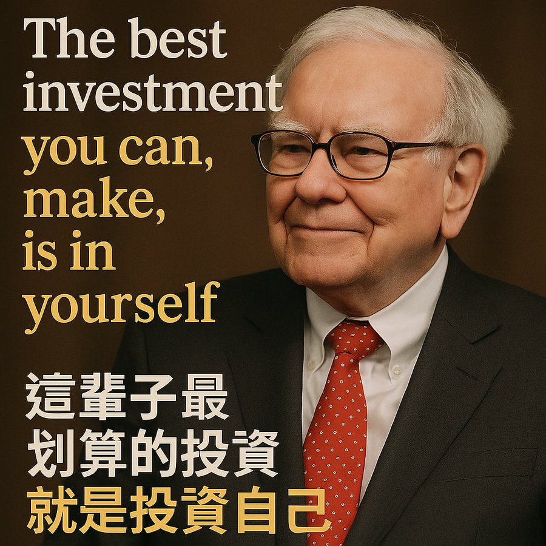

# 巴菲特退休前留下的10句话

94岁的股神巴菲特确认将在今年底卸任伯克希尔哈撒韦CEO。他一生留下的10句话，是投资界的圣经，也是普通人通向智慧人生的灯塔：

1. 这辈子最划算的投资，就是投资自己。
 核心启示： 知识、健康、品格的复利最高，且免税免流失。先让自己升值，再谈外部资产。

2. 法则一：别让本金受损；法则二：永远记住法则一。
 核心启示： 守住底线比什么都重要。无论是投资还是生活，把风险关在门外，其他目标才有实现的可能。

3. 别人贪婪我恐惧，别人恐惧我贪婪
 核心启示： 逆人性才能逆周期。情绪海啸里，理性者才能在低潮处捡到价值，在狂欢时避开陷阱。

4. 股市是把钱从急躁的人转移到耐心的人手里。
 核心启示： 频繁操作往往只是给情绪交税。静待价值兑现，收益常常悄悄累积。

5. 价格是你支付的，价值才是你得到的。
 核心启示： 别被标签迷惑，学会洞察事物的内在。无论买股票、买房子还是选择伴侣，先问“值不值”，再谈“贵不贵”。

6. 与其用极低的价格买一家平庸公司，不如用合理的价格买一家卓越公司。
 核心启示： 优秀会自我增值，平庸只会消耗时间。挑选人和项目亦然——宁缺毋滥。

7. 风险并非来自波动，而是来自无知。
 核心启示： 真正的危险是看不懂。坚守能力圈，持续学习，把未知逐步变成已知，风险自然可控。

8. 我们最喜欢的持有期限是——永远。
 核心启示： 时间是复利的引擎。愿意长期陪伴的资产、事业和关系，才配得上你的注意力。

9. 你不需要每次都挥棒，耐心等待那个好打的球。
 核心启示： 真正的高手不是出手多快，而是知道何时不出手。无论是投资、择业还是人生选择，等待那个“最合适的机会”比什么都重要。

10. 若找不到睡后收入的方式，你就得一直为钱醒着。
 核心启示： 让资本或系统替你工作，你才能真正拥有时间。主动变被动，效率胜勤奋。