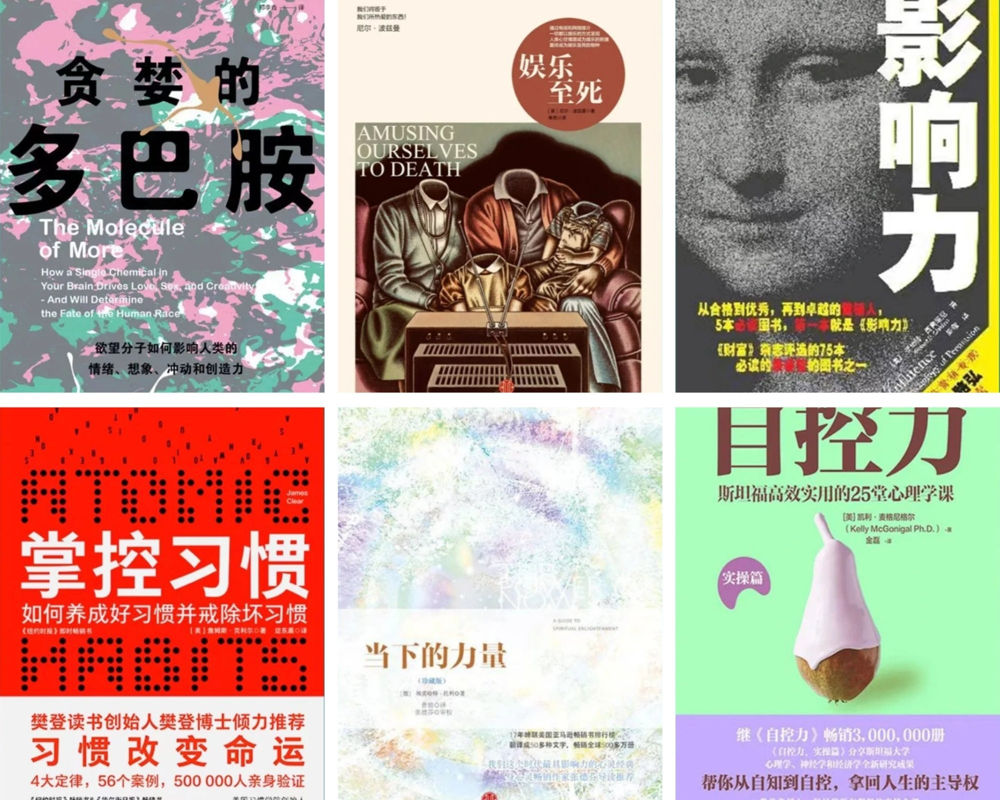

# 能让你戒掉手机瘾的 6 本书

### 《贪婪的多巴胺》

在过去粗浅的认知里，认为多巴胺就代表着“快乐”。本书完全颠覆了以往的认知，多巴胺其实是一种会给我们带来“痛苦”的分子。本书的目的是要告诉我们，通过了解多巴胺的作用机制，充分发挥它的好作用，而不要因为它的贪婪属性而沦落为它的奴隶。

[微信读书](https://weread.qq.com/book-detail?v=92932780727b2999929fce4&wtype=mpArticle)

### 《娱乐至死》

娱乐至死才是人间失格的真实图景！ 毁掉我们的不是我们所憎恨的东西，而恰恰是我们所热爱的东西。在日常工作和生活中，人们惯于用图像代替文字，或用图文相配代替单纯的文字表述，的确减轻了阅读和信息处理的负担，却也在一定程度降低了文字表达能力。文字之美在于运用在于雕琢，文字之力在于锤炼在于思考，而越来越多的泛图片化的信息却日益少见具力量和深度的文字，娱乐至死并非虚言妄之，的确有待警醒！

[微信读书](https://weread.qq.com/web/reader/aef326f05d0f19aef085d2b)

### 《影响力》

在生活中，我们总以为自己是独立而明智地作出了英明决策，但其实，我们的思维与判断却往往受到他人的影响；这些影响可能看似微不足道，看似与我们的决定毫无关联，但它们却实实在在地影响了我们，改变了我们的决定，令我们在不知不觉中听从了他人的安排。这本书把影响我们的《影响力》作了归类，并且将其心理学原理都深入地解释给我们，实在是好。

[微信读书](https://weread.qq.com/web/reader/9ad32d40727950039add092)

### 《掌控习惯》

书中有很多小结和总结非常的精辟，值得反复研读，前前后后读到了几十个杰出成功人士的故事。他们当中有奥运金牌得主、获奖艺术家、商业领袖、救死扶伤的医生和明星喜剧演员，他们都借助于小习惯科学，以掌握和提高他们的技艺，并在各自所在的领域取得登峰造极的优异成绩。我们在此提及的每个人、团队和公司处境各有不同，但最终都以同样的方式取得进步：致力于微小、可持续、不懈的改进。

[微信读书](https://weread.qq.com/web/reader/bcb32150719afe3bbcbad52)

### 《当下的力量》

看了这本书最大感悟是，我们会拥有什么 🤔 未来，主要取决于自已当下生活的状态和质量，所以，当我们学会过好当下的生活，未来的整个世界也可能 🤔 因此改变。专注当下体验你所经历的分分秒秒，培育自己的心智，这样你就最快体验到这本书＂当下的力量＂的精妙之处了。

[微信读书](https://weread.qq.com/web/bookDetail/5b932bd05cf3215b92b7cd5)

### 《自控力》

毋庸置疑，这是一本非常好的书。书中很多研究都很现实指出了我们生活中存在的问题和现象，从发现问题到做研究再到实验结果和解决问题方法，都深刻的触人心灵，是提高自控力良好的动力源泉。

[微信读书](https://weread.qq.com/web/reader/d2f32b705cc7f2d2ff135f6)
