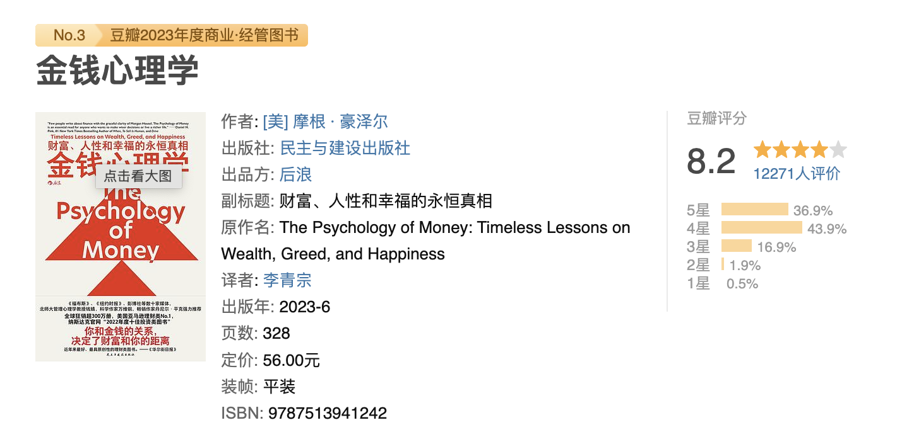

# 《金钱心理学：财富、人性和幸福的永恒真相》阅读笔记

>   摩根·豪泽尔
>
>   137个笔记

 ### 序言 地球上最伟大的表演

-   理财的成功与否和你的智商关系不大，但和你的行为习惯紧密相关。而行为是很难教授的，即便是面对那些高智商的人。 
-   里德将能攒的每一分钱都积攒起来，然后去买了蓝筹股，接下来便是漫长的等待。等到几十年后，这些微小的积蓄通过日积月累的复利，最终滚雪球般地变成了800多万。 
-   在其他哪个领域里，一个没有上过大学，没有接受过培训，没有背景和专业经验也没有社会关系的人可以压倒性地战胜一个接受过最好的教育和专业培训，并有着强大关系网的人？ 
-   在理财这件事上，软技能比技术层面的能力更重要。
-   人们会告诉你，你需要备好6个月的应急资金，并将每月工资的10%用于储蓄。 
-   在金融危机爆发以后，我领悟的第一个道理是，没有人能准确地解释到底发生了什么或者这一切为何会发生，更不用说如何去应对了。
-   物理现象不会出现争议，是因为物理现象必然是遵从物理定律的。金融现象则不同，是由人类行为决定的。我做的事对我来说是合理的，但你可能会感到难以理解。 
-   关于金融危机，从心理和历史角度而非金融本身入手，你可能才会更好地理解它。 

### 第1章 没有人真的对钱失去理智

-   人们一生中的投资决策在很大程度上取决于其生活经历——尤其是成年后的早期经历。 
-   起决定作用的不是智力，不是教育或阅历，而是一个人出生的时间和地点——纯粹靠运气的因素。 
-   公元前600年，如今位于土耳其境内的吕底亚(Lydia)的国王阿利亚特(Alyattes)发行的官方货币被认为开人类历史之先河
-   2018年底，美国的退休金账户中共有27万亿美元，这成了普通投资者储蓄和投资的主要驱动力。
-   在第二次世界大战前，美国人会一直工作到死为止。这就是当时的社会期望和现实。

### 第2章 运气与风险

-   任何事都没有表面看来那样美好或糟糕。 
-   生活中的每一个结果都受到个人努力之外的其他作用的影响。 
-   在生活这场游戏中起作用的除了我们自己，还有其他70亿人，同时还存在着无数的变量。那些在你控制之外的行为产生的意外影响可能比你有意识的行为产生的影响更大。
-   我买了一只股票，5年后这只股票的价格还在原地踏步。这可能是因为我在一开始买的时候就做了错误的决定，也可能是因为我的决定是正确的，有8成的概率赚钱，但我却刚好遭遇了那2成的不幸。
-   在与一些专业投资人和商界领导者来往多年后，我渐渐发现，人们习惯把别人的失败归咎于错误的决策，而把自己的失败归咎于糟糕的运气。
-   大胆和鲁莽之间的差距非常小。如果我们无视了风险和运气的重要影响，那么这种差距通常是看不见的。
-   本杰明·格雷厄姆(Benjamin Graham)是有史以来最伟大的投资者之一，被誉为“价值投资之父”。他也是沃伦·巴菲特(Warren Buffett)早期的导师。

### 第3章 永不知足

-   “知足”——我被这个词简单而又强大的力量震撼了。我感受到的震撼来自两个方面：第一，我自己已经在生活中获得了太多；第二，约瑟夫·海勒的话说得再准确不过了。
-   一名“尼日利亚骗局”的惯犯曾告诉《纽约时报》，他为伤害别人而感到内疚，但“贫穷当前，你就感受不到那种痛苦了”。
-   最难的理财技能是让逐利适可而止
-   当想拥有更多——更多的金钱、权力和声望——的欲望比满足感增长得更快时，事情就变得很危险了。
-   现代资本擅长创造两种东西：财富和嫉妒。
-   如果不懂得知足，生活中便没有了快乐，正如那句俗话所说，“幸福是你拥有的减去你期待的”。
-   问题的症结在于攀比心态
-   问题在于，攀比的天花板很高，因此实际上没有人能触摸到它。
-   攀比就像一场没有人能打赢的战役，取胜的唯一办法是根本不要加入这场战争——用知足的态度接受一切，即使这意味着自己比周围的人逊色。
-   在拉斯维加斯，唯一能赌赢的方法就是在刚进来的那一刻转身离开
-   知足意味着深知它的反义词——永远难以填满的欲望——会将你推向后悔的境地。

### 第5章 致富vs.守富

-   在保持节俭的同时，还需要一些谨小慎微。
-   致富需要的是冒险精神、乐观心态，以及放手一搏的勇气。
-   守富需要谦逊和敬畏之心，需要清楚财富来得有多快，去得就有多容易。
-   守富需要节俭，并要承认你获得的财富中一部分源自运气，所以不要指望无限复制过去的成功。
-   财富年复一年的时间去增长，复利的力量才会显现。这就像种下一棵橡树：1年的成长时间不会让橡树有太大的变化，10年的时间会让橡树出现显著的变化，而50年的时间则会让它长成参天大树。
-   在他经历过的14次经济衰退中，他始终没有惊慌失措地抛售自己的金融资产。
-   比起巨大的回报，财富的安全更重要。只要财富安全，你就知道你总能得到最大的回报，因为只要你坚持足够长的时间，复利就会创造奇迹。
-   在对未来保持乐观的同时时刻提防阻碍你走向美好未来的因素的均衡心态至关重要。
-   经济、市场和个人职业生涯通常也会遵循一条相似的路径——在不断的损失中持续增长的过程。

### 第6章 尾部的胜利

-   任何规模巨大、利润丰厚、声名远播或影响力深远的事物都源自某个尾事件——从几千甚至几百万个事件中脱颖而出的一个。
-   拿破仑对军事天才的定义是“当身边所有人都进入非理性状态时还能继续正常行事的人”。
-   从1900年到2019年共有1,428个月，其中只有300多个月处于经济衰退期，因此在这22%的经济衰退或接近衰退的时间里，苏始终保持冷静，最终比吉姆或汤姆多赚了差不多四分之三的钱。

### 第7章 自由

-   富有的最高级形式是，每天早上起床后你都可以说：“今天我能做我想做的任何事。”
-   在自己喜欢的任何时候和自己喜欢的对象做想做的事，而且想做多久就做多久，这样的自由是极其珍贵的，而这就是金钱能带给我们的最大红利。
-   大多数脑力工作者的笔记本电脑和智能手机是便携式的全能媒体制造机器。
-   那些历经世事沧桑的人能给你的忠告是：时间自由是财富能带给你的最大红利。

### 第8章 豪车悖论

-   在我儿子出生以后，我给他写了一封信。信中写道：“你或许觉得你需要一辆昂贵的车子、一块豪华的手表和一座很大的房子，但我想告诉你的是，你并非真想得到这些东西本身。你真想得到的是来自他人的尊重和羡慕。你觉得拥有昂贵的东西会让别人尊重和羡慕你，但可惜，别人不会——尤其是那些你希望得到其尊重和羡慕的人。”
-   比起豪车，谦虚、善良和同情心等人格特质才能帮你获得更多尊重。

### 第9章 财富是你看不见的那些

-   炫富是让财富流失的最快途径。
-   现代资本主义致力于帮助人们通过超前消费的方式来享受原本力不能及的物质生活，并将这种消费观发展为一个备受推崇的产业。
-   让自己感到富有的最佳方式莫过于把大笔钱花在那些真正美好的东西上。但想真变得富有，你需要做的是花自己已经有的钱，而不是透支还不属于自己的钱。事情就是这么简单。
-   我们很多人面对的问题是，我们很容易找到有钱的人做榜样，但想找到富有的人却不容易，因为从性质上讲，他们的成功更隐蔽。
-   长久以来，我们形成的消费观是，钱就是用来花的，所以我们其实不太理解，富有的前提其实是克制。
-   你很难通过自己看不见的事物学习，这就是为什么很多人都难以积累真正的财富。
-   这个世界上有很多看起来低调但实际上很富有的人，还有很多看上去很有钱却生活在破产边缘的人。

### 第10章 存钱

-   个人的节俭和储蓄行为——在金融方面的节约和高效——是金钱等式中你具备更强控制力的部分，而且在未来也会像今天一样，是百分百行得通的方法。
-   如果你觉得积累财富需要更多的收入或者更高的投资回报，你就会像20世纪70年代对能源持悲观看法的人一样。在你看来，前方的道路充满坎坷，一切都在你自己的控制之外。
-   财富是对收入扣除开支后剩下的部分进行积累的结果。
-   即使你收入不高，你依然可以积累财富，但如果你的储蓄率不高，你绝不可能积累财富——两相对比，孰轻孰重显而易见。
-   如果你学会用更少的钱来获得同样多的幸福感，你的欲望和所得之间就会产生积极的落差。
-   收入超过一定水平后，你的物质需求由欲望决定。
-   增加财富最有效的方式就不是提高个人收入，而是培养你的谦逊之心。
-   那些长期成功经营个人财富的人并不一定有着高收入。他们的一个共同点是，完全不在乎别人如何看待自己。
-   你每存一笔钱，就好像是从未来本可能属于他人的财富中拿来一部分，加入你自己的财富中。
-   在一个智力方面的竞争已经白热化，而很多旧有技术已经被自动化技术取代的世界里，竞争优势开始转向更加细微的软件层面，比如沟通能力、共情能力，以及最重要的一点——一个人的灵活度。
-   当智力不再是一种持久的优势时，拥有别人没有的灵活度是少数几种能帮你拉开与别人的距离的特质。

### 第11章 合乎情理胜过绝对理性

-   在做投资决策时，不要试图保持绝对理性，而要做出对你而言合乎情理，也就是更好接受的选择。后者在现实中更容易做到，能让你长期坚持，而坚持对理财来说才是至关重要的一点。
-   “发热启动了人体的免疫系统，帮助身体对抗感染。100℉～104℉之间的普通发热对患儿是有好处的。”
-   发热会带来痛苦的感受，而人们不喜欢痛苦。
-   事实上，人生中很少有理论与现实一致的时候。

### 第12章 意外！

-   深入研究经济史和投资史是非常可取的，因为历史能帮助我们修正对未来的预期，研究前人经常犯错的地方，针对事物的有效性提供粗略的指引，但是无论如何，历史都不是一张能够预测未来的路线图。

-   在过去的一个世纪里，0.00000000004%的人决定了世界的主要发展方向。

-   比如，“9·11”事件发生后，美联储不得不下调利率，从而引发了房地产泡沫的产生，进而导致了金融危机的发生。然后，就业市场开始萎缩，而这使得成千上万的人不得不涌入大学去读书，从而导致了1.6万亿助学贷款的产生，而其中有10.8%的人违约。单凭直觉，我们很难将19个劫机者和这样一笔巨额的助学贷款联系起来，但在一个意外事件可以产生重大影响的世界里，这样的事真的发生了。

    >   2025/09/23 发表想法
    >   蝴蝶效应

-   世界很难预测。每天都在发生意料外的事。这就是你应该从意外事件中领悟的真理。

-   格雷厄姆的经典著作《聪明的投资者》(The Intelligent Investor)不仅阐释了理论，还提供了像公式一样的实践指南。投资者们使用这些公式，就可以做出聪明的投资决策。

### 第13章 容错空间

-   格雷厄姆的安全边际理论给我们提供了一个简单的建议，那就是我们不能把眼前的世界看成黑白分明的——要么可以预测，要么全凭运气。在你可以接受可能出现的各种结果的灰色区域展开追求，才是最明智的前进方式。
-   杠杆——以负债的方式进行投资——把常规风险扩大到了足以导致毁灭的程度。
-   随时可以做自己想做的事而且想做多久就做多久的能力，才是无限投资回报的源泉。

### 第14章 人是会变的

-   坚持长期计划比你想象中难得多，因为我们的目标和想法总在改变。
-   人类的心理存在一种基本规律：我们很难预料到自己未来的想法。
-   无论在工作生涯的哪个节点，都要定下这样均衡的目标：每年做好适中的储蓄，给自己适度的自由时间，让通勤不超过适当的时长，至少花适量的时间来陪伴家人。这样一来，即使这些方面中的哪一项走向了极端，你也更容易坚持自己的计划，降低未来后悔的可能。
-   我们还应该慢慢接受自己的想法一直在改变的事实
-   当你了解“历史终结错觉”这个概念后，你就会意识到，你在刚满可以饮酒的年龄时选择的工作，你到可以拿退休金的年纪时依然喜欢它的概率是很低的。
-   应对这种现象的方式是，接受事物在不断改变的事实，并在需要应变的时候尽快行动。

### 第15章 世上没有免费的午餐

-   万物皆有定价，只不过有些不会写在标签上。
-   伊梅尔特告诉他的继任者：“任何工作在旁观者看来都很简单。”
-   之所以任何工作在旁观者看来都很简单，是因为当局者要面对的挑战常常是旁观者看不见的。
-   标普500指数在截至2018年的50年中上涨了119倍。
-   波动是投资行为中必然会遇到、极频繁发生的情况。于是许多人选择了看似符合逻辑的应对方法：试图逃避波动。
-   把市场波动看作要支付的价钱而不是该缴纳的罚款的视角看似微不足道，却是培养正确理财心态的重要部分。这种心态可以让你坚持一项理财策略足够久，最终获得长期的投资收益。
-   投资也是如此。几乎所有波动都是一种费用，而非一笔罚款。
-   股市也是一样。它的波动和不确定性让你付出的费用——获得回报需要付出的代价——是你为获得比储蓄和债券带来的低回报更高的收益而要购买的入场券。
-   正确应对波动和不确定性的唯一方法就是理解这笔费用是物有所值的——你需要做的不是忍受惩罚，而是认识到这是一笔值得支付的入场费。

### 第16章 每个人的情况不同

-   你没有意识到的是，那些决定股票边际价格的交易者和你玩的并不是同一个游戏。对那些交易者来说，每股60美元是一个合理的价格，因为他们的计划是在当天结束前卖出股票，而那时的价格可能会比他们买入时高。但如果你是打算长期持股的，60美元的价格对你来说意味着一场即将到来的灾难。
-   你会受到你仰慕的人们的潜移默化的影响，而你之所以像他们那样消费，是因为你在内心深处也希望别人仰慕你。
-   我能给你的关键建议是：尽可能努力明确自己玩的是什么游戏。

### 第17章 悲观主义的诱惑

-   真正的乐观主义者并非相信一切都会变得很好——那就变成盲目自信了。乐观主义是一种信念，相信就算过程中充满坎坷，随着时间过去，你心目中好结果出现的概率也比坏结果出现的概率大。
-   悲观论调听起来似乎比乐观论调更富有智慧，所以也更具说服力。 如果你告诉人们一切都会变得很好，他们可能会不以为然，或者用怀疑的目光看着你。但如果你说他们正处于危险中，你就会获得他们的全部注意力。
-   多年来，财经媒体深谙这一规律。如今的媒体上充满了对未来的悲观论调，但这些论调出现的背景是，在过去的一个世纪中，股市市值增长了1.7万倍（包括股息）。
-   在金融之外的领域，情况同样如此。马特·里德利(Matt Ridley)在《理性乐观派》(The Rational Optimist)一书中写道：
-   持续敲响的悲观主义鼓点会盖过任何有关胜利的赞歌……如果你说世界一直在变好，人们会觉得你很天真，对外部世界的变化浑然不知。如果你说世界将出现向好的转变，人们会觉得你的疯狂令人发指。相反，如果你说一场灾难即将来临，你可能会被授予麦克阿瑟天才奖，甚至诺贝尔和平奖。在我成年以后……人们崇尚悲观主义的原因发生了变化，但悲观主义情绪始终存在。
-   如果你能意识到在一个人一生的时间里，人类社会可以在经济发展、医学突破、股市收益和社会平等等各个领域取得多么巨大的进步，你就会发现，乐观主义本该比悲观主义吸引更多的关注。然而现实并非如此。
-   在进行直接比较或权衡时，失去带给我们的精神影响比得到更大。这种积极和消极的期望或经历之间的力量不对等现象有着演化方面的原因。相比机遇，对威胁反应更快的生物成功生存和繁殖的可能性才更大。
-   在美国，一半以上的家庭直接持有股票，但即使是那些不直接持有股票的家庭，在股市的波动经过媒体的大肆渲染以后，也会将道琼斯工业平均指数作为心中第一位的经济晴雨表。
-   在一个悲观主义者看来，2008年石油产业的发展趋势自然是不容乐观的。但对一个清楚需求是所有创新与发明之母的现实主义者而言，情况就远没有那么糟糕了。
-   眼前的问题有多糟糕，人们解决问题的动力就有多强——这是经济史中普遍存在的一种现象，却很容易被悲观主义者忽视，因为他们的预测一直是简单粗暴的。
-   想想我们在医学领域取得的进步吧。只回顾过去1年间的进步是没什么意义的。单独拿出某个10年来看也意义不大。但如果看看过去50年，我们就会发现一些非凡的成就。例如，根据美国国立卫生研究院(National Institute of Health)的数据，自1965年以来，在美国，心脏病的年龄别死亡率已经下降了70%以上。70%的降幅意味着每年都足足有50万人的生命被挽救。对比一些大城市的人口，来感受一下每年被挽救的生命有多么多吧。但因为这个过程进展得很缓慢，它引起的关注要小于恐怖袭击、飞机失事或自然灾害等突发事件导致的损失所引起的。美国就算每周都遭遇5次卡特里娜飓风——想象一下，这会吸引多大的关注度——在一年内的总死亡人数也无法抵消过去半个世纪里这70%的降幅背后每年被挽救的生命数量。
-   在投资中，你必须认识到成功的代价——在长期增长的背景下出现的波动和损失——并做好为其买单的准备。
-   如果你的期待值过高，那么当前条件下最好的结果在你看来也是平淡无奇的。悲观主义降低了对事物的期待值，缩小了可能出现的结果和你期待的最好结果之间的差距。

### 第18章 当你相信一切的时候

-   这些做法看上去很疯狂，但如果你迫切需要解决问题，而你又不知道或者无法轻易找到有效的办法，此时对你来说阻力最小的做法便是像哈贾吉那样——什么都愿意试一试。你不只愿意尝试，而且会全盘相信。
-   金融领域内的很多投资观点都带有这样的特性：一旦你听从它们，选择了某种策略或方法，你就同时在金钱和心理上进行了双重投资。如果你希望某只股票能上涨10倍，你就成了它的信徒。如果你认为某种经济政策会引发恶性通货膨胀，你就已经站好队了。
-   丹尼尔·卡尼曼曾告诉我，人们会编故事讲给自己听，以此来理解发生过的事。
-   “风险就是在你觉得自己已经考虑周全时被你遗漏的东西。”

### 第19章 总结

-   这个故事会告诉我们，对别人如何理财提出建议是一件多么危险的事。
-   当事态朝正确的方向发展时，要保持谦逊；当事态朝错误的方向发展时，要心怀谅解或同情。这是因为任何事都没有表面看来那样美好或糟糕。世界很大，也很复杂。运气和风险真实存在，也难以判别，所以无论是在评价自己还是他人时，都要将这句话牢记于心。你如果能尊重运气和风险的力量，就更容易把注意力投放在你真正能控制的事上，也就更容易找到正确的参照对象。
-   当事态朝正确的方向发展时，要保持谦逊；当事态朝错误的方向发展时，要心怀谅解或同情。这是因为任何事都没有表面看来那样美好或糟糕。世界很大，也很复杂。运气和风险真实存在，也难以判别，所以无论是在评价自己还是他人时，都要将这句话牢记于心。
-   虚荣越少，财富越多。
-   通过缩减你今天可以购买的东西，你创造了未来可以购买更多东西或拥有更多选择的机会，而财富就是这样积累下来的。
-   无论你的收入有多高，如果无法限制自己当下花钱享乐的欲望，你就永远无法积累财富。
-   如果你想提高投资回报，最简单而有效的方法就是拉长时间。时间是投资中最强大的力量。
-   它能让微不足道的事物成长壮大，而让重大错误的影响渐渐消失。它不能抵消运气和风险，但它会让结果对参与者而言更公平。
-   就算很多事出了错，也不要心态失衡。你就算错了一半，依然能积累财富，因为是少数的几件事决定了整体的结果。
-   利用财富来获取对时间的掌控，因为对人生的幸福感而言，最严重而普遍的扣分项就是时间上的不自由。在任何时候和喜欢的人去做喜欢的事而且想做多久就做多久的能力，才是财富能带给你的最大红利。
-   多一些善意，少一些奢侈。其他人都不会像你自己那样在意你有多少财富。
-   你或许以为自己需要的是一辆豪车或一块名表，但或许你真正想要的是来自别人的尊重和赞赏。比起依靠豪车和名表，你可能更容易通过善良和谦逊获得这些。
-   每个人的生命都是由一连串意外组成的。在生命中最糟糕的时刻，没有特定用途的丰厚储蓄可以为不可避免的意外提供一种对冲。
-   不确定性、疑虑和后悔是金融世界里的常见代价。它们通常是值得你去买单的，但你要把它们看作一笔费用（要为得到好东西而付出的），而不是罚款（要千方百计避免的）。
-   你应该喜欢风险，因为长期看它能带给你回报。但你需要对具有毁灭性的风险格外敏感，因为它会让你早早退场，不再有机会去冒那些能带给你回报的风险。

### 第20章 我的理财方案

-   查理·芒格曾说：“我的目的并不是赚大钱。我想要的不过是独立自主而已。”

-   如果说我的家庭理财计划中有哪一部分是我引以为傲的，那便是我们在年轻时就已经决定，我们对生活方式的欲望不会随着收入水涨船高。

-   纳西姆·塔勒布解释道：“退出无谓的激烈竞争，以获得内心平静为目标来调节你的行为，才是真正的成功。”我很喜欢这句话。

-   我们的金融资产中流动资金的比例高于大多数理财顾问推荐的标准，大约占20%

-   我们这么做是因为现金是独立生活的重要保障，而更重要的是，我们永远不想被迫出售我们持有的股票。

-   统计数据显示，在截至2019年的10年中，85%的大盘股活跃型基金经理的业绩表现未能超过标普500指数。

-   这些年来，我逐渐认识到，只要连续几十年把钱投入低成本的指数基金，让这些钱去不断积累复利，我们是非常有可能实现全家人的所有财务目标的。

    

>   来自微信读书