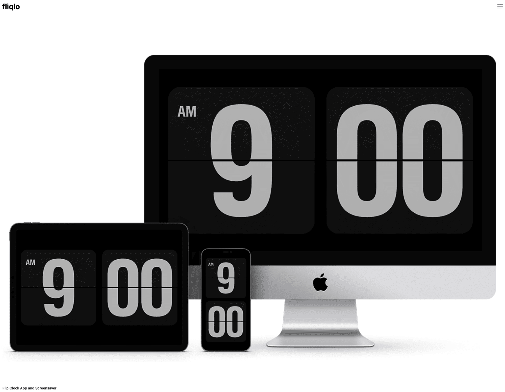

# 优质资源收集

### 科技爱好者周刊

由行业前辈阮一峰主导推出的，文章内容质量很高。涵盖科技、人文等多个领域的新鲜、优质内容。

[https://github.com/ruanyf/weekly](https://github.com/ruanyf/weekly)

### Zlibrary

全球最大的数字图书馆，提供电子书免费下载。资源数量超出你的想象。

[https://zh.z-lib.org/](https://zh.z-lib.org/)

### 编程字体

这个网站提供了近百种编程字体，可以切换查看效果，以供选择。

[https://www.programmingfonts.org/](https://www.programmingfonts.org/)

### 程序员音乐-编程背景音乐播放器

一个极客编程风格的音乐网站，内置了一些歌曲和专辑，适合编程时当作背景音乐。

它的界面完全采用字符终端样式。

[https://musicforprogramming.net/latest/](https://musicforprogramming.net/latest/)

### JavaScript学习笔记

来自Evan's同学的blog，笔记非常细致，且目录结构极为清晰，适合新手上路阅读。

[https://xugaoyi.com/note/javascript/](https://xugaoyi.com/note/javascript/)

### 前端面试之道

由汪图南同学编写的这篇前端面试指南，是前端之必备手册。

[https://wangtunan.github.io/blog/interview/](https://wangtunan.github.io/blog/interview/)

### fliqlo-时钟屏保

一款针对MacOS的时钟屏保

[Fliqlo - Flip Clock App and Screensaver](https://fliqlo.com/)

### Warp-Shell工具

一款运行于MacOS的Shell工具，代码自动补全，历史记录以及极简的设计风格，一定会让你爱不释手。

[https://www.warp.dev/](https://www.warp.dev/)

