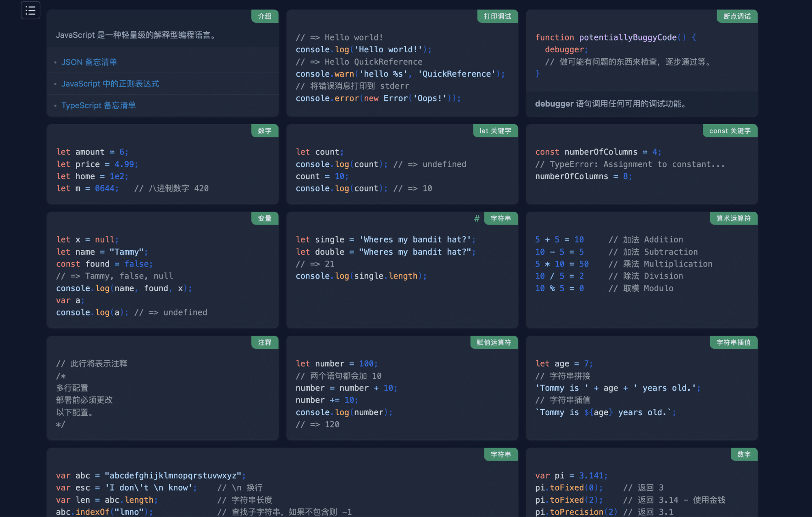

# 优质资源收集

### 科技爱好者周刊

由行业前辈阮一峰主导推出的，文章内容质量很高。涵盖科技、人文等多个领域的新鲜、优质内容。

[https://github.com/ruanyf/weekly](https://github.com/ruanyf/weekly)

### 数字图书馆-Zlibrary

全球最大的数字图书馆，提供电子书免费下载。资源数量超出你的想象。

[https://zh.z-lib.org/](https://zh.z-lib.org/)

### 编程字体

这个网站提供了近百种编程字体，可以切换查看效果，以供选择。

[https://www.programmingfonts.org/](https://www.programmingfonts.org/)

### 程序员音乐-编程背景音乐播放器

一个极客编程风格的音乐网站，内置了一些歌曲和专辑，适合编程时当作背景音乐。

它的界面完全采用字符终端样式。

[https://musicforprogramming.net/latest/](https://musicforprogramming.net/latest/)

### JavaScript学习笔记

来自Evan's同学的blog，笔记非常细致，且目录结构极为清晰，适合新手上路阅读。

[https://xugaoyi.com/note/javascript/](https://xugaoyi.com/note/javascript/)

### 前端面试之道

由汪图南同学编写的这篇前端面试指南，是前端之必备手册。

[https://wangtunan.github.io/blog/interview/](https://wangtunan.github.io/blog/interview/)

### fliqlo-时钟屏保

一款针对MacOS的时钟屏保

[Fliqlo - Flip Clock App and Screensaver](https://fliqlo.com/)

### Warp-Shell工具

一款运行于MacOS的Shell工具，代码自动补全，历史记录以及极简的设计风格，一定会让你爱不释手。

[https://www.warp.dev/](https://www.warp.dev/)

### 开发人员备忘清单-速查表

一个为开发人员提供快速参考备忘清单的网站。相当于 Reference 的中国版，由国内开发者搬运、整理、翻译、完善。同时你也可以帮助他一起构建该清单。

[https://wangchujiang.com/reference/](https://wangchujiang.com/reference/)

### 异地组网利器-OmniEdge

OmniEdge 的端到端企业 VPN 解决方案，无需公网 IP，无需端口转发，无需反向代理，零配置，不仅适用于初创业团队、个人，也适用于需要弹性扩张，在世界各地拥有成千上万台电脑的大公司。

[https://omniedge.io/](https://omniedge.io/)

### 中国程序员单词发音纠正

在这个网站你可以快速收听开发常用单词的正确发音，包含美式和英式发音。

开源项目地址：https://github.com/shimohq/chinese-programmer-wrong-pronunciation

[https://cpwp.netlify.app/](https://cpwp.netlify.app/)

### 端对端加密的私人笔记-Notesnook

Notesnook是一款开源的私人笔记应用。官方称该应用可以让您自由地写笔记，让任何人都无法窥探你的笔记。与Evernote和其他笔记应用程序不同，您的数据是私人的，不是开放给所有人的。

该应用提供web、macos、ios、android、windows等多个平台支持。

[https://notesnook.com/](https://notesnook.com/)

### 零基础学英语课程

据说这套英文课程学起来比较轻松，这位老师的教学方式能让你逐步建立学习兴趣和有效建立自信心。

来自油管up主：[星容英语笔记](https://www.youtube.com/@xingrong-english)。同时，up主的B站账号也会同步更新。

[B站版：星荣英语笔记](https://space.bilibili.com/160507280/channel/collectiondetail?sid=48449&ctype=0)

### 全球城市模拟驾车 Drive & Listen

一个很有趣的在全世界各个地方模拟驾车体验的网站「Drive & Listen」，真实视角、真实道路、城市背景音效，带来一种身临其境的开车感受。

[https://driveandlisten.herokuapp.com/](https://driveandlisten.herokuapp.com/)

### Mochi Diffusion - 基于苹果的AI图像生成

基于苹果开源的 Core ML Stable Diffusion 框架 ，以实现在搭载 Apple 芯片的 Mac 上用极低的内存占用发挥出最优性能，并同时兼容搭载 Intel 芯片的 Mac。

[https://github.com/godly-devotion/MochiDiffusion](https://github.com/godly-devotion/MochiDiffusion)

### manateelazycat博客

一个技术大佬的个人博客，开源社区贡献者，涉猎广泛、内容丰富，可以看出作者非常善于思考。

[https://manateelazycat.github.io/index.html](https://manateelazycat.github.io/index.html)

### GitBook

快速创建知识库、产品文档。支持域名绑定。

[https://www.gitbook.com/](https://www.gitbook.com/)

### Framer

零代码，在线设计并生成web网站，流行风格、快速高效。

[https://www.framer.com/](https://www.framer.com/)

### 精确获取IP地址的详细数据

为世界各地的组织提供可靠的 IP 数据，仅需几分钟即可配置好API接口。
并且提供**免费的数据库**下载。

[https://ipinfo.io/](https://ipinfo.io/)

### 深入架构原理与实践

关于架构设计的开源电子书，预计 2024 年 3 月左右正式出版。目前作者还在逐渐完善内容中。

[https://www.thebyte.com.cn/](https://www.thebyte.com.cn/)

### Swift中文指南

由于苹果官方并没有提供Swift中文手册，因此中文翻译版的质量和更新速度显得尤为重要。这个网站作者称：可能是最用心的翻译了，并同步更新苹果[官方的 Swift 开发者预览版 ](https://developer.apple.com/library/prerelease/content/documentation/Swift/Conceptual/Swift_Programming_Language/index.html#//apple_ref/doc/uid/TP40014097-CH3-ID0)！

[https://www.cnswift.org/](https://www.cnswift.org/)

### React Native中文文档

国人学习React Native的最佳选择。翻译质量较好，更新目前与官网同步。

[https://reactnative.cn/](https://reactnative.cn/)