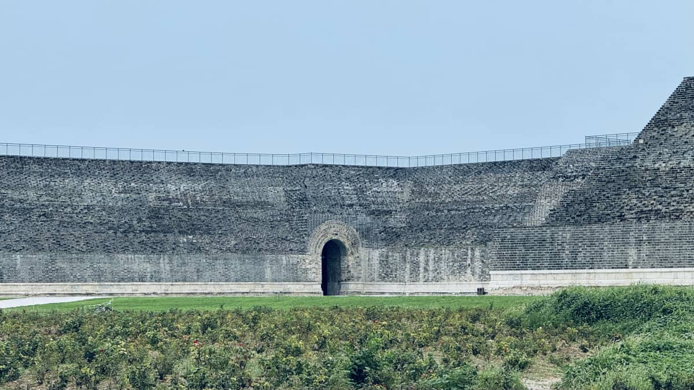
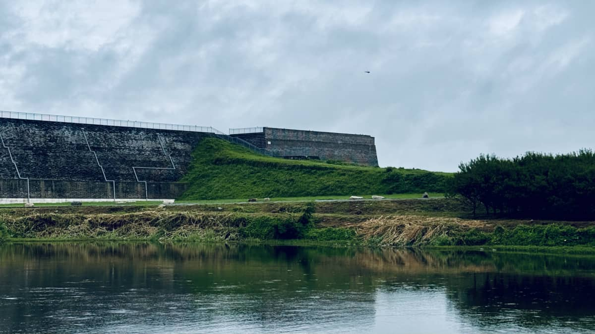
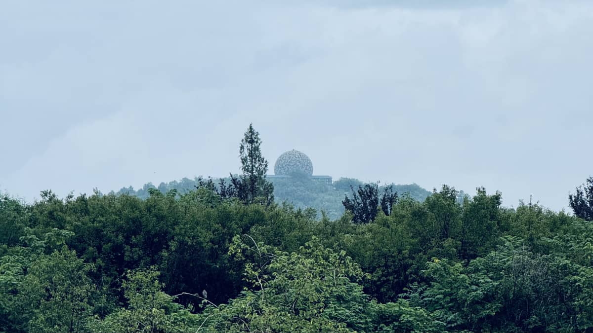
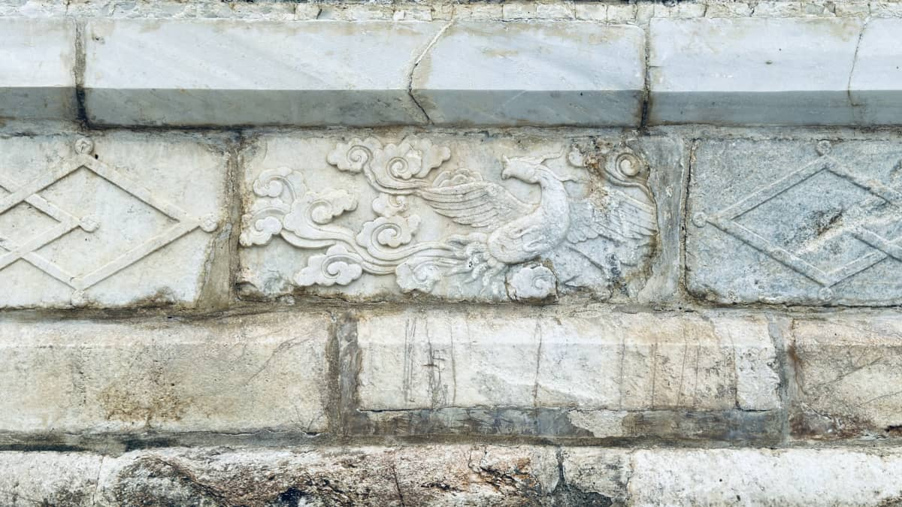
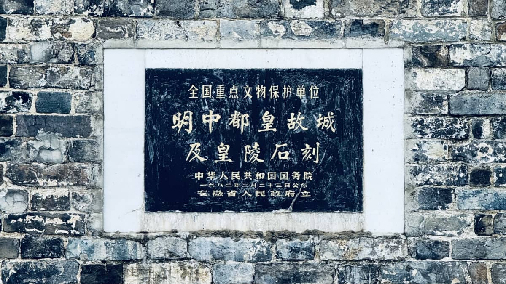
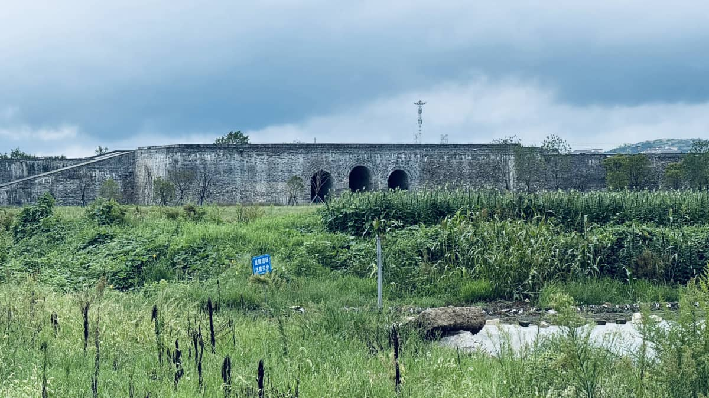
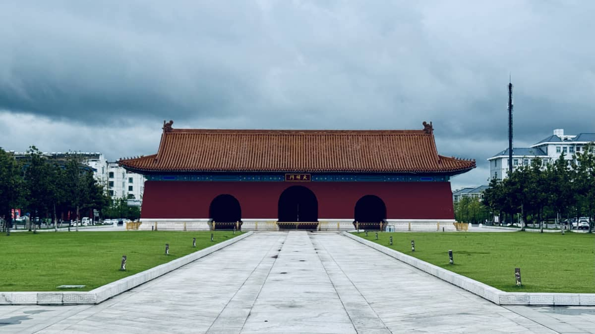
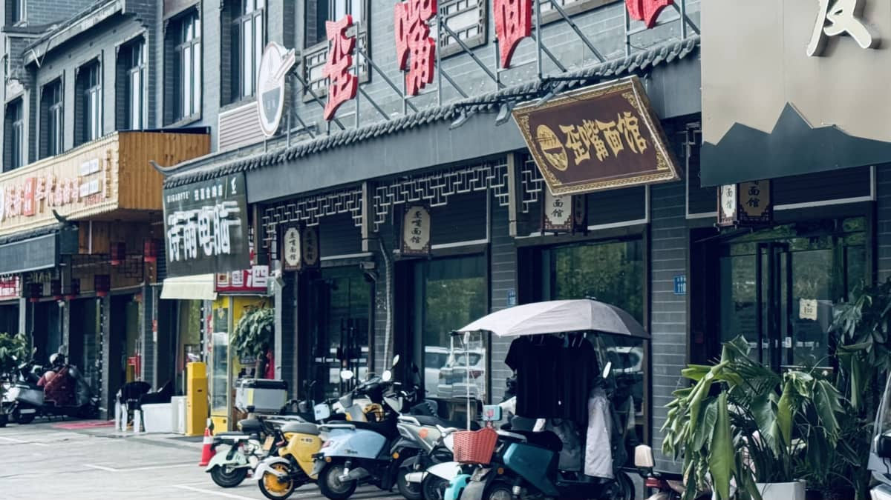
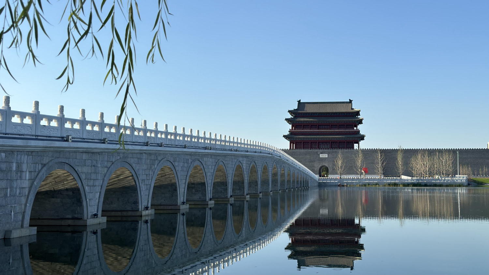

# 夏末雨后探寻凤阳明中都古城

### 明中都古皇城

明中都古皇城位于中国安徽省凤阳县，是明朝建立的第一个都城（1369-1375年），由明太祖朱元璋于1369年（洪武二年）开始营建，并对**后来的南京和北京两京的规划产生了深远影响**。该皇城在城市规划、建筑布局和石雕艺术方面都具有承前启后的地位，但历经破坏，现在主要剩下部分皇城城墙、城门、鼓楼台基和皇陵石雕等遗迹。

**早期都城典范：**明中都是明朝的第一座都城，明中都的都城建筑形制、宫殿布局、左右对称等特点，以及内金水河制度等，对后世的南京和北京的宫城规划产生了深刻影响。

目前主要保留有部分皇城城墙、城门（如北安门、东安门、西安门等），鼓楼台基以及皇陵石雕遗址。

由于大规模的拆城取砖和毁城耕田，明中都古皇城遭到严重破坏。

明中都的发掘填补了宋开封、金中都、元大都、明南京和明北京等重要都城的空白，体现了中华文明的连续性。

自2017年起，故宫博物院考古研究所与安徽省文物考古研究所合作开展了明中都遗址的考古工作，并取得重要成果。

### 周边

复建大明门。2024年，已完成钟楼文化广场、大明门实木建筑群等关联设施建设，形成"两楼三门三庙"的中轴线展示体系 。复建工程采用传统工艺，仅大明门便使用3000立方米金丝楠木。

凤阳山水库。

### 食

小红书多人推荐：歪嘴面馆。

面很劲道，特色白切鸡味道不错。

### 雨后天晴

凤阳洪武门是位于中国安徽省凤阳县的明中都外城南门，始建于洪武七年（1374年），是一座七开间三重檐楼阁式建筑，总高度达47.05米，现已重建，是明中都的标志性建筑之一。2020年凤阳县政府启动复建工程，三重檐规格高于北京正阳门，体现明初皇室营建水准。

