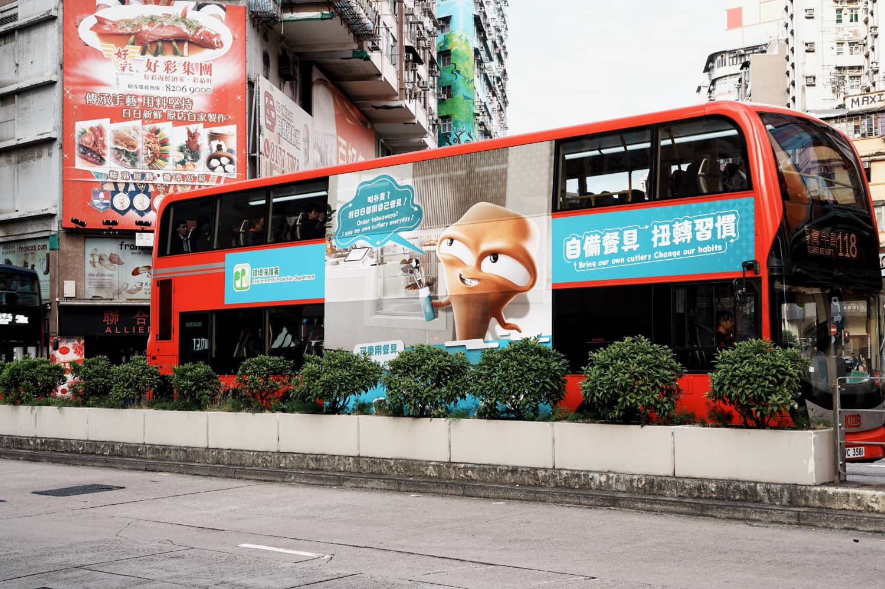
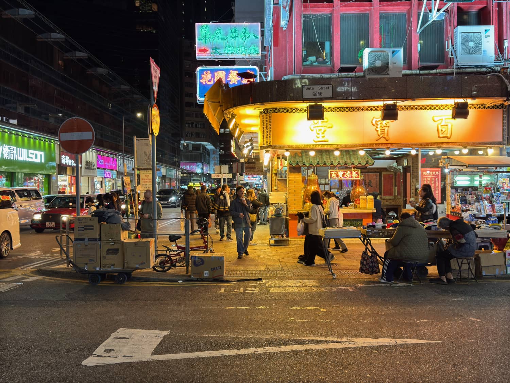

# **香港街景漫记：在繁华与市井之间**

### **1. 初抵香港：维港的昼与夜**

1月的香港，气温徘徊在15℃左右，微凉但不刺骨，很适合漫步。

放下行李，第一站直奔**维多利亚港**。

白天的维港是明信片般的蓝调——天星小轮缓缓驶过，对岸中环的摩天楼群倒映在水面，偶尔有海鸟掠过。而到了夜晚，这里便成了光的盛宴。**「幻彩咏香江」** 灯光秀如期上演，大厦外墙的LED屏变幻着图案，整个维港仿佛被注入了赛博朋克的生命力。

### **2. 旺角：霓虹迷宫与市井烟火**

如果说中环代表香港的精英面孔，那**旺角**就是它的市井灵魂。

走进**砵兰街**，霓虹招牌层层叠叠，繁体字灯箱在暮色中格外醒目。路边摊飘来鸡蛋仔的甜香，茶餐厅里的阿姐手脚麻利地端出冻柠茶。在**金鱼街**，一袋袋五彩斑斓的观赏鱼悬挂在店铺门口，宛如水中的霓虹；而**花园街**的排档上，堆满十元三对的袜子、老式收音机、还有各种叫不出名字的小玩意。

### **3. 中环：摩登都市的折叠面**

从旺角来到**中环**，仿佛穿越到了另一个世界。

这里玻璃幕墙的摩天大厦与百年石板路奇妙共存——**皇后大道中**西装革履的银行家匆匆走过，转角**嘉咸街**的涂鸦墙前却聚集着拍照的年轻人。乘半山自动扶梯上行，沿途会经过隐藏在写字楼群中的**大馆**，这座前警察总部改造的艺术区，将殖民时期的建筑与现代展览完美融合。傍晚时分的**兰桂坊**，happy hour的酒杯碰撞声与下班人群的谈笑声交织成独特的都市交响曲。

### **4. 香港迪士尼：造梦者的乐园**

离开都市丛林，来到**香港迪士尼乐园**，瞬间跌入童话世界。

虽然1月不是旺季，但乐园里依然洋溢着欢乐气息。**灰姑娘旋转木马**在夜幕下流光溢彩，**小小世界**的玩偶们用不同语言唱着同样的歌。最惊喜的是"星梦光影之旅"夜间灯光秀，城堡墙面变成巨幅画布，迪士尼经典角色随音乐跃动，让人暂时忘记现实世界的烦恼。

### **5. 再见香港：流动的盛宴**

离开那日，细雨又至。

站在**中环至半山自动扶梯**上回头看，雨中的城市像被罩上了一层磨砂玻璃。穿着校服的学生、拎着公文包的银行职员、推着行李的游客——所有人都在这个垂直都市里流动，如同永不停歇的齿轮。

海明威说巴黎是一席流动的盛宴，而香港何尝不是？它的味道藏在茶餐厅的菠萝油里，它的声音是叮叮车的“当当”响，它的记忆是霓虹熄灭后，那些依然亮着灯的唐楼窗格。

### **后记**

香港的矛盾与魅力，恰恰在于它既能容下金融中心的冷硬，又能妥帖收留市井的温热。1月的这次短暂停留，像翻开一本斑驳的旧书，每一页都写着不同的故事。
