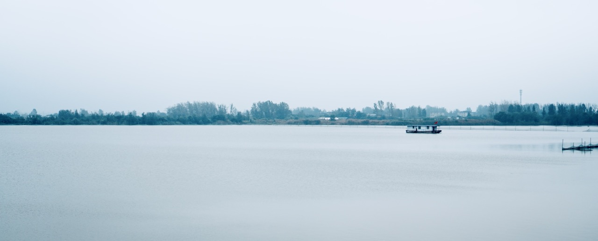
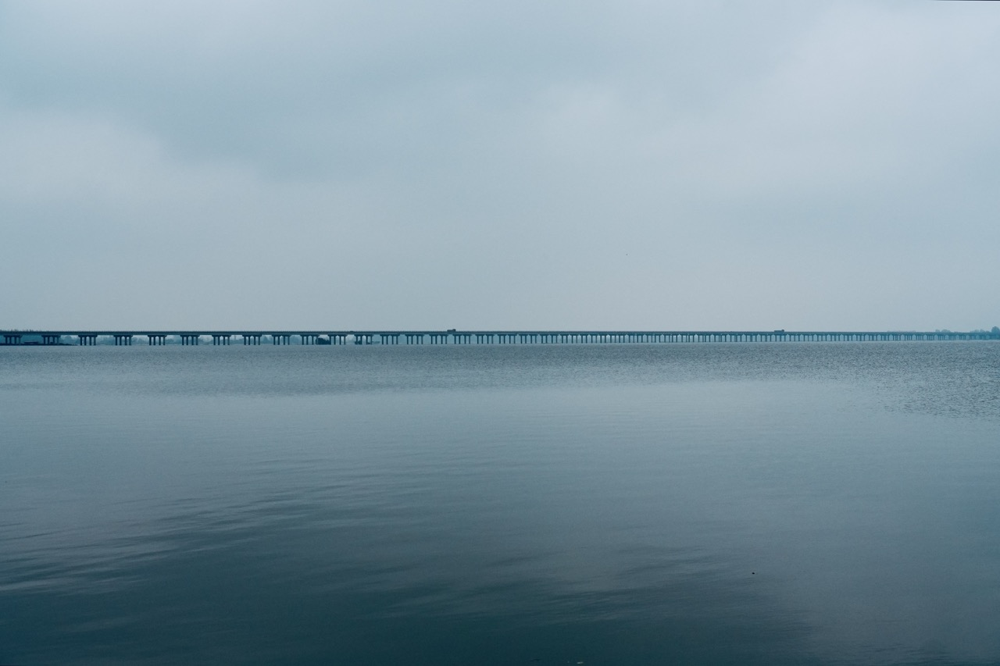
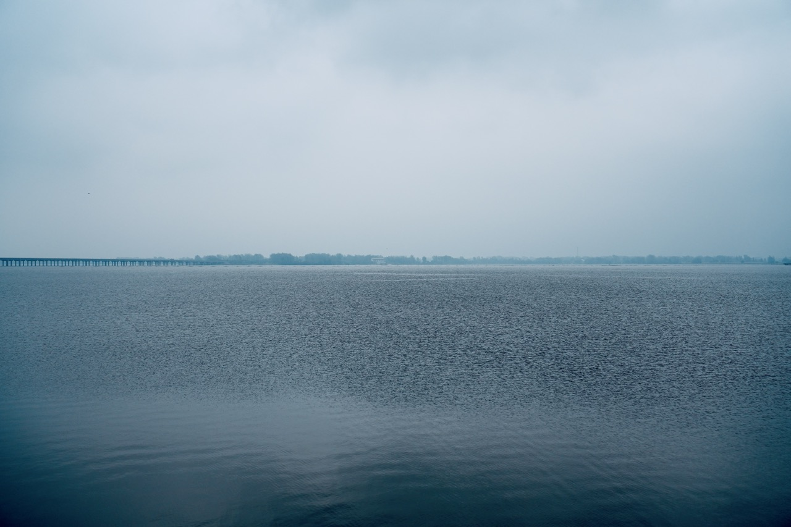
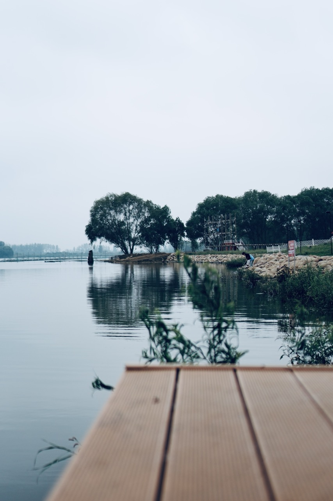
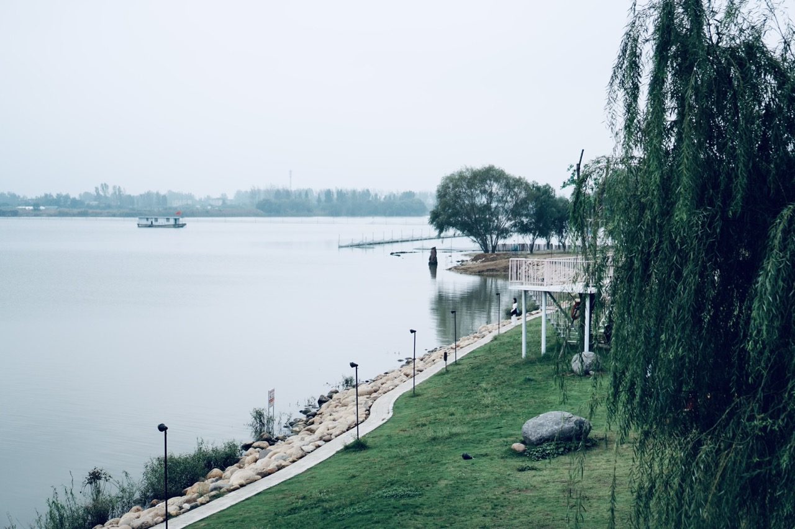
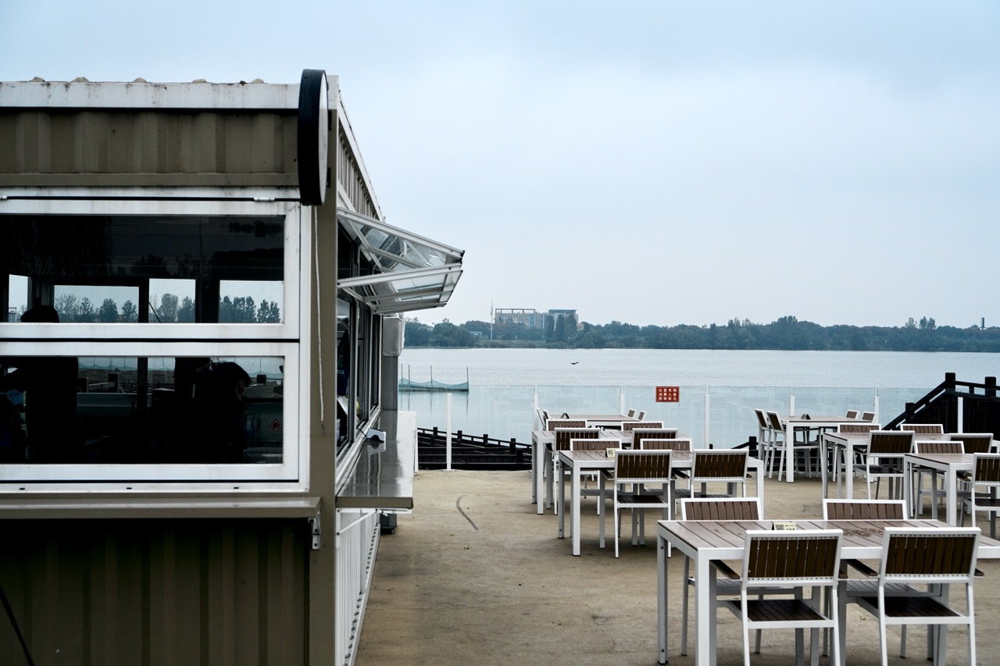
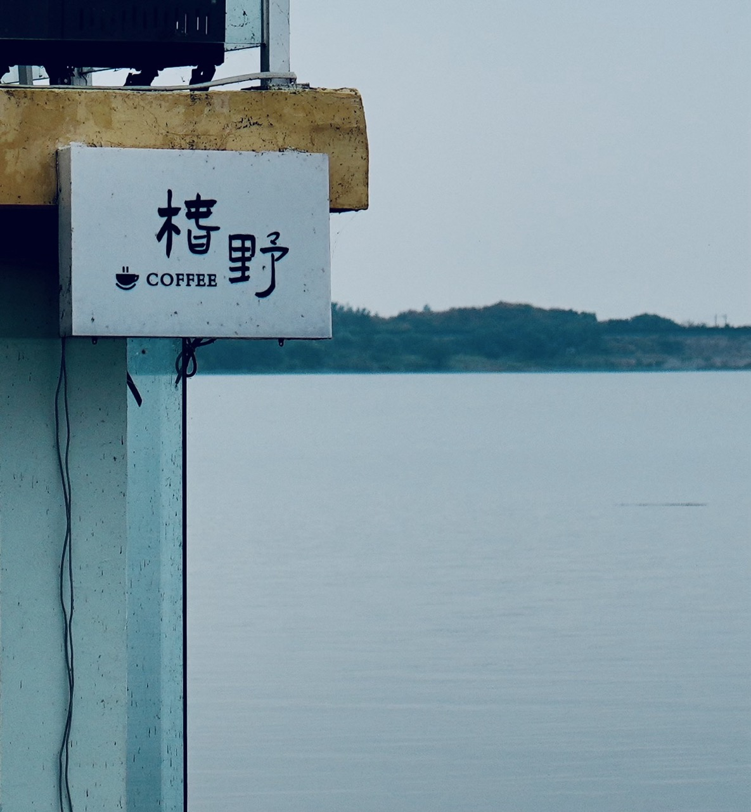
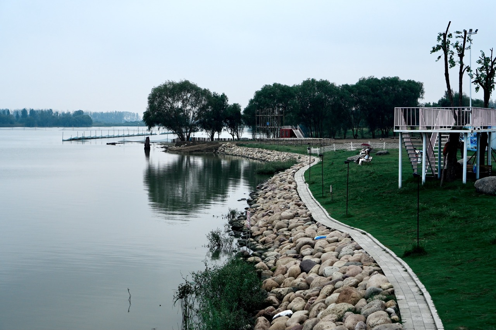
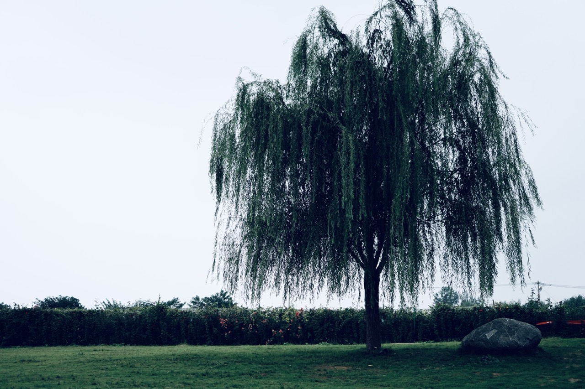
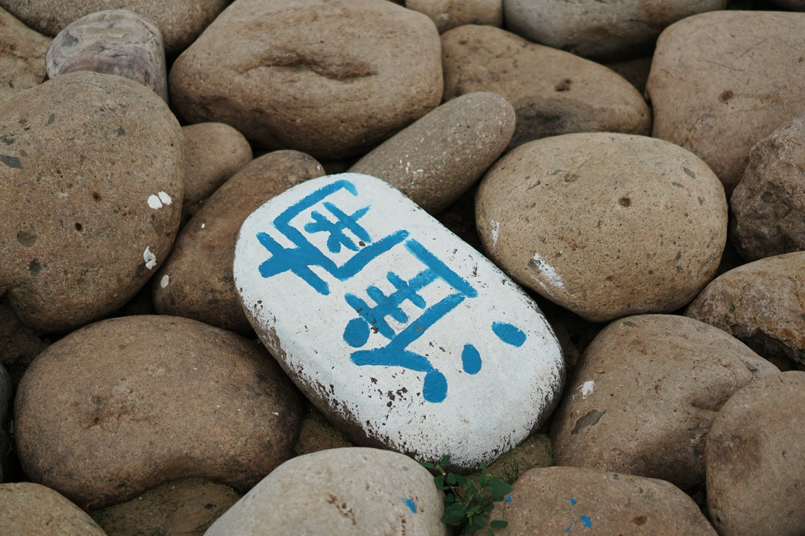

# 十一雨后浅游淮南小洱海

雨总是在十一月里带来一种特别的清冽。

这场雨过后，天并未彻底放晴，云层薄薄地摊开着，滤下柔白的光。去“小洱海”走走吧，早前刷到的短视频，名字听着像远方的许诺，倒要看看淮南的这片水，如何当得起这三个字。

第一眼看见的，果然是水。

雨后的水面，并非明信片里那种鲜亮的蓝，而是蒙着一层珍珠母贝般的银灰色调。没有风吹时，水面平整得像一块巨大的、磨砂的玻璃，倒映着天空的微光，沉静而内敛。

远处，几座覆着绿树的小岛静静地泊在水中央，轮廓在薄雾里显得有些朦胧，仿佛水墨画里淡淡的远山。这景致，没有洱海那般被阳光镀上的壮丽，却多了一份我们江淮地区独有的、湿润而温柔的亲切。

沿着水岸走，最先吸引目光的，是那间白色的河岸咖啡屋。

它静静地立在岸边，将外面的水光湖色尽数收纳。暖意与咖啡的醇香一同涌来。点一杯热饮，坐下。湖水如一幅缓缓流动的画卷。在这里，风景是免费的，而安静，是无价的。它不像一个纯粹的景点，更像一个精神的驿站，让匆匆的步履，得以在湖畔停靠。

咖啡屋外，是大片大片的河岸绿地。雨水洗过的草地，绿得格外鲜润，踩上去软绵绵的。

几颗大树点缀其间，叶子已在秋霜中染成深浅不一的红色，像一团团温和的火焰，在略显寂寥的冬日来临前，做着最后的、安静的燃烧。

有年轻父母带着孩子嬉笑跑过，他们的欢笑声，是这片静谧天地里最动听的配乐。

 

真正的风景，从来不在遥远的他方，而在你愿意为之驻足，并与之产生连接的此刻此地。

