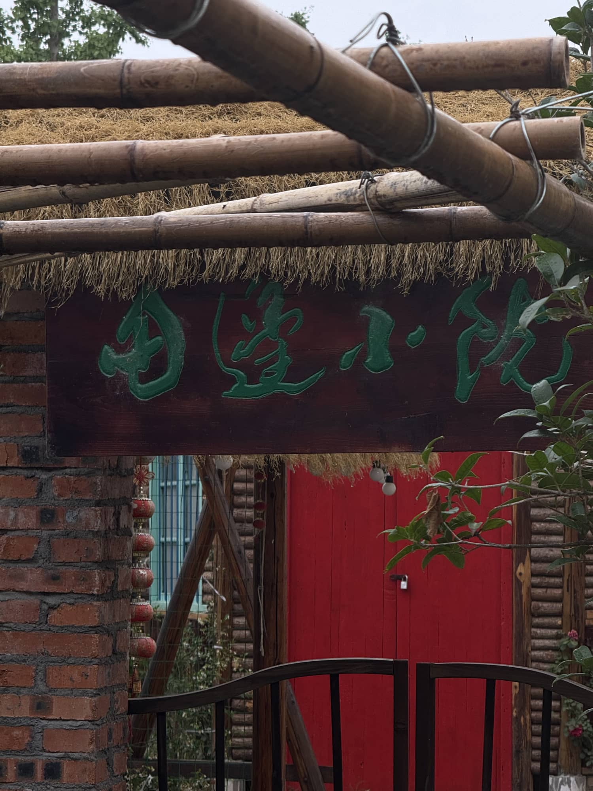

# 躺平式生活体验，一场滂沱雨后的田园邂逅

>   摄于2025年端午

端午时节，本该是暑气渐浓的日子，今年却格外不同。一场滂沱大雨过后，空气中弥漫着泥土与青草的芬芳，气温骤降至令人惊喜的凉爽。这样的天气，正适合一场说走就走的乡间探访。

驱车六十公里，沿着蜿蜒的乡道前行，目的地是五河县张许村的一处田边小院。

车窗外的风景由城市的钢筋水泥逐渐过渡到开阔的田野，心境也随之舒展。雨后的乡间，万物都被洗刷得格外清新，远处的山峦笼罩着一层薄雾，宛如水墨画中的意境。

这处隐匿在田园深处的小院，静静地等待着城市来客的造访。推开吱呀作响的木门，映入眼帘的是几畦整齐的菜地，雨珠还挂在菜叶上，在阳光下闪烁着晶莹的光芒。院角的老槐树投下斑驳的树影，树下一张粗糙的木桌，几把藤椅，构成了一幅理想的田园图景。

在这里，时间仿佛被拉长。没有急促的闹钟，没有拥挤的地铁，只有风吹过稻田的沙沙声，和偶尔传来的几声鸡鸣犬吠。坐在院中的老藤椅上，捧一杯清茶，看云卷云舒，这种"躺平"不是消极的逃避，而是一种对生活本质的回归。

乡居生活的魅力，或许就在于它的简单与真实。在这里，一餐简单的农家饭菜，胜过城市里的山珍海味；一夜无梦的安眠，抵得过最豪华的酒店套房。当夜幕降临，满天繁星取代了霓虹灯光，虫鸣蛙叫代替了车水马龙，人才会惊觉：原来生活可以如此纯粹。

这场突如其来的凉爽，这场说走就走的乡间之旅，给了我们一个重新审视生活的契机。在这个快节奏的时代，偶尔的"躺平"不是懈怠，而是为了更好的前行。

田园生活的美好，不在于它的与世隔绝，而在于它让我们记起了生活最初的模样。

