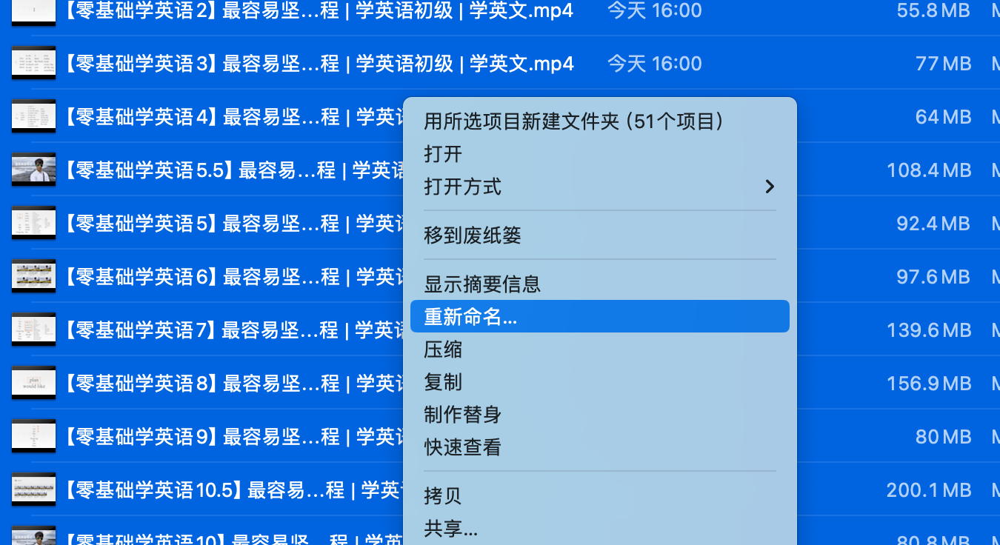
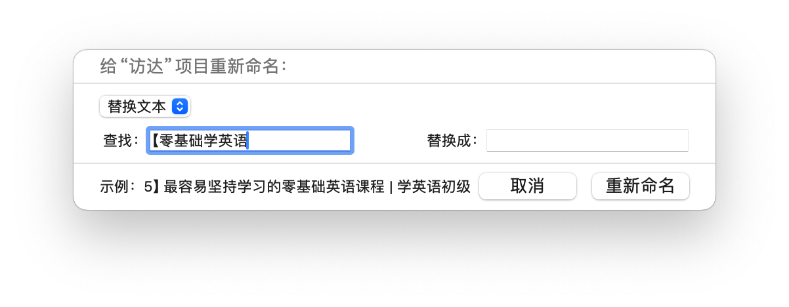
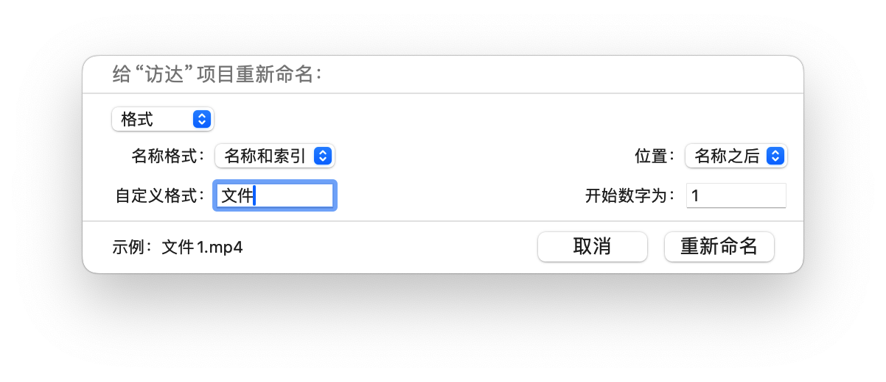

# MacOS文件批量重命名


### 访达内直接操作

1.  在 Mac 上，选择项目，然后按住 Control 键点按其中一个项目。
2.  在快捷键菜单中，选取“重新命名”。



3.   在“给访达项目重新命名”下方的弹出式菜单中，选择替换名称中的文本、给名称添加文本或更改名称格式。

-   *替换文本：*在“查找”栏中输入要移除的文本，然后在“替换成”栏中输入要添加的文本。



-   *添加文本：*在栏中输入要添加的文本，然后选取将文本添加到当前名称之前或之后。


-   *格式：*选取文件的名称格式，然后选取将索引、计数或日期放在名称之前或之后。在“自定义格式”栏中输入名称，然后输入你想要开始的数字。



4.   点按“重新命名”。


### 终端内操作

1.   打开MacOS终端，输入命令前往文件夹。

```shell
cd XXXX #进入目录
```

2.   输入以下命令，进行批量重命名，支持正则。

```shell
for file in *; do mv "$file" "$(echo $file | sed 's/^......//')"; done
```

其中，`for file in *;` 循环目录内所有文件。

`sed 's/^......//')`这部分是进行文件名的匹配操作。

具体的正则表达式用法，请 [查看此文](../../program/regexp/index.md)。