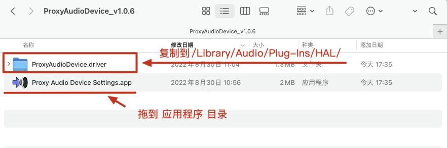
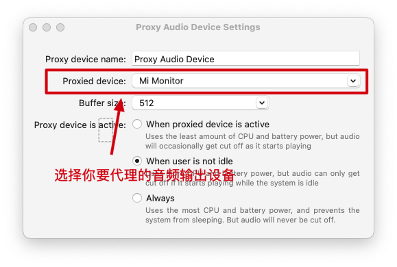
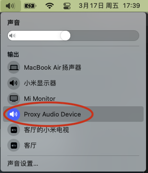

# 解决macos系统采用hdmi音频输出时音量无法调节的问题


### 安装驱动代理音频驱动程序

>   macos 13.2.1实测有效
>
>   同时也是目前最简单且无需安装其他应用程序，直接可以使用系统内置音量调节的方式。

这是一种针对 macOS 的硬件抽象层虚拟音频驱动程序，它可以将所有输出发送到另一个音频设备。其主要目的是使得 macOS 的系统音量控制功能（例如音量菜单栏图标或音量键盘按键）可以用于更改不允许使用该功能的外部音频接口的音量。它可能也有其他用途。

1.   从这个 GitHub 库下载最新版本：[https://github.com/briankendall/proxy-audio-device/releases/tag/v1.0.6](https://github.com/briankendall/proxy-audio-device/releases/tag/v1.0.6)。
2.   下载后（ProxyAudioDevice_v1.0.6.zip），解开zip压缩包。



3.   如图所示，将 ProxyAudioDriver.driver 目录移动到 /Library/Audio/Plug-Ins/HAL 中。

>   如果 HAL 目录不存在，请创建它。打开终端窗口，执行以下命令，并在提示时输入管理员密码。

```	shell
sudo mkdir /Library/Audio/Plug-Ins/HAL
```

4.   执行以下命令，更新系统音频设备

``` shell
sudo launchctl kickstart -k system/com.apple.audio.coreaudiod 
```

5.   启动 Proxy Audio Device Setting.app，配置代理输出设备的名称。驱动程序将代理到哪个输出设备以及要设置多大的音频缓冲区。



6.   在系统栏“声音”选项中测试是否正常工作。

