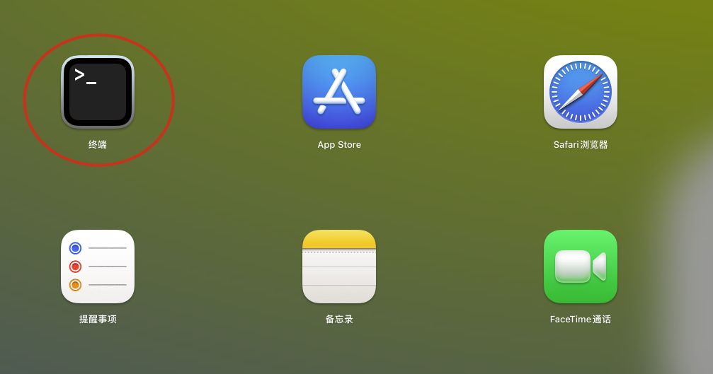
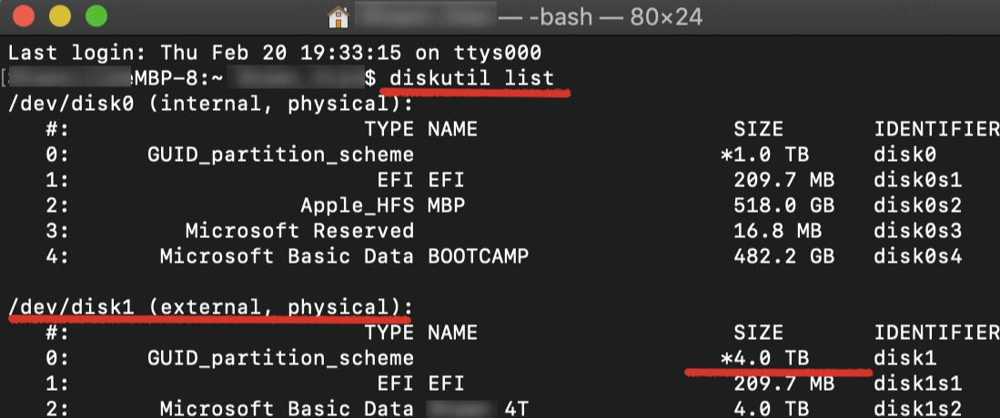

## App启动时提示文件已损坏


打开终端；

输入以下命令，回车；

```
sudo xattr -d com.apple.quarantine /Applications/xxxx.app
```

注意：/Applications/xxxx.app 换成你的App路径（推荐直接将.app文件拖入终端中自动生成路径，以防空格等转义字符手动复制或输入出现错误）

重启App即可。


## 如何开启或关闭系统SIP


### 关闭 SIP

重启电脑，然后按住 Command + R 键不动，m1芯片的mac，按住电源键不放，电脑会进入到恢复模式，点击顶部菜单栏的【实用工具】，再点击【终端】。

在终端中输入命令：

```shell
csrutil disable 
```

然后按回车。重启电脑回到正常的Mac系统，这样就关闭了SIP保护。


### 打开 SIP

步骤和上面的方法一样，只需要在执行命令的时候输入：

```shell
csrutil enable
```


### 如何检查SIP状态？

打开终端，输入：

```shell
csrutil status
```


显示：System Integrity Protection status: enabled. 就是未关闭；

显示：System Integrity Protection status: disabled. 就是已关闭；


## 外接移动硬盘无法装载


连接移动硬盘到Mac电脑，打开电脑上的【终端】。 



**依次输入以下命令:**

查看是否有fsck进程列表弹出

```shell
ps aux | grep fsck
```

若有，杀死所有fsck进程

```shell
sudo pkill -f fsck
```

列出电脑中的磁盘，之后根据磁盘容量或磁盘名等信息确定磁盘编号

```shell
diskutil list
```

 



若确定移动硬盘编号`/dev/disk1`（请根据自己的实际情况更换该硬盘编号）

```shell
sudo diskutil mount /dev/disk1
```

拔除硬盘再重新连接，此时就能装载成功。