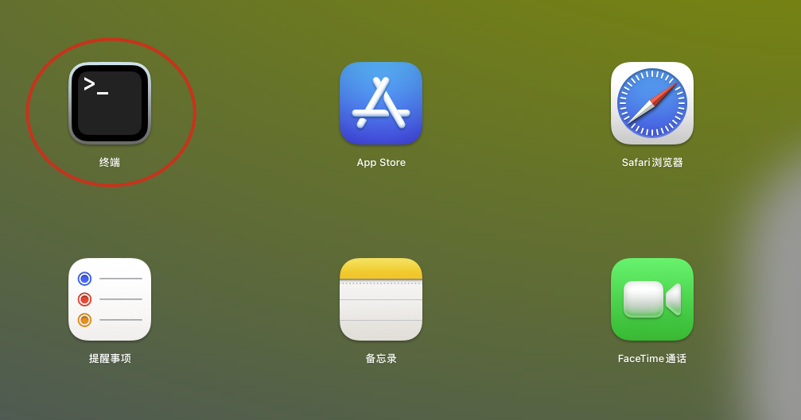

# 外接移动硬盘无法装载


连接移动硬盘到Mac电脑，打开电脑上的【终端】。 



**依次输入以下命令:**

查看是否有fsck进程列表弹出

```shell
ps aux | grep fsck
```

若有，杀死所有fsck进程

```shell
sudo pkill -f fsck
```

列出电脑中的磁盘，之后根据磁盘容量或磁盘名等信息确定磁盘编号

```shell
diskutil list
```

 


若确定移动硬盘编号`/dev/disk1`（请根据自己的实际情况更换该硬盘编号）

```shell
sudo diskutil mount /dev/disk1
```

拔除硬盘再重新连接，此时就能装载成功。