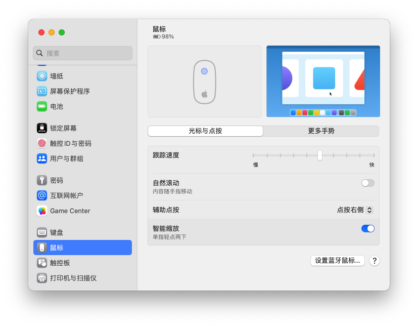

# 解决macos系统蓝牙或妙控鼠标跟踪移动速度不灵敏问题

如果你和我一样从有线鼠标切换到蓝牙鼠标或苹果自己的妙控鼠标，一定会发现鼠标移动速度不灵敏的问题非常严重。通常你会到系统设置里调整鼠标的跟踪速度。可惜的是，即使调整到最大值也没有明显改善。

这时，你需要打开【终端】工具，
1. 输入以下命令：

```
# 设置鼠标跟踪速度为6.0，系统默认最大值为3.0
defaults write .GlobalPreferences com.apple.mouse.scaling 6.0
```

2. 按回车键执行。
3. 重启电脑。

> 注意：在终端命令修改数值后，请勿在系统设置内调整跟踪速度，否则会恢复默认值。                  

