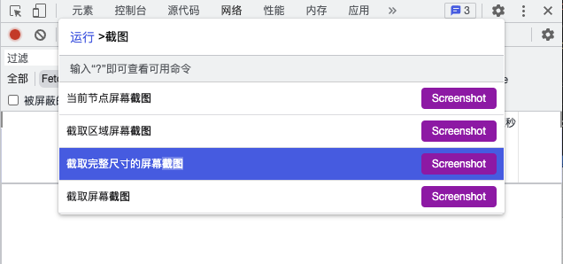
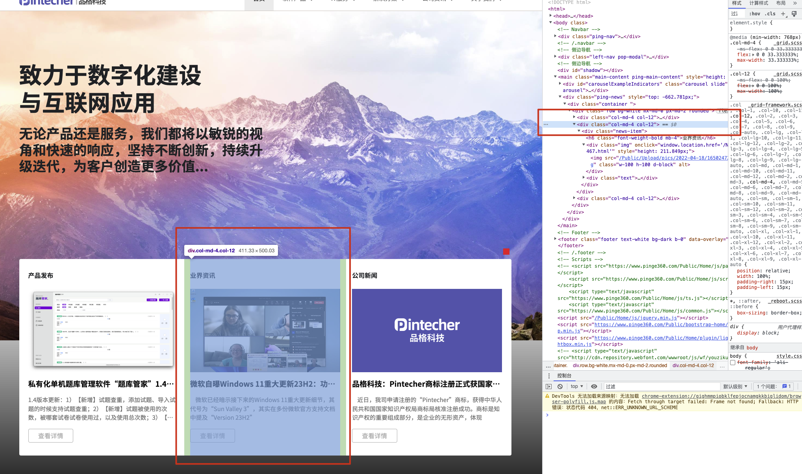
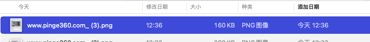
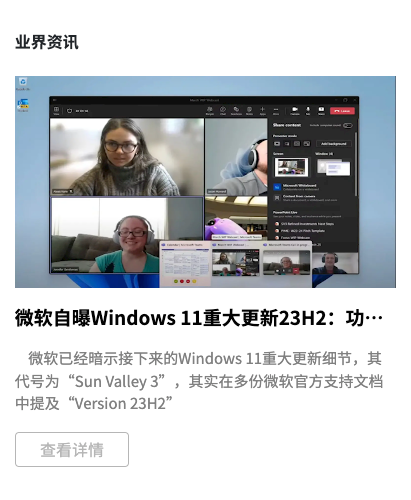

---
description:chrome内置的网页截图工具,chrome内置强大网页截图工具,chrome全页面滚动截图工具
---

# chrome内置强大网页截图工具

### 使用步骤

记住2个快捷键轻松实现强大的网页屏幕截图。

1.   启动chrome
2.   按 `command+option+i(macos)` 或 `F12(windows)` 开启开发者工具
3.   按 `command+shift+p(macos)` 或 `ctrl+shift+p(windows)` 进入命令行
4.   输入 `截图`

您将会看到下图所示四个选项。

### 截取完整尺寸的屏幕截图

点击该选项，你可以获得当前网页“从头到脚”的全尺寸完整截图。

**如图所示**

### 截取屏幕截图

即当前视窗可见范围的网页截图。

**如图所示**

### 截取区域屏幕截图

选择该选项后，你可以在网页视窗内使用鼠标框选截图范围。

**如图所示**

### 当前节点屏幕截图

最厉害的可能就是这个选项了，它可以帮助你按所选的`网页节点`进行截图。

例如，在 `元素` 窗口，找到我们需要截图的 `DOM节点`。点击选中该节点。

然后：

1.   按 `command+shift+p` 进入命令行

2.   输入 `截图`

3.   选择 `当前节点屏幕截图`

此时，你会自动获得你所需要的那个节点部分的截图。

