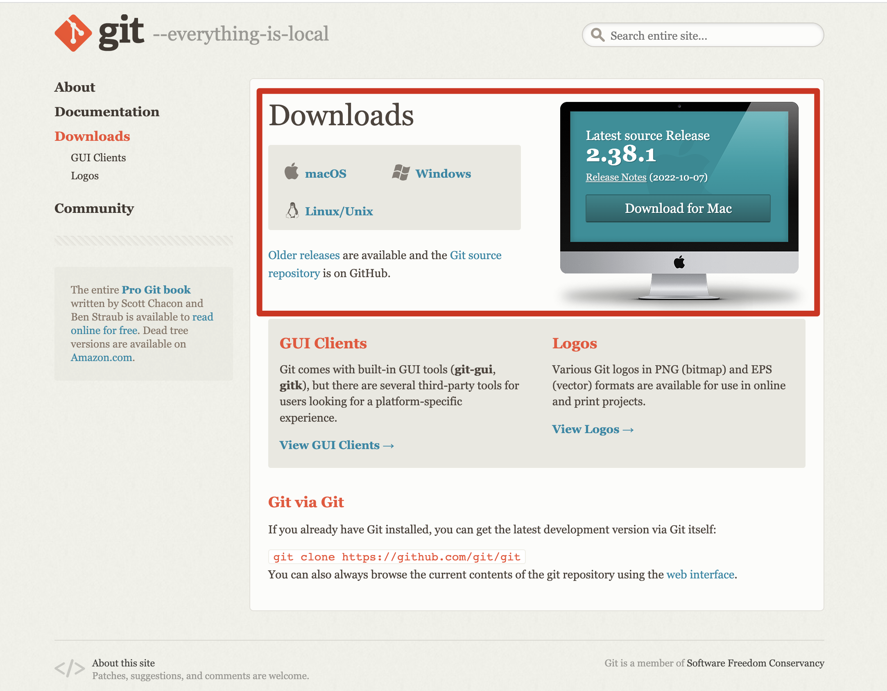
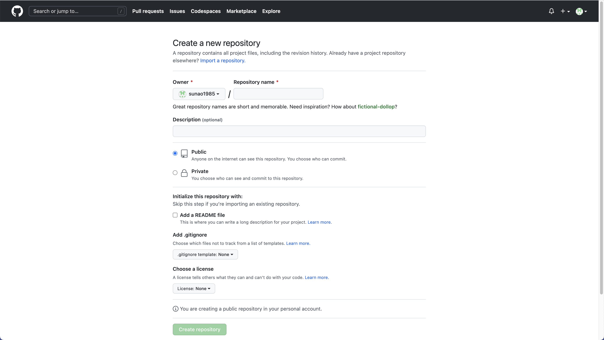
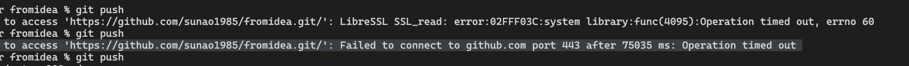
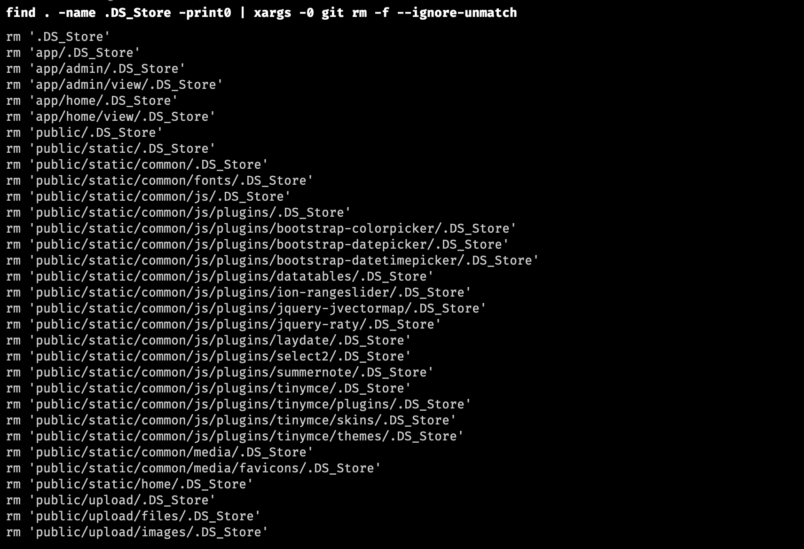

## 什么是Git？

Git 是一个开源的**分布式版本控制系统**。

Git 与常用的版本控制工具 CVS, Subversion 等不同，它采用了分布式版本库的方式，**不必服务器端软件支持**。


## Git 与 SVN 区别

1、**Git 是分布式的，SVN 不是**：这是 Git 和其它非分布式的版本控制系统，例如 SVN，CVS 等，最核心的区别。

2、**Git 把内容按元数据方式存储，而 SVN 是按文件**：所有的资源控制系统都是把文件的元信息隐藏在一个类似 .svn、.cvs 等的文件夹里。

3、**Git 分支和 SVN 的分支不同**：分支在 SVN 中一点都不特别，其实它就是版本库中的另外一个目录。

4、**Git 没有一个全局的版本号，而 SVN 有**：目前为止这是跟 SVN 相比 Git 缺少的最大的一个特征。

5、**Git 的内容完整性要优于 SVN**：Git 的内容存储使用的是 SHA-1 哈希算法。这能确保代码内容的完整性，确保在遇到磁盘故障和网络问题时降低对版本库的破坏。


## Git 安装

访问[https://git-scm.com/downloads](https://git-scm.com/downloads)选择对应平台下载安装




## Git 配置

Git 提供了一个叫做 git config 的工具，专门用来配置或读取相应的工作环境变量。

这些环境变量，决定了 Git 在各个环节的具体工作方式和行为。这些变量可以存放在以下三个不同的地方：

-   `/etc/gitconfig` 文件：系统中对所有用户都普遍适用的配置。若使用 `git config` 时用 `--system` 选项，读写的就是这个文件。
-   `~/.gitconfig` 文件：用户目录下的配置文件只适用于该用户。若使用 `git config` 时用 `--global` 选项，读写的就是这个文件。
-   当前项目的 Git 目录中的配置文件（也就是工作目录中的 `.git/config` 文件）：这里的配置仅仅针对当前项目有效。每一个级别的配置都会覆盖上层的相同配置，所以 `.git/config` 里的配置会覆盖 `/etc/gitconfig` 中的同名变量。


**配置个人的用户名称和电子邮件地址：**

```shell
git config --global user.name "..."
git config --global user.email ...@...
```

>如果用了 **--global** 选项，那么更改的配置文件就是位于你用户主目录下的那个，以后你所有的项目都会默认使用这里配置的用户信息。
>
>如果要在某个特定的项目中使用其他名字或者电邮，只要去掉 --global 选项重新配置即可，新的设定保存在当前项目的 .git/config 文件里。


**查看配置信息**

要检查已有的配置信息，可以使用 git config --list 命令：

```shell
git config --list
```

>有时候会看到重复的变量名，那就说明它们来自不同的配置文件（比如 /etc/gitconfig 和 ~/.gitconfig），不过最终 Git 实际采用的是最后一个。

这些配置我们也可以在 **~/.gitconfig** 或 **/etc/gitconfig** 看到，如下所示：

```shell
vim ~/.gitconfig 
```

显示内容如下：

```
[http]
    postBuffer = 2M
[user]
    name = runoob
    email = test@runoob.com
```


## Git 工作流程

-   克隆 Git 资源作为项目目录。
-   在克隆的资源上添加或修改文件。
-   如果其他人修改了，你可以更新资源。
-   在提交前查看修改。
-   提交修改。
-   在修改完成后，如果发现错误，可以撤回提交并再次修改并提交。


## Git 工作区、暂存区和版本库

-   **工作区**：就是你在电脑里能看到的目录。
-   **暂存区**：英文叫 stage 或 index。一般存放在 **.git** 目录下的 index 文件（.git/index）中，所以我们把暂存区有时也叫作索引（index）。
-   **版本库**：工作区有一个隐藏目录 **.git**，这个不算工作区，而是 Git 的版本库。


## Git 创建仓库

Git 使用 git init 命令来初始化一个 Git 仓库，Git 的很多命令都需要在 Git 的仓库中运行，所以 git init 是使用 Git 的第一个命令。

首先，进入你的项目根目录。然后输入以下命令：

```shell
git init
```

该命令执行完后会在当前目录生成一个 .git 目录。

如果当前目录下有几个文件想要纳入版本控制，需要先用 git add 命令告诉 Git 开始对这些文件进行跟踪，然后提交：

```shell
git add *.c
git add README
git commit -m '初始化项目版本'
```


**git clone**

我们使用 git clone 从现有 Git 仓库中拷贝项目（类似 svn checkout）。

```shell
git clone <repo> <directory>
```

**参数说明：**

-   **repo**：Git 仓库。
-   **directory**：本地目录。


**git config**

git 的设置使用 git config 命令。

显示当前的 git 配置信息：

```shell
git config --list

credential.helper=osxkeychain
core.repositoryformatversion=0
core.filemode=true
core.bare=false
core.logallrefupdates=true
core.ignorecase=true
core.precomposeunicode=true
```

编辑 git 配置文件:

```shell
git config -e    # 针对当前仓库 
```

或

```shell
git config -e --global   # 针对系统上所有仓库
```

设置提交代码时的用户信息：

```shell
git config --global user.name "..."
git config --global user.email ...@...
```

如果去掉 **--global** 参数只对当前仓库有效。


## Git 基本操作

Git 常用的是以下 6 个命令：

-   git clone
-   git push
-   git add 
-   git commit
-   git checkout
-   git pull


**一个简单的操作步骤：**

``` shell
git init # 初始化仓库。
git add . # 添加文件到暂存区。
git commit # 将暂存区内容添加到仓库中。
```


##### **创建仓库命令**

| 命令        | 说明                                   |
| :---------- | :------------------------------------- |
| `git init`  | 初始化仓库                             |
| `git clone` | 拷贝一份远程仓库，也就是下载一个项目。 |


##### **提交与修改**

| 命令         | 说明                                                         |
| :----------- | :----------------------------------------------------------- |
| `git add`    | 添加文件到暂存区<br />（--all 全部文件）                     |
| `git status` | 查看仓库当前的状态，显示有变更的文件。<br />（-s 简短输出）  |
| `git diff`   | 比较文件的不同，即暂存区和工作区的差异。<br />（--cached 已缓存的，HEAD 已缓存和未缓存的，--stat 显示摘要） |
| `git commit` | 提交暂存区到本地仓库。<br />（-m 添加备注信息，-a 免执行add命令，) |
| `git reset`  | 回退版本。<br />（--soft 回退到某个版本，--head 撤销未提交的修改) |
| `git rm`     | 将文件从暂存区和工作区中删除。<br />（-f 强制删除，-r 递归删除，--cached 从暂存区域移除） |
| `git mv`     | 移动或重命名工作区文件。<br />（-f 强制移动，即使新文件名已存在） |


##### 提交前查看更改

在 git commit 前查看更改了哪些文件，可以使用 `git status` 和 `git diff` 命令来查看。

首先，使用 `git status` 命令查看当前在工作目录中修改或添加了哪些文件。

```
git status
```

这时 Git 会列出哪些文件被修改或添加。假设你修改了 `app.js` 和 `style.css` 文件。

然后，使用 `git diff` 命令查看修改的具体内容，包括文件中哪些行被修改了、添加了哪些行、删除了哪些行等。

```
git diff
```

如果你只想查看修改了哪些文件，可以加上 `--name-only` 参数。

```
git diff --name-only
```

这样 Git 就只会列出被修改的文件名。

另外，如果你只关注某个特定文件的修改，可以直接指定文件名，如下所示：

```
git diff app.js
```

这会显示 `app.js` 文件的修改内容。如果你已经修改了文件并使用 `git add` 命令将其添加到了暂存区，那么可以使用 `--cached` 参数来查看将要提交的更改。

```
git diff --cached
```

这样 Git 就会列出已经添加到暂存区的修改内容。


##### **提交日志**

| 命令        | 说明                                 |
| :---------- | :----------------------------------- |
| `git log`   | 查看历史提交记录                     |
| `git blame` | 以列表形式查看指定文件的历史修改记录 |


##### **远程操作**

| 命令         | 说明               |
| :----------- | :----------------- |
| `git remote` | 远程仓库操作       |
| `git fetch`  | 从远程获取代码库   |
| `git pull`   | 下载远程代码并合并 |
| `git push`   | 上传远程代码并合并 |


## Git 分支管理

几乎每一种版本控制系统都以某种形式支持分支，一个分支代表一条独立的开发线。

使用分支意味着你可以从开发主线上分离开来，然后在不影响主线的同时继续工作。

有人把 Git 的分支模型称为**必杀技特性**，而正是因为它，将 **Git** 从版本控制系统家族里区分出来。


##### **创建分支命令：**

```shell
git branch (branchname)
```


##### **切换分支命令:**

当你切换分支的时候，Git 会用该分支的最后提交的快照替换你的工作目录的内容， 所以多个分支不需要多个目录。

```shell
git checkout (branchname)
```


##### **合并分支命令:**

你可以多次合并到统一分支， 也可以选择在合并之后直接删除被并入的分支。

```shell
git merge 
```


开始前我们先创建一个测试目录：

```shell
$ mkdir gitdemo
$ cd gitdemo/
$ git init
Initialized empty Git repository...
$ touch README
$ git add README
$ git commit -m '第一次版本提交'
[master (root-commit) 3b58100] 第一次版本提交
 1 file changed, 0 insertions(+), 0 deletions(-)
 create mode 100644 README
```


##### **列出分支**

```shell
$ git branch
* master
```

没有参数时，**git branch** 会列出你在本地的分支。

此例的意思就是，我们有一个叫做 **master** 的分支，并且该分支是当前分支。

当你执行 **git init** 的时候，默认情况下 Git 就会为你创建 **master** 分支。

如果我们要手动创建一个分支。执行 **git branch (branchname)** 即可。

```shell
$ git branch testing
$ git branch
* master
  testing
```

现在我们可以看到，有了一个新分支 **testing**。

当你以此方式在上次提交更新之后创建了新分支，如果后来又有更新提交， 然后又切换到了 **testing** 分支，Git 将还原你的工作目录到你创建分支时候的样子。

接下来我们将演示如何切换分支，我们用 git checkout (branch) 切换到我们要修改的分支。

```shell
$ ls
README
$ echo 'runoob.com' > test.txt
$ git add .
$ git commit -m 'add test.txt'
[master 3e92c19] add test.txt
 1 file changed, 1 insertion(+)
 create mode 100644 test.txt
$ ls
README        test.txt
$ git checkout testing
Switched to branch 'testing'
$ ls
README
```

当我们切换到 **testing** 分支的时候，我们添加的新文件 test.txt 被移除了。切换回 **master** 分支的时候，它们又重新出现了。

```shell
$ git checkout master
Switched to branch 'master'
$ ls
README        test.txt
```

我们也可以使用 git checkout -b (branchname) 命令来创建新分支并立即切换到该分支下，从而在该分支中操作。

```shell
$ git checkout -b newtest
Switched to a new branch 'newtest'
$ git rm test.txt 
rm 'test.txt'
$ ls
README
$ touch runoob.php
$ git add .
$ git commit -am 'removed test.txt、add runoob.php'
[newtest c1501a2] removed test.txt、add runoob.php
 2 files changed, 1 deletion(-)
 create mode 100644 runoob.php
 delete mode 100644 test.txt
$ ls
README        runoob.php
$ git checkout master
Switched to branch 'master'
$ ls
README        test.txt
```

如你所见，我们创建了一个分支，在该分支上移除了一些文件 test.txt，并添加了 runoob.php 文件，然后切换回我们的主分支，删除的 test.txt 文件又回来了，且新增加的 runoob.php 不存在主分支中。

使用分支将工作切分开来，从而让我们能够在不同开发环境中做事，并来回切换。


##### **删除分支**

```shell
git branch -d (branchname)
```

例如我们要删除 testing 分支：

```shell
$ git branch
* master
  testing
$ git branch -d testing
Deleted branch testing (was 85fc7e7).
$ git branch
* master
```


##### **分支合并**

```shell
git merge
```

```shell
$ git branch
* master
  newtest
$ ls
README        test.txt
$ git merge newtest
Updating 3e92c19..c1501a2
Fast-forward
 runoob.php | 0
 test.txt   | 1 -
 2 files changed, 1 deletion(-)
 create mode 100644 runoob.php
 delete mode 100644 test.txt
$ ls
README        runoob.php
```

以上实例中我们将 newtest 分支合并到主分支去，test.txt 文件被删除。

合并完后就可以删除分支:

```shell
$ git branch -d newtest
Deleted branch newtest (was c1501a2).
```

删除后， 就只剩下 master 分支了：

```shell
$ git branch
* master
```


##### **合并冲突**

合并并不仅仅是简单的文件添加、移除的操作，Git 也会合并修改。

```shell
$ git branch
* master
$ cat runoob.php
```

首先，我们创建一个叫做 change_site 的分支，切换过去，我们将 runoob.php 内容改为:

```shell
<?php
echo 'runoob';
?>
```

创建 change_site 分支：

```shell
$ git checkout -b change_site
Switched to a new branch 'change_site'
$ vim runoob.php
$ head -3 runoob.php
<?php
echo 'runoob';
?>
$ git commit -am 'changed the runoob.php'
[change_site 7774248] changed the runoob.php
 1 file changed, 3 insertions(+)
```

将修改的内容提交到 change_site 分支中。 现在，假如切换回 master 分支我们可以看内容恢复到我们修改前的(空文件，没有代码)，我们再次修改 runoob.php 文件。

```shell
$ git checkout master
Switched to branch 'master'
$ cat runoob.php
$ vim runoob.php    # 修改内容如下
$ cat runoob.php
<?php
echo 1;
?>
$ git diff
diff --git a/runoob.php b/runoob.php
index e69de29..ac60739 100644
--- a/runoob.php
+++ b/runoob.php
@@ -0,0 +1,3 @@
+<?php
+echo 1;
+?>
$ git commit -am '修改代码'
[master c68142b] 修改代码
 1 file changed, 3 insertions(+)
```

现在这些改变已经记录到我的 "master" 分支了。接下来我们将 "change_site" 分支合并过来。

```shell
$ git merge change_site
Auto-merging runoob.php
CONFLICT (content): Merge conflict in runoob.php
Automatic merge failed; fix conflicts and then commit the result.

$ cat runoob.php     # 打开文件，看到冲突内容
<?php
<<<<<<< HEAD
echo 1;
=======
echo 'runoob';
>>>>>>> change_site
?>
```

我们将前一个分支合并到 master 分支，一个合并冲突就出现了，接下来我们需要手动去修改它。

```shell
$ vim runoob.php 
$ cat runoob.php
<?php
echo 1;
echo 'runoob';
?>
$ git diff
diff --cc runoob.php
index ac60739,b63d7d7..0000000
--- a/runoob.php
+++ b/runoob.php
@@@ -1,3 -1,3 +1,4 @@@
  <?php
 +echo 1;
+ echo 'runoob';
  ?>
```

在 Git 中，我们可以用 git add 要告诉 Git 文件冲突已经解决

```shell
$ git status -s
UU runoob.php
$ git add runoob.php
$ git status -s
M  runoob.php
$ git commit
[master 88afe0e] Merge branch 'change_site'
```

现在我们成功解决了合并中的冲突，并提交了结果。


## Git 查看提交历史记录

-   **git log** - 查看历史提交记录。
-   **git blame** - 以列表形式查看指定文件的历史修改记录。

我们可以用 --oneline 选项来查看历史记录的简洁的版本。

```shell
git log --oneline
```

 --graph 选项，查看历史中什么时候出现了分支、合并。

 --reverse 参数来逆向显示所有日志。

如果只想查找指定用户的提交日志可以使用命令：git log --author , 例如，比方说我们要找 Git 源码中 Linus 提交的部分：

如果你要指定日期，可以执行几个选项：--since 和 --before，但是你也可以用 --until 和 --after。

更多 git log 命令可查看：[http://git-scm.com/docs/git-log](http://git-scm.com/docs/git-log)


如果要查看指定文件的修改记录可以使用 git blame 命令，格式如下：

```shell
git blame <file>
```


## Git 标签

如果你达到一个重要的阶段，并希望永远记住那个特别的提交快照，你可以使用 git tag 给它打上标签。

比如说，我们想为我们的 runoob 项目发布一个"1.0"版本。 我们可以用 git tag -a v1.0 命令给最新一次提交打上（HEAD）"v1.0"的标签。

-a 选项意为"创建一个带注解的标签"。 不用 -a 选项也可以执行的，但它不会记录这标签是啥时候打的，谁打的，也不会让你添加个标签的注解。 我推荐一直创建带注解的标签。

```shell
$ git tag -a v1.0 
```

当你执行 git tag -a 命令时，Git 会打开你的编辑器，让你写一句标签注解，就像你给提交写注解一样。

现在，执行 git log --decorate 时，我们可以看到我们的标签了：

```shell
*   d5e9fc2 (HEAD -> master) Merge branch 'change_site'
|\  
| * 7774248 (change_site) changed the runoob.php
* | c68142b 修改代码
|/  
* c1501a2 removed test.txt、add runoob.php
* 3e92c19 add test.txt
* 3b58100 第一次版本提交
```

如果我们忘了给某个提交打标签，又将它发布了，我们可以给它追加标签。

```shell
git tag -a v0.9 85fc7e7
```

如果我们要查看所有标签可以使用以下命令：

```shell
$ git tag
v0.9
v1.0
```

指定标签信息命令：

```shell
git tag -a <tagname> -m "runoob.com标签"
```

PGP签名标签命令：

```shell
git tag -s <tagname> -m "runoob.com标签"
```


## 常见问题


### 如何将本地Git项目上传同步到Github

首先，确保本地Git项目已经创建。

其次，访问github.com，创建存储库：



按需填写后，提交。

回到本地，进入项目目录后，依次在终端输入并执行以下命令：

```shell
# 创建README.md文件，并写入test文字
echo "# test" >> README.md

# 将README.md添加到git
git add README.md

# 更新项目
git commit -m '初始化项目版本'

# 创建分支
git branch -M main

# 添加github远程库
git remote add origin https://github.com/.../....

# 上传
git push -u origin main
```


### Failed to connect to github.com port 443 after 问题解决

当你进行 ```git push```的时候，是不是会报以下错误：

```shell
fatal: unable to access 'https://github.com/...': Failed to connect to github.com port 443 after...
```

如果你和我一样出现了这个问题。



那么，很简单。

你只需要将你的设备网络连接DNS修改为：```114.114.114.114```，即可解决。


### 如何清除Git中的.DS_Store文件

>   .DS_Store文件是苹果公司macos操作系统所生成的系统文件，类似于windows操作系统下的desktop.ini文件。主要用来存储目录的自定义属性，例如图标、背景色等。

**删除Git项目中的.DS_Store文件**

如果你的Git项目是新创建的目录，那么应该是没有这个文件的。可以直接将 .DS_Store 加入 .gitignore 文件内就可以了。

如果你的项目中已经存在 .DS_Store 文件，那就需要先从项目中将其删除，再将它加入到 .gitignore。

```shell
# 进入你的项目目录
cd /...
# 查找并删除项目目录内的.DS_Store文件
find . -name .DS_Store -print0 | xargs -0 git rm -f --ignore-unmatch
```



```shell
#将.DS_Store文件加入到 .gitignore
echo .DS_Store >> .gitignore

#更新项目
git add --all
git commit -m '清除.DS_Store文件'
```

**那么，如何只删除磁盘上的 .DS_Store呢？**

```shell
find . -name '*.DS_Store' -type f -delete
```


