# 如何开启网站ipv6访问(IIS/Nginx)


随着ipv6的不断普及，国家也在大力推动ipv6的发展。最近呢，正好应一位客户的需求，为其网站开通了ipv6的访问。在此，我将整个过程记录下来，希望对大家了解如何为网站开通ipv6访问，能有所帮助。


### 服务器申请ipv6地址

1.   这里以阿里云为例，登录阿里云-云服务器ECS管理页面，找到云服务器的「专有网络」。

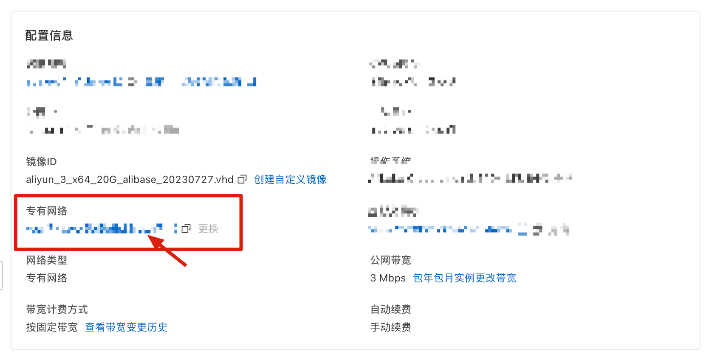

2.   点击您的专有网络名称。进入专有网络配置页面，并点击「开通ipv6」

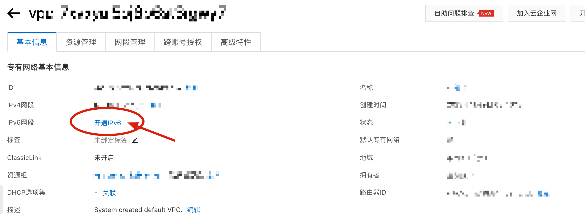

3.   在弹出窗口中，直接点击「确定」

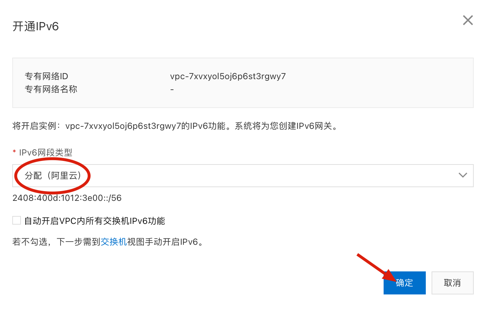

4.   此时，你的专有网络将获得一个由阿里云自动分配的ipv6网段地址

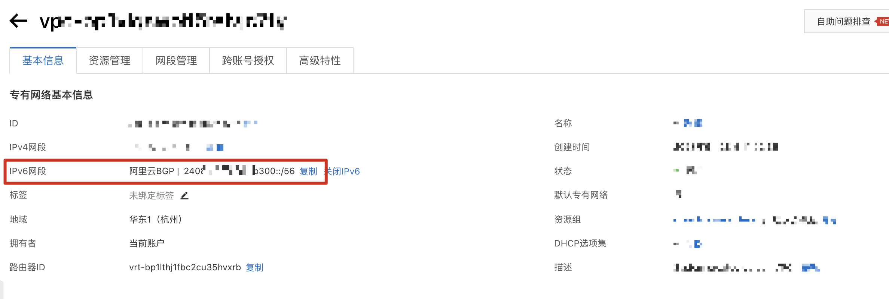

5.   回到云服务器管理页面，点击右上角「全部操作」，并在搜索栏搜索「ipv6」，点击「管理ipv6」

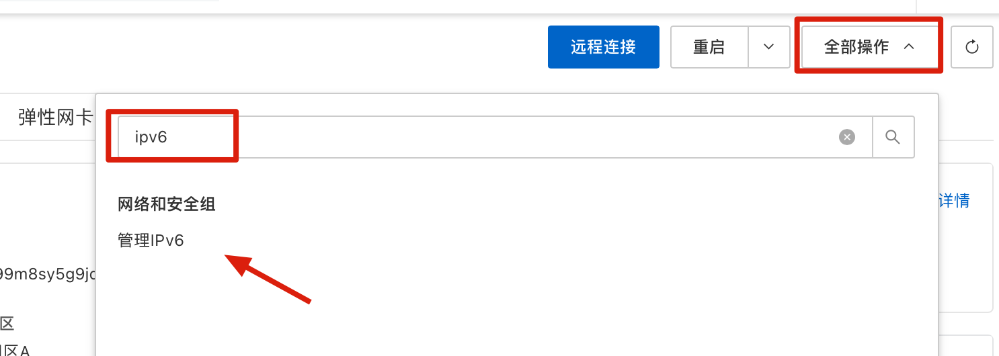

6.   在弹出窗口中找到ipb6地址，点击「立即打开」

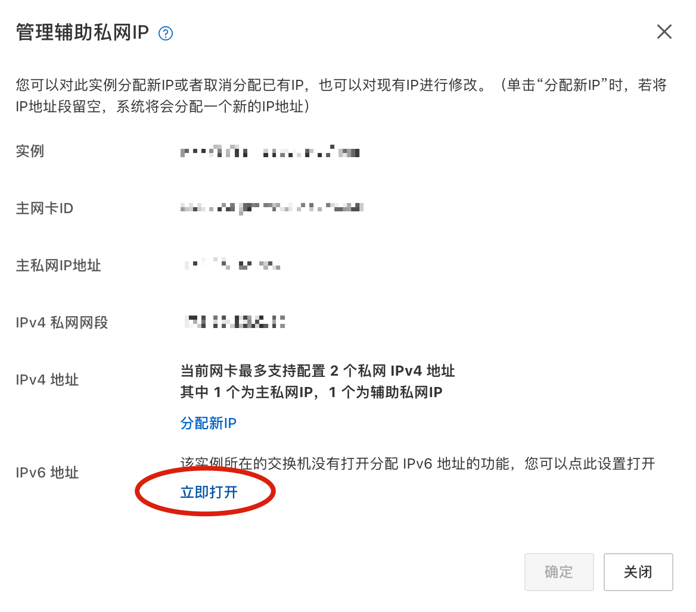

7.   此时会打开专有网络下面的交换机配置页面，在该页面中继续点击「开通ipv6」

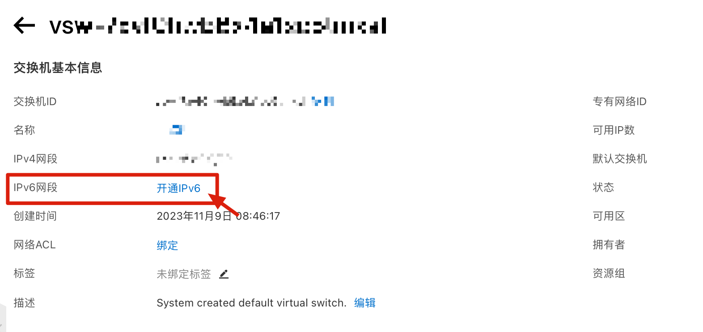

8.   弹出窗口中输入ipv6网段：255，并确定。

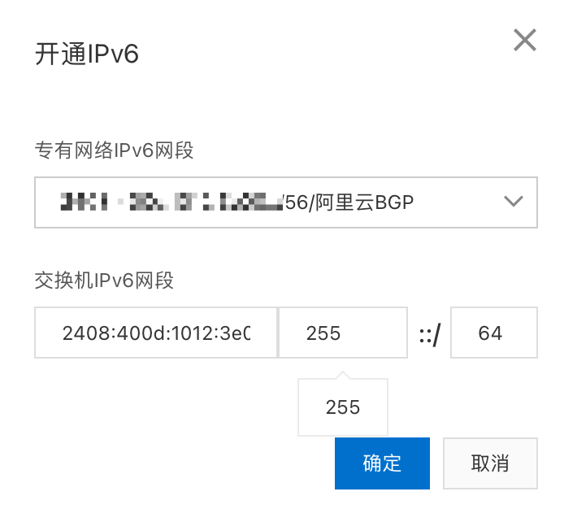

9.   再次回到云服务器管理页面，还是点击右上角「全部操作」，搜索「ipv6」，点击进入「管理ipv6」

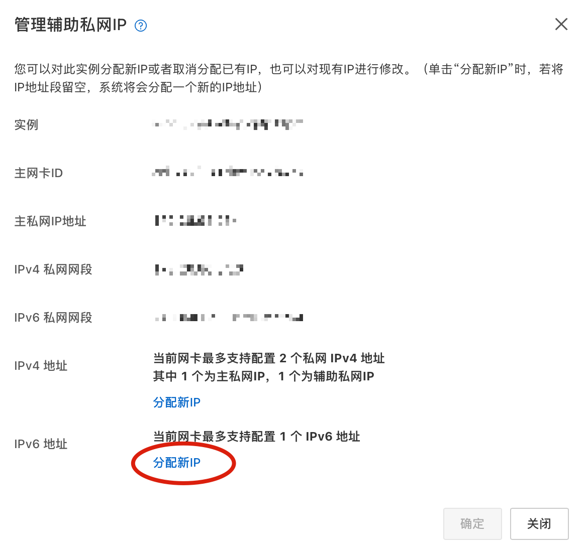

10. 此时窗口中IPv6地址一栏，就有了「分配新IP」。点击它，默认为自动分配。直接点击「确定」即可。

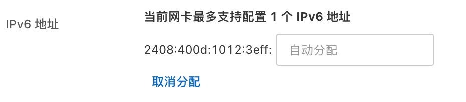

这时云服务器将会绑定一个IPv6地址。

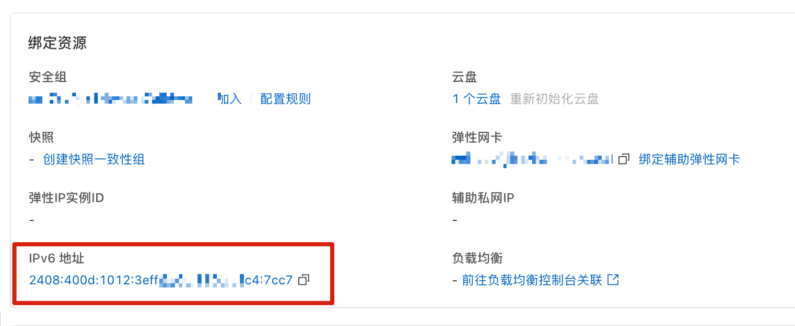

至此，云服务器绑定IPv6地址操作部分，就结束了。

接下来是开通IPv6公网访问。


### 开通IPv6公网访问

默认情况下，开通的IPv6只能支持内网访问，也就是你的同一专有网络下的云服务器之间访问通信是可以的。外网(互联网)访问时默认关闭的。这里，需要我们手动去开通公网服务（付费）。

1.   在云服务器管理页面，点击「IPv6地址」。


2.   在打开的IPv6网关页面，点击你的「实例ID/名称」。


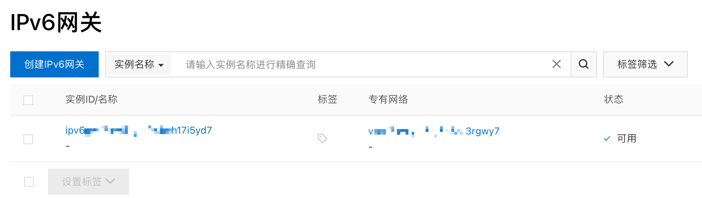

2.   进入详细页面后，可以看到IPv6地址尚未开通公网带宽。点击后方的「开通公网带宽」。


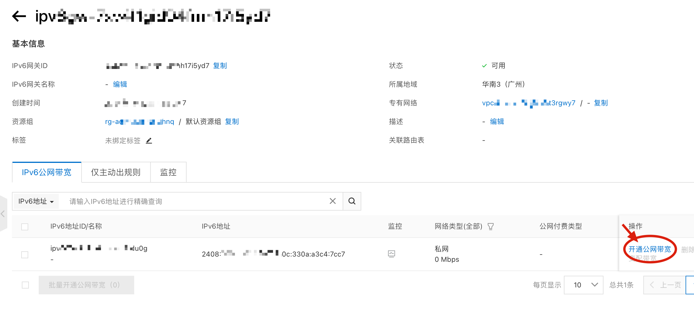

根据适合你的付费方式，进行选择并支付开通即可。

这里我选择的是按使用流量计费。

开通后，你的云服务器所绑定的IPv6就已经支持了公网访问，也就是说可以做域名解析了！


### 域名解析

解析域名时，记录类型选择 `AAAA` ，记录值直接将你的IPv6地址粘贴过来（确实太长，除非你能记住）


### 开放安全组

这一步也很重要，不然解析过的域名并不能通过80端口访问您的网站。

进入云服务器管理页面，找到 「安全组」并进入。

手动添加一条规则，端口：`80/80`，源：`::/0`

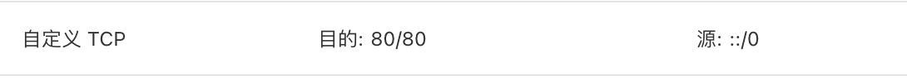


### 服务器配置

1.   IIS

     默认网站绑定IP地址是`*`，即不分配，检查该配置未被改动。


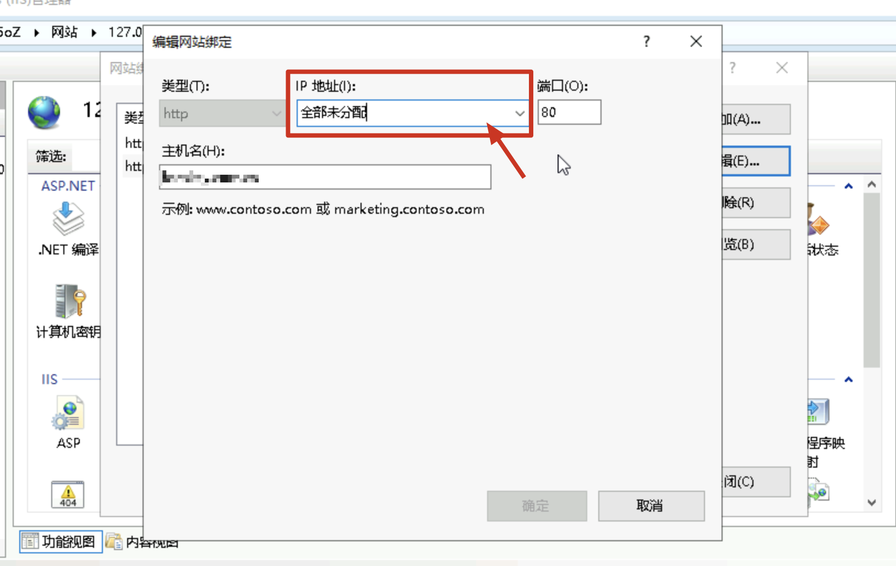

1.   Nginx

     默认 Nginx 的配置文件（/etc/nginx/nginx.conf）已经开启 IPv6 访问，检查是否开放。

     ```conf
       server {
             listen       80;
             listen       [::]:80;  ## 监听 IPv6 的 80 端口
             ...
         }    
     ```


### 验证IPv6访问

1.   登录这个网站 [https://ipw.cn](https://ipw.cn/ipv6webcheck/?site=ipw.cn) 进行ipv6访问检测

2.   如果一切正常，这里会显示「200 请求成功」


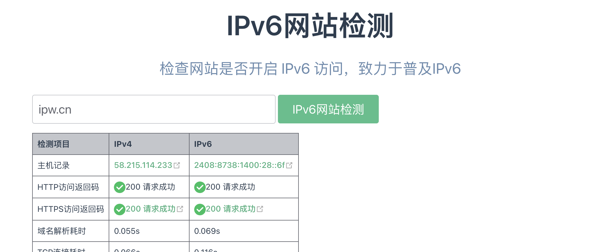


### 大功告成

到此，你的网站就全面支持IPv6的域名指向，并在默认IPv6访问的PC上，支持HTTP访问。
