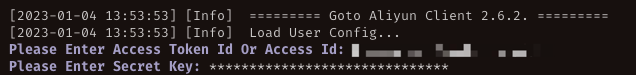

# 阿里云ECS服务器如何跨账号迁移


### 原因

因历史原因，公司下面有多个阿里云账号。目前有一台服务器即将到期，考虑到多账号的维护无形中增加了时间和判断成本。正好借此机会，将这台即将到期的服务器直接迁移到另一个常用账号。当时想法是，如果这次迁移顺利的话，后面逐步对其他服务器也进行迁移操作，最终实现一个账号管理。


### 实施步骤

>   请确保您已经完成阿里云账号完成实名认证、RAM服务开通授权等准备工作。


#### 第一步 源服务器的操作

1.   登录源服务器，将相关服务先暂停。

2.   在源服务器上下载SMC客户端。

     ```shell
     wget https://p2v-tools.oss-cn-hangzhou.aliyuncs.com/smc/Alibaba_Cloud_Migration_Tool.zip
     ```

3.   解压SMC客户端压缩包合集

     ```shell
     unzip Alibaba_Cloud_Migration_Tool.zip
     ```

4.   找到你的适用版本

     ```shell
     ls
     ```

     

     >   一定要自己查看文件名，这个包会更新的，版本可能和我这个不一样

5.   解压

     ```shell
     unzip go2aliyun_client2.6.2_linux_x86_64
     ```

6.   进入目录

     ```shell
     cd go2aliyun_client2.6.2_linux_x86_64/
     ```

7.   依次运行以下命令，运行SMC程序

     ```shell
     chmod +x go2aliyun_client
     ./go2aliyun_client
     ```

8.   输入访问密钥的 `AccessKey ID` 和 `AccessKey Secret`，并按`Enter`键。

     

     期间可能会出现以下提示信息：

     -   若迁移源系统没有安装快照驱动，则SMC客户端会提示，具体如下图所示，您可根据需求选择是否安装快照驱动。
         -   如果在创建迁移任务中启用块复制，输入yes，自动安装快照驱动。
         -   如果在创建迁移任务中不启用块复制，输入no即可。

9.   查看迁移源是否已成功导入。

     *   当客户端界面提示Import Source Server [s-bxxxxxxxxxxxx] Successfully!时，表示迁移源信息成功导入SMC控制台。
     *   当客户端界面提示Error或Goto Aliyun Not Finished!时，表示迁移源信息导入失败。建议您查看原因并修复问题后，重新运行客户端。更多信息，请参见[SMC FAQ](https://help.aliyun.com/document_detail/121707.htm#concept-610474)。


#### 第二步 目标账号操作

1.   使用**目标账号**登录[SMC控制台](https://smc.console.aliyun.com/)
2.   在左侧导航栏，单击**迁移源**。
3.   找到目标迁移源，单击对应**操作**列下的**创建迁移任务**。

>   这一部分比较简单，是在阿里云网页上操作。
>
>   如果有疑问，可以查看[官方操作指南](https://help.aliyun.com/document_detail/123141.htm?spm=a2c4g.11186623.0.0.6a8c1e166d8MGi#task-827285)


#### 最后

整个流程还是比较简单的，也非常顺畅。建议按步骤一步步来，不要着急，一定可以成功。

**然后要注意的几点：**

1.   在目标账号完成操作后，需要等待较长时间来等待数据的迁移（不过好在页面上是有进度条显示的）；
2.   迁移完成后，实际上会生成一个实例镜像，还需要通过此镜像创建新的实例。可以大致理解为，迁移过来的只是服务器的数据。你的源服务器公网内网IP这些外部属性将不会被迁移。