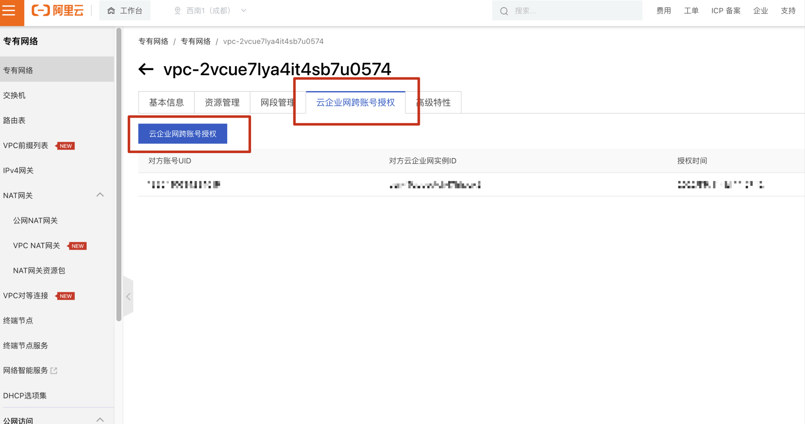
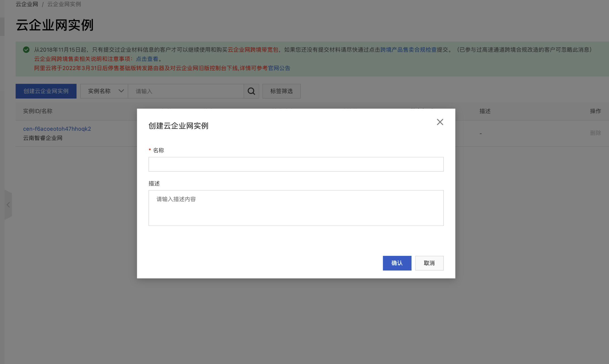
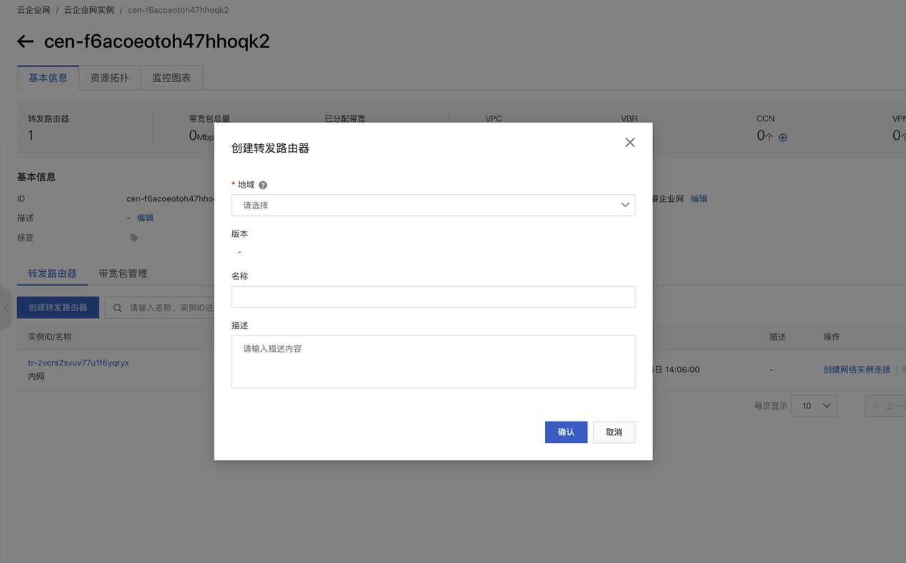
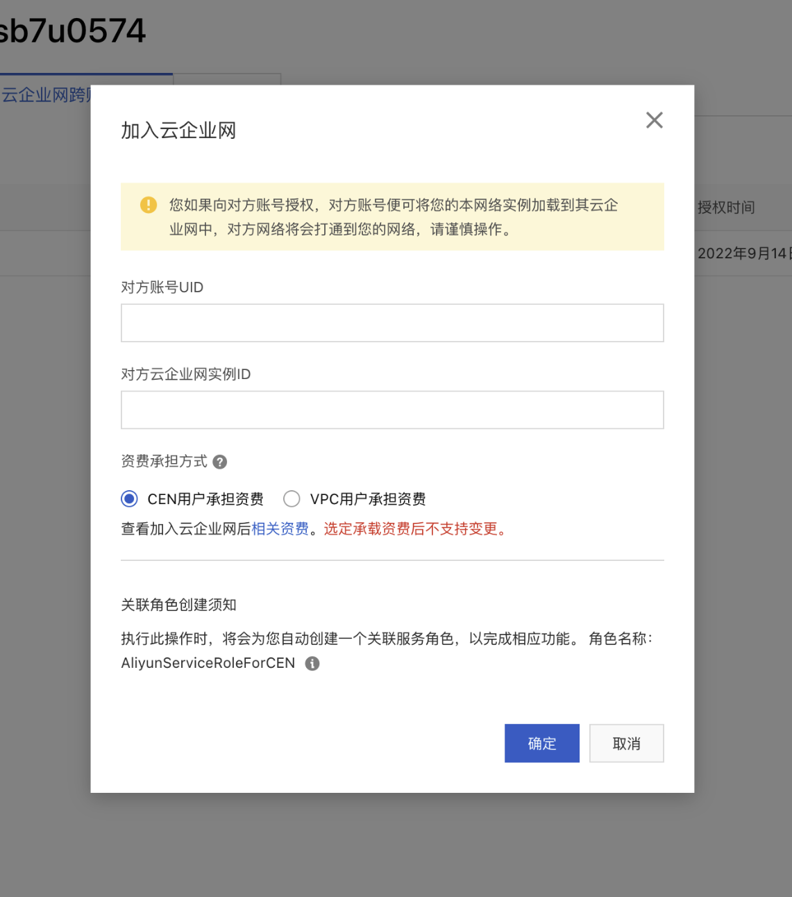
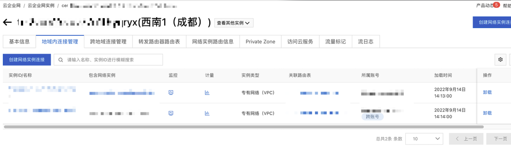
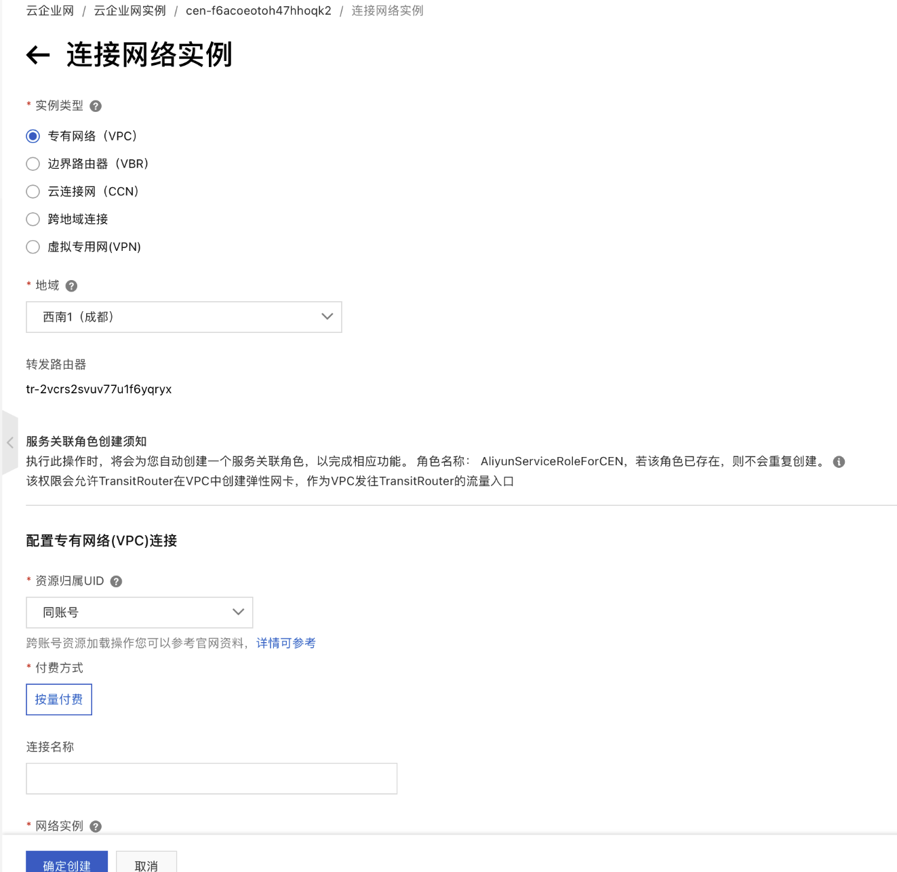

# 阿里云跨账号内网组建

### 第一步

先为我方账号内的云服务产品创建一个vpc专有网络。

[https://vpc.console.aliyun.com/vpc/cn-chengdu/vpcs/new](https://vpc.console.aliyun.com/vpc/cn-chengdu/vpcs/new)

创建完成后，点击管理-云企业网账号授权。

### 第二步

登录客户阿里云账号，进入云企业网（[https://cen.console.aliyun.com/cen/list](https://cen.console.aliyun.com/cen/list)）管理。

创建云企业网实例。

紧接着，在该云企业网下，创建转发路由器。地域选择与我方服务器相同地区。

创建完成后，回到我方阿里云账号。

### 第三步

输入客户的账号ID，以及刚才建立的云企业网实例ID。

资费承担方式选择CEN用户承担资费。

### 第四步

登录客户阿里云账号，进入云企业网的路由器管理页面。

创建网络实例连接。

依次创建连接，1）我方服务器网络；2）客户的服务器或其它云产品的网络。

使其打通内部网络。从而实现内网的传输，提高传输效率。