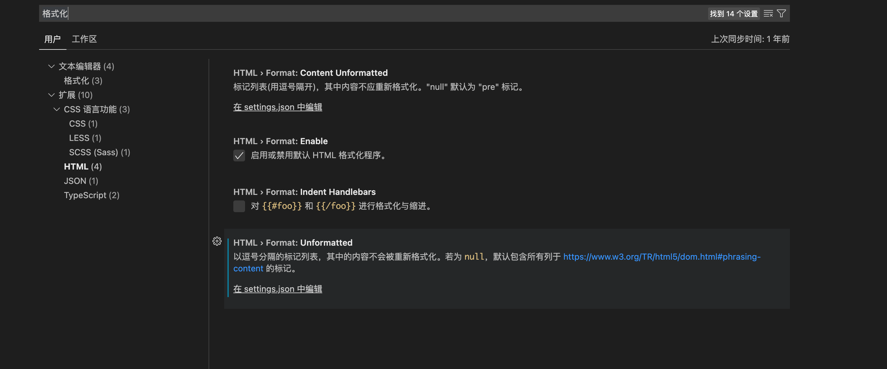
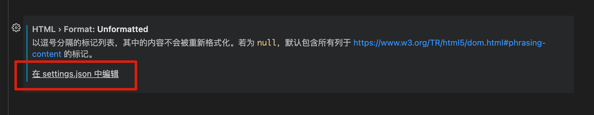

# vscode如何自定义配置“代码格式化”


一般情况下，我们会使用`option+shift+F`格式化代码。

那么，最近在进行一个项目开发的过程中，发现如果在js代码中使用了`{}`符号（用来输出后端变量）时，如果进行格式化操作，会自动对`{}`内前后加入空格。导致后端变量无法输出。

发现问题后，借此机会，略微研究和学习了一下，如何在vscode中对格式化操作进行自定义配置。

首先，打开命令面板，快捷键：`command+,`

在搜索栏搜索：`格式化`



**下面主要以HTML格式化为示例：**

找到：HTML > Format: Unformatted ，点击下方`在 setting.json中编辑`。



添加json语句

```
"html.format.unformatted": "script", //该值输入不希望自动格式化的标记，用,号分隔
```


