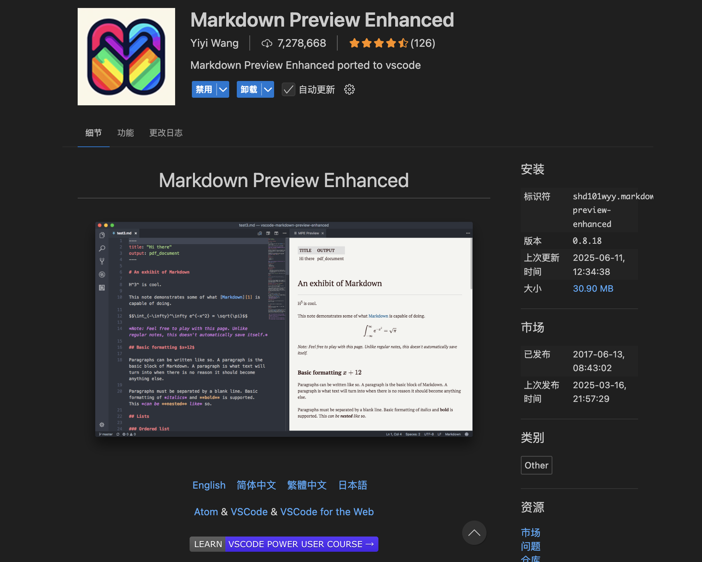

# vscode 如何预览 markdown 文件

vscode 支持编写 markdown 文件，但是怎么能直接预览呢。

方法如下：

### 不安装插件方法

1）编写 markdown 文件时，按`command+k`，松开后紧接着按`v`键，即可**在当前窗口右侧**打开实时预览。

2）按`command+shift+p`调出命令框，输入**markdown**，选择**打开预览**，即可**新窗口**打开实时预览。

### Markdown Preview Enhanced (MPE) 插件

安装后，编写 markdown 文件时，按 command+k，松开后紧接着按 v 键，即可在当前窗口右侧打开实时预览。

### 两者区别

Markdown Preview Enhanced 支持以下功能：LaTeX 公式、流程图、时序图，可自定义 CSS 主题（如仿 Typora 的 LaTeX 风格）
