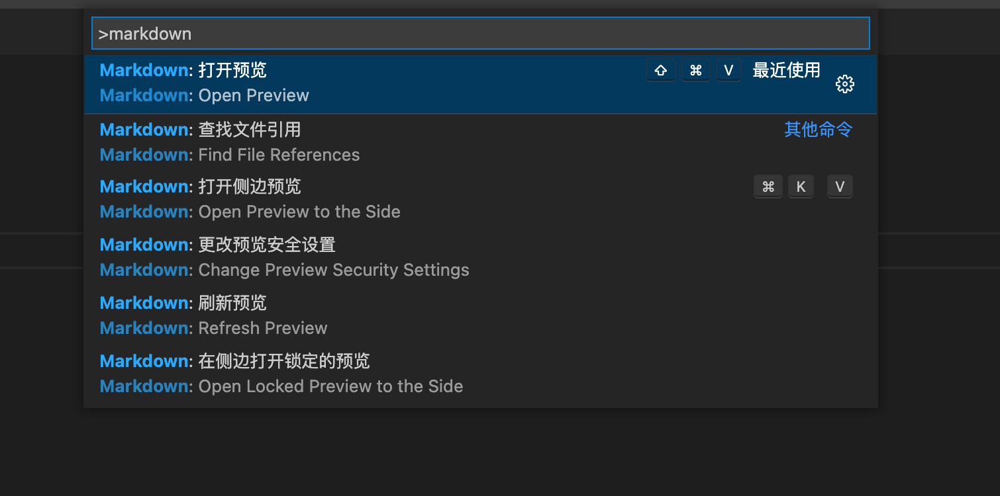

# vscode如何预览markdown文件


vscode支持编写markdown文件，但是怎么能直接预览呢。

方法如下：

1）编写markdown文件时，按```command+k```，松开后紧接着按```v```键，即可**在当前窗口右侧**打开实时预览。

2）按```command+shift+p```调出命令框，输入**markdown**，选择**打开预览**，即可**新窗口**打开实时预览。

