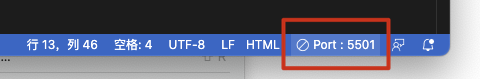
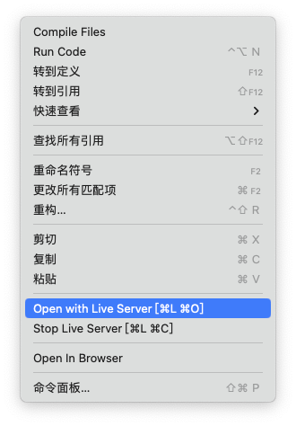

# 解决vscode live server无法热更新(不刷新/不工作)的问题

当你在vscode中安装了live server后，每次保存页面，浏览器却没有正常的自动刷新页面时，请检查下列问题：

*   是否启动了liveserver服务，vscode右下角状态栏，查看是否显示port:端口号。

    

*   如果未显示端口号，请在你编辑的文档中点按鼠标右键，在弹出菜单中，选择 open with live server.

*   如果依旧没有解决问题，请检查你的文档代码，html文件必须要包含：`<head>` 和 `<body>` 标签，liveserver才能正常工作。完善代码后重新启动liveserver服务即可。